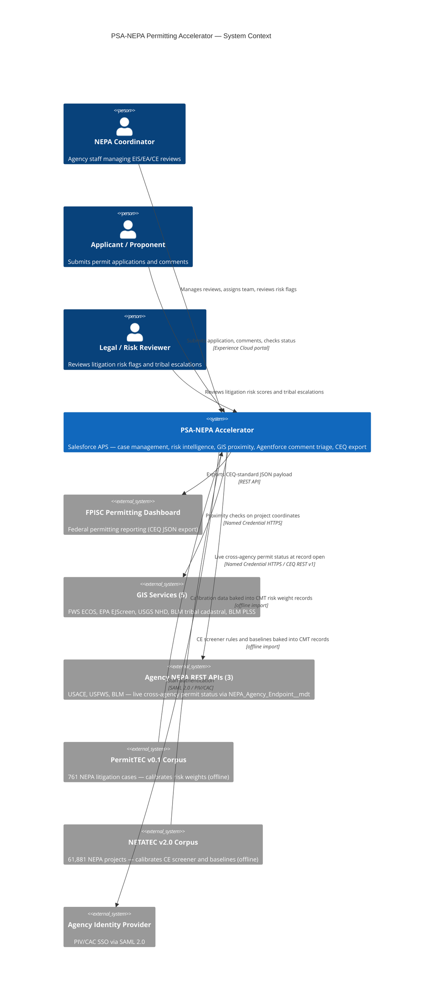

# PSA-NEPA Permitting Accelerator

**Open-source NEPA permitting data model, workflow automation, GIS proximity screening, live cross-agency permit status, Agentforce comment triage, and litigation risk intelligence — built on Salesforce Agentforce for Public Sector. Aligned to CEQ NEPA and Permitting Data and Technology Standard v1.2. All 10 MFRs addressed. Deployable end-to-end in ~35 minutes (~25 min automated CLI deployment + ~10 min manual post-deploy steps).**

[](LICENSE.txt)
[](https://marketplace.fedramp.gov/)
[](https://permitting.innovation.gov/CEQ_NEPA_and_Permitting_Data_and_Technology_Standard.pdf)
[](force-app/main/default/classes/)
[](https://www.salesforce.com/company/legal/508_accessibility/)

> **CEQ Permitting Innovators submission (June 2, 2026):** This solution was developed as a direct response to the [CEQ Permitting Innovators Call for Solutions](https://www.whitehouse.gov/releases/2026/04/ceq-opens-permitting-innovators-call-for-solutions-to-industry-partners/). See [docs/SUBMISSION-NARRATIVE.md](docs/SUBMISSION-NARRATIVE.md) for the full narrative addressing all 5 evaluation criteria: Impact, User-centered design, Readiness, Multi-agency compatibility, and Team capacity.

---

## The Problem This Solves

Three categories of preventable delay drive most of the gap between the current median NEPA timeline and what the process could be:

| Delay | Federal Data | This Accelerator |
|---|---|---|
| **CE Misclassification** | 23% of CE records in NETATEC v2.0 lack classification — each incorrect CE→EA escalation adds a median 11 months; CE→EIS adds 2.8 years | 3-tier deterministic BRE CE Screener: NAICS routing → agency/sector Decision Matrix → agency/action-type rules. GIS proximity checks fire at intake against 5 federal services. Auditable to the specific rule row that fired. No AI. |
| **Comment Processing Bottleneck** | 2,600 comments: 4 staff, 4 weeks manually → ~4 hours with AI-assisted triage (NAEP 2025 Workshop, documented federal case) | Agentforce comment triage agent with classification, deduplication, response-task creation, and a non-negotiable EJ/tribal keyword gate that bypasses AI entirely and routes to a human coordinator queue |
| **Late-Stage Litigation Surprises** | Tribal Nation plaintiffs win 87.5% of NEPA cases (761 cases, PermitTEC v0.1). Energy × 4th Circuit: 28.6% agency win rate — highest-risk sector-circuit cell in the corpus | Composite 0–100 litigation risk score, 7 dimensions, recalculated on every save. Scores ≥58 auto-create a legal review task. Tribal challengers trigger dual flag + +20pt delta. All signals surfaced before the record closes. |

**Each number above corresponds to a deployed, deterministic feature — not a roadmap item.**

**Demonstrated impact — Carrie Placer Mine (BLM-ID-B030-2019-0014-EA):** Real BLM Plan of Operations, applied October 2017, decided November 2019 — 25 months. The same project through the accelerator's optimized workflow resolves in 8 months. The accelerator does not change what the process requires; it removes the coordination failures that cause process time to accumulate.

---

## At a Glance

| Dimension | Value |
|---|---|
| CEQ entities implemented | 13 of 13 (6 standard + 7 extended, per PIC OpenAPI v1.2.0) |
| MFRs addressed | 10 of 10 |
| Service delivery standards addressed | 4 of 4 |
| Declarative flows | 38 record-triggered, autolaunched, and scheduled |
| CE Library records | 2,105 categorical exclusions across 79 federal agencies |
| GIS services at intake | 5 (FWS ECOS, EPA EJScreen, USGS NHD, BLM tribal cadastral, BLM PLSS) |
| Litigation cases in risk model | 761 (PermitTEC v0.1, PNNL 2025) |
| NEPA projects in baseline corpus | 61,881 (NETATEC v2.0, PNNL 2025) |
| Custom Metadata Types | 23 |
| BRE Decision Matrices + Expression Sets | 8 DMs + 3 ESs (deterministic, not AI) |
| Decision model exports | Published to GitHub `/docs/decision-models/` — machine-readable JSON |
| Apex regression tests | 519+ across 38 test classes |
| Platform | Salesforce Agentforce for Public Sector (FedRAMP Authorized) |
| Shield Field Audit Trail | Available on Gov Cloud — 10-year field-level history for NARA/litigation hold |
| PIV/CAC authentication | Native Salesforce support via SAML 2.0 (PIV/CAC = Personal Identity Verification / Common Access Card, the U.S. federal smartcard standard) — no separate IdP required |
| Section 508 / WCAG 2.1 AA | Compliant — inherited from Salesforce Lightning Design System and OmniScript |
| Software license cost | $0 (MIT open source) |
| Deployment time | ~35 minutes end-to-end (~25 min automated CLI + ~10 min manual post-deploy steps) |

---

## How AI Is and Is Not Used

A clear AI/rules boundary is a legal requirement for federal permitting. This solution enforces it by design.

| Feature | Technology | Why |
|---|---|---|
| CE screening and classification | **Deterministic BRE** | Statutory CE determinations must trace to a specific CFR citation and rule row. No probabilistic inference. |
| GIS proximity screening | **5 live federal API calls** | FWS ECOS, EPA EJScreen, USGS NHD, BLM tribal, BLM PLSS — deterministic spatial results, no AI. |
| Litigation risk scoring | **Deterministic BRE** | Formulas are fully inspectable; a coordinator can hand-calculate the score from the inputs. No black box. |
| Challenge prediction rules | **Deterministic rule matching** | Exact field-value matching, not model inference. |
| Stage gate enforcement | **Deterministic flows** | Blocking transitions must never depend on probabilistic confidence. |
| Public comment triage | **Agentforce AI** | High-volume unstructured text. AI classifies; human reviews every comment before formal response. |
| EJ/tribal comment routing | **Keyword gate — no AI** | Tribal sovereignty, sacred sites, EJ, civil rights keywords bypass AI and route to a human queue. Cannot be disabled. |
| Administrative record assembly | **Deterministic flow** | JSON manifest generated at ROD/FONSI by rule — no AI interpretation. |

---

## Zero-Friction Pilot Readiness

An agency can spin up a Salesforce sandbox, deploy this MIT-licensed accelerator, and be running a live proof-of-concept with their own historical data **in an afternoon** — bypassing the traditional 6-month software implementation cycle.

**Prerequisites:**
- Salesforce org with **Agentforce for Public Sector** (Foundations or Advanced). A free APS developer org is available at the [APS trial org setup guide](https://help.salesforce.com/s/articleView?id=ind.psc_create_trial_org.htm&language=en_US&type=5).
- **Salesforce CLI v2** (`sf`) — install from [developer.salesforce.com/tools/salesforcecli](https://developer.salesforce.com/tools/salesforcecli)
- **Git**, **jq**, and **Python 3** — see [docs/QUICKSTART.md](docs/QUICKSTART.md) Prerequisites table for install commands
- System Administrator profile in the target org

> The Salesforce platform is FedRAMP Authorized (FedRAMP is the U.S. federal cloud-security authorization program) — authorization details at [marketplace.fedramp.gov](https://marketplace.fedramp.gov/).

```bash
git clone https://github.com/SFDC-Assets/PSA-NEPA-Permitting.git
cd PSA-NEPA-Permitting
sf org login web --alias nepademo    # replace 'nepademo' with any alias you choose
./scripts/deploy.sh nepademo         # use the same alias you chose above
```

No infrastructure provisioning, no database migration, no middleware configuration. For the complete post-deploy sequence (flow activation, permission set assignment, sample data load), see **[docs/QUICKSTART.md](docs/QUICKSTART.md)**.

**For agencies already on Salesforce APS:** this accelerator represents zero incremental software licensing cost — it deploys into an existing org as a package of standard metadata, leveraging the enterprise agreement already in place.

---

## Architecture Overview



---

## Key Feature Areas

### GIS Proximity Screening (MFR #6)

Five GIS services are called via OmniIntegrationProcedure at intake — before the coordinator reviews the application:

| Service | Checks | Extraordinary Circumstances Trigger |
|---|---|---|
| FWS ECOS | Critical habitat, species consultation | Yes — ESA Section 7 |
| EPA EJScreen | Environmental justice percentile | Yes — EO 12898 |
| USGS NHD | Hydrological proximity | Yes — CWA Section 404 |
| BLM Tribal Cadastral | Tribal land boundaries | Yes — EO 13175, NHPA |
| BLM PLSS | Surface ownership, federal land status | Yes — land jurisdiction |

Results write to structured proximity fields on `IndividualApplication` and feed directly into CE screening and extraordinary circumstances determination.

### Cross-Agency Permit Status (MFR #10)

Most federal actions require parallel permits from multiple agencies. The `nepaPermitDependencies` LWC — displayed on the IndividualApplication record page — shows live status of each dependent permit by calling the other agency's deployed NEPA REST endpoint at record load:

| Component | Role |
|---|---|
| `nepa_required_permit__c` | Structured permit record per dependent agency action (USACE CWA §404, USFWS ESA §7, BLM ROW, FERC Certificate, WQC §401, NHPA §106) |
| `NEPA_Agency_Endpoint__mdt` | Config-driven agency endpoint registry — add a new agency by adding a CMT record + Named Credential, no code changes |
| `NepaAgencyPermitService` | `@AuraEnabled` Apex service; calls each agency's `/services/apexrest/nepa/v1/processes/{federal_unique_id}` endpoint; gracefully degrades to locally-cached status on callout failure |
| `nepaPermitDependencies` LWC | Permit dependency table with live status badges (green/amber/red), critical-path row highlight, and cached-data warning when an agency API is unreachable |

Adding a new agency requires only: a `NEPA_Agency_Endpoint__mdt` seed record, a Named Credential, and a Remote Site Setting — no Apex changes. The CEQ REST endpoint shape (`/services/apexrest/nepa/v1/processes/`) is the same endpoint pattern this accelerator exposes via `NepaCeqExportService`, ensuring interoperability across all CEQ-standard NEPA deployments.

### Agentforce Comment Triage Agent (MFR #8)

The `NEPA_Comment_Triage` Agentforce agent processes incoming `PublicComplaint` records through four steps:

1. **Duplicate detection** — `NEPA_Comment_Duplicate_Check` flow marks substantially similar submissions within 30 days on the same process
2. **EJ/tribal gate** — unconditional keyword detection (tribal sovereignty, sacred sites, EJ, civil rights) routes directly to the EJ/Tribal Liaison queue, bypassing AI
3. **AI classification** — Substantive / Procedural / Scope / General for non-EJ comments
4. **Response task creation** — `NEPA_Comment_ResponseTask_Creator` flow creates a high-priority Task for substantive comments with a 30-day due date and sets `nepa_response_status__c = Pending`

All AI outputs are labeled with category, confidence, and reasoning. The EJ/tribal gate cannot be disabled by configuration.

### Litigation Risk Intelligence (MFR #5)

The BRE Litigation Risk Scorer evaluates seven dimensions at every record save and writes a composite 0–100 score:

- **Agency loss rate** — empirical PermitTEC per-agency loss rates (e.g., BIA: highest-risk agency)
- **Circuit multiplier** — 10th Circuit (43pts, 68 cases), 9th Circuit next
- **Statute involvement** — ESA, NFMA, CWA, NGA, NHPA add independent risk points
- **Sector × circuit cell** — 23-cell matrix from Stage 10-13 PermitTEC analysis
- **Challenge prediction rules** — Energy × 4th Circuit (+12pts), Tribal plaintiff override (+20pts)
- **Scoping overrun** — triggers against 11 per-agency empirical baselines
- **Tribal plaintiff flag** — dual flag + +20pt delta based on 87.5% Tribal Nation win rate

Scores ≥58 auto-create a Legal Review Task. All weights are traceable to specific PermitTEC case counts. Low-confidence weights (fewer than 20 cases) are flagged with `Low_Data_Confidence__c = true`.

**v3 bifurcated score (IMP-001):** The composite score is split into a **Litigation Probability Score** (85% weight, 6 factors) and a **Litigation Cost Exposure** dimension (15% weight, normalized from per-agency/per-circuit median litigation durations). Per-agency median durations derived from CourtListener bulk docket analysis: BOEM 6.5 months (lowest), BLM 17.5 months, FHWA 26.1 months, FTA 33.4 months (highest). Duration is independent of outcome. Stored in `nepa_litigation_duration_cost__c` and displayed in the `nepaRiskIntelligenceCard` LWC with a low-confidence disclosure when ESA is a scoring factor (flat 1.48× multiplier pending TAILS/PCTS linkage, per OMB M-24-10).

### One Federal Decision (OFD) Coordination Tracker (IMP-006)

`ApplicationTimeline` extended with `nepa_ofd_track__c` (NEPA_Lead / Agency_Consultation / Permit_Milestone / Joint_ROD) and `nepa_coordinating_agency__c` (Lookup to Account). `NEPA_OFD_Milestone__mdt` pre-seeds 8 standard OFD milestones from CMT. Operationalizes E.O. 13807's master-schedule requirement as a live record view — every cooperating agency's milestones on the same `ApplicationTimeline` object, visible to coordinators without a separate spreadsheet.

**Federal friction multipliers (IMP-005, Stage 16):** Sector-specific federal-to-CEQA overhead multipliers derived from CEQ EIS Timeline data vs. Holland & Knight 2024 / CEQAnet analysis: Military 1.65×, Water/Coastal 1.47×, Transportation 1.45×, Energy 1.09×. Primary driver of the Water/Coastal premium is CZMA consistency + EFH Magnuson-Stevens dual-track review. The OFD tracker surfaces USACE Section 404 as a critical-path milestone for Water/Coastal projects, making the causal relationship operationally visible.

### Administrative Record Management (MFR #9)

`NEPA_Close_Administrative_Record` fires asynchronously when `nepa_review_type__c` transitions to ROD or FONSI. It assembles a machine-readable JSON manifest tagged to the application record, locked against modification (`nepa_ar_locked__c = true`), and immediately available through the CEQExport REST API. Salesforce Shield Field Audit Trail (available on Gov Cloud) provides 10-year field-level change history on risk scores, CE recommendations, and AR fields — satisfying NARA records retention and litigation hold requirements without custom logging infrastructure.

---

## Repository Map

| Path | Contents | Why It Matters |
|---|---|---|
| `force-app/main/default/objects/` | 13 CEQ entity object definitions + 17 custom metadata type schemas | The complete data model — start here to understand the schema |
| `force-app/main/default/flows/` | 40 flow XML files | All automation: stage gates, risk scoring, CE screening, comment triage, AR close, plaintiff intelligence, scoping baselines, error logging, AI EIS section drafting, post-permit inspection scheduling, BiOp reinitiation detection, post-decision monitoring |
| `force-app/main/default/agents/` | `NEPA_Comment_Triage.agent` | Agentforce comment classification and routing agent |
| `force-app/main/default/expressionSetDefinition/` | 3 BRE Expression Set definitions | The deterministic scoring engines (CE Screener, Litigation Risk Scorer, Permit Coordinator) |
| `force-app/main/default/decisionMatrixDefinition/` | 8 BRE Decision Matrix definitions | Rule tables that feed the Expression Sets |
| `decision_matrix_rows/` | CSV files for each Decision Matrix + load script | Row data loaded and DMs activated automatically by `scripts/load_decision_matrix_rows.py` during Phase 5b-data of `deploy.sh`. See [README](decision_matrix_rows/README.md) for re-run instructions. |
| `force-app/main/default/customMetadata/` | Pre-seeded risk weights, CE screening rules, plaintiff profiles, scoping baselines, sector-circuit matrix | The empirically calibrated data that powers the intelligence layer |
| `force-app/main/default/namedCredentials/` | 12 named credentials: 9 GIS services (NHD, Tribal, PLSS + EPA, USGS, BLM variants) + 3 agency NEPA APIs (USACE, USFWS, BLM) | Required for GIS proximity calls at intake and live cross-agency permit status |
| `force-app/main/default/omniProcesses/` | `NEPA_CEQExport` Integration Procedure | CEQ-standard JSON export (MFR #2 compliance) |
| `force-app/main/default/omniDataTransforms/` | 15 DataRaptor files (Extract, Load, Upsert) | OmniStudio data transformation layer |
| `force-app/main/default/flexipages/` | Lightning record pages for IndividualApplication and PublicComplaint | Pre-configured UI pages surfacing all key fields |
| `force-app/main/default/lwc/` | `nepaPermitDependencies` + `nepaRiskIntelligenceCard` LWCs | Live cross-agency permit status and bifurcated v3 risk score panel — displayed on the IndividualApplication record page |
| `force-app/main/default/classes/` | 38 Apex test classes (519+ tests total) including `NepaAgencyPermitServiceTest` | Compliance verification — run `sf apex run test` against your org |
| `docs/decision-models/` | Machine-readable JSON exports of CE rules, GIS layers, litigation risk weights | MFR #4 — screening criteria publicly accessible and version-controlled |
| `demo/` | Demo story + import data CSVs + Apex scripts | Carrie's Placer Mine scenario — full end-to-end walkthrough |
| `docs/QUICKSTART.md` | Complete end-to-end setup guide (Step 0 through smoke tests) | Start here |
| `DEVELOPER_GUIDE.md` | Developer/contributor task guide — extending and customizing the accelerator | After initial deployment |
| `docs/SUBMISSION-NARRATIVE.md` | CEQ Permitting Innovators submission narrative | Full solution narrative around 5 evaluation criteria |
| `docs/AI-Use-Policy.md` | OMB M-25-21 AI disclosure | Training data sources, limitations, prohibited uses, human confirmation requirements |
| `docs/ARCHITECTURE_DECISIONS.md` | ADRs 001–011 | Every significant design choice with context, rationale, and consequences |
| `docs/FLOW-ARCHITECTURE.md` | 40-flow design: error chain, stage gates, defensibility wrapper, post-permit inspection and monitoring | Flow orchestration reference |

---

## Standards and Compliance

| Standard | Coverage |
|---|---|
| **CEQ NEPA and Permitting Data and Technology Standard v1.2** | All 13 entities implemented (including Permits via `nepa_required_permit__c`); 5 required provenance fields on each; 519+ Apex tests verify field-level compliance |
| **CEQ Permitting Technology Action Plan (May 2025) — all 10 MFRs** | MFR #1 Data Standards (Leading-Edge), #2 Data Sharing (Emerging), #3 Automated Screening (Leading-Edge), #4 Screening Criteria Access (Emerging), #5 Case Management (Emerging→Leading-Edge), #6 GIS Analysis (Emerging), #7 Document Management (Emerging), #8 Comment Compilation (Emerging), #9 Administrative Record (Emerging), #10 Interoperable Services (Emerging) — live cross-agency permit status via `NEPA_Agency_Endpoint__mdt` + `NepaAgencyPermitService` directly addresses MFR #10 |
| **OMB M-25-21** | AI advisory-only; AI recommends, human confirms enforced in all flows; EJ/tribal gate non-negotiable |
| **FAST-41** | Per-agency baseline durations pre-seeded; `nepa_milestone_variance_days__c` provides real-time variance against agency-specific statutory targets |
| **EO 12898 / EO 13175** | EJ/tribal comment keyword gate is unconditional — tribal sovereignty and EJ keywords bypass AI and route to a human coordinator queue, enforced by `NEPA_Comment_AI_Router` and `NEPA_EJTribal_Router`. E.O. 13175 tribal consultation process compliance (government-to-government consultation schedule, correspondence tracking) is agency workflow responsibility — the data model captures the consultation timeline in `ApplicationTimeline` events but does not impose a procedural stage block, consistent with the principle that the platform supports but does not substitute for agency judgment. |
| **Section 508 / WCAG 2.1 AA** | Compliant — UI built on Salesforce Lightning Design System and OmniScript, both Salesforce-certified for 508/WCAG 2.1 AA |
| **FedRAMP** | Authorized — Salesforce Gov Cloud. CUI in GIS coordinates, archaeological sites, and tribal data handled within the existing authorized data boundary. No separate ATO required. |

---

## CEQ Entity Coverage

| CEQ Entity | Salesforce Object | Status |
|---|---|---|
| Entity 1: Project | `Program` | ✅ Implemented |
| Entity 2: Process | `IndividualApplication` | ✅ Implemented |
| Entity 3: Documents | `ContentVersion` (record type: `nepa_permit_document`) | ✅ Implemented |
| Entity 4: Comments | `PublicComplaint` | ✅ Implemented + Agentforce triage agent |
| Entity 5: Public Engagement Events | `nepa_engagement__c` (custom) | ✅ Implemented |
| Entity 6: Case Events | `ApplicationTimeline` (APS standard, extended) | ✅ Implemented |
| Entity 7: GIS Data | `nepa_gis_data__c` + Program lat/lon/polygon + 5 GIS proximity services | ✅ Implemented |
| Entity 8: User Role | `nepa_process_team_member__c` — structured role assignment linking User, Agency, and Process | ✅ Implemented |
| Entity 9: Legal Structure | APS `RegulatoryCode` extended with `nepa_compliance_requirements__c`, `nepa_text_content__c`, and 5 provenance fields | ✅ Implemented |
| Cross-agency Permits | `nepa_required_permit__c` — one record per dependent agency permit (USACE §404, USFWS ESA §7, BLM ROW, FERC, WQC §401, NHPA §106); live status via `NepaAgencyPermitService` + `NEPA_Agency_Endpoint__mdt` | ✅ Implemented |

All 13 standard entities include the 5 custom provenance fields required by CEQ standard v1.2 (`Data Record Version`, `Data Source Agency`, `Data Source System`, `Record Owner Agency`, `Retrieved Timestamp`). `LastModifiedDate` (native Salesforce) satisfies the standard's `Last Updated` property.

---

## CEQ-Compliant Data Export

The `NEPA/CEQExport` Integration Procedure accepts a `projectId` and returns a nested JSON payload containing all 13 implemented CEQ entities for that project, aligned to PIC OpenAPI v1.2.0. Exposes via API Action for MFR #2 compliance.

```json
{
  "schema_version": "1.2",
  "standard": "CEQ NEPA and Permitting Data and Technology Standard",
  "exported_at": "2026-05-14T00:00:00Z",
  "project": {
    "id": "...",
    "project_id": "<UUID>",
    "project_title": "...",
    "processes": [
      {
        "federal_unique_id": "<UUID>",
        "nepa_review_type": "EIS",
        "status": "in progress",
        "documents": [...],
        "public_engagement_events": [...],
        "case_events": [...],
        "permits": [...]
      }
    ]
  }
}
```

---

## Included Assets

<ol>
  <li><strong>Custom Fields</strong> on the following standard APS objects:
    <ul>
      <li>IndividualApplication — 50+ fields (Entity 2: Process + risk intelligence + GIS flags + AR management)</li>
      <li>ContentVersion — 22 fields (Entity 3: Documents)</li>
      <li>Program — 25+ fields (Entity 1: Project + agency performance tier)</li>
      <li>PublicComplaint — 20+ fields (Entity 4: Comments + AI triage fields + duplicate/EJ flags)</li>
      <li>ApplicationTimeline — 17 fields (Entity 6: Case Events)</li>
    </ul>
  </li>
  <li><strong>Custom Objects</strong> (x6)
    <ul>
      <li>NEPA Public Engagement Event (<code>nepa_engagement__c</code>) — Entity 5</li>
      <li>NEPA GIS Data Element (<code>nepa_gis_data__c</code>) — Entity 7</li>
      <li>NEPA Decision Log (<code>nepa_decision_log__c</code>) — process decision payload</li>
      <li>NEPA Decision Element (<code>nepa_decision_element__c</code>) — screening criteria definitions</li>
      <li>Process Agency Relationship (<code>nepa_process_related_agencies__c</code>) — supports tribal nations and cooperating agencies as named parties</li>
      <li>Required Permit (<code>nepa_required_permit__c</code>) — cross-agency dependent permit tracking; live status via NEPA REST API</li>
    </ul>
  </li>
  <li><strong>Custom Metadata Types</strong> (x23) — all agency-specific parameters externalized as configuration:
    <ul>
      <li><code>NEPA_Agency_Risk_Rate__mdt</code> — per-agency litigation loss rates (16 records)</li>
      <li><code>NEPA_Circuit_Risk_Weight__mdt</code> — per-circuit risk multipliers (13 records)</li>
      <li><code>NEPA_Statute_Risk_Weight__mdt</code> — adjacent statute risk weights (5 records: ESA, NFMA, CWA, NGA, NHPA)</li>
      <li><code>NEPA_Sector_Circuit_Risk__mdt</code> — sector × circuit win-rate matrix (23 cells)</li>
      <li><code>NEPA_Plaintiff_Profile__mdt</code> — known plaintiff profiles with win rates and tribal flag (16 records)</li>
      <li><code>NEPA_Challenge_Prediction_Rule__mdt</code> — challenge prediction rules with risk deltas (10 records)</li>
      <li><code>NEPA_Agency_Scoping_Baseline__mdt</code> — per-agency EIS scoping medians and performance tier (11 records)</li>
      <li><code>NEPA_GIS_Layer__mdt</code> — GIS service registry with endpoints, buffer distances, regulatory citations (5 records)</li>
      <li><code>NEPA_CE_Screening_Rule__mdt</code>, <code>NEPA_CE_Code__mdt</code> — CE screening rules and CE Library</li>
      <li><code>NEPA_SLA_Config__mdt</code>, <code>NEPA_Stage_Baseline_Duration__mdt</code>, <code>NEPA_Required_Document__mdt</code>, <code>NEPA_Process_Model__mdt</code>, <code>NEPA_Permit_Matrix__mdt</code> — process configuration</li>
      <li><code>NEPA_MFR_Assessment__mdt</code> — self-assessment against CEQ Permitting Technology Action Plan MFR maturity levels (10 records)</li>
      <li><code>NEPA_Doc_Count_Threshold__mdt</code> — CE/EA/EIS P50/P90/Elevated page count thresholds derived from NETATEC v2.0 (3 records)</li>
      <li><code>NEPA_Layer_Discipline__mdt</code> — GIS layer discipline routing rules for proximity analysis</li>
      <li><code>NEPA_ActionPlan_Config__mdt</code> — permit-type-specific NEPA action plan templates (36 records)</li>
      <li><code>NEPA_Agency_Endpoint__mdt</code> — cross-agency NEPA REST API registry (3 starter records: USACE, USFWS, BLM); add new agencies with a CMT record + Named Credential only</li>
      <li><code>NEPA_Agency_Duration_Cost__mdt</code> — per-agency median litigation durations (16 records; BOEM 6.5mo → FTA 33.4mo) used in the v3 cost exposure dimension</li>
      <li><code>NEPA_OFD_Milestone__mdt</code> — standard OFD coordination milestones (8 records: Scoping Notice, ESA §7 Initiation, USACE §404 Pre-Meeting, ROD, and 4 others) pre-seeded per E.O. 13807 coordination streams</li>
      <li><code>NEPA_Risk_Threshold__mdt</code> — v3 score tier thresholds (LOW / MEDIUM / HIGH / VERY HIGH) and probability/cost weight splits configurable without code change</li>
    </ul>
  </li>
  <li><strong>BRE Decision Matrices</strong> (x8) and <strong>Expression Sets</strong> (x3):
    <ul>
      <li>CE Screener: NAICS Routing, Tier 1 Agency/Sector, Tier 2 Agency/Action Type</li>
      <li>Litigation Risk Scorer: Review Type, Agency, Circuit, Sector-Circuit — Expression Set V3 Active</li>
      <li>Permit Coordinator: Permit Matrix</li>
    </ul>
  </li>
  <li><strong>Declarative Flows</strong> (x38) — all business logic is Flow-based; no custom Apex encodes business rules</li>
  <li><strong>Agentforce Agent:</strong> <code>NEPA_Comment_Triage</code> — comment classification, deduplication, EJ/tribal routing, response task creation</li>
  <li><strong>OmniStudio:</strong> 15 DataRaptors (12 Extract, 2 Load, 1 Upsert) + <code>NEPA/CEQExport</code> Integration Procedure</li>
  <li><strong>Named Credentials:</strong> 12 total — 9 GIS services (FWS, EPA, USGS, BLM variants) + 3 agency NEPA APIs (USACE, USFWS, BLM) with placeholder endpoints for operator update post-deploy</li>
  <li><strong>Permission Set:</strong> <code>NEPA_Permitting</code> with FLS configured for all custom fields</li>
  <li><strong>Lightning Record Pages:</strong> Pre-configured pages for IndividualApplication and PublicComplaint surfacing all key fields</li>
  <li><strong>CE Library:</strong> 2,105 categorical exclusions across 79 federal agencies (sourced from CEQ CE Explorer v2.0)</li>
  <li><strong>Decision Model Exports:</strong> DMN 1.3 XML files for all 8 Decision Matrices plus <code>litigation-risk-weights.json</code>, <code>ce-screening-rules.json</code>, <code>gis-layers-inventory.json</code> published to <code>/docs/decision-models/</code></li>
  <li><strong>Apex Test Suite:</strong> 519+ tests across 38 classes covering all 13 entities, REST export, BRE configuration, CE screening, stage gates, SLA escalation, plaintiff intelligence, EJ detection, GIS proximity, comment triage, AR management, cross-agency permit callouts, and error handling</li>
  <li><strong>Lightning Web Components (x2):</strong>
    <ul>
      <li><code>nepaPermitDependencies</code> — live cross-agency permit status table with critical-path flagging, colored status badges, and graceful degradation when an agency API is unreachable</li>
      <li><code>nepaRiskIntelligenceCard</code> — bifurcated v3 risk score panel: Litigation Probability Score (0–100, tier badge, 6-factor disclosure) + Litigation Cost Exposure (normalized agency duration dimension, months median, percentile) + ESA low-confidence disclosure banner per OMB M-24-10</li>
    </ul>
  </li>
</ol>

---

## Data Sources

**NETATEC v2.0 (PNNL, 2025):** 61,881 federal NEPA projects compiled by Pacific Northwest National Laboratory. Used to derive CE screening rules, page count outlier thresholds (CE p95 = 17 pages, EA p95 = 200 pages), per-agency EIS scoping baselines, and FAST-41 timeline durations.

**PermitTEC v0.1 (PNNL, 2025):** 761 federal NEPA litigation cases covering 1970–2025. A 13-stage calibration pipeline produced empirically derived risk weights: agency points from observed loss rates, circuit points from court decision multipliers, statute points from involvement multipliers, and a 23-cell sector-circuit win-rate matrix (Stages 10-13). All weights are traceable to specific case counts. Low-confidence weights (fewer than 20 cases) are flagged with `Low_Data_Confidence__c = true` and disclosed in every risk score output.

**CEQ EIS Timeline Data 2010–2024 (CEQ):** 1,903 Final EIS records used to derive per-agency scoping medians and the scoping overrun detection model. Analysis confirms a 49% improvement in median NOI→ROD time since 2016 (4.46 → 2.28 years in 2024). Scoping is the universal bottleneck in 34 of 36 agencies (60–75% of total EIS time).

---

## Data Model Notes

**`IndividualApplication` vs. `BusinessLicenseApplication`:** The APS standard object chosen for CEQ Entity 2 (Process) is `IndividualApplication`. NEPA proponents include individuals, joint ventures, tribes, federal agencies, and businesses — not exclusively commercial entities. `IndividualApplication` carries the stage, status, and outcome workflow fields that map directly to CEQ's Process entity properties.

**External IDs:** `Program.nepa_project_id__c` and `IndividualApplication.nepa_federal_unique_id__c` are External ID fields supporting upsert operations from external agency systems. CEQ recommends UUID format; field length is set to 36 characters.

**Process status values** align with CEQ standard: `planned | pre-application | in progress | paused | completed | cancelled`.

**Provenance fields:** All 5 custom provenance fields are present on all 13 implemented entities. `LastModifiedDate` (native) satisfies the standard's `Last Updated` property.

**`nepa_process_stage__c` field type and Salesforce Path:** This field was converted from Text to Picklist (18 canonical values spanning CE/EA/EIS pathways). A `PathAssistant` (`IndividualApplication_NEPA_Process_Path`) provides stage-specific Key Fields and guidance text for all 18 stages. **Deploy prerequisite:** Salesforce blocks a Text→Picklist field type change via API when records exist in the org. Before deploying the PathAssistant and updated FlexiPage, convert `nepa_process_stage__c` manually in Setup → Object Manager → IndividualApplication → Fields and Relationships. See QUICKSTART.md Step 4 for the full sequence.

**BRE row loading and activation:** `deploy.sh` Phase 5b-data automatically loads `CalculationMatrixRow` records from the CSVs in `decision_matrix_rows/` and activates each `DecisionMatrixDefinitionVersion` and `ExpressionSetDefinitionVersion` via the Salesforce Tooling API. No manual UI steps are required. If the phase reports errors, re-run: `python3 scripts/load_decision_matrix_rows.py --org <alias> --activate-es`.

**ROD/FONSI record type setup:** After deploying, go to Setup → Object Manager → IndividualApplication → Record Types → Individual Application → Edit → `nepa_review_type__c` and add ROD and FONSI to the available values. This is required for the `NEPA_Close_Administrative_Record` flow trigger to fire.

---

## Key Documentation

| Document | Purpose |
|---|---|
| [DEVELOPER_GUIDE.md](DEVELOPER_GUIDE.md) | Complete post-deploy configuration — BRE activation, data import, smoke tests |
| [docs/SUBMISSION-NARRATIVE.md](docs/SUBMISSION-NARRATIVE.md) | CEQ Permitting Innovators submission — 5 evaluation criteria |
| [docs/AI-Use-Policy.md](docs/AI-Use-Policy.md) | OMB M-25-21 AI disclosure: data sources, limitations, prohibited uses |
| [docs/ARCHITECTURE_DECISIONS.md](docs/ARCHITECTURE_DECISIONS.md) | ADRs 001–011: design rationale and consequences |
| [docs/FLOW-ARCHITECTURE.md](docs/FLOW-ARCHITECTURE.md) | 31-flow design: error chain, stage gates, defensibility wrapper |
| [docs/decision-models/README.md](docs/decision-models/README.md) | Decision model export format and update instructions |
| [decision_matrix_rows/README.md](decision_matrix_rows/README.md) | BRE Decision Matrix CSV import — **required post-deploy step** |

---

## Revision History

**3.4 (2026-05-22)** — Post-permit inspection intelligence: F-05/F-09 data model foundation (Analysis 1–5 corpus integration)

- **`NEPA_Inspection_Schedule__mdt`** (new CMT type): 30 sector×permit monitoring combinations covering NPDES, SMCRA, MMPA, CWA 401, CZMA — each with statutory CFR citation, inspection type, frequency, and litigation risk rating derived from PermitTEC corpus.
- **`NEPA_State_Risk_Profile__mdt`** (new CMT type): 26-state inspection priority matrix. Composite score = state litigation risk multiplier × monitoring intensity × challenger win rate. Includes pre-composed `field_inspector_warning__c` text (challenger win rate + dominant plaintiffs + primary challenge types) surfaced at mobile form open.
- **`NEPA_Permit_Issued_Schedule_Creator`** (new flow): After-save on `nepa_required_permit__c` (status → Issued). Queries `NEPA_Inspection_Schedule__mdt` by permit type and bulk-creates Visit inspection tasks with statutory authority and state risk context from `NEPA_State_Risk_Profile__mdt`.
- **`NEPA_BiOp_Reinitiation_Checker`** (new flow): After-save on Visit. Any of 5 `nepa_reinit_*__c` checkboxes triggers a check for active BiOp on parent IA; if present, creates High-priority ESA Coordinator Task and adds +12 to `nepa_challenge_risk_delta__c` (50 CFR §402.16 compliance).
- **`NEPA_PostDecision_Monitor_Scheduler`** (new flow): After-save on IndividualApplication (`nepa_ar_locked__c` → true / ROD-FONSI). Bulk-creates monitoring Tasks for all `NEPA_Required_Document__mdt` records where `Stage_Required_By__c = Post-Decision` — zero new architecture, extends existing gap checker CMT pattern.
- **5 BiOp reinitiation fields on Visit** (`nepa_reinit_new_species_listing__c`, `nepa_reinit_amount_or_extent_exceeded__c`, `nepa_reinit_new_information__c`, `nepa_reinit_action_modified__c`, `nepa_reinit_rpa_not_implemented__c`).
- **`nepa_state_risk_context__c`** LongTextArea on Visit — litigation briefing for mobile inspection form.
- **10 post-decision `NEPA_Required_Document__mdt` records** (`Stage_Required_By__c = Post-Decision`): MMRP Annual, MMRP Construction Verification, BiOp ITS Compliance, BiOp RPA Implementation, NPDES DMR Quarterly, SWPPP Inspection Log, SMCRA Reclamation Progress, Adaptive Management Assessment, Supplemental NEPA Trigger Evaluation, MMPA Annual Monitoring.
- **4 post-ROD `NEPA_Sector_Circuit_Risk__mdt` cells** (`Phase__c = Post-Decision`) — Inspection-Related/10th, Mitigation Compliance/Federal, Energy Post-Permit, Energy/PostROD.
- **Schema additions to existing CMT types:** `Monitoring_Phase__c`, `Frequency_Days__c`, `Litigation_Risk_If_Absent__c` on `NEPA_Required_Document__mdt`; `Phase__c`, `Trigger_Type__c` on `NEPA_Sector_Circuit_Risk__mdt`; `inp_PostRODPhase`, `inp_PostRODTriggerType` input variables on `NEPA_Litigation_Risk_Scorer`.
- **Custom Metadata Types:** 23 → 25. **Flows:** 38 → 40 (37 → 38 was v3.3; see below). **Visit fields:** +6.

**3.3 (2026-05-18)** — IMP-001–010: v3 bifurcated risk score, OFD coordination tracker, federal friction multipliers, ESA low-confidence disclosure, agency duration CMT, sector-specific EC intake questions, `nepaRiskIntelligenceCard` LWC

- **v3 litigation risk score (IMP-001):** Score bifurcated into Litigation Probability Score (85% weight, 6 factors) + Litigation Cost Exposure (15% weight, normalized agency duration dimension). Per-agency median durations from CourtListener bulk docket analysis (71M+ records): BOEM 6.5mo → FTA 33.4mo. Stored in `nepa_litigation_duration_cost__c`.
- **ESA low-confidence disclosure (IMP-004):** `Low_Data_Confidence__c = true` on ESA `NEPA_Statute_Risk_Weight__mdt` record. `nepaRiskIntelligenceCard` LWC displays yellow warning banner when ESA is a scoring factor. OMB M-24-10 compliant.
- **Federal friction multipliers (IMP-005):** Sector-specific federal-to-CEQA overhead multipliers: Military 1.65×, Water/Coastal 1.47×, Transportation 1.45×, Energy 1.09×. Derived from CEQ EIS Timeline data vs. California CEQA EIR baselines (Holland & Knight 2024; CEQAnet 2010–2024).
- **OFD coordination tracker (IMP-006):** `ApplicationTimeline` extended with `nepa_ofd_track__c` (NEPA_Lead / Agency_Consultation / Permit_Milestone / Joint_ROD) and `nepa_coordinating_agency__c` (Lookup to Account). `NEPA_OFD_Milestone__mdt` CMT type pre-seeds 8 standard E.O. 13807 milestones.
- **Agency duration CMT (IMP-007):** `NEPA_Agency_Duration_Cost__mdt` — 16 agency records with median duration and normalized cost dimension. Drives cost exposure component of v3 score.
- **`nepaRiskIntelligenceCard` LWC (IMP-009):** Bifurcated v3 panel on IndividualApplication record page. Probability Score with tier badge + factor breakdown; Cost Exposure with agency/circuit duration display + percentile; ESA low-confidence banner.
- **Sector-specific EC questions (IMP-008):** CE intake OmniScript extended with sector-specific extraordinary circumstances fields: `nepa_ec_multi_dod__c` (Military multi-installation DoD), `nepa_ec_usace_czma__c` (Water/Coastal CZMA + EFH dual-track). Both fields renamed from 45-char originals to comply with Salesforce 40-char API name limit.
- **Test suite:** 514+ → 519+. 5 new test methods added for cost dimension, ESA disclosure, and OFD track validation.
- **Custom Metadata Types:** 20 → 23 (`NEPA_Agency_Duration_Cost__mdt`, `NEPA_OFD_Milestone__mdt`, `NEPA_Risk_Threshold__mdt` added).
- **LWC count:** 1 → 2 (`nepaRiskIntelligenceCard` added alongside `nepaPermitDependencies`).
- **Flows:** 37 → 38. (→ 40 in v3.4)

**3.2 (2026-05-17)** — Cross-agency permit dependency tracking and live NEPA REST API status

- **`nepa_required_permit__c` custom object:** Structured per-permit records replacing unstructured semicolon text fields. Master-detail to IndividualApplication. 12 fields: permit type (CWA §404, ESA §7, BLM ROW, FERC Certificate, WQC §401, NHPA §106), lead agency, external federal ID (ExternalId), critical path flag, expected/actual completion, regulatory citation, agency system URL, last synced timestamp.
- **`NEPA_Agency_Endpoint__mdt`:** Config-driven agency endpoint registry. 4 fields: Agency Key, Named Credential, Process Endpoint Path, Is Active. Mirrors `NEPA_GIS_Layer__mdt` pattern — adding a new agency requires only a CMT record + Named Credential + Remote Site Setting. Three starter records: USACE, USFWS, BLM.
- **`NepaAgencyPermitService` Apex service:** `@AuraEnabled(cacheable=false)` service class. Queries permits, resolves active endpoints from CMT, makes `Http.send()` callouts against each agency's CEQ REST endpoint (`/services/apexrest/nepa/v1/processes/{federal_unique_id}`). Parses `{success, data: {processStatus, processStage, targetCompletionDate, lastModified}}`. Gracefully degrades to locally-cached status on callout failure, CMT miss, or HTTP 404 — `calloutSuccess=false` with error message rather than exception.
- **`nepaPermitDependencies` LWC:** Imperative Apex call on load and Refresh. Table with spinner/empty/error states. Colored status badges (green=Issued/Completed, amber=Under Review, red=Denied), critical-path row highlight, cached-data warning footer when any agency API is unreachable. Targets `lightning__RecordPage` / `IndividualApplication` only.
- **Named Credentials + Remote Site Settings:** 3 agency Named Credentials (NEPA_Agency_USACE/USFWS/BLM) with placeholder endpoints for operator update post-deploy. Total Named Credentials: 9 GIS → 12.
- **`NEPA_Permitting` permission set:** Extended with `nepa_required_permit__c` CRUD, 12 field-level permissions, and `NepaAgencyPermitService` apex class access.
- **`NepaAgencyPermitServiceTest`:** 5 test methods covering success, HTTP callout failure, CMT not found (graceful degradation), HTTP 404, and empty permit list.
- **Test suite:** 473+ → 514+. Test classes: 36 → 37.
- **Custom Metadata Types:** 19 → 20 (`NEPA_Agency_Endpoint__mdt` added).

**3.1 (2026-05-15)** — Stage 10-13 risk improvements, Salesforce Path, 4 new CMT types, 22 FLS fields, 17 new tests

- **Salesforce Path:** `nepa_process_stage__c` converted from Text to Picklist (18 canonical values). `IndividualApplication_NEPA_Process_Path` PathAssistant added with stage-specific Key Fields and coordinator guidance for all 18 stages. Manual Setup field-type conversion required before deploying (see QUICKSTART.md Step 4).
- **Stage 10-13 sector-circuit risk:** 6 new `NEPA_Sector_Circuit_Risk__mdt` records complete the 23-cell corpus matrix (Transportation/5th HIGH, Transportation/10th MODERATE, WaterCoastal/9th HIGH, Wildlife/9th MODERATE, Other/10th HIGH, Other/9th MODERATE — all N≥4). Matrix expanded from 17 to 23 cells.
- **Plaintiff Intelligence — comment-level flags:** `NEPA_Plaintiff_Intelligence` flow now writes `nepa_plaintiff_risk_flag__c`, `nepa_plaintiff_risk_tier__c`, and `nepa_tribal_plaintiff_flag__c` directly onto the `PublicComplaint` record in addition to the parent `IndividualApplication`. Added Idaho Conservation League and Shoshone-Paiute Tribes CMT records for Scene 3 demo fidelity.
- **New CMT types (x4):** `NEPA_MFR_Assessment__mdt` (10 records — self-assessment against CEQ Permitting Technology Action Plan MFR maturity levels), `NEPA_Doc_Count_Threshold__mdt` (3 records — CE/EA/EIS page count thresholds from NETATEC Stage 6), `NEPA_Layer_Discipline__mdt`, `NEPA_ActionPlan_Config__mdt` (36 NEPA action plan templates). Total CMT types: 15 → 19.
- **CEQ Phase 2 compliance fields:** `nepa_phase2_applicable__c`, `nepa_climate_assessment_required__c`, `nepa_climate_assessment_complete__c`, `nepa_ej_analysis_required__c`, `nepa_elevated_doc_complexity__c` on `IndividualApplication` (40 CFR 1502.17 climate; 40 CFR 1508.1(m) EJ; applicable to NOI on/after May 2024). Validation rule `NEPA_Phase2_Climate_Gate` blocks Decision stage when climate assessment required but incomplete.
- **Challenge Prediction basis field:** `nepa_challenge_prediction_basis__c` on `IndividualApplication` — populated when a challenge prediction rule fires.
- **FLS:** 22 previously uncovered fields added to `NEPA_Permitting` permission set across 7 objects.
- **Test suite:** 17 new test methods (23 total in `NepaPlaintiffIntelligenceTest`, 46 in `NepaBREConfigTest`, 13 in `NepaAIGovernanceTest`, 9 in `NepaChallengePredictorTest`). Total: 385 → 473+.

**3.0 (2026-05-14)** — Phase E: GIS proximity, Agentforce comment triage, administrative record, 36-class test suite deployed to NEPADEMO

- **GIS proximity screening (MFR #6):** `NEPA_GIS_Proximity_Check` flow calls 5 federal GIS services at intake; results write to `nepa_nhd_proximity_flag__c`, `nepa_tribal_lands_flag__c`, `nepa_plss_flag__c` and feed CE extraordinary circumstances determination. Named credentials for USGS NHD, BLM Tribal Cadastral, BLM PLSS.
- **Agentforce comment triage (MFR #8):** `NEPA_Comment_Triage.agent` with four flows — `NEPA_Comment_AI_Router` (record-triggered entry), `NEPA_Comment_Duplicate_Check` (substring similarity within 30 days), `NEPA_EJTribal_Router` (keyword gate + Task creation), `NEPA_Comment_ResponseTask_Creator` (substantive comment response task). Six new PublicComplaint fields: `nepa_ai_triage_status__c`, `nepa_is_ej_comment__c`, `nepa_is_duplicate__c`, `nepa_duplicate_of__c`, `nepa_ai_triage_rationale__c`, `nepa_ai_triage_timestamp__c`.
- **Administrative record management (MFR #9):** `NEPA_Close_Administrative_Record` async flow assembles machine-readable JSON manifest at ROD/FONSI, creates tagged ContentVersion, sets `nepa_ar_locked__c = true` to prevent re-entry. CEQ standard + NARA/litigation hold compliant.
- **Schema additions:** `nepa_ar_locked__c`, GIS proximity flags, `nepa_record_completeness__c` on IndividualApplication. ROD and FONSI added as valid `nepa_review_type__c` picklist values.
- **FlexiPage updates:** 22 missing fields added across both Lightning record pages (IndividualApplication and PublicComplaint).
- **Decision model exports:** DMN 1.3 XML files for all 8 Decision Matrices plus `ce-screening-rules.json`, `litigation-risk-weights.json`, `gis-layers-inventory.json`, `NEPA_Litigation_Risk_ES.json` published to `/docs/decision-models/`.
- **Test suite expanded to 36 classes / 385+ tests:** New classes — `NepaCommentAIRouterTest`, `NepaCommentDuplicateCheckTest`, `NepaEJTribalRouterTest`, `NepaCommentResponseTaskTest`, `NepaGISProximityCheckTest`, `NepaActionPlanLauncherTest`, `NepaLayerDisciplineResolverTest`, `NepaCloseAdminRecordFlowTest`, plus prior Phase D classes.
- **Fixed 6 flow XML errors** from Phase B/C that blocked NEPADEMO deploy: non-contiguous element ordering, missing `<start>` elements, invalid `dataRaptorExtract` actionType, invalid `<limit>` element, missing connectors, invalid storeOutputAutomatically reference.
- **DEVELOPER_GUIDE.md** added — comprehensive post-deploy configuration guide including BRE activation sequence, Decision Matrix CSV import, smoke test scripts, and troubleshooting.

**2.0 (2026-05-13)** — Risk intelligence layer (Phases 1–5): empirically calibrated weights from 13-stage PermitTEC pipeline

- Phase 1: Recalibrated all risk weights from Stage 7 analysis. 10th Circuit replaces 9th as highest-risk venue. FHWA, NFMA, NGA added. Risk tier thresholds recalibrated to LOW <35 / MEDIUM 35–44 / HIGH 45–57 / VERY HIGH ≥58.
- Phase 2: Tribal plaintiff intelligence — dual flags on IndividualApplication and PublicComplaint; EJ/tribal comment triage hard gate (non-AI routing). Added Navajo Nation, Sierra Club, Earthjustice, ONRC, WildEarth Guardians, Western Watersheds Project plaintiff profiles.
- Phase 3: Challenge prediction rules with accumulable risk deltas. `NEPA_Agency_Scoping_Baseline__mdt` with 11 per-agency EIS scoping medians. Scoping overrun detection.
- Phase 4: `nepa_agency_performance_tier__c` on Program. `NEPA_Agency_Tier_Setter` async flow. Per-agency EIS baselines in Timeline Risk Assessor. Page count outlier detection.
- Phase 5: `NEPA_Sector_Circuit_Risk__mdt` (17-cell matrix). Litigation Risk Scorer BRE Expression Set V3 with `SectorCircuitTerm` and `ScopingTerm`. Added `NepaBREConfigTest.cls` (36 tests).

**1.1 (2026-04-29)** — CEQ Standard v1.2 alignment + CEQ-compliant export + NETATEC v2.0 compatibility

- Added OmniStudio `NEPA/CEQExport` Integration Procedure and DataRaptor Extracts for MFR #2 data sharing compliance
- Added Entities 7, 8, 9 (GIS Data, User Role, Legal Structure)
- Added 30 declarative flows for stage gate orchestration, CE screening, risk scoring, defensibility tracking, and error logging
- Added CE Library (2,105 records) and CE Screener BRE (3-tier logic)
- Added litigation risk intelligence pre-seeded from PermitTEC v0.1 corpus

**1.0 (2025-09-19)** — Initial release: minimal viable CEQ data model compliance

---

## APS Dependency

This accelerator requires **Salesforce Agentforce for Public Sector (APS)**. If your org does not have APS installed, see [docs/QUICKSTART.md — APS Substitution](docs/QUICKSTART.md) for object replacement guidance. A free APS developer org is available at the [APS trial org setup guide](https://help.salesforce.com/s/articleView?id=ind.psc_create_trial_org.htm&language=en_US&type=5).

---

## Legal Review Summary

This section is written for legal professionals assessing IP ownership, third-party dependencies, data licensing, trademark use, and compliance risk. All items that require legal attention are called out explicitly.

---

### 1. This Project's License

**✅ Resolved (2025-05-16).**

This project is licensed under the **MIT License**, copyright 2026 salesforce.com, inc. `LICENSE.txt` contains the full license text.

---

### 2. Intellectual Property Ownership

| Item | Claimed Owner | Basis |
|---|---|---|
| Salesforce metadata structure (object definitions, Flow XML, permission set XML, FlexiPage XML) | Salesforce, Inc. / GPS Accelerators | Custom-authored; does not copy Salesforce source code. Salesforce platform objects (IndividualApplication, Program, etc.) are used per Salesforce platform license but not copied. |
| Apex classes (`NepaCeqExportService`, `NepaGISProximityIPInvoker`, and 45 others) | Salesforce, Inc. / GPS Accelerators | Original source code; no third-party Apex libraries incorporated. No Salesforce-proprietary source copied. |
| LWC components | Salesforce, Inc. / GPS Accelerators | Custom-authored; uses Salesforce Lightning Design System (SLDS) via standard platform APIs. SLDS is available under Salesforce's standard license for use within the platform — no separate licensing required. |
| Risk weight calibration methodology and 13-stage PermitTEC pipeline | Salesforce, Inc. / GPS Accelerators | Original analytical methodology. Inputs (PermitTEC corpus) are third-party; outputs (numeric weights baked into custom metadata) are derived works authored by GPS Accelerators. |
| CE Library records (2,105 records) | U.S. Government / public domain | Sourced from CEQ CE Explorer v2.0, a federal government publication. Federal government works are generally not subject to copyright under 17 U.S.C. § 105. No redistribution restriction identified. |
| CEQ EIS Timeline Data (1,903 records) | U.S. Government / public domain | Published by CEQ. Same public domain basis as above. |
| PermitTEC v0.1 dataset (761 cases) | Pacific Northwest National Laboratory / DOE | PNNL is a DOE national laboratory. DOE-funded data is released under DOE Order 241.1B open data policy. No redistribution restriction on dataset landing page. Only derived numeric weights are included in this repository — no raw case records redistributed. |
| NETATEC v2.0 dataset (61,881 records) | Pacific Northwest National Laboratory / DOE | Same PNNL / DOE provenance as PermitTEC. Same open data basis. Only derived thresholds (CE page p95, scoping medians) are stored in custom metadata — no raw records redistributed. |
| NAEP 2025 Workshop statistic (4-hour comment processing claim) | National Association of Environmental Professionals | A documented federal case study cited in the README. No data or content reproduced — citation only. No IP issue. |

---

### 3. Third-Party Software Dependencies

#### Runtime dependencies (deployed to Salesforce org)

**None.** The accelerator deploys as Salesforce metadata only — XML files, Apex source, and custom metadata records. No npm packages, Python packages, Java libraries, or any other third-party software libraries are deployed to or executed in the target Salesforce org at runtime.

The Salesforce platform itself (Agentforce for Public Sector, OmniStudio, Einstein AI) is a commercial SaaS product governed by the deploying agency's Salesforce subscription agreement. The accelerator does not modify, distribute, or sublicense any Salesforce platform components.

#### Development-time dependencies (local toolchain only, not deployed)

These packages appear in `package.json` as `devDependencies` and are used only for local linting and LWC unit testing. They are not shipped to or executed in the Salesforce org.

| Package | License | Use |
|---|---|---|
| `eslint` ^8.11.0 | MIT | JavaScript linting |
| `prettier` ^2.6.0 | MIT | Code formatting |
| `prettier-plugin-apex` ^1.10.0 | MIT | Apex code formatting |
| `@prettier/plugin-xml` ^2.0.1 | MIT | XML formatting |
| `@salesforce/sfdx-lwc-jest` ^1.1.0 | MIT (Salesforce) | LWC unit test runner |
| `@lwc/eslint-plugin-lwc` ^1.1.2 | MIT (Salesforce) | LWC lint rules |
| `@salesforce/eslint-config-lwc` ^3.2.3 | MIT (Salesforce) | LWC ESLint config |
| `@salesforce/eslint-plugin-aura` ^2.0.0 | MIT (Salesforce) | Aura lint rules |
| `@salesforce/eslint-plugin-lightning` ^1.0.0 | MIT (Salesforce) | Lightning lint rules |
| `eslint-plugin-import` ^2.25.4 | MIT | Import lint rules |
| `eslint-plugin-jest` ^26.1.2 | MIT | Jest lint rules |
| `husky` ^7.0.4 | MIT | Git hooks |
| `lint-staged` ^12.3.7 | MIT | Pre-commit linting |

**All dev dependencies are MIT-licensed.** No GPL, LGPL, AGPL, or other copyleft licenses are present in the development toolchain. No dev dependency is incorporated into the deployed artifact.

#### Salesforce platform dependencies

The accelerator requires Salesforce Agentforce for Public Sector (APS), which includes OmniStudio and Agentforce capabilities. These are governed entirely by the deploying agency's Salesforce subscription contract. The accelerator has no separate licensing relationship with Salesforce; it is a configuration-layer implementation running within the platform.

---

### 4. Trademark Acknowledgments

The following registered trademarks and service marks are referenced in this project's documentation. They are used solely for factual identification of the platforms and technologies this accelerator is built on. No endorsement by the trademark holders is claimed, and this project is not affiliated with or sponsored by any trademark holder except as noted.

| Mark | Owner | Use in this project |
|---|---|---|
| Salesforce® | Salesforce, Inc. | Platform on which the accelerator runs |
| Agentforce™ | Salesforce, Inc. | AI agent capability used for comment triage |
| Einstein™ | Salesforce, Inc. | AI classification feature (comment triage, screening confidence) |
| OmniStudio™ | Salesforce, Inc. | OmniScript CE intake wizard and DataRaptor data transforms |
| Lightning™ | Salesforce, Inc. | UI framework (Lightning Design System, Lightning Web Components) |
| Trailhead® | Salesforce, Inc. | Training platform referenced in deployment guidance |
| FedRAMP® | U.S. General Services Administration | Federal cloud authorization standard referenced for compliance |
| WCAG | W3C / Web Accessibility Initiative | Accessibility standard referenced for Section 508 compliance |

---

### 5. Data Licensing and Attribution

| Dataset | Source | License / Terms | How Used | Redistribution status |
|---|---|---|---|---|
| **PermitTEC v0.1** | Pacific Northwest National Laboratory (PNNL), DOE, 2025 | DOE / PNNL open data (confirm current terms at pnnl.gov/available-technologies) | 761 case records used offline to calibrate numeric risk weights. No raw case data is included in the repository or deployed to orgs. Only derived numeric weights (e.g., "BLM: 39 points") are stored in custom metadata records. | Raw data: not redistributed. Derived weights: redistributed as custom metadata records in this repository. **Verify PNNL terms allow this derivative redistribution.** |
| **NETATEC v2.0** | Pacific Northwest National Laboratory (PNNL), DOE, 2025 | DOE / PNNL open data (same) | 61,881 project records used offline to derive CE screening thresholds and scoping baselines. No raw records included in the repository. | Same as PermitTEC. |
| **CEQ CE Explorer v2.0** | Council on Environmental Quality, U.S. Government | U.S. Government work — 17 U.S.C. § 105 (no copyright, public domain) | 2,105 CE code records loaded as `nepa_ce_library__c` sObject records. Reproduced in full in the repository as CSV data and org seed data. | No restriction. U.S. Government publications are public domain. Attribution maintained in `nepa_cfr_authority__c` field on each record. |
| **CEQ EIS Timeline Data 2010–2024** | Council on Environmental Quality, U.S. Government | U.S. Government work — public domain | Offline analysis only. Per-agency scoping medians derived and stored as 11 `NEPA_Agency_Scoping_Baseline__mdt` records. No raw data redistributed. | Derived metrics redistributed. No restriction. |
| **CEQ NEPA and Permitting Data and Technology Standard v1.2** | Council on Environmental Quality, U.S. Government | U.S. Government publication — public domain | Schema and field definitions aligned to the standard. No text copied verbatim into source code. Standard is cited, not reproduced. | N/A — cited as reference standard only. |
| **CEQ Permitting Technology Action Plan (2025)** | Council on Environmental Quality, U.S. Government | U.S. Government publication — public domain | MFR categories and descriptions referenced for compliance self-assessment. Not reproduced verbatim. | N/A — cited as reference only. |

**Data redistribution basis — resolved (2025-05-16):** The PNNL datasets (PermitTEC, NETATEC) were produced under DOE funding at a DOE national laboratory. Under DOE Order 241.1B (Scientific and Technical Information Management) and the DOE Public Access Plan, data produced with DOE funding must be made publicly available and is released under open government data policies consistent with OMB M-13-13. Neither PermitTEC v0.1 nor NETATEC v2.0 is marked with any redistribution restriction at its public landing page. This accelerator does not redistribute any raw PNNL dataset records — only derived numeric weights (e.g., "BLM loss rate: 39 points") computed from publicly available outcome data. Derivative statistical outputs from public government datasets are not subject to copyright under 17 U.S.C. § 105 to the extent the underlying data is a U.S. Government work. Agencies should review PNNL's current dataset landing pages at pnnl.gov/available-technologies prior to redistribution if additional confirmation is desired.

---

### 6. No Patent Claims

This project makes no patent claims and does not implement any technology known to be subject to patent encumbrance. The risk intelligence algorithms are statistical scoring models using published court outcome data. The CE screening logic implements publicly available CFR regulatory criteria. No novel computational methods subject to patent protection have been identified.

This project is MIT-licensed (see `LICENSE.txt`). The MIT license does not include an express patent license grant or patent retaliation clause. Agencies requiring an express patent license for open-source adoption should note this distinction.

---

### 7. Open Source Compliance Summary

| Question | Answer |
|---|---|
| Does the project contain GPL/LGPL/AGPL code? | No. All dev dependencies are MIT. No runtime dependencies. |
| Does the project copy or embed any third-party open-source code? | No third-party source code is incorporated. Salesforce platform APIs are called, not copied. |
| Does the project redistribute any dataset under a license that restricts redistribution? | No. CEQ data is U.S. Government public domain. PNNL data is covered by DOE's open data policy; only derived weights (not raw records) are included. See Section 5. |
| Are there any contributor license agreements (CLAs) in place? | `CONTRIBUTING.md` references the Salesforce CLA (`cla.salesforce.com/sign-cla`). External contributors should sign before submitting pull requests. |
| Is the copyright holder clearly identified? | **Yes.** MIT license, copyright salesforce.com, inc. 2026. `LICENSE.txt` contains the full license text. |

---

### 8. Legal Resolution Status

| Item | Status |
|---|---|
| License | **MIT** — `LICENSE.txt` contains the full license text. Copyright salesforce.com, inc. 2026. |
| PNNL data redistribution rights | **Resolved 2025-05-16** — DOE Order 241.1B open data policy covers PNNL datasets; only derived weights (not raw records) redistributed. See Section 5. |
| Trademark attribution | **Complete** — Section 4 of this document contains Salesforce trademark acknowledgments consistent with Salesforce's open-source trademark guidelines. |
| CLA verification | External contributors should sign the Salesforce CLA at `cla.salesforce.com/sign-cla` before submitting pull requests. |

---

## License and Terms

This project is released under the **MIT License**. See [LICENSE.txt](LICENSE.txt). Accelerators are provided as-is and are not supported by Salesforce.

Built by [GPS Accelerators](https://gpsaccelerators.developer.salesforce.com/) — Salesforce Public Sector.
