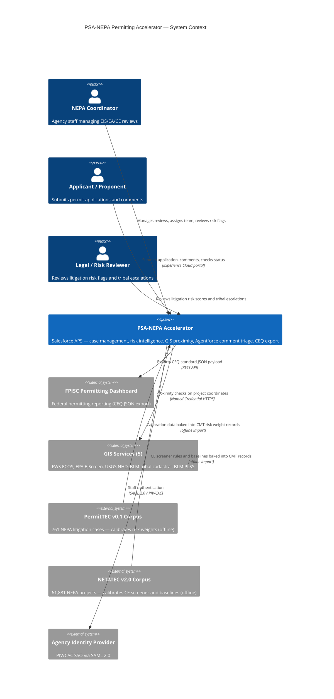

# PSA-NEPA Permitting Accelerator

**Open-source NEPA permitting data model, workflow automation, GIS proximity screening, Agentforce comment triage, and litigation risk intelligence — built on Salesforce Agentforce for Public Sector. Aligned to CEQ NEPA and Permitting Data and Technology Standard v1.2. All 10 MFRs addressed. Deployable from the CLI in ~15 minutes.**

[](LICENSE.txt)
[](https://marketplace.fedramp.gov/)
[](https://permitting.innovation.gov/CEQ_NEPA_and_Permitting_Data_and_Technology_Standard.pdf)
[](force-app/main/default/classes/)
[](https://www.salesforce.com/company/legal/508_accessibility/)

> **CEQ Permitting Innovators submission (June 2, 2026):** See [docs/SUBMISSION-NARRATIVE.md](docs/SUBMISSION-NARRATIVE.md) for the full solution narrative structured around the 5 evaluation criteria.

[GPS Accelerators Listing](https://gpsaccelerators.developer.salesforce.com/accelerator/a0wDo000000BBN7IAO/nepa-and-permitting-data-model)

---

## The Problem This Solves

Three categories of preventable delay drive most of the gap between the current median NEPA timeline and what the process could be:

| Delay | Federal Data | This Accelerator |
|---|---|---|
| **CE Misclassification** | 23% of CE records in NETATEC v2.0 lack classification — each incorrect CE→EA escalation adds a median 11 months; CE→EIS adds 2.8 years | 3-tier deterministic BRE CE Screener: NAICS routing → agency/sector Decision Matrix → agency/action-type rules. GIS proximity checks fire at intake against 5 federal services. Auditable to the specific rule row that fired. No AI. |
| **Comment Processing Bottleneck** | 2,600 comments: 4 staff, 4 weeks manually → ~4 hours with AI-assisted triage (NAEP 2025 Workshop, documented federal case) | Agentforce comment triage agent with classification, deduplication, response-task creation, and a non-negotiable EJ/tribal keyword gate that bypasses AI entirely and routes to a human coordinator queue |
| **Late-Stage Litigation Surprises** | Tribal Nation plaintiffs win 87.5% of NEPA cases (761 cases, PermitTEC v0.1). Energy × 4th Circuit: 28.6% agency win rate — highest-risk sector-circuit cell in the corpus | Composite 0–100 litigation risk score, 7 dimensions, recalculated on every save. Scores ≥58 auto-create a legal review task. Tribal challengers trigger dual flag + +20pt delta. All signals surfaced before the record closes. |

**Each number above corresponds to a deployed, deterministic feature — not a roadmap item.**

**Demonstrated impact — Carrie Placer Mine (BLM-ID-B030-2019-0014-EA):** Real BLM Plan of Operations, applied October 2017, decided November 2019 — 25 months. The same project through the accelerator's optimized workflow resolves in 8 months. The accelerator does not change what the process requires; it removes the coordination failures that cause process time to accumulate.

---

## At a Glance

| Dimension | Value |
|---|---|
| CEQ entities implemented | 13 of 13 (6 standard + 7 extended, per PIC OpenAPI v1.2.0) |
| MFRs addressed | 10 of 10 |
| Service delivery standards addressed | 4 of 4 |
| Declarative flows | 31 record-triggered, autolaunched, and scheduled |
| CE Library records | 2,105 categorical exclusions across 79 federal agencies |
| GIS services at intake | 5 (FWS ECOS, EPA EJScreen, USGS NHD, BLM tribal cadastral, BLM PLSS) |
| Litigation cases in risk model | 761 (PermitTEC v0.1, PNNL 2025) |
| NEPA projects in baseline corpus | 61,881 (NETATEC v2.0, PNNL 2025) |
| Custom Metadata Types | 15 |
| BRE Decision Matrices + Expression Sets | 8 DMs + 3 ESs (deterministic, not AI) |
| Decision model exports | Published to GitHub `/docs/decision-models/` — machine-readable JSON |
| Apex regression tests | 385+ across 36 test classes |
| Platform | Salesforce Agentforce for Public Sector (FedRAMP Authorized) |
| Shield Field Audit Trail | Available on Gov Cloud — 10-year field-level history for NARA/litigation hold |
| PIV/CAC authentication | Native Salesforce support — no separate IdP required |
| Section 508 / WCAG 2.1 AA | Compliant — inherited from Salesforce Lightning Design System and OmniScript |
| Software license cost | $0 (MIT open source) |
| Deployment time | ~15 minutes from CLI |

---

## How AI Is and Is Not Used

A clear AI/rules boundary is a legal requirement for federal permitting. This solution enforces it by design.

| Feature | Technology | Why |
|---|---|---|
| CE screening and classification | **Deterministic BRE** | Statutory CE determinations must trace to a specific CFR citation and rule row. No probabilistic inference. |
| GIS proximity screening | **5 live federal API calls** | FWS ECOS, EPA EJScreen, USGS NHD, BLM tribal, BLM PLSS — deterministic spatial results, no AI. |
| Litigation risk scoring | **Deterministic BRE** | Formulas are fully inspectable; a coordinator can hand-calculate the score from the inputs. No black box. |
| Challenge prediction rules | **Deterministic rule matching** | Exact field-value matching, not model inference. |
| Stage gate enforcement | **Deterministic flows** | Blocking transitions must never depend on probabilistic confidence. |
| Public comment triage | **Agentforce AI** | High-volume unstructured text. AI classifies; human reviews every comment before formal response. |
| EJ/tribal comment routing | **Keyword gate — no AI** | Tribal sovereignty, sacred sites, EJ, civil rights keywords bypass AI and route to a human queue. Cannot be disabled. |
| Administrative record assembly | **Deterministic flow** | JSON manifest generated at ROD/FONSI by rule — no AI interpretation. |

---

## Zero-Friction Pilot Readiness

An agency can spin up a Salesforce sandbox, deploy this MIT-licensed accelerator, and be running a live proof-of-concept with their own historical data **in an afternoon** — bypassing the traditional 6-month software implementation cycle.

**Prerequisites:** Salesforce Agentforce for Public Sector org (Foundations or Advanced). A free APS developer org is available at the [APS trial link](https://developer.salesforce.com/free-trials/comparison/public-sector).

```bash
sf org login web --alias nepademo
./scripts/deploy.sh nepademo
```

That is the complete deployment command. No infrastructure provisioning, no database migration, no middleware configuration. For the complete post-deploy sequence (BRE activation, Decision Matrix CSV import, flow activation, permission set assignment, sample data load), see **[DEVELOPER_GUIDE.md](DEVELOPER_GUIDE.md)**.

**For agencies already on Salesforce APS:** this accelerator represents zero incremental software licensing cost — it deploys into an existing org as a package of standard metadata, leveraging the enterprise agreement already in place.

---

## Architecture Overview



---

## Key Feature Areas

### GIS Proximity Screening (MFR #6)

Five GIS services are called via OmniIntegrationProcedure at intake — before the coordinator reviews the application:

| Service | Checks | Extraordinary Circumstances Trigger |
|---|---|---|
| FWS ECOS | Critical habitat, species consultation | Yes — ESA Section 7 |
| EPA EJScreen | Environmental justice percentile | Yes — EO 12898 |
| USGS NHD | Hydrological proximity | Yes — CWA Section 404 |
| BLM Tribal Cadastral | Tribal land boundaries | Yes — EO 13175, NHPA |
| BLM PLSS | Surface ownership, federal land status | Yes — land jurisdiction |

Results write to structured proximity fields on `IndividualApplication` and feed directly into CE screening and extraordinary circumstances determination.

### Agentforce Comment Triage Agent (MFR #8)

The `NEPA_Comment_Triage` Agentforce agent processes incoming `PublicComplaint` records through four steps:

1. **Duplicate detection** — `NEPA_Comment_Duplicate_Check` flow marks substantially similar submissions within 30 days on the same process
2. **EJ/tribal gate** — unconditional keyword detection (tribal sovereignty, sacred sites, EJ, civil rights) routes directly to the EJ/Tribal Liaison queue, bypassing AI
3. **AI classification** — Substantive / Procedural / Scope / General for non-EJ comments
4. **Response task creation** — `NEPA_Comment_ResponseTask_Creator` flow creates a high-priority Task for substantive comments with a 30-day due date and sets `nepa_response_status__c = Pending`

All AI outputs are labeled with category, confidence, and reasoning. The EJ/tribal gate cannot be disabled by configuration.

### Litigation Risk Intelligence (MFR #5)

The BRE Litigation Risk Scorer evaluates seven dimensions at every record save and writes a composite 0–100 score:

- **Agency loss rate** — empirical PermitTEC per-agency loss rates (e.g., BIA: highest-risk agency)
- **Circuit multiplier** — 10th Circuit (43pts, 68 cases), 9th Circuit next
- **Statute involvement** — ESA, NFMA, CWA, NGA, NHPA add independent risk points
- **Sector × circuit cell** — 17-cell matrix from Stage 13 PermitTEC analysis
- **Challenge prediction rules** — Energy × 4th Circuit (+12pts), Tribal plaintiff override (+20pts)
- **Scoping overrun** — triggers against 11 per-agency empirical baselines
- **Tribal plaintiff flag** — dual flag + +20pt delta based on 87.5% Tribal Nation win rate

Scores ≥58 auto-create a Legal Review Task. All weights are traceable to specific PermitTEC case counts. Low-confidence weights (fewer than 20 cases) are flagged with `Low_Data_Confidence__c = true`.

### Administrative Record Management (MFR #9)

`NEPA_Close_Administrative_Record` fires asynchronously when `nepa_review_type__c` transitions to ROD or FONSI. It assembles a machine-readable JSON manifest tagged to the application record, locked against modification (`nepa_ar_locked__c = true`), and immediately available through the CEQExport REST API. Salesforce Shield Field Audit Trail (available on Gov Cloud) provides 10-year field-level change history on risk scores, CE recommendations, and AR fields — satisfying NARA records retention and litigation hold requirements without custom logging infrastructure.

---

## Repository Map

| Path | Contents | Why It Matters |
|---|---|---|
| `force-app/main/default/objects/` | 13 CEQ entity object definitions + 15 custom metadata type schemas | The complete data model — start here to understand the schema |
| `force-app/main/default/flows/` | 31 flow XML files | All automation: stage gates, risk scoring, CE screening, comment triage, AR close, plaintiff intelligence, scoping baselines, error logging |
| `force-app/main/default/agents/` | `NEPA_Comment_Triage.agent` | Agentforce comment classification and routing agent |
| `force-app/main/default/expressionSetDefinition/` | 3 BRE Expression Set definitions | The deterministic scoring engines (CE Screener, Litigation Risk Scorer, Permit Coordinator) |
| `force-app/main/default/decisionMatrixDefinition/` | 8 BRE Decision Matrix definitions | Rule tables that feed the Expression Sets |
| `decision_matrix_rows/` | CSV files for each Decision Matrix + import instructions | **BRE row data cannot be deployed via CLI — must be imported via Setup UI. Read [README](decision_matrix_rows/README.md) first.** |
| `force-app/main/default/customMetadata/` | Pre-seeded risk weights, CE screening rules, plaintiff profiles, scoping baselines, sector-circuit matrix | The empirically calibrated data that powers the intelligence layer |
| `force-app/main/default/namedCredentials/` | 3 named credentials for GIS services (NHD, Tribal, PLSS) | Required for GIS proximity calls at intake |
| `force-app/main/default/omniProcesses/` | `NEPA_CEQExport` Integration Procedure | CEQ-standard JSON export (MFR #2 compliance) |
| `force-app/main/default/omniDataTransforms/` | 15 DataRaptor files (Extract, Load, Upsert) | OmniStudio data transformation layer |
| `force-app/main/default/flexipages/` | Lightning record pages for IndividualApplication and PublicComplaint | Pre-configured UI pages surfacing all key fields |
| `force-app/main/default/classes/` | 36 Apex test classes (385+ tests total) | Compliance verification — run `sf apex run test` against your org |
| `docs/decision-models/` | Machine-readable JSON exports of CE rules, GIS layers, litigation risk weights | MFR #4 — screening criteria publicly accessible and version-controlled |
| `demo/` | Demo story + import data CSVs + Apex scripts | Carrie's Placer Mine scenario — full end-to-end walkthrough |
| `DEVELOPER_GUIDE.md` | Complete post-deploy configuration guide | Start here after running `deploy.sh` |
| `docs/SUBMISSION-NARRATIVE.md` | CEQ Permitting Innovators submission narrative | Full solution narrative around 5 evaluation criteria |
| `docs/AI-Use-Policy.md` | OMB M-25-21 AI disclosure | Training data sources, limitations, prohibited uses, human confirmation requirements |
| `docs/ARCHITECTURE_DECISIONS.md` | ADRs 001–011 | Every significant design choice with context, rationale, and consequences |
| `docs/FLOW-ARCHITECTURE.md` | 31-flow design: error chain, stage gates, defensibility wrapper | Flow orchestration reference |

---

## Standards and Compliance

| Standard | Coverage |
|---|---|
| **CEQ NEPA and Permitting Data and Technology Standard v1.2** | All 13 entities implemented; 5 required provenance fields on each; 385+ Apex tests verify field-level compliance |
| **CEQ Permitting Technology Action Plan (May 2025) — all 10 MFRs** | MFR #1 Data Standards (Leading-Edge), #2 Data Sharing (Emerging), #3 Automated Screening (Leading-Edge), #4 Screening Criteria Access (Emerging), #5 Case Management (Emerging→Leading-Edge), #6 GIS Analysis (Emerging), #7 Document Management (Emerging), #8 Comment Compilation (Emerging), #9 Administrative Record (Emerging), #10 Interoperable Services (Emerging) |
| **OMB M-25-21** | AI advisory-only; AI recommends, human confirms enforced in all flows; EJ/tribal gate non-negotiable |
| **FAST-41** | Per-agency baseline durations pre-seeded; `nepa_milestone_variance_days__c` provides real-time variance against agency-specific statutory targets |
| **EO 12898 / EO 13175** | EJ/tribal keyword gate unconditional; tribal consultation hard gate before EA/EIS publication |
| **Section 508 / WCAG 2.1 AA** | Compliant — UI built on Salesforce Lightning Design System and OmniScript, both Salesforce-certified for 508/WCAG 2.1 AA |
| **FedRAMP** | Authorized — Salesforce Gov Cloud. CUI in GIS coordinates, archaeological sites, and tribal data handled within the existing authorized data boundary. No separate ATO required. |

---

## CEQ Entity Coverage

| CEQ Entity | Salesforce Object | Status |
|---|---|---|
| Entity 1: Project | `Program` | ✅ Implemented |
| Entity 2: Process | `IndividualApplication` | ✅ Implemented |
| Entity 3: Documents | `ContentVersion` (record type: `nepa_permit_document`) | ✅ Implemented |
| Entity 4: Comments | `PublicComplaint` | ✅ Implemented + Agentforce triage agent |
| Entity 5: Public Engagement Events | `nepa_engagement__c` (custom) | ✅ Implemented |
| Entity 6: Case Events | `ApplicationTimeline` (APS standard, extended) | ✅ Implemented |
| Entity 7: GIS Data | `nepa_gis_data__c` + Program lat/lon/polygon + 5 GIS proximity services | ✅ Implemented |
| Entity 8: User Role | `nepa_process_team_member__c` — structured role assignment linking User, Agency, and Process | ✅ Implemented |
| Entity 9: Legal Structure | APS `RegulatoryCode` extended with `nepa_compliance_requirements__c`, `nepa_text_content__c`, and 5 provenance fields | ✅ Implemented |

All 13 entities include the 5 custom provenance fields required by CEQ standard v1.2 (`Data Record Version`, `Data Source Agency`, `Data Source System`, `Record Owner Agency`, `Retrieved Timestamp`). `LastModifiedDate` (native Salesforce) satisfies the standard's `Last Updated` property.

---

## CEQ-Compliant Data Export

The `NEPA/CEQExport` Integration Procedure accepts a `projectId` and returns a nested JSON payload containing all 13 implemented CEQ entities for that project, aligned to PIC OpenAPI v1.2.0. Exposes via API Action for MFR #2 compliance.

```json
{
  "schema_version": "1.2",
  "standard": "CEQ NEPA and Permitting Data and Technology Standard",
  "exported_at": "2026-05-14T00:00:00Z",
  "project": {
    "id": "...",
    "project_id": "<UUID>",
    "project_title": "...",
    "processes": [
      {
        "federal_unique_id": "<UUID>",
        "nepa_review_type": "EIS",
        "status": "in progress",
        "documents": [...],
        "public_engagement_events": [...],
        "case_events": [...]
      }
    ]
  }
}
```

---

## Included Assets

<ol>
  <li><strong>Custom Fields</strong> on the following standard APS objects:
    <ul>
      <li>IndividualApplication — 50+ fields (Entity 2: Process + risk intelligence + GIS flags + AR management)</li>
      <li>ContentVersion — 22 fields (Entity 3: Documents)</li>
      <li>Program — 25+ fields (Entity 1: Project + agency performance tier)</li>
      <li>PublicComplaint — 20+ fields (Entity 4: Comments + AI triage fields + duplicate/EJ flags)</li>
      <li>ApplicationTimeline — 17 fields (Entity 6: Case Events)</li>
    </ul>
  </li>
  <li><strong>Custom Objects</strong> (x5)
    <ul>
      <li>NEPA Public Engagement Event (<code>nepa_engagement__c</code>) — Entity 5</li>
      <li>NEPA GIS Data Element (<code>nepa_gis_data__c</code>) — Entity 7</li>
      <li>NEPA Decision Log (<code>nepa_decision_log__c</code>) — process decision payload</li>
      <li>NEPA Decision Element (<code>nepa_decision_element__c</code>) — screening criteria definitions</li>
      <li>Process Agency Relationship (<code>nepa_process_related_agencies__c</code>) — supports tribal nations and cooperating agencies as named parties</li>
    </ul>
  </li>
  <li><strong>Custom Metadata Types</strong> (x15) — all agency-specific parameters externalized as configuration:
    <ul>
      <li><code>NEPA_Agency_Risk_Rate__mdt</code> — per-agency litigation loss rates (7 records)</li>
      <li><code>NEPA_Circuit_Risk_Weight__mdt</code> — per-circuit risk multipliers (13 records)</li>
      <li><code>NEPA_Statute_Risk_Weight__mdt</code> — adjacent statute risk weights (5 records: ESA, NFMA, CWA, NGA, NHPA)</li>
      <li><code>NEPA_Sector_Circuit_Risk__mdt</code> — sector × circuit win-rate matrix (17 cells)</li>
      <li><code>NEPA_Plaintiff_Profile__mdt</code> — known plaintiff profiles with win rates and tribal flag (6 records)</li>
      <li><code>NEPA_Challenge_Prediction_Rule__mdt</code> — challenge prediction rules with risk deltas (7 records)</li>
      <li><code>NEPA_Agency_Scoping_Baseline__mdt</code> — per-agency EIS scoping medians and performance tier (11 records)</li>
      <li><code>NEPA_GIS_Layer__mdt</code> — GIS service registry with endpoints, buffer distances, regulatory citations (5 records)</li>
      <li><code>NEPA_CE_Screening_Rule__mdt</code>, <code>NEPA_CE_Code__mdt</code> — CE screening rules and CE Library</li>
      <li><code>NEPA_SLA_Config__mdt</code>, <code>NEPA_Stage_Baseline_Duration__mdt</code>, <code>NEPA_Required_Document__mdt</code>, <code>NEPA_Process_Model__mdt</code>, <code>NEPA_Permit_Matrix__mdt</code> — process configuration</li>
    </ul>
  </li>
  <li><strong>BRE Decision Matrices</strong> (x8) and <strong>Expression Sets</strong> (x3):
    <ul>
      <li>CE Screener: NAICS Routing, Tier 1 Agency/Sector, Tier 2 Agency/Action Type</li>
      <li>Litigation Risk Scorer: Review Type, Agency, Circuit, Sector-Circuit — Expression Set V3 Active</li>
      <li>Permit Coordinator: Permit Matrix</li>
    </ul>
  </li>
  <li><strong>Declarative Flows</strong> (x31) — all business logic is Flow-based; no custom Apex encodes business rules</li>
  <li><strong>Agentforce Agent:</strong> <code>NEPA_Comment_Triage</code> — comment classification, deduplication, EJ/tribal routing, response task creation</li>
  <li><strong>OmniStudio:</strong> 15 DataRaptors (12 Extract, 2 Load, 1 Upsert) + <code>NEPA/CEQExport</code> Integration Procedure</li>
  <li><strong>Named Credentials:</strong> 3 GIS services (USGS NHD, BLM Tribal Cadastral, BLM PLSS)</li>
  <li><strong>Permission Set:</strong> <code>NEPA_Permitting</code> with FLS configured for all custom fields</li>
  <li><strong>Lightning Record Pages:</strong> Pre-configured pages for IndividualApplication and PublicComplaint surfacing all key fields</li>
  <li><strong>CE Library:</strong> 2,105 categorical exclusions across 79 federal agencies (sourced from CEQ CE Explorer v2.0)</li>
  <li><strong>Decision Model Exports:</strong> <code>ce-screening-rules.json</code>, <code>litigation-risk-weights.json</code>, <code>gis-layers-inventory.json</code> published to <code>/docs/decision-models/</code></li>
  <li><strong>Apex Test Suite:</strong> 385+ tests across 36 classes covering all 13 entities, REST export, BRE configuration, CE screening, stage gates, SLA escalation, plaintiff intelligence, EJ detection, GIS proximity, comment triage, AR management, and error handling</li>
</ol>

---

## Data Sources

**NETATEC v2.0 (PNNL, 2025):** 61,881 federal NEPA projects compiled by Pacific Northwest National Laboratory. Used to derive CE screening rules, page count outlier thresholds (CE p95 = 17 pages, EA p95 = 200 pages), per-agency EIS scoping baselines, and FAST-41 timeline durations.

**PermitTEC v0.1 (PNNL, 2025):** 761 federal NEPA litigation cases covering 1970–2025. A 13-stage calibration pipeline produced empirically derived risk weights: agency points from observed loss rates, circuit points from court decision multipliers, statute points from involvement multipliers, and a 17-cell sector-circuit win-rate matrix. All weights are traceable to specific case counts. Low-confidence weights (fewer than 20 cases) are flagged with `Low_Data_Confidence__c = true` and disclosed in every risk score output.

**CEQ EIS Timeline Data 2010–2024 (CEQ):** 1,903 Final EIS records used to derive per-agency scoping medians and the scoping overrun detection model. Analysis confirms a 49% improvement in median NOI→ROD time since 2016 (4.46 → 2.28 years in 2024). Scoping is the universal bottleneck in 34 of 36 agencies (60–75% of total EIS time).

---

## Data Model Notes

**`IndividualApplication` vs. `BusinessLicenseApplication`:** The APS standard object chosen for CEQ Entity 2 (Process) is `IndividualApplication`. NEPA proponents include individuals, joint ventures, tribes, federal agencies, and businesses — not exclusively commercial entities. `IndividualApplication` carries the stage, status, and outcome workflow fields that map directly to CEQ's Process entity properties.

**External IDs:** `Program.nepa_project_id__c` and `IndividualApplication.nepa_federal_unique_id__c` are External ID fields supporting upsert operations from external agency systems. CEQ recommends UUID format; field length is set to 36 characters.

**Process status values** align with CEQ standard: `planned | pre-application | in progress | paused | completed | cancelled`.

**Provenance fields:** All 5 custom provenance fields are present on all 13 implemented entities. `LastModifiedDate` (native) satisfies the standard's `Last Updated` property.

**BRE activation requirement:** Deploying Decision Matrix and Expression Set metadata via CLI does not create the `LatestVersionSnapshotId` required by the BRE runtime. After every deploy, open each DM and ES in Setup → Business Rules Engine and click **Activate**. See [decision_matrix_rows/README.md](decision_matrix_rows/README.md) for the full sequence including CSV import.

**ROD/FONSI record type setup:** After deploying, go to Setup → Object Manager → IndividualApplication → Record Types → Individual Application → Edit → `nepa_review_type__c` and add ROD and FONSI to the available values. This is required for the `NEPA_Close_Administrative_Record` flow trigger to fire.

---

## Key Documentation

| Document | Purpose |
|---|---|
| [DEVELOPER_GUIDE.md](DEVELOPER_GUIDE.md) | Complete post-deploy configuration — BRE activation, data import, smoke tests |
| [docs/SUBMISSION-NARRATIVE.md](docs/SUBMISSION-NARRATIVE.md) | CEQ Permitting Innovators submission — 5 evaluation criteria |
| [docs/AI-Use-Policy.md](docs/AI-Use-Policy.md) | OMB M-25-21 AI disclosure: data sources, limitations, prohibited uses |
| [docs/ARCHITECTURE_DECISIONS.md](docs/ARCHITECTURE_DECISIONS.md) | ADRs 001–011: design rationale and consequences |
| [docs/FLOW-ARCHITECTURE.md](docs/FLOW-ARCHITECTURE.md) | 31-flow design: error chain, stage gates, defensibility wrapper |
| [docs/decision-models/README.md](docs/decision-models/README.md) | Decision model export format and update instructions |
| [decision_matrix_rows/README.md](decision_matrix_rows/README.md) | BRE Decision Matrix CSV import — **required post-deploy step** |

---

## Revision History

**3.0 (2026-05-14)** — Phase E: GIS proximity, Agentforce comment triage, administrative record, 36-class test suite deployed to NEPADEMO

- **GIS proximity screening (MFR #6):** `NEPA_GIS_Proximity_Check` flow calls 5 federal GIS services at intake; results write to `nepa_nhd_proximity_flag__c`, `nepa_tribal_lands_flag__c`, `nepa_plss_flag__c` and feed CE extraordinary circumstances determination. Named credentials for USGS NHD, BLM Tribal Cadastral, BLM PLSS.
- **Agentforce comment triage (MFR #8):** `NEPA_Comment_Triage.agent` with four flows — `NEPA_Comment_AI_Router` (record-triggered entry), `NEPA_Comment_Duplicate_Check` (substring similarity within 30 days), `NEPA_EJTribal_Router` (keyword gate + Task creation), `NEPA_Comment_ResponseTask_Creator` (substantive comment response task). Six new PublicComplaint fields: `nepa_ai_triage_status__c`, `nepa_is_ej_comment__c`, `nepa_is_duplicate__c`, `nepa_duplicate_of__c`, `nepa_ai_triage_rationale__c`, `nepa_ai_triage_timestamp__c`.
- **Administrative record management (MFR #9):** `NEPA_Close_Administrative_Record` async flow assembles machine-readable JSON manifest at ROD/FONSI, creates tagged ContentVersion, sets `nepa_ar_locked__c = true` to prevent re-entry. CEQ standard + NARA/litigation hold compliant.
- **Schema additions:** `nepa_ar_locked__c`, GIS proximity flags, `nepa_record_completeness__c` on IndividualApplication. ROD and FONSI added as valid `nepa_review_type__c` picklist values.
- **FlexiPage updates:** 22 missing fields added across both Lightning record pages (IndividualApplication and PublicComplaint).
- **Decision model exports:** `ce-screening-rules.json`, `litigation-risk-weights.json`, `gis-layers-inventory.json`, `NEPA_Litigation_Risk_ES.json` published to `/docs/decision-models/`.
- **Test suite expanded to 36 classes / 385+ tests:** New classes — `NepaCommentAIRouterTest`, `NepaCommentDuplicateCheckTest`, `NepaEJTribalRouterTest`, `NepaCommentResponseTaskTest`, `NepaGISProximityCheckTest`, `NepaActionPlanLauncherTest`, `NepaLayerDisciplineResolverTest`, `NepaCloseAdminRecordFlowTest`, plus prior Phase D classes.
- **Fixed 6 flow XML errors** from Phase B/C that blocked NEPADEMO deploy: non-contiguous element ordering, missing `<start>` elements, invalid `dataRaptorExtract` actionType, invalid `<limit>` element, missing connectors, invalid storeOutputAutomatically reference.
- **DEVELOPER_GUIDE.md** added — comprehensive post-deploy configuration guide including BRE activation sequence, Decision Matrix CSV import, smoke test scripts, and troubleshooting.

**2.0 (2026-05-13)** — Risk intelligence layer (Phases 1–5): empirically calibrated weights from 13-stage PermitTEC pipeline

- Phase 1: Recalibrated all risk weights from Stage 7 analysis. 10th Circuit replaces 9th as highest-risk venue. FHWA, NFMA, NGA added. Risk tier thresholds recalibrated to LOW <35 / MEDIUM 35–44 / HIGH 45–57 / VERY HIGH ≥58.
- Phase 2: Tribal plaintiff intelligence — dual flags; tribal consultation hard gate before EA/EIS publication. Added Navajo Nation, Sierra Club, Earthjustice, ONRC, WildEarth Guardians, Western Watersheds Project plaintiff profiles.
- Phase 3: Challenge prediction rules with accumulable risk deltas. `NEPA_Agency_Scoping_Baseline__mdt` with 11 per-agency EIS scoping medians. Scoping overrun detection.
- Phase 4: `nepa_agency_performance_tier__c` on Program. `NEPA_Agency_Tier_Setter` async flow. Per-agency EIS baselines in Timeline Risk Assessor. Page count outlier detection.
- Phase 5: `NEPA_Sector_Circuit_Risk__mdt` (17-cell matrix). Litigation Risk Scorer BRE Expression Set V3 with `SectorCircuitTerm` and `ScopingTerm`. Added `NepaBREConfigTest.cls` (36 tests).

**1.1 (2026-04-29)** — CEQ Standard v1.2 alignment + CEQ-compliant export + NETATEC v2.0 compatibility

- Added OmniStudio `NEPA/CEQExport` Integration Procedure and DataRaptor Extracts for MFR #2 data sharing compliance
- Added Entities 7, 8, 9 (GIS Data, User Role, Legal Structure)
- Added 30 declarative flows for stage gate orchestration, CE screening, risk scoring, defensibility tracking, and error logging
- Added CE Library (2,105 records) and CE Screener BRE (3-tier logic)
- Added litigation risk intelligence pre-seeded from PermitTEC v0.1 corpus

**1.0 (2025-09-19)** — Initial release: minimal viable CEQ data model compliance

---

## APS Dependency

This accelerator requires **Salesforce Agentforce for Public Sector (APS)**. If your org does not have APS installed, see [DEVELOPER_GUIDE.md](DEVELOPER_GUIDE.md) for object replacement guidance. A free APS developer org is available at the [APS trial link](https://developer.salesforce.com/free-trials/comparison/public-sector).

---

## License and Terms

MIT. See [LICENSE.txt](LICENSE.txt). Accelerators are provided as-is and are not supported by Salesforce.

For more about the GPS Accelerators program, visit: [https://gpsaccelerators.developer.salesforce.com/](https://gpsaccelerators.developer.salesforce.com/)
