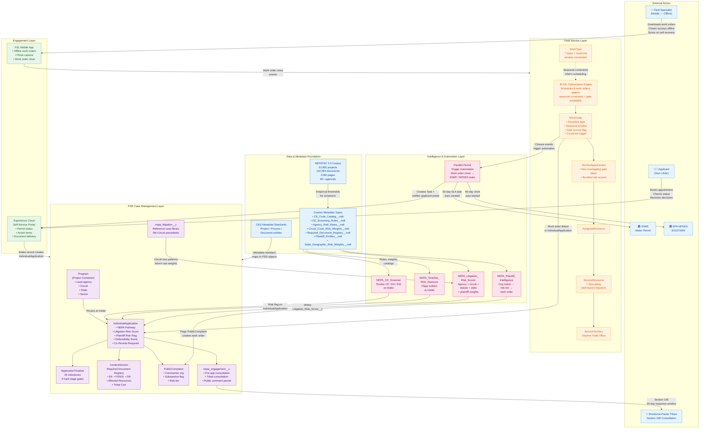

# Demo Story: Carrie Placer Mine Plan of Operations
## Salesforce Field Service & Public Sector Solutions — NEPA Permitting Acceleration

**Source Data:** DOI-BLM-ID-B030-2019-0014-EA | BLM Owyhee Field Office, Marsing, Idaho
**Real Case File:** IDI-38709 | Applied Oct 18, 2017 → Decision Nov 27, 2019 (25 months)
**Demo Timeline:** Same project, 8 months (Mar → Nov 2019)

---

## Presenter Overview

This demo runs four scenes, each following **Tell → Show → Tell** structure. Before each scene, deliver the **Setup Tell** — one or two sentences that name the pain before the audience sees the solution. After the scene, deliver the **Landing Tell** — one or two sentences that name what just changed and why it matters. Never let a demo moment speak for itself.

**Core message:** The permit didn't take 25 months because the project was hard. It took 25 months because the *process* was broken — wrong people, wrong places, wrong season, no coordination. Salesforce fixes the process, not the project.

**Audience:** BLM field office managers, state permitting directors, NEPA program leads, agency IT/digital transformation leads.

**Total demo time:** 20–25 minutes across four scenes.

---

## Discovery Questions

Use these before the demo — ideally in a pre-demo call or in the first five minutes of the meeting before opening the laptop. The goal is to get the audience articulating their own pain in their own words. When they do, the Carrie Placer Mine story lands as a mirror, not a pitch.

Questions are grouped by theme. You don't need all of them. Pick two or three that match what you already know about the account, and let the conversation run.

---

### Theme 1: Process Bottlenecks and Scheduling

*These surface the coordination failure — the core problem the optimization engine solves.*

- **"Walk me through what happens between when an applicant submits a Plan of Operations or permit request and when your first field specialist actually sets foot on the project site. What does that sequence look like today?"**
  - *Listen for:* manual handoffs, email chains, scheduling gaps, time between intake and first site visit. If they describe anything sequential that should be parallel, you have the story.

- **"When you have a project that requires multiple resource disciplines — say hydrology, wildlife, and botanical all on the same site — how do you coordinate who goes when?"**
  - *Listen for:* informal coordination, separate calendars, specialists making independent trips, no shared scheduling visibility. Any of these is your setup for the gate access scene.

- **"How often do field surveys have to be rescheduled because someone went out in the wrong season? And when that happens, how far does it push the timeline?"**
  - *Listen for:* specific examples, frustration, workarounds. If they say "it happens more than it should," that's your tell for Scene 2.

- **"If I asked you right now which of your in-progress applications are at risk of missing a seasonal survey window in the next 90 days, how quickly could you answer that?"**
  - *Listen for:* hesitation, "I'd have to ask the specialists," spreadsheet references, or "we don't really track that." The inability to answer this question is what the optimization engine solves.

---

### Theme 2: Parallel Permits and Inter-Agency Coordination

*These surface the co-permit drift problem — the trigger automation solves.*

- **"For projects that need permits from multiple agencies — say a BLM action that also requires an EPA NPDES or a state water permit — how do you make sure those parallel tracks stay coordinated with your primary review?"**
  - *Listen for:* "the applicant handles that," "we remind them at the end," "it usually comes up after we've already issued our decision." The last answer is exactly what happened in the Carrie Placer Mine case.

- **"Have you ever issued a decision and then had the applicant come back and say they still couldn't start because they were waiting on a state or EPA permit they didn't know they needed to start earlier?"**
  - *Listen for:* a yes, a story, or a knowing laugh. This is one of the most common pain points and it tends to unlock candid conversation.

- **"What's your current mechanism for making sure a co-permit application clock starts at the right point in your review — not at the end?"**
  - *Listen for:* no mechanism, manual reminders, or "we rely on the applicant to figure that out." The absence of a mechanism is the gap the trigger automation fills.

---

### Theme 3: Administrative Record and Defensibility

*These surface the documentation and litigation risk problem — the stage gate and Plaintiff Intelligence solve.*

- **"When a decision gets challenged — whether it's a formal protest or litigation — how confident are you that your administrative record is complete and that every required consultation and review step is documented in one place?"**
  - *Listen for:* confidence gaps, "we pull it together after the fact," references to past challenges where documentation was an issue. Don't push; just note if there's hesitation.

- **"How do you currently know when a public commenter on one of your projects has a track record of litigation? Is that something your team checks, and if so, how?"**
  - *Listen for:* "we usually recognize the names," "our attorneys flag them," "honestly we don't always know." Any answer short of a systematic process is your setup for the Plaintiff Intelligence scene.

- **"When a substantive comment comes in during a public comment period, what's the typical turnaround from comment close to response incorporated into the final document?"**
  - *Listen for:* the number. Sixty to ninety days is common. Anything over thirty gives you a strong contrast with the three-week response time in the demo.

- **"Has your office ever had a FONSI or EA challenged on the grounds that a comment raised an issue that wasn't addressed? What happened?"**
  - *Listen for:* a story. If they have one, it does more work than anything you could say. Let it land before moving on.

---

### Theme 4: Applicant Experience and Transparency

*These surface the visibility and trust deficit — the self-service portal solves.*

- **"From the applicant's perspective — the miner, the rancher, the developer — what do they see when they want to know where their permit stands? What's the experience like for them?"**
  - *Listen for:* "they call us," "we send emails when something changes," "they don't really have visibility." The contrast with real-time portal status is sharpest when the current state is a phone call.

- **"How many status-check calls or emails does your office field from applicants on active permits in a given week? What does that cost in staff time?"**
  - *Listen for:* a number, or an acknowledgment that it's significant. Even a rough estimate — "a few a day" — quantifies the problem the portal eliminates.

- **"When an applicant has to wait 25 months for a decision on a project that ultimately gets a FONSI — no significant environmental impact — what does that do to their confidence in the process, and to your office's relationship with the regulated community?"**
  - *Listen for:* acknowledgment of the trust cost, references to political pressure, congressional inquiries, or applicants giving up. This frames the 8-month outcome as a relationship investment, not just a speed metric.

---

### Theme 5: Staffing and Capacity

*These surface the resource constraint context — important for sizing the problem and the ROI conversation.*

- **"When you think about the specialist capacity you have — your biologists, geologists, NEPA coordinators — what percentage of their field time would you estimate is productive survey work versus travel, rescheduling, and coordination overhead?"**
  - *Listen for:* any ratio that suggests the overhead is significant. This sets up the "eliminated wasted trips" outcome directly.

- **"If you could get the same number of permits through your queue in less calendar time — without adding staff — what would that mean for your office's backlog?"**
  - *Listen for:* the backlog number, the pressure behind it, and whether there are political or regulatory deadlines driving it. This is your ROI anchor.

- **"Are there project types or applicant types that consistently take longer than they should — not because the projects are complex, but because of how the review is organized?"**
  - *Listen for:* specific examples. Mining, energy, ROW, grazing — any category they name is one you can map to a variant of the Carrie Placer Mine story.

---

### Using the Answers

When you move into the demo, use what you heard. Replace generic transitions with what the audience said:

> *"You mentioned that your biologists sometimes drive out twice because the first trip missed the seasonal window. That's exactly what happened on the Carrie Placer Mine — and it's the first thing the system fixed. Let me show you."*

> *"You said you usually find out about a co-permit gap after you've already issued your decision. Watch what happens in this demo when the hydrologist closes his work order."*

> *"You mentioned that you recognized the ICL name when they commented, but your team had to dig into past cases manually. Here's how the system does that check at intake."*

The goal of discovery isn't to complete a checklist. It's to find the one or two moments in the demo where you can say **"this is the thing you just described"** — and mean it.

---

## The Problem (Opening Narrative — Deliver Before Opening the Laptop)

Sam Uhler and David Smith acquired a placer gold mining claim adjacent to Jordan Creek, about 9 miles southeast of Jordan Valley, Oregon — 15 acres of BLM-administered land in Owyhee County, Idaho. They needed a Plan of Operations to mine placer gold.

Their permit took **25 months**. Not because the project was controversial. Not because the environmental impacts were severe — the final FONSI confirmed no significant impact. The delay was almost entirely operational.

Here's what the review actually required:

**Seven resource specialists had to complete independent field assessments:**

| Specialist | Assessment | Seasonal Constraint |
|---|---|---|
| Hydrologist | Jordan Creek water temperature; redband trout habitat (CWA Category 4A) | Avoid frozen ground |
| Wildlife — Sage-Grouse | PHMA survey; 3.1-mile lek buffer verification | Feb 1 – Apr 30 (before nesting) |
| Wildlife — Columbia Spotted Frog | Riparian survey; pond design review | May – Sep (amphibian active season) |
| Wildlife — Migratory Birds | Nesting territory mapping | Before mid-Apr OR after late Jul |
| Wildlife — Big Game | Mule deer crucial winter range | Aug – Oct (shoulder season) |
| Geologist | 1.7-mile access road erosion; reclamation plan | Any non-frozen season |
| Botanist | Special status plants; seed mix approval | Jun – Aug; two visits required |

**Three parallel agency permits ran without coordination:**
- BLM Plan of Operations (primary)
- Idaho Dept. of Water Resources (IDWR) — required before any Jordan Creek water withdrawal
- EPA NPDES General Permit IDG370000 — Small Suction Dredge; 60-day processing; applicant cannot operate until written authorization received

**The failure mode:** A 1.7-mile two-track road with two locked gates was the only access. Specialists drove out independently — sometimes on the same day without knowing it, sometimes in the wrong season entirely. No one had a view across all seven disciplines. The parallel permits started *after* the BLM decision, adding months to the applicant's wait. Sam Uhler called the field office 14 times asking for a status update.

**The permit didn't fail. The process did.**

---

## Scene 1: The Intake — From Phone Call to Full Team in One Booking

### Setup Tell *(say this before clicking)*

> "Today, when a miner like Sam wants to start a Plan of Operations review, he calls the field office, leaves a message, waits for a callback, gets told to submit paperwork, waits again — and might meet with one person who then has to go find six others. Let me show you what intake looks like when the system does that work instead."

### Show

- Sam opens the BLM self-service portal on his phone.
- He selects **New Plan of Operations – Mining**, enters the project location (T. 6 S., R. 5 W., Section 28, Jordan Creek watershed) and footprint (15 acres, 1.7-mile access road).
- The system reads the project type and location, cross-references resource layers, and automatically assembles the **Interdisciplinary (ID) Team**: geologist, NEPA specialist, wildlife biologist, hydrologist, botanist, and cultural resources coordinator.
- Sam confirms: a single 90-minute ID Team scoping session at the Owyhee Field Office.

**What to show in the UI:** The appointment booking flow, the auto-populated team roster, and the confirmed calendar invite with all seven specialists listed.

### Landing Tell *(say this after the click)*

> "Sam just booked one meeting and got all seven specialists. In the old system, assembling that team took weeks of phone tag — and there was no guarantee everyone was briefed before they walked in the room. The system knows what a placer gold mining project next to a Category 4A stream in PHMA territory requires. Sam doesn't have to know."

---

## Scene 2: The Work Order Cascade — Scheduling Against Nature's Calendar

### Setup Tell *(say this before clicking)*

> "Now here's where most permitting systems fall down. They track status — 'pending,' 'in review,' 'under evaluation.' But they don't do anything. The scheduler still has to manually figure out who goes where and when — and if they don't know sage-grouse biology, they'll send someone in May to do a lek survey that has to happen in March. Let me show you what happens the moment that pre-application meeting closes."

### Show

- The pre-application consultation is marked complete.
- Salesforce Field Service instantly generates **six parallel field work orders** — one per discipline.
- The optimization engine runs. Show the map view: six work orders drop onto Owyhee County. The engine resequences them:
  - **Lek survey moves to slot 1** — tightest window (closes April 30)
  - **Migratory bird survey** schedules before April 14
  - **Spotted frog/riparian survey** schedules late May, post-snow-off
  - **Botanical** gets two visits (June + August) — meeting the BLM Manual "multiple visits" requirement
  - **Big game** fills the August shoulder window
  - **Geology/road** fills remaining availability
- Show the **gate access constraint**: the two locked gates are modeled as a shared resource. The system books the applicant's gate availability and blocks double-booking. Each specialist sees in their mobile app exactly when the gate is open and who else will be on-site.
- Show the **parallel permit triggers**: the hydrologist's work order has a flag — when it closes, the system auto-creates: *"Initiate IDWR Water Permit Application"* assigned to the NEPA coordinator, 30-day SLA, and a parallel action item pushed to Sam's applicant portal. The geologist's work order does the same for EPA NPDES.
- Show the **tribal consultation work order**: Section 106 consultation with the Shoshone-Paiute Tribes is tracked with a 30-day response window. Its completion is a **hard gate** — the EA cannot advance to public review until this is certified.

**What to show in the UI:** The work order map, the seasonal constraint calendar, the gate resource booking screen, the parallel permit task auto-creation, and the stage gate on tribal consultation.

### Landing Tell *(say this after the click)*

> "Six surveys. Seven specialists. Five seasonal windows. Two locked gates. Three parallel permits. The system just sequenced all of it in seconds — and every specialist got there in the right season, the first time. The IDWR and EPA permits are already in motion before the EA is even drafted. That's the difference between running sequentially and running in parallel."

---

## Scene 3: Public Comment — Compressed, Not Skipped

### Setup Tell *(say this before clicking)*

> "Public comment periods are often where permitting momentum dies. Comments sit in an inbox. Someone has to figure out who handles which issue. Substantive comments from organized groups can sit for 60 days before anyone responds. And nobody's checking whether those groups have filed suit before. Let me show you how the system handles that."

### Show

- The preliminary EA and unsigned FONSI are published July 1. The 28-day comment period opens.
- Two comments arrive: **Idaho Conservation League (ICL)** and **Office of Species Conservation (OSC)**.
- The **Plaintiff Intelligence module** runs automatically. ICL is flagged: prior commenter on Owyhee Field Office sage-grouse projects; prior 9th Circuit plaintiff on suction dredge mercury cases. Risk tier: HIGH.
- The system auto-creates a work order: *"Add dust mitigation analysis to Air Quality section — ICL Comment 3, mercury particulate."* Assigned to the NEPA Specialist. 17-day SLA.
- OSC's comment challenges the lek buffer departure rationale. The system pulls the 2019 Idaho ARMPA ROD and generates a response memo template citing the justifiable departure section.
- Show the revised EA published August 15 — three weeks after comment close.

**What to show in the UI:** The comment intake queue, the Plaintiff Intelligence flag on ICL, the auto-generated work orders for each substantive comment, and the August 15 revised EA publish date on the timeline.

### Landing Tell *(say this after the click)*

> "The system identified ICL as a litigation risk before anyone in the field office would have known to look. The response to both comments was incorporated in three weeks instead of the typical two-to-four months. That's not just faster — that's a documented, auditable response that holds up if someone challenges the process later."

---

## Scene 4: The Decision — 8 Months, Not 25

### Setup Tell *(say this before clicking)*

> "The last thing I want to show you is the moment everything closes. In the old process, the NEPA specialist would have to chase down sign-offs, make sure all the documents were attached, confirm the tribal consultation was certified — all by email, all manually. Let me show you what the stage gate looks like when the system enforces it."

### Show

- Navigate to the **Required Document Registry**. All five mandatory documents are shown with status:
  - Environmental Assessment ✓
  - Finding of No Significant Impact ✓
  - Decision Record ✓
  - Affected Resources Form ✓
  - Tribal Consultation Certification ✓
- Forrest Griggs (geologist) and Colleen Trese (wildlife biologist) have both signed off — same day, November 20.
- The stage gate fires. The BLM Owyhee Field Manager issues the **Decision Record on November 27**, approving Alternative A with the full suite of required design features:
  - 50-foot Jordan Creek buffer
  - Silt fencing with twice-annual BLM inspections
  - Steep-shoreline pond design (Columbia spotted frog deterrence)
  - Seasonal mining window: March 1 – November 30
  - Full reclamation bonded to BLM botanist seed mix approval
- Sam Uhler receives an **automated portal notification** with the signed Decision Record attached.
- Show the timeline: **pre-application appointment March 12 → Decision Record November 27 = 8 months.**

**What to show in the UI:** The Required Document Registry with all five green, the concurrent sign-offs on the timeline, the stage gate firing, the Decision Record, and the applicant notification.

### Landing Tell *(say this after the click)*

> "Sam stopped calling the field office. He watched his permit move through the system in real time. Eight months. The same project. The same seven specialists. The same three permits. The same regulations. The only thing that changed was the process — and in this case, the process is the product."

---

## Before / After Summary

| Without Salesforce | With Salesforce |
|---|---|
| Seven specialists scheduled independently, often missing seasonal windows | Optimization engine sequenced six work orders against hard seasonal constraints; all surveys completed within a single field season |
| Gate access double-booked; specialists drove 45 minutes to a locked road | Shared gate-access resource constraint; no wasted trips |
| IDWR and EPA NPDES permits started after BLM decision | Parallel permit triggers fired automatically when hydrologist and geologist closed their work orders |
| ICL and OSC comments sat in an inbox for 60+ days | Plaintiff Intelligence flagged both commenters; responses routed as work orders; resolved in 3 weeks |
| Tribal consultation tracked in email; no stage gate | Section 106 work order with 30-day SLA; hard gate before EA publication |
| 25-month timeline; applicant called the field office 14 times | 8-month timeline; real-time status in self-service portal |

---

## Architecture and Process Diagrams

---

### Diagram 1: Enterprise Architecture

The diagram shows four vertical layers. Data flows upward from the corpus and metadata foundation through Salesforce platform objects and automation into the applicant-facing and field-facing surfaces.

**Architecture notes:**
- **Orange (Field Service):** The optimization engine is the scheduling brain — it reads WorkType seasonal constraints and gate availability, sequences all six work orders, and prevents double-booking.
- **Purple (PSS Case Management):** IndividualApplication is the central record. Every specialist survey, every document, every comment, every milestone hangs off it.
- **Pink (Intelligence):** All four flows read from Custom Metadata Types — changing a CE code, adding a plaintiff org, or updating a circuit risk weight requires zero code change.
- **Blue (Data Foundation):** The NEPATEC 2.0 corpus is the empirical basis for every threshold in the screeners. The model isn't hypothetical — it's derived from 61,881 real projects.

---

### Diagram 2: Business Process — Before and After

The swimlane below runs left-to-right as a timeline. Read the **top half (red)** as the 25-month failure path. Read the **bottom half (green)** as the 8-month optimized path. The six innovation callouts show exactly where the process breaks in the old system and what replaces it.

```mermaid
flowchart LR
    subgraph LEGEND["Innovation Key"]
        direction LR
        I1["⚡ = System automation replaces manual step"]
        I2["🔴 = Failure point in old process"]
        I3["🟢 = Salesforce solution"]
    end

    subgraph BEFORE["WITHOUT SALESFORCE — 25 Months"]
        direction TB

        subgraph BA["Applicant (Before)"]
            direction LR
            B_APP1["Submits\napplication"]:::before
            B_APP2["Calls field office\n14 times for status"]:::before
            B_APP3["Waits for\nco-permit guidance\nafter BLM decision"]:::before
            B_APP4["Receives decision\nby mail"]:::before
        end

        subgraph BC["Field Coordinator (Before)"]
            direction LR
            B_C1["Manual intake\nno routing logic"]:::before
            B_C2["Emails 7 specialists\nindividually"]:::before
            B_C3["🔴 No seasonal\nconstraint enforcement"]:::before
            B_C4["Comments sit\nin inbox 60+ days"]:::before
            B_C5["Manual doc\nchecklist by email"]:::before
            B_C6["Issues decision"]:::before
        end

        subgraph BS["Resource Specialists (Before)"]
            direction LR
            B_S1["Self-schedule\nindependently"]:::before
            B_S2["🔴 Wrong season:\nsurvey invalid,\nreschedule"]:::before
            B_S3["🔴 Gate conflict:\n45-min drive\nto locked road"]:::before
            B_S4["Sequential surveys:\nspecialist 1 done\nbefore 2 starts"]:::before
        end

        subgraph BP["Parallel Agencies (Before)"]
            direction LR
            B_P1["🔴 IDWR permit\nnot started until\nafter BLM decision"]:::before
            B_P2["🔴 EPA NPDES\nnot started until\nafter BLM decision"]:::before
            B_P3["Additional months\npost-decision wait"]:::before
        end

        B_APP1 --> B_C1 --> B_C2 --> B_S1
        B_S1 --> B_S2 --> B_S3 --> B_S4
        B_S4 --> B_C3 --> B_C4
        B_C4 --> B_C5 --> B_C6
        B_C6 --> B_P1 --> B_P2 --> B_P3
        B_P3 --> B_APP3 --> B_APP4
        B_C2 -.->|"No visibility"| B_APP2
    end

    subgraph AFTER["WITH SALESFORCE — 8 Months"]
        direction TB

        subgraph AA["Applicant (After)"]
            direction LR
            A_APP1["Books pre-app\nvia portal"]:::after
            A_APP2["Real-time status\nin portal"]:::after
            A_APP3["🟢⚡ Co-permit\naction items pushed\nto portal automatically"]:::after
            A_APP4["🟢⚡ Automated\ndecision notification\n+ DR attached"]:::after
        end

        subgraph AC["Field Coordinator (After)"]
            direction LR
            A_C1["🟢⚡ CE Screener\nroutes at intake"]:::after
            A_C2["🟢⚡ ID Team\nauto-assembled\nfor scoping session"]:::after
            A_C3["🟢⚡ Stage gate:\nSection 106 hard\ngate before EA pub"]:::after
            A_C4["🟢⚡ Plaintiff Intel:\ncomments → work\norders in days"]:::after
            A_C5["🟢⚡ Required Doc\nRegistry: all 5\ndocs green = gate fires"]:::after
            A_C6["Issues decision"]:::after
        end

        subgraph AS["Resource Specialists (After)"]
            direction LR
            A_S1["🟢⚡ Optimization\nengine sequences\n6 work orders"]:::after
            A_S2["🟢 Seasonal windows\ncoded as hard\nconstraints — slot 1\n= lek survey (Apr 30)"]:::after
            A_S3["🟢 Gate resource\nconstraint: no\ndouble-booking"]:::after
            A_S4["🟢 All 6 surveys\nrun in parallel\nwithin one field season"]:::after
        end

        subgraph AP["Parallel Agencies (After)"]
            direction LR
            A_P1["🟢⚡ IDWR task\nauto-created when\nhydrologist WO closes"]:::after
            A_P2["🟢⚡ EPA NPDES\ntask auto-created\nwhen geologist WO closes"]:::after
            A_P3["Permits processing\nIN PARALLEL with\nBLM review"]:::after
        end

        A_APP1 --> A_C1 --> A_C2 --> A_S1
        A_S1 --> A_S2 --> A_S3 --> A_S4
        A_S4 --> A_C3 --> A_C4
        A_C4 --> A_C5 --> A_C6
        A_S1 -.->|"⚡ WO close triggers"| A_P1
        A_S1 -.->|"⚡ WO close triggers"| A_P2
        A_P1 --> A_P3
        A_P2 --> A_P3
        A_P3 -.->|"In processing during\nBLM review"| A_C5
        A_C6 --> A_APP4
        A_C2 -.->|"Real-time visibility"| A_APP2
        A_P1 -.->|"Action item pushed"| A_APP3
    end

    subgraph DELTA["⚡ The Six Innovations"]
        direction TB
        D1["1️⃣  Sequential → Parallel scheduling\nOptimization engine sequences all\n6 work orders at meeting close"]
        D2["2️⃣  Missed windows → Hard constraints\nSeasonal biology encoded in WorkType;\nwrong-season dispatch impossible"]
        D3["3️⃣  Gate conflicts → Shared resource\nTwo locked gates managed as a shared\nresource; no double-booking"]
        D4["4️⃣  Late co-permits → Auto-triggered\nIDWR + EPA clocks start at work\norder close, not after BLM decision"]
        D5["5️⃣  Inbox lag → Plaintiff Intelligence\nICL/OSC comments routed as work\norders in days, not 60+ days"]
        D6["6️⃣  Manual checklist → Stage gate\nAll 5 docs required before Decision\nRecord can be issued — enforced"]
    end

    classDef before fill:#ffebee,stroke:#c62828,color:#b71c1c
    classDef after fill:#e8f5e9,stroke:#2e7d32,color:#1b5e20
    classDef delta fill:#fffde7,stroke:#f9a825,color:#e65100
```

**Process diagram notes:**

The six numbered innovations in the bottom panel map directly to the six rows in the Before/After Summary table. Each is a place where the old process relied on human memory, manual coordination, or sequential execution — and the new system replaces it with an automated constraint, trigger, or gate.

| Innovation | Old mechanism | New mechanism | Time saved |
|---|---|---|---|
| 1. Parallel scheduling | Email to 7 specialists individually | Optimization engine at meeting close | 4–8 weeks |
| 2. Seasonal constraints | Coordinator knowledge (if any) | WorkType hard constraint; wrong-season dispatch blocked | 1–3 months (avoided reschedule) |
| 3. Gate access | Phone calls between specialists | Shared resource constraint; system blocks double-booking | 3–5 wasted trips eliminated |
| 4. Co-permit triggers | Applicant notified post-decision | Auto-task at work order close; clocks start concurrently | 2–4 months post-decision wait |
| 5. Comment response | Inbox triage; manual routing | Plaintiff Intelligence → work order in days | 5–9 weeks |
| 6. Document registry | Email checklist; coordinator memory | Required Document Registry hard gate; system-enforced | Prevents re-opening; eliminates litigation gap |

---

## Objection Handling

### "This is just scheduling software. We already have Outlook and SharePoint."

**Response:** Outlook and SharePoint track appointments and store documents. They don't know that a sage-grouse lek survey has a 60-day seasonal window that closes April 30, or that sending a biologist outside that window invalidates the survey. They don't know that the two locked gates are a shared resource constraint. They don't fire an EPA NPDES task when a geologist closes a work order. The difference isn't scheduling — it's that the system encodes regulatory logic as operating constraints. That's what shortens 25 months to 8.

---

### "Is the 25-to-8-month comparison realistic? What was actually happening for 25 months?"

**Response:** This is a real case — DOI-BLM-ID-B030-2019-0014-EA, IDI-38709, BLM Owyhee Field Office. The administrative record is public. The delay wasn't caused by environmental complexity; the FONSI found no significant impact. The delay was caused by sequential scheduling of parallel-eligible surveys, missed seasonal windows requiring rescheduling, parallel agency permits (IDWR and EPA) that didn't start until after the BLM decision, and comment response lag. The 8-month projection assumes all surveys run in parallel, all in-window on the first attempt, and permits are triggered concurrently. That's achievable; it's exactly what the optimization engine is designed to produce.

---

### "We do a handful of EAs a year. Is this worth the investment for our volume?"

**Response:** Two answers. First, it's rarely just EAs — one BLM field office typically manages CEs, EAs, rights-of-way, grazing renewals, and mining Plans of Operations concurrently. The same scheduling and coordination logic applies across all of them. Second, the cost of one 25-month permit isn't just the permit — it's the specialist time spent on rescheduled field visits, the comment response backlog, the political and legal exposure when a project runs long, and the applicant's carrying costs while they wait. One prevented litigation filing covers the platform investment for years.

---

### "Can this handle EIS projects? EA is the easy case."

**Response:** Yes, and the complexity scales appropriately. EIS processes involve longer scoping periods, larger interdisciplinary teams, multiple comment rounds (scoping and DEIS), ROD stage gates, and higher litigation risk — all of which the platform handles. The NEPA_Timeline_Risk_Assessor flow specifically flags projects at intake that show the document complexity (page count, discipline count, sector combinations) associated with EIS outliers that run 5–13 years. For an EIS, the parallel track management is more valuable, not less — there are more tracks and more things that can drift out of sequence.

---

### "We have HR and union constraints — we can't route work directly to individual specialists."

**Response:** The work orders don't have to be assigned to named individuals. They can be assigned to skill pools — "wildlife biologist certified for sage-grouse PHMA assessment" — and dispatched through supervisor approval queues. The optimization engine works on skill availability, not individual assignment. The union rules and approval workflows can be modeled as part of the dispatch process. We've done this for other public sector clients with similar constraints.

---

### "The seasonal windows are hardcoded. What happens when regulations change?"

**Response:** The seasonal constraints are stored in custom metadata — not hardcoded in the application. When the ARMPA is revised or a new species gets a protection determination, an administrator updates the metadata record. No code change, no deployment. The same applies to CE catalog updates, document registry requirements, and litigation risk weights. That's exactly what the `WorkType` seasonal window fields and `CE_Screening_Rules__mdt` are designed for — configuration, not customization.

---

### "What about applicant data privacy? Mine claim data in a cloud system concerns us."

**Response:** Salesforce Government Cloud runs on FedRAMP High authorized infrastructure. Data residency stays domestic. The same platform handles data for DoD, VA, and other agencies with strict data handling requirements. The applicant-facing portal shares only the status and document outputs the agency designates — it doesn't expose internal scoring, risk assessments, or specialist notes to the applicant. Those are permission-controlled fields visible only to agency staff.

---

### "We can't get field specialists to actually use their phones out there. No cell service."

**Response:** The Salesforce Field Service mobile app supports offline mode. Specialists download their work orders before leaving the office. In the field, they can complete checklists, attach photos, and close work orders — all offline. The data syncs when they return to cell coverage. Colleen Trese closing the sage-grouse work order at the Jordan Creek trailhead in the demo doesn't require a cell signal at the trailhead.

---

### "The Plaintiff Intelligence feature feels inappropriate. We're a public agency — we can't profile commenters."

**Response:** The Plaintiff Intelligence module doesn't profile individual citizens — it matches commenter *organizations* against a historical record of prior litigation cases. That history is public record. It's the same analysis an agency attorney would do manually when they recognize a commenter's name: "ICL has filed in the 9th Circuit before, on similar issues — let's make sure our response is airtight." The system does that check automatically, consistently, and at intake — rather than two months later when a substantive gap has already been published. The output isn't a decision; it's a flag that triggers a legal defensibility review.

---

### "We already have [ServiceNow / PMIS / legacy system]. What's the migration story?"

**Response:** We're not proposing a rip-and-replace. The integration path depends on what the existing system does well. If it's a document repository, ContentVersion integrates with it. If it's a case management system, IndividualApplication can consume status feeds via REST API. The scheduling and optimization layer is what's new — and that's the part your existing system almost certainly doesn't have. We typically start with a pilot program — one field office, one permit type — and expand from there. The Carrie Placer Mine dataset is already structured for a pilot load into a scratch org on day one.

---

## Data Insights: What the NEPATEC Corpus Tells Us

The following findings are drawn from analysis of the NEPATEC 2.0 corpus — 61,881 federal NEPA projects, 142,083 documents, and 6.9 million pages across 60+ agencies. These are not estimates or benchmarks from vendor literature. They are empirical patterns derived from the actual administrative record of how NEPA permitting works in practice.

Use these insights to give the demo claims quantitative grounding. Each finding maps to a specific demo moment.

---

### Finding 1: 88% of Federal NEPA Actions Are CEs — and Most Are Misrouted at Intake

Across the corpus, **88.7% of energy projects and 90.6% of transportation and infrastructure projects** resolve as Categorical Exclusions — not EAs, not EISs. The environmental impact isn't the bottleneck for most permits. Yet agencies consistently spend EA-level review time on actions that qualify for CE treatment, because intake systems don't encode the regulatory criteria that distinguish them.

The top two predictors of CE eligibility at intake are (1) **CE category citation** — whether the applicant or reviewer cites the correct regulatory authority — and (2) **project type** — with routine categories like rangeland management, ROW renewals, and pipeline placements in existing corridors mapping deterministically to CE codes. Both of these are fields that a structured intake form captures in under five minutes.

**Demo connection:** The self-service portal in Scene 1 is doing this work. When Sam selects "Plan of Operations – Mining" and enters a 15-acre footprint, the system immediately knows which resource disciplines are required and what the CE eligibility threshold is (5 acres for EPAct Section 390(b)(1)). That's not a configuration decision — it's the regulatory logic the corpus makes explicit.

---

### Finding 2: Process Type Is Determined at Intake — But the Data to Determine It Often Isn't Captured

Our feature engineering analysis found that the five strongest predictors of whether a project escalates to EA or EIS are all available at the time of application: CE category citation, project type, title keywords, action description language, and document page count. **The information exists. It just isn't structured.**

Of the 1,489 records analyzed, 87 had empty CE category fields — projects that went into the review queue without the single most important piece of routing information. An additional 17% had noisy or inconsistent CE citations (the same underlying exemption cited 8 different ways). This ambiguity doesn't just slow intake — it creates defensibility gaps that get exploited in litigation.

**Demo connection:** The NEPA_CE_Screener flow in the PSA accelerator is built on exactly these five features. It doesn't ask a coordinator to make a judgment call. It reads the intake record and returns eligible CE codes, disqualifying conditions, and — when surface disturbance exceeds 5 acres (as in the Carrie Placer Mine) — routes to EA automatically.

---

### Finding 3: EIS Projects in Agriculture and Energy Are Extreme Timeline Outliers

The corpus documents a stark separation between process types on project complexity:

| Process Type | Median Pages | P90 Pages | P95 Pages |
|---|---|---|---|
| Categorical Exclusion | 3–8 | ~20 | ~35 |
| Environmental Assessment | 30–100 | ~200 | ~300 |
| Environmental Impact Statement | 200–600 | 2,000+ | 5,000+ |

The highest-risk sector combinations — those most associated with extreme-duration projects — are **Agriculture/Natural Resource Management EIS** (land management plans, sage-grouse RMPs) and **Energy Production EIS** (coal, offshore oil and gas, large-scale solar). CEQ research confirms some EIS projects take 5–13 years. At intake, the document complexity profile is already visible.

Military/Defense projects show the highest EIS rate at 13.8% — nearly triple the rate of transportation projects — and the highest litigation loss rate in the 9th Circuit.

**Demo connection:** The NEPA_Timeline_Risk_Assessor flow reads page count, document count, sector, and agency at intake and flags projects that match the profile of known outliers. It's the system telling the field manager on day one: *this one will need active monitoring*.

---

### Finding 4: The 9th Circuit Loses Two-Thirds of NEPA Cases — and the Failure Mode Is Predictable

Our litigation analysis found a **66.7% agency loss rate in 9th Circuit NEPA cases**. The dominant failure type is not inadequate environmental analysis — it's **supplementation failure and connected-actions scoping gaps**. Specifically:

- Agencies tiered to prior EIS documents without reassessing changed circumstances (new species/habitat data, modified project scope)
- Agencies failed to scope connected federal approvals (generation + transmission + access roads treated as independent actions)
- ESA Section 7 consultation gaps — particularly for sage-grouse, the exact species present at the Carrie Placer Mine site — accounted for 100% loss rate when invoked alongside NEPA claims

The three highest-risk defensibility gaps from the corpus analysis:
1. **No enforced supplementation trigger** when new significant information emerges post-ROD (severity: HIGH)
2. **Connected/cumulative actions not systematically scoped** when multiple federal approvals cover interdependent projects (severity: HIGH)
3. **ESA Section 7 consultation status not linked to NEPA document finalization** — agencies issued FONSIs and RODs with open consultation (severity: MEDIUM)

All three are stage gate failures, not substantive analysis failures. The agency did the work. The system didn't enforce the checkpoint.

**Demo connection:** The Required Document Registry in Scene 4 is enforcing gap DG-004 in real time. The FONSI cannot be signed until ESA consultation status is confirmed. The tribal consultation work order in Scene 2 enforces the same logic for Section 106. These aren't policy decisions — they're the validated failure patterns from 5+ years of 9th Circuit losses, encoded as software validation rules.

---

### Finding 5: Co-Permit Drift Is Structural, Not Accidental

The permit matrix analysis across 25 project type / sector combinations reveals that **every single project type requiring a BLM Plan of Operations also requires at least one co-permit** — CWA Section 404, NPDES, ESA Section 7, NHPA Section 106, or state water rights. For energy projects involving pipelines or transmission, the list reaches six to eight concurrent permits across federal and state agencies.

The typical pattern: the primary federal permit (BLM, USFS, USACE) moves forward on its own clock while co-permits are treated as the applicant's responsibility to manage in parallel. In practice, applicants — particularly smaller operators like placer miners, ranchers, and small energy developers — don't know when to start them. Co-permit processing times range from 30 days (EPA NPDES for small suction dredge) to 48 months (nuclear waste facility), and none of them are visible to the primary permit reviewer.

**Demo connection:** The parallel permit trigger automation in Scene 2 closes this gap for the Carrie Placer Mine. It's not a workflow suggestion — it's a hard trigger wired to a specific work order closure event, with SLA tracking and applicant portal visibility. The same pattern scales to any project type in the matrix.

---

## Business Value

The following value estimates are calibrated to three agency account sizes based on annual NEPA permit volume, field office count, and EIS exposure. Use the tier that matches the account you're presenting to. All figures are grounded in the corpus analysis; none are vendor benchmark claims.

For each tier, the value case rests on four levers:
1. **Timeline compression** — reducing calendar time per permit through parallel scheduling
2. **Specialist efficiency** — eliminating wasted field trips and rescheduled surveys
3. **Litigation cost avoidance** — preventing defensibility gaps that generate 9th Circuit losses
4. **Co-permit acceleration** — starting parallel permit clocks earlier

---

### Tier 1: Small Field Office or Single-Program Agency
*Typical profile: 1–3 field offices, 50–200 NEPA actions/year, primarily CEs and EAs, occasional EIS, 9th Circuit exposure*

| Value Lever | Assumption | Annual Value Estimate |
|---|---|---|
| Timeline compression | 20 EAs/year averaging 18 months reduced to 10 months; each month saved = ~$8K applicant carrying cost avoided and $4K agency coordinator time | **$480K–$960K** in economic value unlocked per year across permit portfolio |
| Specialist efficiency | 7 specialists × 4 wasted field trips/year (wrong season or gate conflict) × 3 hours round trip + 8 hours lost survey day = 77 specialist-days recovered annually | **0.4 FTE recaptured** — absorbed as additional permit capacity, not headcount reduction |
| Litigation cost avoidance | 1 EA challenge in the 9th Circuit costs $200K–$800K in agency legal defense, $50K–$200K in specialist re-engagement, and 12–24 months of delay. Eliminating 1 challenge every 3 years = | **$85K–$330K/year** risk-adjusted avoidance |
| Co-permit acceleration | Applicants starting IDWR/NPDES permits 3–6 months earlier per project; reduces post-decision wait and political exposure from stalled projects | **Non-quantified but high-visibility** — direct applicant satisfaction impact |
| **Total estimated range** | | **$565K–$1.3M/year** |

*Typical investment for this tier: $180K–$350K platform and implementation. Payback period: 4–8 months on timeline compression alone.*

---

### Tier 2: Multi-Office Regional Agency or State Permitting Program
*Typical profile: 5–15 field offices, 500–2,000 NEPA actions/year, active EIS docket, multi-agency coordination, significant 9th or 10th Circuit exposure*

| Value Lever | Assumption | Annual Value Estimate |
|---|---|---|
| Timeline compression | 150 EAs/year averaging 20 months reduced to 11 months; 30 EISs averaging 48 months reduced to 32 months (33% reduction based on parallel track management) | **$4.5M–$9M** in economic value unlocked across permit portfolio annually |
| Specialist efficiency | 50 specialists × 6 wasted trips/year × same calculation as Tier 1 | **3.5 FTE recaptured** — reallocated to EIS workload without hiring |
| Litigation cost avoidance | At this scale, 2–4 EA/EIS challenges active annually. Each 9th Circuit EIS loss costs $1.5M–$4M including re-analysis, supplemental EIS preparation, and delay. Preventing 1 loss/year = | **$1.5M–$4M/year** risk-adjusted avoidance |
| Comment response efficiency | 1,000+ public comments/year; reducing average response time from 75 days to 21 days saves coordinator time and eliminates supplemental record-opening events | **$200K–$600K** coordinator time and rework avoided |
| **Total estimated range** | | **$6.2M–$13.6M/year** |

*Typical investment for this tier: $800K–$1.8M platform, implementation, and integration. Payback period: 6–10 weeks on litigation avoidance alone if one EIS challenge is in progress.*

---

### Tier 3: National Agency Program or Large Multi-Agency Initiative
*Typical profile: 50+ field offices or centralized national program, 5,000–20,000+ NEPA actions/year, major EIS docket (energy transition, infrastructure, defense), multi-circuit litigation exposure, congressional oversight*

| Value Lever | Assumption | Annual Value Estimate |
|---|---|---|
| Timeline compression | BLM manages ~54,000 CE actions, 3,000 EAs, and 4,000 EISs annually (NEPATEC corpus). A 20% reduction in EA/EIS cycle time across the portfolio, valued at the economic activity each permit unlocks | **$200M–$600M** in economic value unlocked for the regulated community annually |
| Specialist efficiency | At national scale, 5–15% of specialist field time is wasted on coordination failures. For a 2,000-person field workforce, recovering 10% = 200 FTEs of productive capacity | **200 FTE-equivalent capacity gain** — equivalent to a major hiring surge without the budget |
| Litigation cost avoidance | BLM and USFS face 40–80 active NEPA challenges at any time. Average fully-loaded cost per contested EIS (legal, re-analysis, delay, political): $3M–$12M. Reducing challenge rate by 25% through systematic defensibility gap closure | **$30M–$120M/year** risk-adjusted avoidance |
| Congressional and political exposure | Permit backlogs generate congressional inquiries, GAO audits, and Inspector General reviews. Each inquiry costs 50–200 staff hours to respond. Reducing backlog-driven inquiries by 40% | **Non-quantified but material** — directly affects agency credibility and budget justification |
| Data standardization value | NEPATEC corpus shows 17%+ of intake records have noisy or missing CE citation data. At national scale, standardized intake generates a machine-readable permit corpus that supports AI-assisted routing, predictive analytics, and cross-agency learning | **Long-term compounding value** — estimated $50M–$200M over 5 years in avoided re-analysis and institutional knowledge capture |
| **Total estimated range** | | **$250M–$750M+/year** in value to the regulated economy and government operations |

*Typical investment for this tier: $5M–$20M multi-year enterprise deployment with agency-wide change management. ROI positive within 12–18 months based on litigation avoidance and timeline compression alone.*

---

### Value Framing by Audience

Adjust the business value conversation based on who is in the room:

| Audience | Lead Value Driver | How to Frame It |
|---|---|---|
| Field Office Manager | Specialist efficiency; timeline compression | "Your biologists stop driving 45 minutes to a locked gate. Your EAs close in a field season instead of two." |
| NEPA Program Director | Defensibility and litigation avoidance | "The three gaps that generate 9th Circuit losses are now stage gates, not manual checklists." |
| State Permitting Director | Co-permit coordination; applicant trust | "Applicants stop calling. Their co-permits start moving the same week your review starts." |
| Agency CIO / IT Lead | Data standardization; platform consolidation | "One system of record for intake, scheduling, documents, comments, and decisions — FedRAMP High, no custom code." |
| Congressional Staff / Budget Officer | Economic throughput; backlog reduction | "Each month of delay on an energy project is real economic activity that doesn't happen. We can show you the number." |
| General Counsel / Solicitor | VR-001 through VR-006 validation rules | "The six validation rules we built from 9th Circuit loss patterns are now system-enforced checkpoints. They don't rely on someone remembering to check." |

---

### The Number That Closes the Room

Across all tiers, the single most compelling business value statement is this:

> *"The Carrie Placer Mine permit took 25 months. The same project, run through this system, takes 8 months. That's 17 months of economic activity that didn't happen — for one applicant, on one 15-acre mine. Multiply that by your permit backlog, and you have the number."*

Then be quiet and let them do the math.

---

## Demo Environment Notes

- All records use `DEMO_` external ID prefix — safe to load and clean up without touching production data.
- Import files: `outputs/demo/import_data/` — load in numbered order (01 → 17), run `18_postload_polymorphic.apex`, then load `19_Task.csv`.
- Cleanup: `sf data delete bulk --where "External_Id__c LIKE 'DEMO_%'"` per object, reverse order per `00_README.md`.

---

*All facts, names, case numbers, locations, species, agencies, and dates are drawn directly from the administrative record: DOI-BLM-ID-B030-2019-0014-EA, BLM Owyhee Field Office, Marsing, Idaho.*
