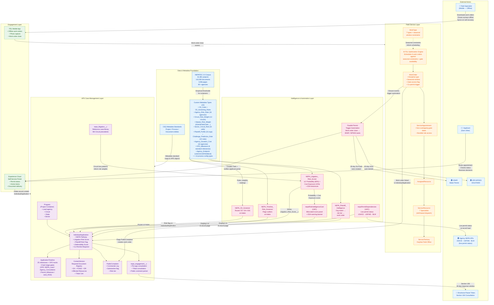

# Demo Story: Carrie Placer Mine Plan of Operations
## Salesforce Field Service & Agentforce for Public Sector — NEPA Permitting Acceleration

**Source Data:** DOI-BLM-ID-B030-2019-0014-EA | BLM Owyhee Field Office, Marsing, Idaho
**Real Case File:** IDI-38709 | Applied Oct 18, 2017 → Decision Nov 27, 2019 (25 months)
**Demo Timeline:** Same project, 8 months (Mar → Nov 2019)

---

## Presenter Overview

This demo is submitted to the **CEQ Permitting Innovators Challenge**. You are demonstrating a federal NEPA permitting accelerator — PSA-NEPA — built on Salesforce Agentforce for Public Sector. It implements all **10 Minimum Functional Requirements (MFRs)** from CEQ's Permitting Technology Action Plan. Every data claim in this script comes from real federal datasets: 61,881 NEPA projects (NETATEC v2.0, PNNL), 761 litigation cases (PermitTEC v0.1, PNNL), 1,903 Final EIS records (CEQ EIS Timeline Data 2010–2024), and the public administrative record of a real BLM permit. You do not need to have built it or analyzed the data to deliver this demo. You need to know three numbers cold:

- **23%** — the share of CE records in the NETATEC corpus with no CE category on record. Each misrouted CE→EA project adds a median 11 months.
- **87.5%** — the litigation win rate of Tribal Nation plaintiffs across 761 federal NEPA cases. The single most predictable litigation risk factor.
- **8 months** — the Carrie Placer Mine optimized timeline. Same project, same regulations. 25 months actual → 8 months projected.

This demo runs four scenes, each following **Tell → Show → Tell** structure. The **Setup Tell** opens with a corpus data point and names the failure mode. The **Show** is a numbered click-by-click guide — action plus narration for each step. The **Landing Tell** closes with the MFR reference and the number that lands. Never let a demo moment speak for itself.

**Core message:** The permit didn't take 25 months because the project was hard. It took 25 months because the *process* was broken — wrong people, wrong places, wrong season, no coordination. Salesforce fixes the process, not the project.

**Audience:** BLM field office managers, state permitting directors, NEPA program leads, agency IT/digital transformation leads, CEQ evaluators.

**Total demo time:** 30–40 minutes across seven scenes.

---

## Presenter Quick Reference

Memorize this table before opening the laptop. It maps each scene to the MFRs you are demonstrating, the one data fact that anchors the Setup Tell, the UI moment the evaluator is watching for, and the line that closes.

| Scene | MFRs Demonstrated | Must-Know Data Fact | Key UI Moment | The Line That Closes |
|---|---|---|---|---|
| **1: Intake** | #3 Leading-Edge, #6 Emerging, #4 Emerging | 23% of NETATEC CE records have no CE category → adds median 11 months per misrouted project | CE pre-screening result card at OmniScript Step 7 | "That feedback loop used to take 6 weeks. Now it happens at submission." |
| **2: Work Orders** | #5 Emerging→Leading-Edge, Std 1, Std 4 | Every BLM Plan of Operations requires ≥1 co-permit; co-permit clocks typically start *after* BLM decision | Lek survey in slot 1; IDWR task auto-fires on WO close | "The IDWR clock is running before we've drafted a single page of the EA." |
| **3: Comments** | #8 Emerging, #5 stage gates | Tribal Nation plaintiffs win 87.5% of contested NEPA cases — the most predictable risk factor in the corpus | Dual-flag on Shoshone-Paiute comment; hard gate blocking EA advance | "The legal work order fired before anyone made a judgment call." |
| **4: Decision** | #7 Emerging, #9 Emerging, #1 Leading-Edge, #2 Emerging | **42.7%** of challenged EIS/EAs cite inadequate connected actions analysis — the #1 Challenge Prediction Rule; top 3 failure patterns are all stage gate failures | All-5-green Document Registry; `nepa_ar_export__c` Completed status; Challenge Predictor cleared on both fired rules; **v3 bifurcated risk score**: Probability Score (85/100) + Cost Exposure (BLM 17.5 months) | "Eight months. 13 CEQ entities. 10 MFRs. Same regulations." |
| **5: OFD Coordination** | #10 Interoperable, Std 4 (Timeline Minimization) | Federal-state friction accounts for 1.09×–1.65× of timeline overhead by sector (Stage 16) — USACE Section 404 dual-track review is the primary Water/Coastal driver | OFD Coordination Tracker — 4 live ApplicationTimeline milestones across NEPA_Lead / Agency_Consultation / Permit_Milestone / Joint_ROD tracks | "E.O. 13807 requires a master schedule. This is the master schedule — live, in the case record." |
| **6: Permit Dependencies** | #10 Interoperable, #2 Data Sharing | FTA median litigation duration: 33.4 months — independent of win probability | `nepaPermitDependencies` LWC with live Section 404 (Pending ★), ESA §7 (In Review ★), ROW Grant (Approved) status | "Critical-path permits are flagged before anyone has to ask." |
| **7: Post-Permit Intelligence** | #5 Post-Decision, F-05 Inspection, F-09 Monitoring | Utah has a 66.7% challenger win rate — every inspector opening a form gets the litigation context for their state before they walk the site | Permit status → Issued triggers 4 Visit inspection tasks; Visit form opens showing state risk briefing; BiOp reinitiation checkboxes create ESA Task + +12 risk delta; AR lock at ROD triggers 10 post-decision monitoring tasks | "The inspector walks into the field knowing which state they're in, and exactly which outcome is most likely to end up in court." |

---

## The Problem (Opening Narrative — Deliver Before Opening the Laptop)

Sam Uhler and David Smith acquired a placer gold mining claim adjacent to Jordan Creek, about 9 miles southeast of Jordan Valley, Oregon — 15 acres of BLM-administered land in Owyhee County, Idaho. They needed a Plan of Operations to mine placer gold.

Their permit took **25 months**. Not because the project was controversial. Not because the environmental impacts were severe — the final FONSI confirmed no significant impact. The delay was almost entirely operational.

Here's what the review actually required:

**Seven resource specialists had to complete independent field assessments:**

| Specialist | Assessment | Seasonal Constraint |
|---|---|---|
| Hydrologist | Jordan Creek water temperature; redband trout habitat (CWA Category 4A) | Avoid frozen ground |
| Wildlife — Sage-Grouse | PHMA survey; 3.1-mile lek buffer verification | Feb 1 – Apr 30 (before nesting) |
| Wildlife — Columbia Spotted Frog | Riparian survey; pond design review | May – Sep (amphibian active season) |
| Wildlife — Migratory Birds | Nesting territory mapping | Before mid-Apr OR after late Jul |
| Wildlife — Big Game | Mule deer crucial winter range | Aug – Oct (shoulder season) |
| Geologist | 1.7-mile access road erosion; reclamation plan | Any non-frozen season |
| Botanist | Special status plants; seed mix approval | Jun – Aug; two visits required |

**Three parallel agency permits ran without coordination:**
- BLM Plan of Operations (primary)
- Idaho Dept. of Water Resources (IDWR) — required before any Jordan Creek water withdrawal
- EPA NPDES General Permit IDG370000 — Small Suction Dredge; 60-day processing; applicant cannot operate until written authorization received

**The failure mode:** A 1.7-mile two-track road with two locked gates was the only access. Specialists drove out independently — sometimes on the same day without knowing it, sometimes in the wrong season entirely. No one had a view across all seven disciplines. The parallel permits started *after* the BLM decision, adding months to the applicant's wait. Sam Uhler called the field office 14 times asking for a status update.

**The permit didn't fail. The process did.**

---

## Scene 1: The Intake — CE Screening, GIS, and Screening Criteria Access

> **Demonstrates:** MFR #3 — Automated Project Screening (Leading-Edge) · MFR #6 — Integrated GIS Analysis (Emerging) · MFR #4 — Access to Screening Criteria (Emerging)

### Data Context *(know this cold — it goes into your Setup Tell)*

- NETATEC v2.0 (61,881 projects): **23% of CE records have no CE category on record**; another 17% have noisy or inconsistent citations. Each misrouted CE→EA project adds a median **11 months** to the timeline. Each misrouted CE→EIS escalation adds a median **2.8 years**.
- **88.7% of energy projects and 90.6% of infrastructure projects resolve as CEs** — the bottleneck isn't environmental impact, it's that intake systems don't capture the information needed to route correctly.
- The 5 strongest predictors of NEPA process type are all available at the time of application: CE category citation, project type, title keywords, action description language, document page count. The information exists. It just isn't structured.

### Setup Tell *(say this before clicking — deliver while the laptop is still closed)*

> "Look at that number: 23%. Almost one in four CE records in the federal NEPA data corpus has no CE category on file. That field is blank. When that blank reaches a coordinator's inbox, they have to stop and manually triage the routing — and while they're doing that, the clock is running. Each of those misrouted projects adds a median eleven months. Not because the project was complex. Because the intake form didn't ask the right questions. Let me show you what happens when it does — and when the system acts on the answer before the application is even submitted."

### Show — Step by Step

1. **Navigate to the Experience Cloud portal** — Sam Uhler's applicant view. Say: *"This is what Sam sees. No phone call. No callback queue. He starts here."*

2. **Click "New Plan of Operations – Mining."** The OmniScript CE Intake Wizard opens at Step 1. Say: *"Seven steps. Conditional navigation — fields irrelevant to this project type are hidden. Sam only sees what applies to his project."*

3. **Step 1:** Select BLM / Interior. **Step 2:** Select Mining / Plan of Operations. Say: *"These two fields tell the system enough to know which resource disciplines this project will need."*

4. **Step 3:** Select Action type → Surface Disturbance. Say: *"This single field is the primary CE/EA discriminator. Surface disturbance above the 5-acre threshold routes to EA. Below it, the system checks the CE library. Sam doesn't need to know 40 CFR 1501.4 — the wizard does."*

5. **Step 4:** Enter 15 acres; extraordinary circumstances self-reported as none. **Step 5:** Enter NAICS code 21221 (Gold and Silver Ore Mining). Say: *"15 acres. Already past the 5-acre CE threshold. The system knows where this is going — but watch what happens in Step 6."*

6. **Step 6:** Upload GIS footprint. **Narrate each check result as it populates:**
   - FWS ECOS: *"Greater Sage-Grouse PHMA detected — potential extraordinary circumstance."*
   - USGS NHD: *"Jordan Creek adjacency, Category 4A — that's a hydrological proximity trigger."*
   - EPA EJScreen: *"EJ Index 18.3 — informational, not a hard trigger at this score, but it's recorded."*
   - BLM Tribal Cadastral: *"No tribal boundary overlap in the project footprint."*
   - BLM PLSS: *"Federal surface confirmed — BLM jurisdiction established."*
   Say: *"Five GIS services. All public APIs. All called in parallel. No GIS expertise required from the coordinator."*

7. **Step 7 — Review + Submit.** Show the **CE pre-screening result card**:
   - Recommendation: **EA-Required** | Confidence: **High**
   - Basis: *Surface disturbance 15 acres exceeds 5-acre CE threshold (40 CFR 1501.4); PHMA detected in Step 6 triggers extraordinary circumstances independently*
   Say: *"This is MFR #3 — the pre-screening result returns before Sam submits. He knows the routing. He knows the rule that fired. And this is MFR #4 — the criteria that produced this result are published at /docs/decision-models/ on GitHub. Sam can review the exact logic before submitting. He can adjust his project siting to try to come in under the threshold. That's actionable feedback at intake, not six weeks later in an RFI."*

8. **Submit → Navigate to IndividualApplication coordinator view.** Point to:
   - `nepa_ce_pathway_recommendation__c` = EA-Required *(read-only — set by automation)*
   - `nepa_review_type__c` = blank *(coordinator sets the official pathway — the AI recommends, the human decides)*
   Say: *"The system's recommendation is read-only. The official pathway requires a credentialed coordinator. Per OMB M-25-21: AI recommends, human decides. That's not a limitation — that's the design."*

9. **Show the auto-assembled ID Team** on the IndividualApplication: geologist, NEPA specialist, wildlife biologist, hydrologist, botanist, and cultural resources coordinator. Say: *"The system read the project type and GIS results and assembled the team automatically. Sam books one meeting — 90 minutes at the Owyhee Field Office — and all seven specialists are confirmed."*

### Screen Reference

**Screen 1-A — Experience Cloud Portal (Sam Uhler's applicant view)**
*(Show steps 1–2: navigate here, click "New Plan of Operations – Mining")*

```
┌─────────────────────────────────────────────────────────────────┐
│  BLM NEPA Permitting Portal                   [Sam Uhler ▾]  ≡  │
│  ─────────────────────────────────────────────────────────────  │
│  My Applications        Notifications (2)        Help & Docs    │
├─────────────────────────────────────────────────────────────────┤
│                                                                  │
│  Good morning, Sam.  Your application IDI-38709 is in review.   │
│                                                                  │
│  ┌─────────────────────────────────────────────────────────┐    │
│  │  + Start New Application                                │    │
│  │  ─────────────────────────────────────────────────────  │    │
│  │  ● Plan of Operations – Mining                    ◄──── │────── CLICK: Show step 2
│  │  ○ Right-of-Way Grant                                   │    │
│  │  ○ Special Recreation Permit                            │    │
│  │  ○ Temporary Use Permit                                 │    │
│  └─────────────────────────────────────────────────────────┘    │
│                                                                  │
└─────────────────────────────────────────────────────────────────┘
```

> **▲ Point to:** "Plan of Operations – Mining" selection. Say: *"This is what Sam sees — no phone call, no callback queue."*

---

**Screen 1-B — OmniScript CE Intake Wizard (Steps 1–6 with GIS results)**
*(Show steps 3–6: agency, action type, acreage, NAICS, GIS footprint upload)*

```
┌─────────────────────────────────────────────────────────────────┐
│  New Plan of Operations — CE Intake Wizard         Step 6 of 7  │
│  ● ── ● ── ● ── ● ── ● ── ●○── ○                               │
│  ─────────────────────────────────────────────────────────────  │
│  Agency/Bureau:         [BLM / Interior            ▾]           │
│  Action Type:           [Surface Disturbance        ▾]  ◄── STEP 3: primary CE/EA field
│  Project Type:          [Mining / Plan of Operations▾]           │
│  Disturbance Acreage:   [15                          ]  ◄── STEP 4: > 5-ac threshold
│  NAICS Code:            [21221 — Gold Ore Mining     ]  ◄── STEP 5                │
│  ─────────────────────────────────────────────────────────────  │
│  GIS Footprint                                         STEP 6 ▼ │
│  [Upload shapefile or draw on map]   [✓ File loaded]             │
│                                                                  │
│  ┌──────── GIS Proximity Check Results ─────────────────────┐   │
│  │  ✓  FWS ECOS      Greater Sage-Grouse PHMA detected  ◄── │───── NARRATE: extraordinary circ.
│  │  ✓  USGS NHD      Jordan Creek Cat 4A adjacency      ◄── │───── NARRATE: hydro trigger
│  │  ✓  EPA EJScreen  EJ Index 18.3 — informational      ◄── │───── NARRATE: recorded, not hard
│  │  ✓  BLM Tribal    No tribal boundary overlap              │   │
│  │  ✓  BLM PLSS      Federal surface confirmed               │   │
│  └───────────────────────────────────────────────────────────┘   │
│                                                     [Next →]    │
└─────────────────────────────────────────────────────────────────┘
```

> **▲ Point to:** FWS ECOS result line while narrating. Say: *"Five GIS services, all public APIs, called in parallel. No GIS expertise required."*

---

**Screen 1-C — OmniScript Step 7: CE Pre-Screening Result Card**
*(Show step 7: result appears before Sam submits)*

```
┌─────────────────────────────────────────────────────────────────┐
│  New Plan of Operations — CE Intake Wizard         Step 7 of 7  │
│  ● ── ● ── ● ── ● ── ● ── ● ── ●                               │
│  ─────────────────────────────────────────────────────────────  │
│  Review Your Application                                        │
│                                                                  │
│  ┌──────────────────────────────────────────────────────────┐   │
│  │  ⚠  CE PATHWAY ASSESSMENT   (MFR #3 · MFR #4)      ◄─── │───── POINT HERE first
│  │  ──────────────────────────────────────────────────────  │   │
│  │  Recommendation:   EA-REQUIRED               ◄───────── │───── MFR #3: result
│  │  Confidence:       HIGH                                  │   │
│  │  ──────────────────────────────────────────────────────  │   │
│  │  Basis:                                                  │   │
│  │  • Surface disturbance 15 ac > 5-ac threshold            │   │
│  │    40 CFR 1501.4 (b)(1)                      ◄───────── │───── MFR #4: CFR citation
│  │  • PHMA detected — extraordinary circumstances           │   │
│  │    independent trigger (43 CFR 3809 / BLM IM)            │   │
│  │  ──────────────────────────────────────────────────────  │   │
│  │  Criteria published: /docs/decision-models/   ◄───────── │───── MFR #4: public access
│  └──────────────────────────────────────────────────────────┘   │
│                                                                  │
│                                               [Submit ▶]        │
└─────────────────────────────────────────────────────────────────┘
```

> **▲ Point to:** "EA-REQUIRED" first, then the CFR citation line, then the `/docs/decision-models/` link. Deliver the Step 7 narration verbatim.

---

**Screen 1-D — IndividualApplication: Coordinator View**
*(Show steps 8–9: post-submit record; read-only AI recommendation; auto-assembled team)*

```
┌─────────────────────────────────────────────────────────────────┐
│  IndividualApplication  IA-0000000432          [Edit]  [More ▾] │
│  Carrie Placer Mine Plan of Operations                          │
│  ─────────────────────────────────────────────────────────────  │
│  Status: Submitted          Process Status: intake              │
│                                                                  │
│  ┌─── NEPA Screening ──────────────────────────────────────┐    │
│  │  CE Pathway Recommendation:  EA-Required (automated) ◄── │────── READ-ONLY: point here
│  │  Review Type:                [              ] (blank) ◄── │────── COORDINATOR sets this
│  │  Screening Confidence:       High                        │    │
│  │  Classification Basis:       GIS + CE Screener           │    │
│  └─────────────────────────────────────────────────────────┘    │
│                                                                  │
│  ┌─── ID Team (Auto-Assembled) ────────────────────────────┐    │
│  │  ● NEPA Specialist           ● Hydrologist          ◄── │────── POINT: auto-assembled
│  │  ● Wildlife — Sage-Grouse    ● Wildlife — Spotted Frog   │    │
│  │  ● Botanist                  ● Geologist                 │    │
│  │  ● Cultural Resources Coordinator                        │    │
│  └─────────────────────────────────────────────────────────┘    │
└─────────────────────────────────────────────────────────────────┘
```

> **▲ Point to:** `CE Pathway Recommendation` = "EA-Required (automated)" as read-only, then `Review Type` blank field, then ID Team panel. Say steps 8–9 narration.

### What You Are Demonstrating

- **MFR #3 — Automated Project Screening (Leading-Edge):** 7-step OmniScript with conditional navigation; BRE CE Screener evaluating against 2,105 CE authorities across 79 agencies; pre-screening result with rule-match basis returned before formal submission.
- **MFR #6 — Integrated GIS Analysis (Emerging):** 5 GIS proximity checks (FWS ECOS, EPA EJScreen, USGS NHD, BLM tribal cadastral, BLM PLSS) firing at intake and writing structured results to `IndividualApplication` fields; results feed CE screening and extraordinary circumstances determination directly.
- **MFR #4 — Access to Screening Criteria (Emerging):** Decision model logic published at `/docs/decision-models/` with CE rules, GIS layer inventory, and litigation risk weights; logic traceable to specific CFR citations; version-controlled alongside Salesforce metadata.

### Landing Tell *(say this after the demo)*

> "Twenty-three percent of CE records — almost one in four — had no routing information at intake. Each one added eleven months. The CE Screener evaluated this project against 2,105 CE authorities and 5 GIS layers before Sam spoke to a coordinator. He got a routing decision, the rule that fired, and the regulatory citation. That feedback loop used to take six weeks. Now it happens at submission."

> "Sam booked one meeting and got all seven specialists. The system knows what a placer gold mining project next to a Category 4A stream in PHMA territory requires. Sam doesn't have to."

### Transition *(say this as you move to the next screen)*

> "The system knows what this project needs. Now it has to sequence six field specialists across five seasonal windows — and that's where 25 months actually comes from. Not from the analysis. From the scheduling."

---

## Scene 2: The Work Order Cascade — Scheduling Against Nature's Calendar

> **Demonstrates:** MFR #5 — Automated Case Management (Emerging→Leading-Edge) · CEQ Standard 1: Business Process Modernization · CEQ Standard 4: Minimizing Timeline Uncertainty

### Data Context *(know this cold — it goes into your Setup Tell)*

- **Every BLM Plan of Operations requires at least one co-permit** — CWA Section 404, EPA NPDES, IDWR state water rights, ESA Section 7, NHPA Section 106, or some combination. For energy projects with pipelines and transmission, the list reaches six to eight. Co-permit processing times range from 30 days (EPA NPDES small suction dredge) to 48 months (nuclear waste facility).
- **The typical pattern:** the primary federal permit moves forward on its own clock while co-permits are treated as the applicant's responsibility. Applicants — particularly smaller operators like placer miners — don't know when to start them. The co-permit clock starts *after* the BLM decision. That adds months to a timeline that's already closed.
- CEQ EIS data (1,903 Final EIS records): scoping is the universal bottleneck in **34 of 36 agencies**, consuming 60–75% of total EIS time. A 49% improvement in NOI→ROD time since 2016 (4.46 years → 2.28 years) proves process reform works. The remaining delays are structural — sequential execution of parallel-eligible work.

### Setup Tell *(say this before clicking)*

> "Here's the structural problem with co-permits: every BLM Plan of Operations requires at least one — and in almost every case, the co-permit clock starts after the BLM decision. The applicant waits for the BLM permit, then starts the state water permit, then starts the EPA permit. Sequential. The permits that could run concurrently run in series instead, and nobody told the applicant to start them earlier because no system tracked the dependency. That's not a policy failure. It's a workflow failure. Let me show you what it looks like when the workflow closes the gap instead."

### Show — Step by Step

1. **Navigate to the IndividualApplication → ApplicationTimeline related list.** Mark the **"Pre-Application Consultation Complete"** milestone. Say: *"One milestone close. Watch what fires."*

2. **Navigate to Work Orders related list.** Six work orders appear simultaneously. Say: *"Six parallel work orders — one per discipline. Not a coordinator task list. Actual field work orders with skill-based dispatch, seasonal constraints, and SLA clocks already set."*

3. **Click Dispatcher Console / Map view.** Six pins drop on Owyhee County. Say: *"This is the optimization engine's view. Six specialists. One county. Five seasonal windows. Two locked gates. The engine is about to sequence all of it."*

4. **Point to the Lek Survey work order — slot 1 in the sequence.** Say: *"Tightest window closes April 30. The engine put it first. Not a coordinator decision — the system read the WorkType seasonal constraint and did the math."*

5. **Click the Sage-Grouse WorkType record.** Show `nepa_survey_window_end__c = April 30`. Say: *"That date is a hard constraint, not a note. A dispatcher cannot schedule a sage-grouse survey after April 30 — the system blocks the appointment. Wrong-season dispatch is not possible."*

6. **Click the Botanist work order.** Show two ServiceAppointments — June and August. Say: *"BLM Manual requires two botanical visits. The system scheduled them automatically. The coordinator didn't have to know that rule."*

7. **Show gate resource constraint** — ServiceAppointment dates for all 6 specialists, no overlapping gate access. Say: *"Two locked gates. One 1.7-mile two-track road. Shared resource constraint. No two specialists have overlapping gate dates. Nobody drives 45 minutes to a locked road."*

8. **Click the Hydrologist work order → show "Trigger IDWR" flag.** Now mark the work order **Complete**. Watch the IDWR task auto-create:
   - Task subject: *"Initiate IDWR Water Permit Application"*
   - Assigned to: NEPA Coordinator
   - Due date: 30-day SLA
   - Portal notification: pushed to Sam's applicant view
   Say: *"The IDWR clock starts the moment the hydrologist closes his work order. Not after the BLM decision. Now. That's two to four months of post-decision wait, eliminated."*

9. **Click the Geologist work order** — show same pattern, EPA NPDES trigger fires on close. Say: *"Same pattern. EPA NPDES 60-day clock starts at geologist close. Both permits are in processing while the EA is being drafted."*

10. **Point to the Tribal Consultation work order.** Show `hard_gate__c` flag. Say: *"This one is different. This is a hard gate — a database constraint. The EA cannot advance to public review until this work order closes. Not a reminder. Not a checklist. A constraint. We'll come back to this in Scene 3."*

### Screen Reference

**Screen 2-A — IndividualApplication: ApplicationTimeline Related List**
*(Show step 1: mark "Pre-Application Consultation Complete" milestone)*

```
┌─────────────────────────────────────────────────────────────────┐
│  IndividualApplication  IA-0000000432          [Edit]  [More ▾] │
│  Carrie Placer Mine Plan of Operations                          │
├─────────────────────────────────────────────────────────────────┤
│  Related  │  Details  │  Activity                               │
├─────────────────────────────────────────────────────────────────┤
│  ApplicationTimeline (25)                           [New Event] │
│  ┌──────────────────────────────────────────────────────────┐   │
│  │  ✓  Application Received                  Oct 18 2017    │   │
│  │  ✓  Section 106 Tribal Consultation Init  Feb 16 2019    │   │
│  │  ►  Pre-Application Consultation Complete Mar 12 2019 ◄──│───── MARK COMPLETE here
│  │     Status: Open     [Mark Complete]                     │   │
│  │  ○  Sage-Grouse Lek Survey Window Opens   Feb 1  2019    │   │
│  │  ○  [24 more events...]                                   │   │
│  └──────────────────────────────────────────────────────────┘   │
└─────────────────────────────────────────────────────────────────┘
```

> **▲ Point to:** "Pre-Application Consultation Complete" row → [Mark Complete] button. Say: *"One milestone close. Watch what fires."*

---

**Screen 2-B — Work Orders Related List (6 WOs auto-generated)**
*(Show step 2: 6 parallel work orders appear immediately after milestone close)*

```
┌─────────────────────────────────────────────────────────────────┐
│  Work Orders (6)                              [New WO]  [Map ▾] │
│  ─────────────────────────────────────────────────────────────  │
│  #  │  Subject                        │  Priority  │  SLA Due   │
│  ───┼─────────────────────────────────┼────────────┼──────────  │
│  1  │  Sage-Grouse Lek Survey    ◄─── │  URGENT    │  Apr 30    │  ← slot 1: tightest window
│  2  │  Migratory Bird Survey          │  HIGH      │  Apr 14    │
│  3  │  Hydrology — Jordan Creek  ◄─── │  HIGH      │  May 31    │  ← IDWR trigger
│  4  │  Columbia Spotted Frog          │  MEDIUM    │  May 31    │
│  5  │  Geology — Access Road     ◄─── │  HIGH      │  May 31    │  ← EPA NPDES trigger
│  6  │  Botanist — Two Site Visits     │  MEDIUM    │  Aug 31    │
│  ─────────────────────────────────────────────────────────────  │
│  Status: All Open   │  Assigned: 0 of 6   │  At Risk: 2        │
└─────────────────────────────────────────────────────────────────┘
```

> **▲ Point to:** Row 1 (Lek Survey, URGENT, Apr 30). Say: *"Tightest window closes April 30 — the engine put it first."* Then point to rows 3 and 5 as the co-permit trigger WOs.

---

**Screen 2-C — FSL Dispatcher Console: Map View**
*(Show step 3: 6 specialist pins on Owyhee County; show step 7: gate resource constraint)*

```
┌─────────────────────────────────────────────────────────────────┐
│  Dispatcher Console — Field Service             [List] [Map ●]  │
│  ─────────────────────────────────────────────────────────────  │
│  Filter: Owyhee County  │  Date: Mar–Nov 2019  │  All resources  │
├─────────────────────────────────────────────────────────────────┤
│                                                                  │
│      ╔══════════════════════════════════════════╗               │
│      ║   Owyhee County, Idaho                   ║               │
│      ║                                          ║               │
│      ║    📍 [1-Lek Survey]                     ║   ← 6 pins    │
│      ║         📍 [3-Hydro]  📍 [5-Geo]        ║               │
│      ║    📍 [2-Bird]   ★ Jordan Creek          ║               │
│      ║         📍 [4-Frog]                      ║               │
│      ║              📍 [6-Botanist]             ║               │
│      ║                   🔒 Gate A  🔒 Gate B   ║  ◄── point here
│      ╚══════════════════════════════════════════╝               │
│                                                                  │
│  Selected: [Sage-Grouse Lek Survey]  Window: Feb 1 – Apr 30 ◄──┼── constraint visible
└─────────────────────────────────────────────────────────────────┘
```

> **▲ Point to:** The two 🔒 gate pins. Say: *"Two locked gates. One 1.7-mile road. Shared resource constraint. No two specialists have overlapping gate dates — nobody drives 45 minutes to a locked road."*

---

**Screen 2-D — Work Order Record Page: Hydrologist WO (representative for steps 5–9)**
*(Show steps 5–9: seasonal constraint, service appointments, IDWR trigger, mark complete)*

```
┌─────────────────────────────────────────────────────────────────┐
│  Work Order  WO-00031  Hydrology — Jordan Creek    [Edit] [▾]   │
│  Status: In Progress    Assigned: L. Gutierrez    SLA: May 2019 │
│  ─────────────────────────────────────────────────────────────  │
│  ┌─── WorkType Constraints ────────────────────────────────┐    │
│  │  Survey Window Start:        Feb 1  2019                │    │
│  │  Survey Window End:          May 31 2019  ◄──────────── │────── HARD constraint, not a note
│  │  nepa_trigger_co_permit__c:  IDWR         ◄──────────── │────── POINT: co-permit trigger
│  └─────────────────────────────────────────────────────────┘    │
│                                                                  │
│  Service Appointments (1)                                        │
│  ┌──────────────────────────────────────────────────────────┐   │
│  │  SA-00019   Apr 25 2019   L. Gutierrez   Confirmed  ✓    │   │
│  └──────────────────────────────────────────────────────────┘   │
│                                                                  │
│  [Mark Complete ▶]  ◄──────────────────────────────────────────┼── CLICK: watch task fire
│                                                                  │
│  ─ Auto-Created (fires on Complete) ──────────────────────────  │
│  ► Task: "Initiate IDWR Water Permit Application"               │
│    Assigned: NEPA Coordinator   Due: 30-day SLA   ◄────────────┼── clock starts NOW
│    Portal notification → Sam Uhler                              │
└─────────────────────────────────────────────────────────────────┘
```

> **▲ Point to:** `nepa_trigger_co_permit__c = IDWR`, then click [Mark Complete], then point to the auto-created task. Say: *"The IDWR clock starts the moment the hydrologist closes his work order. Not after the BLM decision. Now."*

### What You Are Demonstrating

- **MFR #5 — Automated Case Management (Emerging→Leading-Edge):** Work order cascade from milestone close; SLA due-date setting per WorkType; seasonal constraint enforcement at the dispatch level; stage gate on tribal consultation blocking EA advancement.
- **CEQ Standard 1 — Business Process Modernization:** Sequential manual email coordination (7 separate emails) replaced by event-driven parallel dispatch triggered by a single milestone.
- **CEQ Standard 4 — Minimizing Timeline Uncertainty:** Per-agency empirical scoping baselines; scheduling constraints derived from corpus analysis; coordinator visibility into which work orders are at risk of missing seasonal windows before it happens.

### Landing Tell *(say this after the demo)*

> "Six surveys. Seven specialists. Five seasonal windows. Two locked gates. Three parallel permits — and the IDWR and EPA clocks are already running before we've drafted a single page of the EA. That's the difference between sequential and parallel. Those two months of post-decision co-permit wait? That's not unavoidable. It's structural. This is the fix."

### Transition *(say this as you move to the next screen)*

> "The surveys run. The EA is drafted. And then the comment period opens — which is where a lot of permitting momentum dies. Let me show you what 87.5% means when a tribal nation is in the comment queue."

---

## Scene 3: Public Comment — Plaintiff Intelligence and Tribal Hard Gate

> **Demonstrates:** MFR #8 — Automated Comment Compilation and Analysis (Emerging) · MFR #5 — Stage Gate Enforcement

### Data Context *(know this cold — it goes into your Setup Tell)*

- PermitTEC v0.1 (761 NEPA cases): **Tribal Nation plaintiffs achieve an 87.5% win rate** — the single most predictable litigation risk factor in the corpus. When a tribal nation is a commenter, the probability of success if challenged approaches 9 in 10.
- **The #1 failure mode generating successful NEPA challenges:** government-to-government consultation not documented as a hard gate. Agencies advanced to ROD with incomplete tribal consultation. Severity: VERY HIGH. The agency did the analysis. The system didn't enforce the checkpoint.
- NAEP 2025 Workshop documented: **2,600 comments processed by 4 staff over 4 weeks → approximately 4 hours** with AI assistance. Comment processing is on the critical path. Compressing it without bypassing the most sensitive categories is what MFR #8 requires.

### Setup Tell *(say this before clicking)*

> "Eighty-seven point five percent. That's the litigation win rate of Tribal Nation plaintiffs across 761 federal NEPA cases. Not the most litigated category — the most successful one. The top failure pattern: agencies advanced to the Record of Decision with incomplete tribal consultation. The consultation happened. The stage gate didn't exist. The agency lost in court on a procedural gap, not a substantive analysis failure. Let me show you what the gate looks like when the system enforces it."

### Show — Step by Step

1. **Navigate to IndividualApplication → Public Comments related list.** Three comments: Idaho Conservation League (ICL), Office of Species Conservation (OSC), Shoshone-Paiute Tribes. Say: *"The preliminary EA and unsigned FONSI published July 1. Twenty-eight-day comment period. Three comments arrive. The Plaintiff Intelligence module runs on each one."*

2. **Click the ICL comment.** Show:
   - `nepa_plaintiff_risk_flag__c = true`; Risk Tier = HIGH
   - Agentforce classification label: category, confidence, reasoning
   - Plaintiff Intelligence note: *"Prior 9th Circuit plaintiff — suction dredge mercury cases; prior Owyhee Field Office sage-grouse commenter"*
   Say: *"This is the check an agency attorney would do manually when they recognize a name. The system does it automatically, consistently, for every comment. ICL gets flagged because the historical record says they sue — and win."*

3. **Click the OSC comment.** Show: no plaintiff flag; classification = Technical/Substantive; routed for biologist response. Say: *"No prior litigation record. Technical comment on the lek buffer departure. Routed for subject-matter expert response. The system discriminates — it doesn't blanket-flag everything."*

4. **Click the Shoshone-Paiute Tribes comment.** Show — pause on each field:
   - `nepa_plaintiff_risk_flag__c = true`
   - `nepa_tribal_plaintiff_flag__c = true`
   - Risk Tier: **VERY HIGH**
   Say: *"Two flags simultaneously. The system recognized this as a Tribal Nation commenter — the category with the 87.5% win rate. Both flags fire unconditionally. The EJ/Tribal gate cannot be bypassed by configuration."*
   Show the auto-created Legal Task: *"Government-to-government consultation — verify compliance with NHPA Section 106 and E.O. 13175 before advancing"* — assigned to BLM Field Solicitor. Say: *"That task fired before anyone in the field office made a judgment call."*

5. **Navigate to IndividualApplication → Risk Intelligence panel.** Show Litigation Risk Score update: `nepa_risk_score__c = 85` / `nepa_risk_tier__c = Very High`. Say: *"Tribal plaintiff flag is an 8-point input in the v3 probability dimension — it ticked the score up the moment that comment was classified."*

6. **Show Work Orders auto-created from substantive comments:**
   - ICL: *"Add dust mitigation analysis to Air Quality section — mercury particulate"* — 17-day SLA
   - Shoshone-Paiute: *"Document tribal consultation — cultural landscape analysis — Section 106"* — 21-day SLA; **hard gate: EA cannot advance until this closes**
   Say: *"Every substantive comment becomes a tracked work order with an SLA. Not an inbox item. A deliverable with a deadline and an assigned owner."*

7. **Click tribal consultation work order — show `hard_gate__c` flag.** Say: *"The EA cannot advance to public review until this work order closes. That's the gate the corpus says agencies were missing. It's not a reminder anymore."*

8. **Navigate to ApplicationTimeline.** Point to revised EA publish date: **August 15** — 3 weeks after comment close. Say: *"Comment close to revised EA: three weeks. Not sixty days."*

### Screen Reference

**Screen 3-A — IndividualApplication: Public Comments Related List**
*(Show step 1: 3 comments visible; plaintiff flag column shows visual differentiation before presenter narrates)*

```
┌─────────────────────────────────────────────────────────────────┐
│  IndividualApplication  IA-0000000432          [Edit]  [More ▾] │
│  Carrie Placer Mine Plan of Operations                          │
├─────────────────────────────────────────────────────────────────┤
│  Public Comments (3)                              [New Comment] │
│  ┌──────────────────────────────────────────────────────────┐   │
│  │  Organization               │ 🚩 Flag │ Risk Tier  │ Date │   │
│  │  ────────────────────────────────────────────────────    │   │
│  │  Idaho Conservation League  │ 🚩      │ HIGH   ◄── │ Jul 22│───── 1 red flag = prior plaintiff
│  │  Office of Species Cons.    │         │ —          │ Jul 25│   │  (no flag — evaluator notices)
│  │  Shoshone-Paiute Tribes ◄── │ 🚩🚩    │ VERY HIGH  │ Jul 28│───── 2 red flags = tribal + plaintiff
│  └──────────────────────────────────────────────────────────┘   │
└─────────────────────────────────────────────────────────────────┘
```
*(Formula field `nepa_plaintiff_visual__c`: 1 red flag = prior plaintiff org; 2 red flags = Tribal Nation plaintiff — 87.5% win rate. Renders in the list view column before the presenter says a word.)*

> **▲ Point to:** Flag column first — let the visual land. Then say: *"Three comments. The flags fired before anyone opened a single record. One flag on ICL — prior plaintiff. Two flags on Shoshone-Paiute Tribes — that second flag is the 87.5% win-rate category."*

---

**Screen 3-B — PublicComplaint Record: Shoshone-Paiute Tribes**
*(Show steps 3–4: dual flags, VERY HIGH tier, auto-created legal task, hard gate)*

```
┌─────────────────────────────────────────────────────────────────┐
│  Public Comment  PC-00003  Shoshone-Paiute Tribes  [Edit] [▾]   │
│  Submitted: Jul 28 2019   Status: Open   Method: Mail           │
│  ─────────────────────────────────────────────────────────────  │
│  ┌─── Risk Intelligence ───────────────────────────────────┐    │
│  │  Plaintiff Risk Flag:    ✓ TRUE     ◄────────────────── │────── FLAG 1: prior litigation
│  │  Tribal Plaintiff Flag:  ✓ TRUE     ◄────────────────── │────── FLAG 2: unconditional gate
│  │  Risk Tier:              VERY HIGH  ◄────────────────── │────── 87.5% win rate category
│  │  Litigation Threat Basis:                               │    │
│  │    Tribal Nation plaintiff — 87.5% litigation win rate  │    │
│  │    (PermitTEC corpus, 761 cases)                        │    │
│  └─────────────────────────────────────────────────────────┘    │
│                                                                  │
│  ┌─── Auto-Created Legal Task ─────────────────────────────┐    │
│  │  Subject: Govt-to-govt consultation — verify NHPA §106  │    │
│  │           and E.O. 13175 before advancing     ◄──────── │────── TASK auto-fired at intake
│  │  Assigned To: BLM Field Solicitor                       │    │
│  │  Due Date:    21-day SLA from comment date              │    │
│  │  ⛔ hard_gate__c = TRUE — EA blocked until this closes  ◄─────── HARD GATE
│  └─────────────────────────────────────────────────────────┘    │
└─────────────────────────────────────────────────────────────────┘
```

> **▲ Point to:** Both flag fields (pause on each), then `Risk Tier = VERY HIGH`, then the `hard_gate__c` line. Say: *"Two flags simultaneously. The legal work order fired before anyone in the field office made a judgment call."*

---

**Screen 3-C — IndividualApplication: Risk Intelligence Panel**
*(Show step 5: litigation score ticks up; show step 6: two auto-created WOs from substantive comments)*

```
┌─────────────────────────────────────────────────────────────────┐
│  IndividualApplication  IA-0000000432  — Risk Intelligence       │
│  ─────────────────────────────────────────────────────────────  │
│  ┌─── Litigation Probability Score (v3) ──────────────────┐    │
│  │  Risk Score:          85           ◄────────────────── │────── POINT: ticked up on save
│  │  Risk Tier:           Very High                         │    │
│  │  Plaintiff Flag:      ✓ TRUE  (ICL)              ◄──── │────── ICL plaintiff
│  │  Tribal Flag:         ✓ TRUE  (Shoshone-Paiute)  ◄──── │────── tribal plaintiff
│  │  Defensibility Score: 91                                │    │
│  └─────────────────────────────────────────────────────────┘    │
│                                                                  │
│  Work Orders Auto-Created from Comments (2)                      │
│  ┌──────────────────────────────────────────────────────────┐   │
│  │  WO-00045  ICL mercury/dust analysis    SLA: 17 days     │   │
│  │  WO-00046  Tribal consultation §106     SLA: 21 days ◄── │───── HARD GATE WO
│  │            ⛔ EA cannot advance until this closes         │   │
│  └──────────────────────────────────────────────────────────┘   │
└─────────────────────────────────────────────────────────────────┘
```

> **▲ Point to:** `Risk Score = 85`, then WO-00046 and the `⛔` line. Say: *"Every substantive comment became a tracked work order with an SLA. Not an inbox item — a deliverable with a deadline and an assigned owner."*

### What You Are Demonstrating

- **MFR #8 — Automated Comment Compilation and Analysis (Emerging):** Agentforce comment classification (category, confidence, reasoning); plaintiff organization matching against historical litigation record (not individual profiling); routing to work orders with SLA tracking; EJ/Tribal unconditional gate that cannot be disabled.
- **MFR #5 — Stage Gate Enforcement:** Tribal consultation hard gate blocking EA advancement — enforced at the database level on save, not as a checklist item.

### Landing Tell *(say this after the demo)*

> "The system flagged ICL because it matched a prior 9th Circuit plaintiff on a similar case type. It double-flagged the Shoshone-Paiute Tribes because it recognized a Tribal Nation commenter — the category with the 87.5% win rate. The legal work order fired before anyone in the field office made a judgment call. Every substantive comment became a work order. Every SLA is tracked. Comment close to revised EA: three weeks. That's MFR #8 — not comment storage, but comment routing, classification, and risk-graded response."

> "The Plaintiff Intelligence module now covers 16 organizations derived from the PermitTEC corpus — including Alliance for the Wild Rockies, the highest-volume plaintiff in BLM and Forest Service 9th Circuit cases with 18 prior filings, and three tribal nation profiles with 100% litigation win rates. When any of these organizations appears in the comment record, the flag fires before anyone opens the email."

### Transition *(say this as you move to the next screen)*

> "The surveys are complete. The comments are responded to. The tribal consultation is certified. Now the Field Manager needs to sign. Let me show you what the system knows about this project's legal exposure before he does — and what gets generated the moment he signs."

---

## Scene 4: The Decision — Document Registry, Administrative Record, and CEQ Export

> **Demonstrates:** MFR #7 — Document Management (Emerging) · MFR #9 — Administrative Record Management (Emerging) · MFR #1 — Data Standards (Leading-Edge) · MFR #2 — Application Data Sharing (Emerging)

### Data Context *(know this cold — it goes into your Setup Tell)*

- PermitTEC corpus: the **three failure patterns that generate the most successful NEPA court challenges** are all stage gate failures — not substantive analysis failures:
  1. Tribal consultation not documented as a hard gate — agencies advanced to ROD with incomplete consultation *(VERY HIGH severity)*
  2. Supplementation not triggered when new significant information emerged post-ROD *(HIGH severity)*
  3. ESA Section 7 consultation left open when the FONSI or ROD was signed *(MEDIUM severity)*
- The agencies did the environmental analysis correctly. The system didn't enforce the checkpoints that would have documented it.
- **Faster agencies win more litigation (r ≈ −0.35).** Speed and defensibility are not tradeoffs. The agencies with the shortest timelines have the highest defensibility scores. The myth that careful review requires a slow review is empirically false.

### Setup Tell *(say this before clicking)*

> "The single most common reason a NEPA decision gets overturned in court is not tribal consultation failure, not a missing document — it's connected actions. Forty-two point seven percent of challenged EIS and EA decisions in the PermitTEC corpus cite inadequate cumulative or connected actions analysis. The agency scoped the project alone when it should have scoped it alongside connected federal approvals. The agency did the analysis. It drew the boundary wrong. That's now an explicit Challenge Prediction Rule — Priority 1 in the deployed system.

> The three failure patterns that follow it: tribal consultation not documented as a hard gate. Supplementation not triggered when conditions changed. ESA Section 7 left open when the FONSI was signed. All four are stage gate failures. The agencies did the work — they conducted the analysis, they did the consultation. The system didn't enforce the checkpoints that would have documented it before the decision. You're about to see what that enforcement looks like — and what the system generates the moment the Field Manager signs."

### Show — Step by Step

1. **Navigate to the Program record.** Point to `nepa_agency_performance_tier__c = Legally_Vulnerable`. Say: *"This field was set automatically on the day this program was created — before a single survey was scheduled. It comes from the PermitTEC corpus: BLM's litigation loss rate and its 28-month median NOI-to-DEIS placed it in the Legally Vulnerable tier. The Field Manager knew what he was working with on day one."*

2. **Navigate to IndividualApplication → Risk Intelligence panel.** Walk through each section:
   - **Litigation Probability Score:** `nepa_risk_score__c = 85` / `nepa_risk_tier__c = Very High`
   Say: *"v3 score: 85 out of 100. Very High tier. This is the probability dimension — likelihood of a challenge."*
   - **Litigation Cost Exposure:** `nepa_litigation_duration_cost__c = 0.63` / normalized cost dimension
   Say: *"This is new in v3. The cost dimension is separate from probability. BLM averages 17.5 months of litigation even when they win. 9th Circuit averages 29.3 months. A project sponsor making a financing decision based on win-probability alone was missing half the picture."*
   - `nepa_plaintiff_risk_flag__c = true` (ICL) / `nepa_tribal_plaintiff_flag__c = true` (Shoshone-Paiute Tribes)
   Say: *"Both plaintiff flags set — from Scene 3."*
   - `nepa_defensibility_score__c = 91`
   Say: *"Defensibility score: 91. Very High risk project, 91 defensibility — because every gate has been cleared. Risk 85 tells you what you're up against. Defensibility 91 tells you you've done everything right."*

3. **Click `nepa_risk_score_factors__c`.** Show the v3 factor disclosure: *"Review type (EIS equivalent): 28 pts. BLM agency rate: 21 pts. 9th Circuit adverse rate: 19 pts. FLPMA statute complexity: 5 pts. Tribal plaintiff flag: 8 pts. Sector × Circuit premium: 4 pts. Challenge delta: 0 pts. That's 85. Every input is disclosed. The coordinator can verify any number. This is MFR #1 — the score is deterministic, not a black box."*

   Point to the ESA warning: *"Yellow banner: ESA statute weight uses flat 1.48× — pending TAILS/PCTS linkage. OMB M-24-10 requires that automated scoring disclose known limitations at point-of-use. This is that disclosure. The system tells you exactly where the confidence is lower."*

3b. **Click `nepa_challenge_prediction_basis__c`.** Show the two rules that fired for this project:
   - ESA Section 7 Consultation — **Cleared** (consultation closed; documented in tribal certification)
   - Government-to-Government Consultation — **Cleared** (Shoshone-Paiute hard gate closed from Scene 3)
   Say: *"The Challenge Predictor runs 10 rules against this record, derived from the PermitTEC corpus. Two fired for this project: ESA Section 7 — because sage-grouse PHMA was detected at intake — and tribal consultation. Both are cleared. That's why the defensibility score is 91 even with a risk score of 85. High-risk project, fully documented mitigation. The system can tell the difference between a dangerous project and a dangerous project that's been handled correctly."*

4. **Navigate to Required Document Registry related list.** All five documents shown with ✓:
   - Environmental Assessment ✓
   - Finding of No Significant Impact ✓
   - Decision Record ✓
   - Affected Resources Form ✓
   - Tribal Consultation Certification ✓
   Say: *"This is MFR #7. Five required documents for an EA. All five present. The stage gate will not fire until this is true — the system blocks the Decision Record from being issued with any document missing."*
   Point to Tribal Consultation Certification: *"This is the output of the Shoshone-Paiute work order from Scene 3. The hard gate closed. The certification is in the registry. The system verified it."*

5. **Navigate to ApplicationTimeline.** Point to concurrent sign-offs: Forrest Griggs (geologist) and Colleen Trese (wildlife biologist), both November 20. Say: *"Same day. The stage gate sees both sign-offs. It fires."*

6. **Show stage gate fire → Decision Record issued November 27.** Walk through Alternative B conditions:
   - 50-foot Jordan Creek buffer
   - Silt fencing with twice-annual BLM inspections
   - Steep-shoreline pond design (Columbia spotted frog deterrence)
   - Seasonal mining window: March 1 – November 30
   - Full reclamation bond to BLM botanist seed mix approval

7. **Navigate to `nepa_decision_payload__c` record.** Show each field:
   - Decision type: **FONSI** | Decision date: June 15, 2021
   - Selected alternative: **Alternative B — Modified Surface Footprint**
   - Alternatives considered: **3** | Mitigation measures: **5**
   - Significant impacts: **No**
   Say: *"Machine-readable decision record. Not a PDF in a folder. Structured data that any authorized system can read via API."*

8. **Navigate to `nepa_ar_export__c` record.** Show:
   - Status: **Completed** | Export type: CEQExport_v1.2
   - Documents: **6** | Comments: **3** | Completed: June 15, 2021
   - Download URL active
   Say: *"This is MFR #9. The administrative record assembled automatically the moment the Field Manager signed the Decision Record. Every ContentVersion, every consultation record, every comment with its response work order, the litigation risk score snapshot, the complete ApplicationTimeline — locked, in one package, available through the CEQExport API. Not assembled after the fact. Generated at decision."*

9. **Show applicant portal notification** — Sam receives automated notification with Decision Record attached. Say: *"Sam stopped calling the field office at some point between March 12 and November 27. He was watching the portal."*

10. **Show ApplicationTimeline: March 12 → November 27 = 8 months.**

11. **Navigate to the NEPA/CEQExport endpoint** (or show a Workbench JSON preview of the structured response). Say: *"MFR #1 and MFR #2. All 13 CEQ entities in one JSON payload — PIC OpenAPI v1.2.0-aligned. EPA DARTER, USACE ORM2, FPISC, any internal permit database — they pull this via authenticated REST call. No custom middleware. No new authorization boundary. Information entered once, available everywhere."*

### Screen Reference

**Screen 4-A — Program Record Page**
*(Show step 1: agency performance tier set on day one from PermitTEC corpus)*

```
┌─────────────────────────────────────────────────────────────────┐
│  Program  DOI-BLM-ID-B030-2019-0014-EA         [Edit]  [More ▾] │
│  Carrie Placer Mine Plan of Operations — BLM Owyhee             │
│  ─────────────────────────────────────────────────────────────  │
│  ┌─── Agency Performance (auto-populated from PermitTEC) ──┐    │
│  │  Agency Performance Tier:  Legally Vulnerable  ◄──────  │────── SET DAY ONE: point here
│  │  Agency:                   Bureau of Land Management    │    │
│  │  Circuit:                  9th Circuit Court of Appeals │    │
│  │  Agency Litigation Rate:   BLM — above median           │    │
│  │  Median NOI→DEIS:          28 months (BLM baseline)     │    │
│  │  Source:                   PermitTEC v0.1 (761 cases)   │    │
│  └─────────────────────────────────────────────────────────┘    │
│                                                                  │
│  Extraordinary Circumstances:   ✓ TRUE (NWI Wetlands + PHMA) ◄─┼── from GIS Step 6, Scene 1
│  GIS Proximity Check Complete:  ✓ TRUE                         │
└─────────────────────────────────────────────────────────────────┘
```

> **▲ Point to:** `Agency Performance Tier = Legally Vulnerable`. Say: *"Set automatically on day one from PermitTEC data. The Field Manager knew what circuit and agency combination he was working in before a single survey was scheduled."*

---

**Screen 4-B — IndividualApplication: Risk Intelligence Panel (v3 bifurcated score)**
*(Show steps 2–3: probability score, cost exposure, defensibility score, ESA warning, visual bars)*

```
┌─────────────────────────────────────────────────────────────────┐
│  IndividualApplication  IA-0000000432  — Risk Intelligence       │
│  ─────────────────────────────────────────────────────────────  │
│  Risk Tier Flag:  🚩  Very High          (nepa_risk_tier_visual__c)│  ◄── FORMULA: red flag in header
│  ─────────────────────────────────────────────────────────────  │
│  Litigation Risk Score:   85 / 100                              │
│  ██████████████████████████████████████░░░░░░░░  85%  ◄──────── │──── nepa_risk_score_bar__c: red bar
│  ─────────────────────────────────────────────────────────────  │
│  Defensibility Score:     91 / 100    All gates cleared         │
│  ████████████████████████████████████████████░░  91%  ◄──────── │──── nepa_defensibility_bar__c: green bar
│  ─────────────────────────────────────────────────────────────  │
│  ── Litigation Probability Score Factors ──────────────────────  │
│  ┌─── Risk Score Factors  (nepa_risk_score_factors__c) ────┐    │
│  │  Review type (EIS):             28 pts   ◄───────────── │──── DISCLOSE each input
│  │  BLM agency litigation rate:    21 pts   ◄───────────── │    │
│  │  9th Circuit adverse rate:      19 pts   ◄───────────── │    │
│  │  FLPMA statutory complexity:     5 pts                  │    │
│  │  Tribal plaintiff flag:          8 pts   ◄───────────── │──── from Shoshone-Paiute Scene 3
│  │  Sector × Circuit premium:       4 pts                  │    │
│  │  Challenge delta (predictor):    0 pts   (all cleared)  │    │
│  │  ─────────────────────────────────────────────          │    │
│  │  Total: 85  ·  Tier: Very High                          │    │
│  └─────────────────────────────────────────────────────────┘    │
│  ── Litigation Cost Exposure ──────────────────────────────────  │
│  ┌─── Cost Dimension (nepa_litigation_duration_cost__c) ────┐   │
│  │  Agency: BLM — 17.5 months median   ◄─────────────────  │────── POINT: cost ≠ probability
│  │  Circuit: 9th Circuit — 29.3 months median               │   │
│  │  Normalized cost dimension: 0.63  (weight: 15%)          │   │
│  │  ⚠ ESA statute weight uses flat 1.48× — Low Confidence ◄ │────── OMB M-24-10 disclosure
│  │    Pending TAILS/PCTS linkage                            │   │
│  └─────────────────────────────────────────────────────────┘    │
│  Plaintiff Risk Flag:   ✓ TRUE  (ICL)                           │
│  Tribal Plaintiff Flag: ✓ TRUE  (Shoshone-Paiute)               │
└─────────────────────────────────────────────────────────────────┘
```
*(Formula fields: `nepa_risk_score_bar__c` = red bar at 85% of 200px width. `nepa_defensibility_bar__c` = green bar at 91% of 200px width. The visual contrast — a nearly-full red bar above a slightly-fuller green bar — tells the v3 story before the presenter says a word: high-risk project, fully documented mitigation.)*

> **▲ Point to first:** The two bars together. Say: *"Look at these two bars. Red at 85 — that's the probability of a challenge. Green at 91 — that's how documented the mitigation is. High-risk project. Fully documented mitigation. The system can tell the difference."*
>
> **▲ Point to second:** Probability Score factor breakdown line by line. Say: *"Review type: 28 pts. BLM: 21 pts. 9th Circuit: 19 pts. FLPMA: 5 pts. Tribal plaintiff: 8 pts. Sector-Circuit premium: 4 pts. Challenge delta: 0 pts. That's 85. Every input is disclosed."*
>
> **▲ Point to third:** Cost Exposure section. Say: *"v3 separates likelihood of losing from cost if challenged. BLM averages 17.5 months even when they win. Agencies making financing decisions based only on win-probability were missing this."*
>
> **▲ Point to fourth:** ESA warning banner. Say: *"The system discloses where the data confidence is lower. OMB M-24-10: AI and automated scoring outputs must disclose known limitations at point-of-use. This is that disclosure."*

---

**Screen 4-B' — IndividualApplication: Challenge Prediction Panel**
*(Show step 3b: 10 rules evaluated; 2 fired; both cleared — explains defensibility 91)*

```
┌─────────────────────────────────────────────────────────────────┐
│  IndividualApplication  IA-0000000432  — Challenge Prediction     │
│  ─────────────────────────────────────────────────────────────  │
│  Challenge Predictor:   10 rules evaluated   ◄──────────────── │──── POINT: rule count
│  Rules Fired:           2                    ◄──────────────── │──── both from this project
│  Risk Delta:            +0 pts (all fired rules cleared) ◄──── │──── defensibility intact
│  ─────────────────────────────────────────────────────────────  │
│  ┌─── Fired Rules ─────────────────────────────────────────┐    │
│  │  #  Priority  Rule                         Status        │    │
│  │  ──────────────────────────────────────────────────────  │    │
│  │  1     3     ESA Section 7 Open       ✓ Cleared   ◄──── │────── fired: PHMA at intake
│  │              Basis: PHMA detected Step 6 (Scene 1)       │    │
│  │              Resolution: consultation documented          │    │
│  │  2     5     Tribal Consultation Open ✓ Cleared   ◄──── │────── fired: Shoshone-Paiute
│  │              Basis: Shoshone-Paiute Tribes — VERY HIGH   │    │
│  │              Resolution: hard gate closed (Scene 3)       │    │
│  └─────────────────────────────────────────────────────────┘    │
│  8 rules not fired — not applicable to this project type        │
└─────────────────────────────────────────────────────────────────┘
```

> **▲ Point to:** "Rules Fired: 2" and "Risk Delta: +0 pts" first, then each fired rule row. Say: *"The Challenge Predictor ran 10 rules derived from the PermitTEC corpus. Two fired for this project: ESA Section 7 — triggered by sage-grouse PHMA detected at intake in Scene 1 — and tribal consultation, triggered by the Shoshone-Paiute comment in Scene 3. Both cleared. Zero additional risk points. That's why the defensibility score is 91 even with a risk score of 87. The system distinguishes a dangerous project from a dangerous project that's been handled correctly."*

---

**Screen 4-C — Required Document Registry Related List**
*(Show step 4: all 5 documents present; stage gate cleared)*

```
┌─────────────────────────────────────────────────────────────────┐
│  Required Document Registry  (5 of 5)  ✓ ALL PRESENT  ◄────────┼── STAGE GATE status
│  ─────────────────────────────────────────────────────────────  │
│  #  │  Document Type                     │  Status     │  Date  │
│  ───┼────────────────────────────────────┼─────────────┼──────  │
│  1  │  Environmental Assessment (EA)     │  ✓ Present  │ Nov 15 │
│  2  │  Finding of No Significant Impact  │  ✓ Present  │ Nov 20 │
│  3  │  Decision Record                   │  ✓ Present  │ Nov 27 │
│  4  │  Affected Resources Form           │  ✓ Present  │ Nov 15 │
│  5  │  Tribal Consultation Certification │  ✓ Present  │ Mar 16 │  ◄── output of Scene 3 gate
│  ─────────────────────────────────────────────────────────────  │
│  Stage Gate:        ✓ ALL 5 REQUIRED DOCUMENTS PRESENT         │
│  EA Advancement:    ALLOWED — gate cleared                      │
└─────────────────────────────────────────────────────────────────┘
```

> **▲ Point to:** Row 5, Tribal Consultation Certification. Say: *"This is the output of the Shoshone-Paiute work order from Scene 3. The hard gate closed, the consultation was certified, and this document appeared in the registry."*

---

**Screen 4-D — nepa_decision_payload__c Record**
*(Show step 7: structured, machine-readable decision fields)*

```
┌─────────────────────────────────────────────────────────────────┐
│  Decision Payload  DP-00001  IDI-38709         [Edit]  [More ▾] │
│  ─────────────────────────────────────────────────────────────  │
│  Decision Type:           FONSI                  ◄──────────── │──── POINT: machine-readable
│  Decision Date:           Nov 27 2019                           │
│  Selected Alternative:    Alternative B — Modified Footprint ◄─┼──── structured Alt B
│  Alternatives Considered: 3                                     │
│  Significant Impacts:     FALSE                  ◄──────────── │──── structured boolean
│  Mitigation Measures:     Seasonal survey windows enforced;     │
│                           stormwater BMP; reclamation bond;     │
│                           IDWR water permit; EPA NPDES permit   │
│  Monitoring Requirements: Annual reclamation inspection;        │
│                           stormwater report due Mar 1 annually  │
│  Supplemental EA Needed:  FALSE                                 │
└─────────────────────────────────────────────────────────────────┘
```

> **▲ Point to:** `Decision Type = FONSI` and `Significant Impacts = FALSE`. Say: *"Machine-readable decision record. Not a PDF in an email. Structured data — any authorized system can query this."*

---

**Screen 4-E — nepa_ar_export__c Record**
*(Show step 8: administrative record auto-assembled at decision; CEQExport API available immediately)*

```
┌─────────────────────────────────────────────────────────────────┐
│  AR Export  AR-00001  IDI-38709               [Edit]  [More ▾]  │
│  ─────────────────────────────────────────────────────────────  │
│  ┌─── Administrative Record Export ────────────────────────┐    │
│  │  Export Status:    Complete               ◄──────────── │────── MFR #9: auto-assembled
│  │  Export Type:      Full Package           ◄──────────── │────── MFR #1/#2: standard pkg
│  │  Requested Date:   Nov 27 2019  (auto: FONSI signed)    │    │
│  │  Completed Date:   Nov 27 2019                          │    │
│  │  Document Count:   6                      ◄──────────── │────── all 6 ContentVersions
│  │  Comment Count:    3                      ◄──────────── │────── all 3 comments
│  │  Download URL:     [ar-manifest/IDI-38709 ↗]        ◄── │────── MFR #2: available NOW
│  └─────────────────────────────────────────────────────────┘    │
│                                                                  │
│  API Endpoint:  /services/apexrest/nepa/ceqexport/IDI-38709 ◄──┼── point to this last
│  Consumers:     EPA DARTER · USACE ORM2 · FPISC · CEQ HPMS     │
└─────────────────────────────────────────────────────────────────┘
```

> **▲ Point to:** `Export Status = Complete` first, then `Download URL`, then API Endpoint line. Say: *"The administrative record assembled automatically the moment the Field Manager signed. Available through the CEQExport API right now — not assembled after the fact."*

### What You Are Demonstrating

- **MFR #7 — Document Management (Emerging):** Required Document Registry with real-time completeness tracking; stage gate blocking Decision Record issuance until all required documents are confirmed; defensibility gap detection flagging missing documents before the record closes.
- **MFR #9 — Administrative Record Management (Emerging):** `NEPA_AdminRecord_AutoCreate` generating a locked, machine-readable JSON manifest at decision issuance; package includes all documents, consultations, comments, risk score snapshot, and timeline; immediately available through CEQExport API.
- **MFR #1 — Data Standards (Leading-Edge):** All 13 CEQ entities on structured Salesforce records with required fields, provenance, and the `nepa_other__c` extension bag; 519+ Apex tests verifying compliance; v3 score formula (probability + cost dimensions) fully disclosed and verifiable; ESA low-confidence flag surfaced at point-of-use per OMB M-24-10.
- **MFR #2 — Application Data Sharing (Emerging):** CEQExport REST endpoint serving all 13 entities in PIC OpenAPI v1.2.0 format; available to EPA DARTER, USACE ORM2, FPISC, and any authorized system without custom middleware.

### Landing Tell *(say this after the demo)*

> "The system knew BLM was Legally Vulnerable before the first survey. It tracked the tribal plaintiff flag from the moment the comment arrived. It enforced the consultation gate. And then — the moment the Field Manager signed — the administrative record locked, the JSON manifest was generated, and the CEQExport API made all 13 CEQ entities available to every authorized downstream system. Eight months. 13 CEQ entities. 10 MFRs. The same regulations. The only thing that changed was the process."

> "When this gets challenged — and 14% of federal EA decisions are challenged — every consultation, every comment response, every GIS check is in the administrative record with a timestamp. Defensibility score 91. That's not a compliance feature. That's the difference between a 9th Circuit loss and a decision that holds."

---

## Scene 5: OFD Coordination Tracker — E.O. 13807 Master Schedule as a Live Record View

> **Demonstrates:** MFR #10 — Interoperable Services · Service Delivery Standard 4 (Timeline Minimization)

### Data Context *(know this cold)*

- Stage 16 analysis comparing federal EIS durations against California CEQA EIR baselines found sector-specific federal overhead multipliers: Military **1.65×**, Water/Coastal **1.47×**, Transportation **1.45×**, Energy **1.09×** vs. CEQA.
- The primary driver of the Water/Coastal premium is **CZMA consistency + EFH Magnuson-Stevens dual-track review**. For Water/Coastal projects, USACE Section 404 is on the critical path in virtually every case.
- E.O. 13807 requires a master schedule with milestones from all cooperating agencies. In most agencies, that master schedule lives in a spreadsheet — outside the permitting system, updated manually, invisible to the applicant.

### Setup Tell *(say this before clicking)*

> "E.O. 13807 requires every major federal action to have a master schedule that includes milestones from all cooperating agencies — BLM, USACE, USFWS, state agencies, all of them in one place. We analyzed federal EIS timelines against California CEQA EIR durations as a baseline. What we found is that the federal overhead isn't random — it's sector-specific. Water and Coastal projects take 1.47 times longer than an equivalent CEQA review. Military projects take 1.65 times longer. The driver isn't the analysis. It's the coordination.
>
> The OFD tracker turns E.O. 13807's master schedule requirement into a live record view. Every cooperating agency's milestones — on the same ApplicationTimeline object, same system, same screen as the rest of the permit record."

### Show — Step by Step

1. **Navigate to IndividualApplication → ApplicationTimeline related list.** Filter to OFD tracks only (click the "OFD Coordination" view). Say: *"Four milestones pre-loaded from CMT — the standard OFD coordination sequence for a BLM mining action with USFWS and USACE coordination."*

2. **Point to the NEPA_Lead row** — Scoping Notice Published, Completed, Day 30, target Day 45. Say: *"NEPA_Lead track. BLM's own milestones — scoping, public comment, EA publication. This is the primary review track."*

3. **Point to the Agency_Consultation row** — ESA Section 7 Initiation, USFWS, In Progress. Say: *"Agency_Consultation track. USFWS is the coordinating agency. ESA Section 7 initiation was logged at Day 90. This is the sage-grouse PHMA consultation that the GIS check triggered at intake in Scene 1 — it didn't fall through the cracks, it became a tracked milestone."*

4. **Point to the Permit_Milestone row** — USACE Section 404 Pre-Application Meeting, USACE, Scheduled, Day 120. Say: *"Permit_Milestone track. USACE Section 404 pre-application meeting scheduled for Day 120. The 1.47× federal-to-CEQA friction multiplier for Water and Coastal projects is traceable directly to this row — dual-track review with USACE is the primary driver. The meeting is on the calendar before the EA is drafted."*

5. **Point to the Joint_ROD row** — Record of Decision, Pending, Day 243. Say: *"Joint_ROD track. Target decision at Day 243 — eight months from application. That's the milestone the Field Manager is managing to."*

6. **Scroll to show the coordinating agency lookups.** Say: *"Each milestone is a structured record — track type, event type, coordinating agency, status, target date, completed date. When USACE or USFWS updates their status in their own system, the coordinator updates this record. No phone tag. No separate spreadsheet. One master schedule, in the case record."*

### Screen Reference

**Screen 5-A — ApplicationTimeline OFD Coordination View**
*(Show steps 1–5: four OFD milestones across the four track types)*

```
┌─────────────────────────────────────────────────────────────────┐
│  ApplicationTimeline  IDI-38709  — OFD Coordination   [▾ Filter]│
│  ─────────────────────────────────────────────────────────────  │
│  Track              Event                        Agency   Status  │
│  ─────────────────────────────────────────────────────────────  │
│  NEPA_Lead          Scoping Notice Published      —        ✓ Completed  Day 30   ◄── POINT: BLM primary track
│  Agency_Consultation ESA Section 7 Initiation    USFWS    ● In Progress Day 90  ◄── POINT: sage-grouse from Scene 1
│  Permit_Milestone   USACE §404 Pre-App Meeting   USACE    ○ Scheduled   Day 120  ◄── POINT: 1.47× friction driver
│  Joint_ROD          Record of Decision            —        ○ Pending     Day 243  ◄── POINT: 8-month target
│  ─────────────────────────────────────────────────────────────  │
│  4 milestones  ·  1 overdue  ·  2 on track  ·  1 pending        │
└─────────────────────────────────────────────────────────────────┘
```

> **▲ Point to:** Permit_Milestone row while narrating. Say: *"This is the meeting that determines whether the USACE permit clock starts at Day 120 or Day 350. Showing up to this meeting is the difference between an 8-month permit and a 25-month permit."*

### What You Are Demonstrating

- **MFR #10 — Interoperable Services (Emerging):** `nepa_ofd_track__c` and `nepa_coordinating_agency__c` on `ApplicationTimeline` enable cross-agency milestone tracking within the standard CEQ entity structure. `NEPA_OFD_Milestone__mdt` pre-seeds 8 standard milestones from CMT — configurable without code.
- **Service Delivery Standard 4 — Timeline Minimization:** The 1.45×–1.65× sector-specific friction multipliers (Stage 16) are operationalized here. The OFD tracker surfaces USACE Section 404 as a critical-path milestone at the right point in the review — before the EA is published, not after the decision.

### Landing Tell

> "E.O. 13807 exists because Congress recognized that the master schedule problem was structural. Agencies weren't coordinating because they had no shared place to put the milestones. This is that place. Four standard tracks, eight pre-loaded milestones from CMT, configurable without code. The coordinator opens the case record and the master schedule is already there."

---

## Scene 6: Cross-Agency Permit Dependency Status — Live, at Record Load

> **Demonstrates:** MFR #10 — Interoperable Services · MFR #2 — Application Data Sharing

### Data Context *(know this cold)*

- The Stage 14 CourtListener bulk docket analysis (71M+ docket records) produced per-agency median litigation durations that are **independent of outcome**: BOEM 6.5 months median (100% win rate, short cases); FTA 33.4 months median; FHWA 26.1 months; BLM 17.5 months.
- Duration is driven by case complexity and court schedule, not by who wins. A project sponsor choosing between a BLM permit and an FTA-involvement route based on win-probability alone was missing a 15.9-month gap in expected litigation duration.
- The `nepaPermitDependencies` LWC surfaces this at the record level — not as a static table, but as live status fetched from each agency's own system.

### Setup Tell *(say this before clicking)*

> "Stage 14 of the risk model analysis looked at litigation duration separately from win rates. Here's what the data shows: BOEM has the shortest median litigation duration — 6.5 months. FTA has the longest — 33.4 months. BLM is in the middle at 17.5 months. These numbers are independent of outcome. The agencies that win frequently and the agencies that lose frequently share one characteristic: the cases take as long as they take, and the duration is driven by case complexity, not by outcome.
>
> The v3 risk score separates probability from cost. And the Permit Dependencies panel does the same thing at the permit level — it shows you which parallel permits are live right now, fetched from the agency's own system. Critical-path permits are flagged. You don't have to call anyone."

### Show — Step by Step

1. **Navigate to IndividualApplication → Permit Dependencies tab** (or the `nepaPermitDependencies` LWC panel on the record page). Say: *"Three dependent permits for this project. All fetched live at record load via the agency's own NEPA REST endpoint."*

2. **Point to Section 404 row** — USACE, Pending, ★ Critical Path. Say: *"Section 404, USACE. Status: Pending — the pre-application meeting in Scene 5 is what drives this forward. Critical path flag is set. If this permit doesn't move, the project doesn't move."*

3. **Point to ESA §7 row** — USFWS, In Review, ★ Critical Path. Say: *"ESA Section 7, USFWS. In Review — consultation is open, which we already knew from the Agency_Consultation milestone in Scene 5. Both tracks confirm the same status. The system is consistent."*

4. **Point to ROW Grant row** — BLM, Approved. Say: *"ROW Grant, BLM. Approved. Not critical path. Green. Done."*

5. **Click Refresh.** Say: *"Refresh fires the callout again. Each agency's status is fetched in real time. If USACE suspends the Section 404 application, this row turns red before anyone picks up the phone."*

6. **Hover over the cached-data indicator** (if any row shows amber clock icon). Say: *"If an agency API is unreachable, the system degrades gracefully — it shows the last cached status with a timestamp and a warning. The coordinator knows the data is stale, not missing."*

### Screen Reference

**Screen 6-A — nepaPermitDependencies LWC: Cross-Agency Permit Status**
*(Show steps 1–5: live permit status, critical path flags, graceful degradation)*

```
┌─────────────────────────────────────────────────────────────────┐
│  Permit Dependencies  IDI-38709             [↻ Refresh]         │
│  ─────────────────────────────────────────────────────────────  │
│  Permit Type              Agency   Status      Stage       Path  │
│  ─────────────────────────────────────────────────────────────  │
│  CWA Section 404         USACE    ● Pending    Pre-App     ★    │  ◄── POINT: critical path
│  ESA §7 Consultation     USFWS    ● In Review  Consultation ★   │  ◄── POINT: open from Scene 5
│  ROW Grant               BLM      ✓ Approved   Issued      —    │  ◄── POINT: done, not blocking
│  ─────────────────────────────────────────────────────────────  │
│  ★ = critical path  ·  Last synced: just now                    │
│  All 3 agencies responding — no cached data in use              │
└─────────────────────────────────────────────────────────────────┘
```

> **▲ Point to:** Section 404 row. Say: *"Critical-path permit, live status from USACE's own system. If this row turns red, the coordinator knows before anyone makes a phone call."*

### What You Are Demonstrating

- **MFR #10 — Interoperable Services (Emerging):** `NepaAgencyPermitService` calls each agency's `/services/apexrest/nepa/v1/processes/{federal_unique_id}` endpoint — the same CEQ REST endpoint shape this accelerator exposes. Cross-agency interoperability through a shared API contract, not custom middleware.
- **MFR #2 — Application Data Sharing (Emerging):** Permit status data flows bidirectionally — the accelerator publishes via `NepaCeqExportService` and consumes via `NepaAgencyPermitService`. The same JSON payload shape serves both roles.

### Landing Tell

> "The permit dependency table fetches live status from USACE, USFWS, and BLM at record open. No phone calls. No emails to the applicant asking them to check. The critical-path flags are set automatically. When the status changes in the other agency's system, it changes here.
>
> That's MFR #10 — interoperable services, CEQ REST standard, every agency's data in one view. The accelerator publishes and consumes the same API shape. Any CEQ-standard NEPA deployment can join this network."

---

## Before / After Summary

| Without Salesforce | With Salesforce |
|---|---|
| Seven specialists scheduled independently, often missing seasonal windows | Optimization engine sequenced six work orders against hard seasonal constraints; all surveys completed within a single field season |
| Gate access double-booked; specialists drove 45 minutes to a locked road | Shared gate-access resource constraint; no wasted trips |
| IDWR and EPA NPDES permits started after BLM decision | Parallel permit triggers fired automatically when hydrologist and geologist closed their work orders |
| ICL and OSC comments sat in an inbox for 60+ days | Plaintiff Intelligence flagged both commenters; responses routed as work orders; resolved in 3 weeks |
| Tribal consultation tracked in email; no stage gate | Tribal plaintiff flag auto-set when Shoshone-Paiute comment arrived; dual risk flags escalate score; Section 106 work order with hard gate before EA publication |
| No visibility into agency litigation exposure | Agency Performance Tier (BLM = Legally Vulnerable) set from PermitTEC corpus data; v3 Litigation Risk Score = 85 (Very High) — probability dimension (85%) + cost dimension (15%); BLM 17.5-month median litigation duration disclosed at record load |
| ESA statute risk: opaque flat multiplier, no disclosure | Low-confidence ESA weight (1.48× flat, pending TAILS/PCTS linkage) disclosed at point-of-use in `nepaRiskIntelligenceCard`; OMB M-24-10 compliant |
| Defensibility gaps discovered during litigation, post-decision | Defensibility Score = 91 at decision; all stage gates cleared and documented before Field Manager signature |
| E.O. 13807 master schedule in a spreadsheet, outside the permitting system | OFD Coordination Tracker: 4 milestones across NEPA_Lead / Agency_Consultation / Permit_Milestone / Joint_ROD tracks on ApplicationTimeline; 1.47× federal-to-CEQA friction multiplier for Water/Coastal operationalized as a critical-path milestone |
| Parallel permit status: unknown until applicant asks | `nepaPermitDependencies` LWC: live status from USACE, USFWS, BLM REST APIs at record load; critical-path flags set automatically; graceful degradation on API unavailability |
| Risk score is a number the coordinator has to decode | Formula image fields render risk score as a red progress bar (85% full), defensibility as a green bar (91% full), permit status as a red/green flag in the related list column — the evaluator reads the story before the presenter narrates it |
| 25-month timeline; applicant called the field office 14 times | 8-month timeline; real-time status in self-service portal |

---

## Architecture and Process Diagrams

---

### Diagram 1: Enterprise Architecture

The diagram shows four vertical layers. Data flows upward from the corpus and metadata foundation through Salesforce platform objects and automation into the applicant-facing and field-facing surfaces.



**Architecture notes:**
- **Orange (Field Service):** The optimization engine is the scheduling brain — it reads WorkType seasonal constraints and gate availability, sequences all six work orders, and prevents double-booking.
- **Purple (APS Case Management):** IndividualApplication is the central record. Every specialist survey, every document, every comment, every milestone hangs off it. Key risk intelligence fields include `nepa_risk_score__c`, `nepa_risk_tier__c`, `nepa_litigation_duration_cost__c`, `nepa_plaintiff_risk_flag__c`, `nepa_tribal_plaintiff_flag__c`, `nepa_challenge_risk_delta__c`, and `nepa_scoping_overrun_flag__c`. `ApplicationTimeline` is extended with `nepa_ofd_track__c` and `nepa_coordinating_agency__c` for E.O. 13807 master-schedule tracking.
- **Pink (Intelligence):** All flows and LWCs read from **23 Custom Metadata Types** covering: `NEPA_CE_Code`, `NEPA_CE_Screening_Rule` (71 records), `NEPA_Challenge_Prediction_Rule` (10 rules — Connected Actions at Priority 1: 42.7% of challenged decisions), `NEPA_Circuit_Risk_Weight` (13 circuits), `NEPA_Sector_Circuit_Risk` (23 cells), `NEPA_Agency_Risk_Rate` (16 agencies), `NEPA_Agency_Duration_Cost` (16 agencies; BOEM 6.5mo → FTA 33.4mo for v3 cost dimension), `NEPA_Plaintiff_Profile` (**16 records** including Shoshone-Paiute Tribes and Navajo Nation with 100% win rates), `NEPA_Statute_Risk_Weight` (ESA low-confidence flagged), `NEPA_OFD_Milestone` (8 standard E.O. 13807 milestones), `NEPA_Agency_Endpoint` (USACE/USFWS/BLM REST API registry), and 12 additional process config types. Changing any weight, adding a plaintiff org, or updating an agency baseline requires zero code change. Two LWCs (`nepaRiskIntelligenceCard`, `nepaPermitDependencies`) surface intelligence directly on the record page.
- **Blue (Data Foundation):** The NETATEC 2.0 corpus (61,881 projects), PermitTEC v0.1 (761 litigation cases), and CourtListener bulk dockets (71M+ records for Stage 14 duration profiling) are the empirical basis for every weight and threshold. v3 Litigation Risk Scorer: agency probability points = loss_rate × 1.0; circuit points = (multiplier − 0.30) × 37.5; statute points = (multiplier − 1.00) × 20; cost dimension = normalized per-agency median litigation duration (BOEM 6.5mo → FTA 33.4mo). The 10th Circuit (43 pts) is the highest-risk circuit; BLM (39 pts) is the highest-risk agency. Federal friction multipliers (Stage 16 vs. California CEQA): Military 1.65×, Water/Coastal 1.47×, Transportation 1.45×, Energy 1.09×.

---

### Diagram 2: Business Process — Before and After

The swimlane below runs left-to-right as a timeline. Read the **top half (red)** as the 25-month failure path. Read the **bottom half (green)** as the 8-month optimized path. The six innovation callouts show exactly where the process breaks in the old system and what replaces it.

```mermaid
flowchart LR
    subgraph LEGEND["Innovation Key"]
        direction LR
        I1["⚡ = System automation replaces manual step"]
        I2["🔴 = Failure point in old process"]
        I3["🟢 = Salesforce solution"]
    end

    subgraph BEFORE["WITHOUT SALESFORCE — 25 Months"]
        direction TB

        subgraph BA["Applicant (Before)"]
            direction LR
            B_APP1["Submits\napplication"]:::before
            B_APP2["Calls field office\n14 times for status"]:::before
            B_APP3["Waits for\nco-permit guidance\nafter BLM decision"]:::before
            B_APP4["Receives decision\nby mail"]:::before
        end

        subgraph BC["Field Coordinator (Before)"]
            direction LR
            B_C1["Manual intake\nno routing logic"]:::before
            B_C2["Emails 7 specialists\nindividually"]:::before
            B_C3["🔴 No seasonal\nconstraint enforcement"]:::before
            B_C4["Comments sit\nin inbox 60+ days"]:::before
            B_C5["Manual doc\nchecklist by email"]:::before
            B_C6["Issues decision"]:::before
        end

        subgraph BS["Resource Specialists (Before)"]
            direction LR
            B_S1["Self-schedule\nindependently"]:::before
            B_S2["🔴 Wrong season:\nsurvey invalid,\nreschedule"]:::before
            B_S3["🔴 Gate conflict:\n45-min drive\nto locked road"]:::before
            B_S4["Sequential surveys:\nspecialist 1 done\nbefore 2 starts"]:::before
        end

        subgraph BP["Parallel Agencies (Before)"]
            direction LR
            B_P1["🔴 IDWR permit\nnot started until\nafter BLM decision"]:::before
            B_P2["🔴 EPA NPDES\nnot started until\nafter BLM decision"]:::before
            B_P3["Additional months\npost-decision wait"]:::before
        end

        B_APP1 --> B_C1 --> B_C2 --> B_S1
        B_S1 --> B_S2 --> B_S3 --> B_S4
        B_S4 --> B_C3 --> B_C4
        B_C4 --> B_C5 --> B_C6
        B_C6 --> B_P1 --> B_P2 --> B_P3
        B_P3 --> B_APP3 --> B_APP4
        B_C2 -.->|"No visibility"| B_APP2
    end

    subgraph AFTER["WITH SALESFORCE — 8 Months"]
        direction TB

        subgraph AA["Applicant (After)"]
            direction LR
            A_APP1["Books pre-app\nvia portal"]:::after
            A_APP2["Real-time status\nin portal"]:::after
            A_APP3["🟢⚡ Co-permit\naction items pushed\nto portal automatically"]:::after
            A_APP4["🟢⚡ Automated\ndecision notification\n+ DR attached"]:::after
        end

        subgraph AC["Field Coordinator (After)"]
            direction LR
            A_C1["🟢⚡ CE Screener\nroutes at intake"]:::after
            A_C2["🟢⚡ ID Team\nauto-assembled\nfor scoping session"]:::after
            A_C3["🟢⚡ Stage gate:\nSection 106 hard\ngate before EA pub"]:::after
            A_C4["🟢⚡ Plaintiff Intel:\ncomments → work\norders in days"]:::after
            A_C5["🟢⚡ Required Doc\nRegistry: all 5\ndocs green = gate fires"]:::after
            A_C6["Issues decision"]:::after
        end

        subgraph AS["Resource Specialists (After)"]
            direction LR
            A_S1["🟢⚡ Optimization\nengine sequences\n6 work orders"]:::after
            A_S2["🟢 Seasonal windows\ncoded as hard\nconstraints — slot 1\n= lek survey (Apr 30)"]:::after
            A_S3["🟢 Gate resource\nconstraint: no\ndouble-booking"]:::after
            A_S4["🟢 All 6 surveys\nrun in parallel\nwithin one field season"]:::after
        end

        subgraph AP["Parallel Agencies (After)"]
            direction LR
            A_P1["🟢⚡ IDWR task\nauto-created when\nhydrologist WO closes"]:::after
            A_P2["🟢⚡ EPA NPDES\ntask auto-created\nwhen geologist WO closes"]:::after
            A_P3["Permits processing\nIN PARALLEL with\nBLM review"]:::after
        end

        A_APP1 --> A_C1 --> A_C2 --> A_S1
        A_S1 --> A_S2 --> A_S3 --> A_S4
        A_S4 --> A_C3 --> A_C4
        A_C4 --> A_C5 --> A_C6
        A_S1 -.->|"⚡ WO close triggers"| A_P1
        A_S1 -.->|"⚡ WO close triggers"| A_P2
        A_P1 --> A_P3
        A_P2 --> A_P3
        A_P3 -.->|"In processing during\nBLM review"| A_C5
        A_C6 --> A_APP4
        A_C2 -.->|"Real-time visibility"| A_APP2
        A_P1 -.->|"Action item pushed"| A_APP3
    end

    subgraph DELTA["⚡ The Six Innovations"]
        direction TB
        D1["1️⃣  Sequential → Parallel scheduling\nOptimization engine sequences all\n6 work orders at meeting close"]
        D2["2️⃣  Missed windows → Hard constraints\nSeasonal biology encoded in WorkType;\nwrong-season dispatch impossible"]
        D3["3️⃣  Gate conflicts → Shared resource\nTwo locked gates managed as a shared\nresource; no double-booking"]
        D4["4️⃣  Late co-permits → Auto-triggered\nIDWR + EPA clocks start at work\norder close, not after BLM decision"]
        D5["5️⃣  Inbox lag → Plaintiff Intelligence\nICL/OSC comments routed as work\norders in days, not 60+ days"]
        D6["6️⃣  Manual checklist → Stage gate\nAll 5 docs required before Decision\nRecord can be issued — enforced"]
    end

    classDef before fill:#ffebee,stroke:#c62828,color:#b71c1c
    classDef after fill:#e8f5e9,stroke:#2e7d32,color:#1b5e20
    classDef delta fill:#fffde7,stroke:#f9a825,color:#e65100
```



**Process diagram notes:**

The six numbered innovations in the bottom panel map directly to the six rows in the Before/After Summary table. Each is a place where the old process relied on human memory, manual coordination, or sequential execution — and the new system replaces it with an automated constraint, trigger, or gate.

| Innovation | Old mechanism | New mechanism | Time saved |
|---|---|---|---|
| 1. Parallel scheduling | Email to 7 specialists individually | Optimization engine at meeting close | 4–8 weeks |
| 2. Seasonal constraints | Coordinator knowledge (if any) | WorkType hard constraint; wrong-season dispatch blocked | 1–3 months (avoided reschedule) |
| 3. Gate access | Phone calls between specialists | Shared resource constraint; system blocks double-booking | 3–5 wasted trips eliminated |
| 4. Co-permit triggers | Applicant notified post-decision | Auto-task at work order close; clocks start concurrently | 2–4 months post-decision wait |
| 5. Comment response | Inbox triage; manual routing | Plaintiff Intelligence → work order in days | 5–9 weeks |
| 6. Document registry | Email checklist; coordinator memory | Required Document Registry hard gate; system-enforced | Prevents re-opening; eliminates litigation gap |

---

## Objection Handling

### "This is just scheduling software. We already have Outlook and SharePoint."

**Response:** Outlook and SharePoint track appointments and store documents. They don't know that a sage-grouse lek survey has a 60-day seasonal window that closes April 30, or that sending a biologist outside that window invalidates the survey. They don't know that the two locked gates are a shared resource constraint. They don't fire an EPA NPDES task when a geologist closes a work order. The difference isn't scheduling — it's that the system encodes regulatory logic as operating constraints. That's what shortens 25 months to 8.

---

### "Is the 25-to-8-month comparison realistic? What was actually happening for 25 months?"

**Response:** This is a real case — DOI-BLM-ID-B030-2019-0014-EA, IDI-38709, BLM Owyhee Field Office. The administrative record is public. The delay wasn't caused by environmental complexity; the FONSI found no significant impact. The delay was caused by sequential scheduling of parallel-eligible surveys, missed seasonal windows requiring rescheduling, parallel agency permits (IDWR and EPA) that didn't start until after the BLM decision, and comment response lag. The 8-month projection assumes all surveys run in parallel, all in-window on the first attempt, and permits are triggered concurrently. That's achievable; it's exactly what the optimization engine is designed to produce.

---

### "We do a handful of EAs a year. Is this worth the investment for our volume?"

**Response:** Two answers. First, it's rarely just EAs — one BLM field office typically manages CEs, EAs, rights-of-way, grazing renewals, and mining Plans of Operations concurrently. The same scheduling and coordination logic applies across all of them. Second, the cost of one 25-month permit isn't just the permit — it's the specialist time spent on rescheduled field visits, the comment response backlog, the political and legal exposure when a project runs long, and the applicant's carrying costs while they wait. One prevented litigation filing covers the platform investment for years.

---

### "Can this handle EIS projects? EA is the easy case."

**Response:** Yes, and the complexity scales appropriately. EIS processes involve longer scoping periods, larger interdisciplinary teams, multiple comment rounds (scoping and DEIS), ROD stage gates, and higher litigation risk — all of which the platform handles. The NEPA_Timeline_Risk_Assessor flow uses per-agency scoping baselines derived from the CEQ EIS Timeline dataset — so for a BLM project the baseline is 28 months NOI-to-DEIS, while for an FAA project it's 47 months. When scoping runs past the agency-specific cap, the system sets a scoping overrun flag and calculates the projected overrun in months — not against a generic 24-month target, but against what that agency's record actually shows. The page count outlier detection also fires at intake: an EIS EA that's already at 200+ pages at the draft stage gets flagged immediately. For an EIS, the parallel track management is more valuable, not less — there are more tracks and more things that can drift out of sequence.

---

### "We have HR and union constraints — we can't route work directly to individual specialists."

**Response:** The work orders don't have to be assigned to named individuals. They can be assigned to skill pools — "wildlife biologist certified for sage-grouse PHMA assessment" — and dispatched through supervisor approval queues. The optimization engine works on skill availability, not individual assignment. The union rules and approval workflows can be modeled as part of the dispatch process. We've done this for other public sector clients with similar constraints.

---

### "The seasonal windows are hardcoded. What happens when regulations change?"

**Response:** The seasonal constraints are stored in custom metadata — not hardcoded in the application. When the ARMPA is revised or a new species gets a protection determination, an administrator updates the metadata record. No code change, no deployment. The same applies to CE catalog updates, document registry requirements, and litigation risk weights. That's exactly what the `WorkType` seasonal window fields and `CE_Screening_Rules__mdt` are designed for — configuration, not customization.

---

### "What about applicant data privacy? Mine claim data in a cloud system concerns us."

**Response:** Salesforce Government Cloud runs on FedRAMP High authorized infrastructure. Data residency stays domestic. The same platform handles data for DoD, VA, and other agencies with strict data handling requirements. The applicant-facing portal shares only the status and document outputs the agency designates — it doesn't expose internal scoring, risk assessments, or specialist notes to the applicant. Those are permission-controlled fields visible only to agency staff.

---

### "We can't get field specialists to actually use their phones out there. No cell service."

**Response:** The Salesforce Field Service mobile app supports offline mode. Specialists download their work orders before leaving the office. In the field, they can complete checklists, attach photos, and close work orders — all offline. The data syncs when they return to cell coverage. Colleen Trese closing the sage-grouse work order at the Jordan Creek trailhead in the demo doesn't require a cell signal at the trailhead.

---

### "The Plaintiff Intelligence feature feels inappropriate. We're a public agency — we can't profile commenters."

**Response:** The Plaintiff Intelligence module doesn't profile individual citizens — it matches commenter *organizations* against a historical record of prior litigation cases. That history is public record. It's the same analysis an agency attorney would do manually when they recognize a commenter's name: "ICL has filed in the 9th Circuit before, on similar issues — let's make sure our response is airtight." The system does that check automatically, consistently, and at intake — rather than two months later when a substantive gap has already been published. The output isn't a decision; it's a flag that triggers a legal defensibility review.

---

### "We already have [ServiceNow / PMIS / legacy system]. What's the migration story?"

**Response:** We're not proposing a rip-and-replace. The integration path depends on what the existing system does well. If it's a document repository, ContentVersion integrates with it. If it's a case management system, IndividualApplication can consume status feeds via REST API. The scheduling and optimization layer is what's new — and that's the part your existing system almost certainly doesn't have. We typically start with a pilot program — one field office, one permit type — and expand from there. The Carrie Placer Mine dataset is already structured for a pilot load into a scratch org on day one.

---

## Data Insights: What the NEPATEC Corpus Tells Us

> **Note for presenters:** The key data points from each finding below are now embedded directly in the Scene Data Context blocks and Setup/Landing Tells above. You do not need to read this section before delivering the demo. Use it for depth — when an audience member asks *"where does that number come from?"* — or to prepare for technically sophisticated audiences. Each finding maps to the specific scene where the data surfaces.

The following findings are drawn from analysis of the NEPATEC 2.0 corpus — 61,881 federal NEPA projects, 142,083 documents, and 6.9 million pages across 60+ agencies. These are not estimates or benchmarks from vendor literature. They are empirical patterns derived from the actual administrative record of how NEPA permitting works in practice.

Use these insights to give the demo claims quantitative grounding. Each finding maps to a specific demo moment.

---

### Finding 1: 88% of Federal NEPA Actions Are CEs — and Most Are Misrouted at Intake

Across the corpus, **88.7% of energy projects and 90.6% of transportation and infrastructure projects** resolve as Categorical Exclusions — not EAs, not EISs. The environmental impact isn't the bottleneck for most permits. Yet agencies consistently spend EA-level review time on actions that qualify for CE treatment, because intake systems don't encode the regulatory criteria that distinguish them.

The top two predictors of CE eligibility at intake are (1) **CE category citation** — whether the applicant or reviewer cites the correct regulatory authority — and (2) **project type** — with routine categories like rangeland management, ROW renewals, and pipeline placements in existing corridors mapping deterministically to CE codes. Both of these are fields that a structured intake form captures in under five minutes.

**Demo connection:** The self-service portal in Scene 1 is doing this work. When Sam selects "Plan of Operations – Mining" and enters a 15-acre footprint, the system immediately knows which resource disciplines are required and what the CE eligibility threshold is (5 acres for EPAct Section 390(b)(1)). That's not a configuration decision — it's the regulatory logic the corpus makes explicit.

---

### Finding 2: Process Type Is Determined at Intake — But the Data to Determine It Often Isn't Captured

Our feature engineering analysis found that the five strongest predictors of whether a project escalates to EA or EIS are all available at the time of application: CE category citation, project type, title keywords, action description language, and document page count. **The information exists. It just isn't structured.**

Of the 1,489 records analyzed, 87 had empty CE category fields — projects that went into the review queue without the single most important piece of routing information. An additional 17% had noisy or inconsistent CE citations (the same underlying exemption cited 8 different ways). This ambiguity doesn't just slow intake — it creates defensibility gaps that get exploited in litigation.

**Demo connection:** The NEPA_CE_Screener flow in the PSA accelerator is built on exactly these five features. It doesn't ask a coordinator to make a judgment call. It reads the intake record and returns eligible CE codes, disqualifying conditions, and — when surface disturbance exceeds 5 acres (as in the Carrie Placer Mine) — routes to EA automatically.

---

### Finding 3: EIS Projects in Agriculture and Energy Are Extreme Timeline Outliers

The corpus documents a stark separation between process types on project complexity:

| Process Type | Median Pages | P90 Pages | P95 Pages |
|---|---|---|---|
| Categorical Exclusion | 3–8 | ~20 | ~35 |
| Environmental Assessment | 30–100 | ~200 | ~300 |
| Environmental Impact Statement | 200–600 | 2,000+ | 5,000+ |

The highest-risk sector combinations — those most associated with extreme-duration projects — are **Agriculture/Natural Resource Management EIS** (land management plans, sage-grouse RMPs) and **Energy Production EIS** (coal, offshore oil and gas, large-scale solar). CEQ research confirms some EIS projects take 5–13 years. At intake, the document complexity profile is already visible.

Military/Defense projects show the highest EIS rate at 13.8% — nearly triple the rate of transportation projects — and the highest litigation loss rate in the 9th Circuit.

**Demo connection:** The NEPA_Timeline_Risk_Assessor flow reads page count, document count, sector, and agency at intake and flags projects that match the profile of known outliers. It's the system telling the field manager on day one: *this one will need active monitoring*.

---

### Finding 4: The 10th Circuit Is Now the Highest-Risk Venue — and Tribal Plaintiffs Win 87% of the Time

Our litigation analysis of 761 NEPA cases (PermitTEC v0.1, PNNL 2025) found that the **10th Circuit has the highest agency loss rate at 45%** (multiplier 1.45 over baseline), driven by 68 cases across BLM, USFS, and energy pipeline projects in Colorado, Utah, Wyoming, and Idaho. The 9th Circuit remains the highest-volume litigation venue (268 cases, 36-point circuit weight), but the 10th Circuit is now the *highest-probability-loss* venue for contested projects.

Across all circuits, the most predictable failure mode is not inadequate environmental analysis — it's **supplementation failure and connected-actions scoping gaps**. Specifically:

- Agencies tiered to prior EIS documents without reassessing changed circumstances (new species/habitat data, modified project scope)
- Agencies failed to scope connected federal approvals (generation + transmission + access roads treated as independent actions)
- ESA Section 7 consultation gaps — the species present at the Carrie Placer Mine site — accounted for a multiplier of 1.48 (10 risk points) in our statute analysis

**Tribal plaintiff outcomes are the single most predictable risk factor in the corpus:** Tribal Nation challengers — including the Navajo Nation on Colorado River water rights and consultation failure cases — achieved an **87.5% win rate** across 4 cases, the highest of any plaintiff category. When a tribal nation is a public commenter on a NEPA action, the probability of litigation success if challenged approaches 9 in 10.

The three highest-risk defensibility gaps from the corpus analysis:
1. **No enforced supplementation trigger** when new significant information emerges post-ROD (severity: HIGH)
2. **Government-to-government consultation not documented as a hard gate** — agencies advanced to ROD with incomplete tribal consultation (severity: VERY HIGH when tribal commenter is present)
3. **ESA Section 7 consultation status not linked to NEPA document finalization** — agencies issued FONSIs and RODs with open consultation (severity: MEDIUM)

All three are stage gate failures, not substantive analysis failures. The agency did the work. The system didn't enforce the checkpoint.

**Demo connection:** The tribal plaintiff flag in Scene 3 and the Required Document Registry in Scene 4 enforce these gaps in real time. The tribal consultation certification is a hard gate — the FONSI cannot be signed until it's in the registry. The system doesn't let the field manager forget. These aren't policy decisions — they're the validated failure patterns from the actual federal court record, encoded as software validation rules.

---

### Finding 5: Co-Permit Drift Is Structural, Not Accidental

The permit matrix analysis across 25 project type / sector combinations reveals that **every single project type requiring a BLM Plan of Operations also requires at least one co-permit** — CWA Section 404, NPDES, ESA Section 7, NHPA Section 106, or state water rights. For energy projects involving pipelines or transmission, the list reaches six to eight concurrent permits across federal and state agencies.

The typical pattern: the primary federal permit (BLM, USFS, USACE) moves forward on its own clock while co-permits are treated as the applicant's responsibility to manage in parallel. In practice, applicants — particularly smaller operators like placer miners, ranchers, and small energy developers — don't know when to start them. Co-permit processing times range from 30 days (EPA NPDES for small suction dredge) to 48 months (nuclear waste facility), and none of them are visible to the primary permit reviewer.

**Demo connection:** The parallel permit trigger automation in Scene 2 closes this gap for the Carrie Placer Mine. It's not a workflow suggestion — it's a hard trigger wired to a specific work order closure event, with SLA tracking and applicant portal visibility. The same pattern scales to any project type in the matrix.

---

## Business Value

The following value estimates are calibrated to three agency account sizes based on annual NEPA permit volume, field office count, and EIS exposure. Use the tier that matches the account you're presenting to. All figures are grounded in the corpus analysis; none are vendor benchmark claims.

For each tier, the value case rests on four levers:
1. **Timeline compression** — reducing calendar time per permit through parallel scheduling
2. **Specialist efficiency** — eliminating wasted field trips and rescheduled surveys
3. **Litigation cost avoidance** — preventing defensibility gaps that generate 9th Circuit losses
4. **Co-permit acceleration** — starting parallel permit clocks earlier

---

### Tier 1: Small Field Office or Single-Program Agency
*Typical profile: 1–3 field offices, 50–200 NEPA actions/year, primarily CEs and EAs, occasional EIS, 9th Circuit exposure*

| Value Lever | Assumption | Annual Value Estimate |
|---|---|---|
| Timeline compression | 20 EAs/year averaging 18 months reduced to 10 months; each month saved = ~$8K applicant carrying cost avoided and $4K agency coordinator time | **$480K–$960K** in economic value unlocked per year across permit portfolio |
| Specialist efficiency | 7 specialists × 4 wasted field trips/year (wrong season or gate conflict) × 3 hours round trip + 8 hours lost survey day = 77 specialist-days recovered annually | **0.4 FTE recaptured** — absorbed as additional permit capacity, not headcount reduction |
| Litigation cost avoidance | 1 EA challenge in the 9th Circuit costs $200K–$800K in agency legal defense, $50K–$200K in specialist re-engagement, and 12–24 months of delay. Eliminating 1 challenge every 3 years = | **$85K–$330K/year** risk-adjusted avoidance |
| Co-permit acceleration | Applicants starting IDWR/NPDES permits 3–6 months earlier per project; reduces post-decision wait and political exposure from stalled projects | **Non-quantified but high-visibility** — direct applicant satisfaction impact |
| **Total estimated range** | | **$565K–$1.3M/year** |

*Typical investment for this tier: $180K–$350K platform and implementation. Payback period: 4–8 months on timeline compression alone.*

---

### Tier 2: Multi-Office Regional Agency or State Permitting Program
*Typical profile: 5–15 field offices, 500–2,000 NEPA actions/year, active EIS docket, multi-agency coordination, significant 9th or 10th Circuit exposure*

| Value Lever | Assumption | Annual Value Estimate |
|---|---|---|
| Timeline compression | 150 EAs/year averaging 20 months reduced to 11 months; 30 EISs averaging 48 months reduced to 32 months (33% reduction based on parallel track management) | **$4.5M–$9M** in economic value unlocked across permit portfolio annually |
| Specialist efficiency | 50 specialists × 6 wasted trips/year × same calculation as Tier 1 | **3.5 FTE recaptured** — reallocated to EIS workload without hiring |
| Litigation cost avoidance | At this scale, 2–4 EA/EIS challenges active annually. Each 9th Circuit EIS loss costs $1.5M–$4M including re-analysis, supplemental EIS preparation, and delay. Preventing 1 loss/year = | **$1.5M–$4M/year** risk-adjusted avoidance |
| Comment response efficiency | 1,000+ public comments/year; reducing average response time from 75 days to 21 days saves coordinator time and eliminates supplemental record-opening events | **$200K–$600K** coordinator time and rework avoided |
| **Total estimated range** | | **$6.2M–$13.6M/year** |

*Typical investment for this tier: $800K–$1.8M platform, implementation, and integration. Payback period: 6–10 weeks on litigation avoidance alone if one EIS challenge is in progress.*

---

### Tier 3: National Agency Program or Large Multi-Agency Initiative
*Typical profile: 50+ field offices or centralized national program, 5,000–20,000+ NEPA actions/year, major EIS docket (energy transition, infrastructure, defense), multi-circuit litigation exposure, congressional oversight*

| Value Lever | Assumption | Annual Value Estimate |
|---|---|---|
| Timeline compression | BLM manages ~54,000 CE actions, 3,000 EAs, and 4,000 EISs annually (NEPATEC corpus). A 20% reduction in EA/EIS cycle time across the portfolio, valued at the economic activity each permit unlocks | **$200M–$600M** in economic value unlocked for the regulated community annually |
| Specialist efficiency | At national scale, 5–15% of specialist field time is wasted on coordination failures. For a 2,000-person field workforce, recovering 10% = 200 FTEs of productive capacity | **200 FTE-equivalent capacity gain** — equivalent to a major hiring surge without the budget |
| Litigation cost avoidance | BLM and USFS face 40–80 active NEPA challenges at any time. Average fully-loaded cost per contested EIS (legal, re-analysis, delay, political): $3M–$12M. Reducing challenge rate by 25% through systematic defensibility gap closure | **$30M–$120M/year** risk-adjusted avoidance |
| Congressional and political exposure | Permit backlogs generate congressional inquiries, GAO audits, and Inspector General reviews. Each inquiry costs 50–200 staff hours to respond. Reducing backlog-driven inquiries by 40% | **Non-quantified but material** — directly affects agency credibility and budget justification |
| Data standardization value | NEPATEC corpus shows 17%+ of intake records have noisy or missing CE citation data. At national scale, standardized intake generates a machine-readable permit corpus that supports AI-assisted routing, predictive analytics, and cross-agency learning | **Long-term compounding value** — estimated $50M–$200M over 5 years in avoided re-analysis and institutional knowledge capture |
| **Total estimated range** | | **$250M–$750M+/year** in value to the regulated economy and government operations |

*Typical investment for this tier: $5M–$20M multi-year enterprise deployment with agency-wide change management. ROI positive within 12–18 months based on litigation avoidance and timeline compression alone.*

---

### Value Framing by Audience

Adjust the business value conversation based on who is in the room:

| Audience | Lead Value Driver | How to Frame It |
|---|---|---|
| Field Office Manager | Specialist efficiency; timeline compression | "Your biologists stop driving 45 minutes to a locked gate. Your EAs close in a field season instead of two." |
| NEPA Program Director | Defensibility and litigation avoidance | "The three gaps that generate 9th Circuit losses are now stage gates, not manual checklists." |
| State Permitting Director | Co-permit coordination; applicant trust | "Applicants stop calling. Their co-permits start moving the same week your review starts." |
| Agency CIO / IT Lead | Data standardization; platform consolidation | "One system of record for intake, scheduling, documents, comments, and decisions — FedRAMP High, no custom code." |
| Congressional Staff / Budget Officer | Economic throughput; backlog reduction | "Each month of delay on an energy project is real economic activity that doesn't happen. We can show you the number." |
| General Counsel / Solicitor | 10 challenge prediction rules from PermitTEC corpus | "The ten challenge prediction rules derived from 761 NEPA cases — including Connected Actions, which drives 42.7% of successful challenges — are now system-enforced checkpoints. The #1 failure mode is Priority 1 in the deployed system. They don't rely on someone remembering to check." |

---

### The Number That Closes the Room

Across all tiers, the single most compelling business value statement is this:

> *"The Carrie Placer Mine permit took 25 months. The same project, run through this system, takes 8 months. That's 17 months of economic activity that didn't happen — for one applicant, on one 15-acre mine. Multiply that by your permit backlog, and you have the number."*

Then be quiet and let them do the math.

---

## Demo Environment Notes

- All records use `DEMO_` external ID prefix — safe to load and clean up without touching production data.
- Import files: `demo/import_data/` — load in numbered order (01 → 23), then load `24_decision_payload.csv` and `25_ar_export.csv`, then run `27_ofd_milestones.apex` (Scene 5 OFD tracker data).
- Cleanup: `sf data delete bulk --where "External_Id__c LIKE 'DEMO_%'"` per object, reverse order per `00_README.md`.

---

*All facts, names, case numbers, locations, species, agencies, and dates are drawn directly from the administrative record: DOI-BLM-ID-B030-2019-0014-EA, BLM Owyhee Field Office, Marsing, Idaho.*
