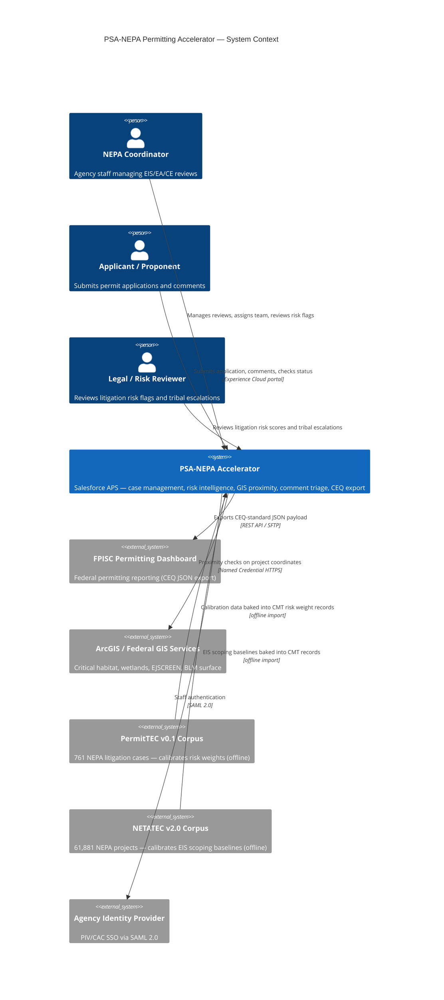
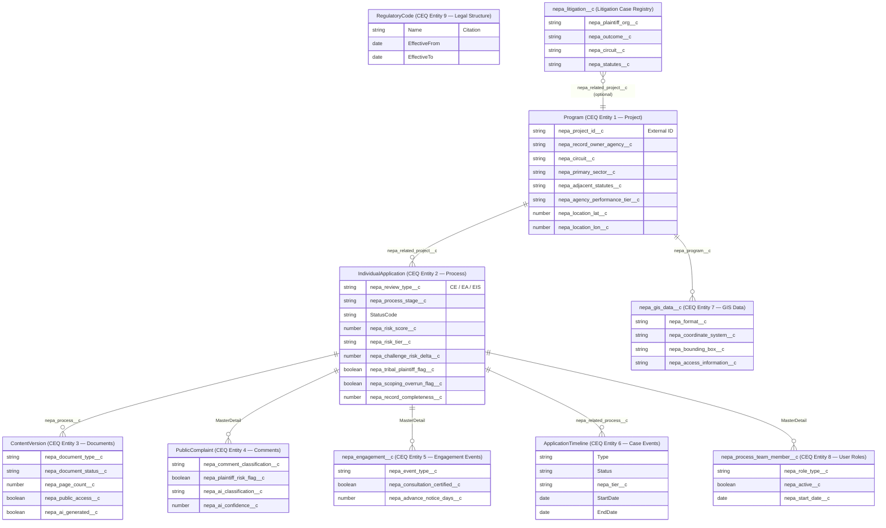
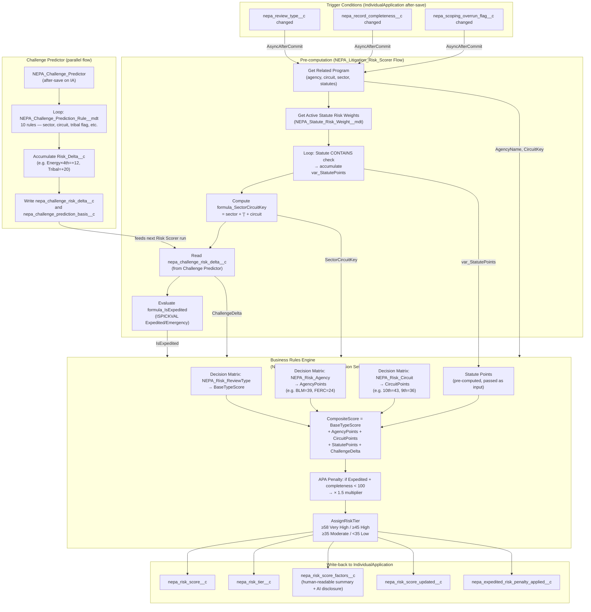
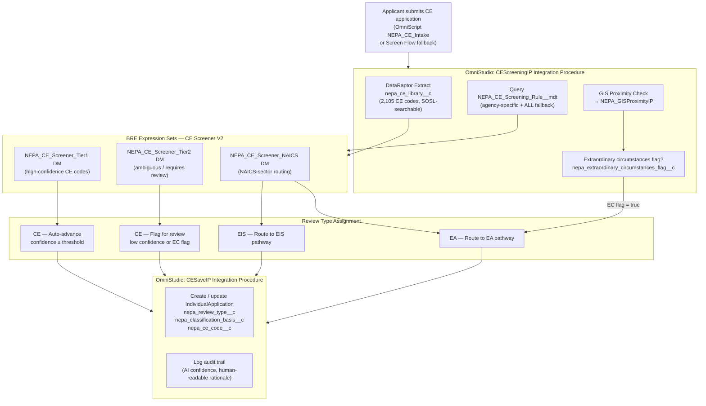
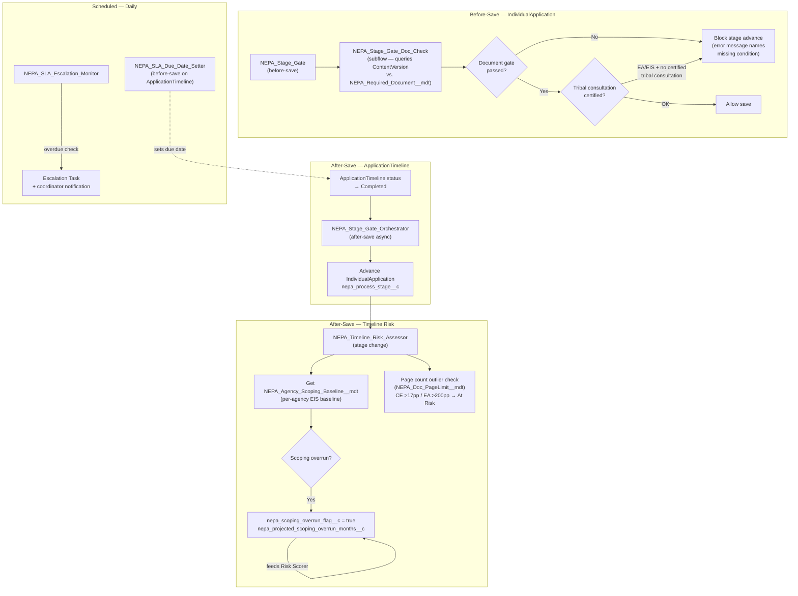
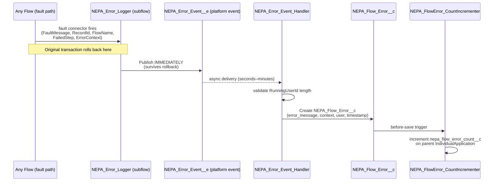
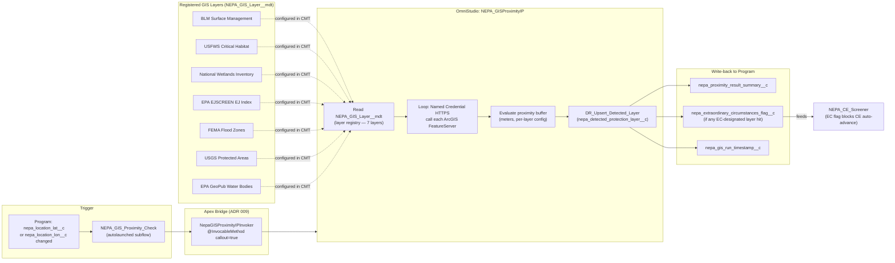
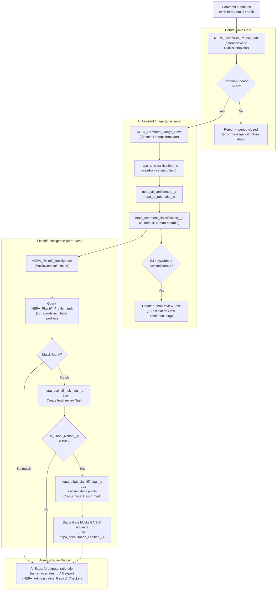
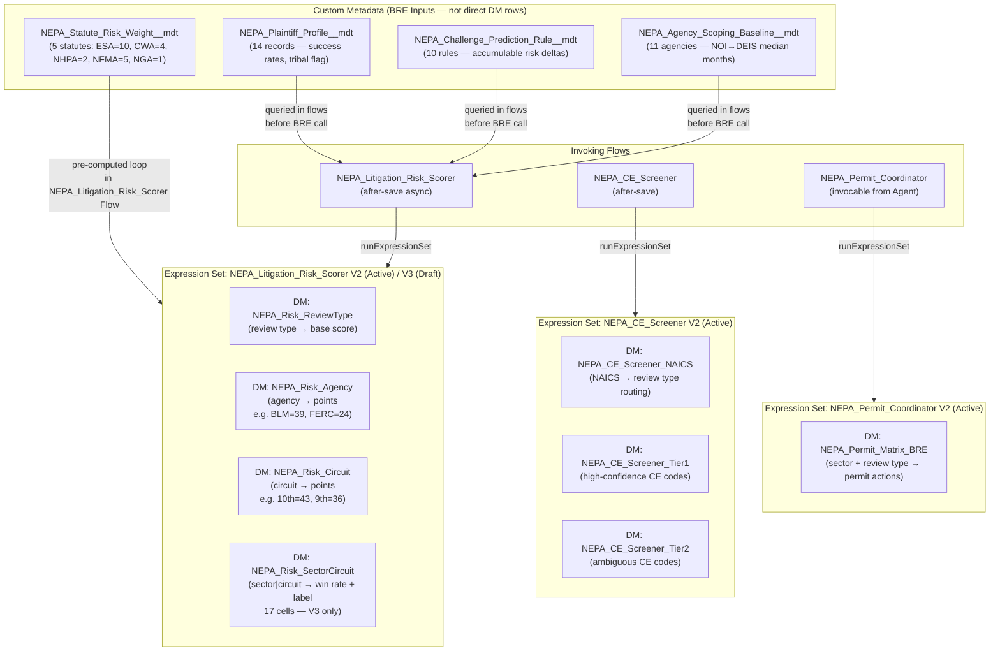
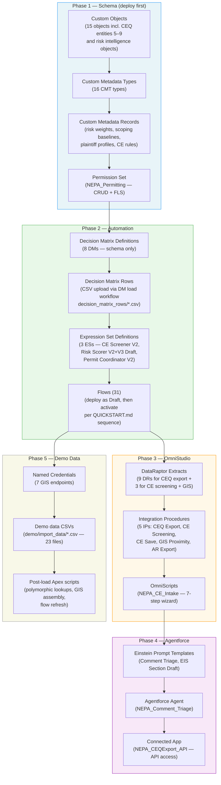

# PSA-NEPA Permitting Accelerator — Architecture Diagrams

Architecture and data-flow reference for the PSA-NEPA permitting accelerator. Companion to [ARCHITECTURE_DECISIONS.md](ARCHITECTURE_DECISIONS.md) (the why) and [FLOW-ARCHITECTURE.md](FLOW-ARCHITECTURE.md) (the flow inventory).

---

## Table of Contents

1. [System Context](#1-system-context)
2. [Data Model — Core CEQ Entities](#2-data-model--core-ceq-entities)
3. [Risk Intelligence Pipeline](#3-risk-intelligence-pipeline)
4. [CE Screening and Intake Flow](#4-ce-screening-and-intake-flow)
5. [Stage Gate and Timeline Architecture](#5-stage-gate-and-timeline-architecture)
6. [Error Handling Architecture](#6-error-handling-architecture)
7. [GIS Proximity Check Flow](#7-gis-proximity-check-flow)
8. [Public Comment and Tribal Intelligence Flow](#8-public-comment-and-tribal-intelligence-flow)
9. [BRE / Decision Engine Layer](#9-bre--decision-engine-layer)
10. [Deployment Package Map](#10-deployment-package-map)

---

## 1. System Context

How the accelerator fits within Salesforce APS, external federal systems, and agency users.

---

## 2. Data Model — Core CEQ Entities

Entity-relationship diagram for the 9 CEQ standard entities and key supporting objects.

---

## 3. Risk Intelligence Pipeline

How a litigation risk score is calculated end-to-end, from record trigger through BRE to write-back.

---

## 4. CE Screening and Intake Flow

How a CE application is routed from submission through screening to review type assignment.

---

## 5. Stage Gate and Timeline Architecture

How timeline events, document checks, and consultation gates control stage advancement.

---

## 6. Error Handling Architecture

Platform event pattern that guarantees error records survive transaction rollbacks.

**Key invariant:** The platform event publish is the only durable side-effect that can survive a rolled-back transaction. All 31 flows wire their fault paths to `NEPA_Error_Logger` using this pattern.

---

## 7. GIS Proximity Check Flow

How project coordinates trigger proximity checks against federal spatial datasets.

---

## 8. Public Comment and Tribal Intelligence Flow

How a public comment is ingested, triaged, flagged for litigation history, and escalated for tribal consultation.

---

## 9. BRE / Decision Engine Layer

How the three Expression Sets and eight Decision Matrices are organized.

---

## 10. Deployment Package Map

What is deployed and in what order.

---

*Diagrams render in any Mermaid-compatible viewer including GitHub, GitLab, and VS Code with the Mermaid preview extension.*
