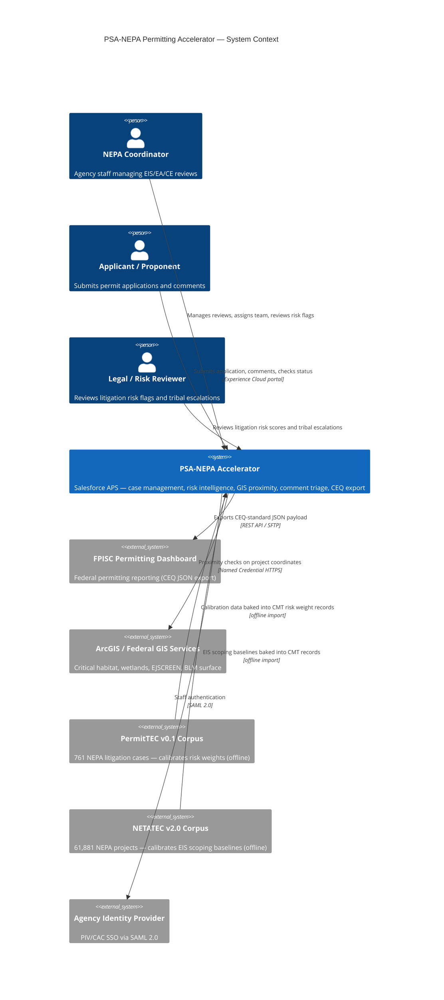
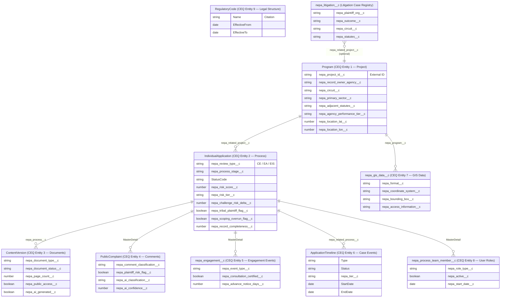
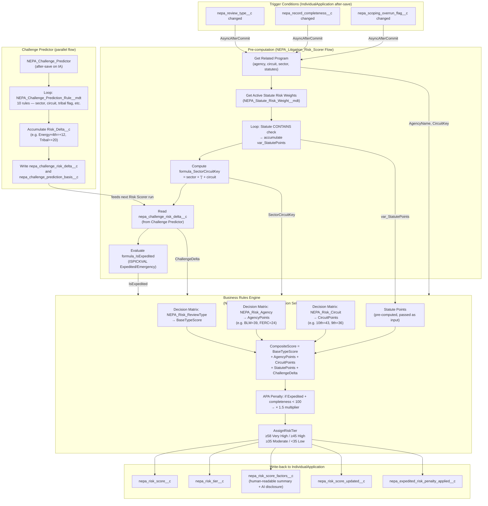
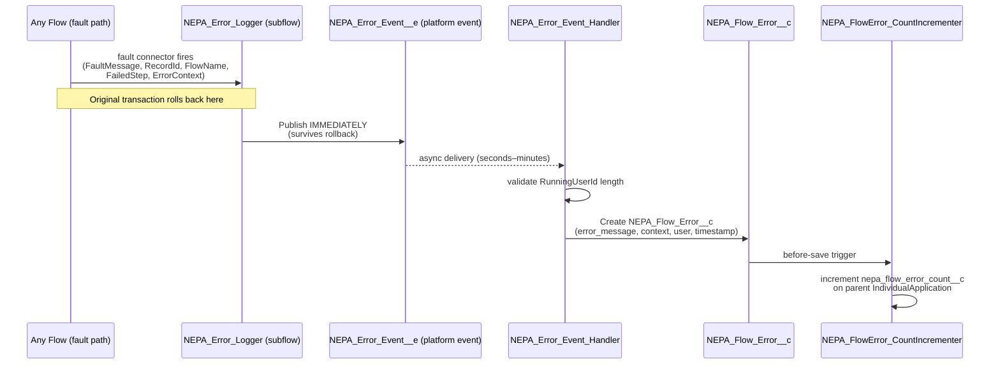
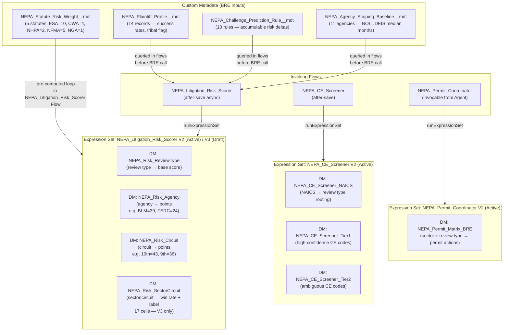

# Architecture Decision Records

**Project:** PSA-NEPA-Permitting-Data-Model
**Maintainer:** GPS Accelerators
**Last Updated:** 2026-05-17

Open-source NEPA permitting accelerator built on Salesforce Agentforce for Public Sector (APS). Maps CEQ NEPA and Permitting Data and Technology Standard v1.2 entities — which define MFRs (Minimum Functional Requirements) as CEQ's baseline capability benchmarks — to PSS standard objects, adds custom objects and 12+ declarative flows for risk intelligence, and prepares for Phase 2 OmniStudio + Agentforce portal delivery.

---

## Table of Contents

| ADR | Title | Status |
|-----|-------|--------|
| 001 | [APS Object Mapping for CEQ Entities](#adr-001--aps-object-mapping-for-ceq-entities) | Accepted |
| 002 | [Flow-Only Risk Intelligence (No Apex)](#adr-002--flow-only-risk-intelligence-no-apex) | Accepted |
| 003 | [Platform Event Error Architecture](#adr-003--platform-event-error-architecture) | Accepted |
| 004 | [Custom Metadata Weight Tables](#adr-004--custom-metadata-weight-tables) | Accepted |
| 005 | [Phase 2 OmniStudio Isolation Strategy](#adr-005--phase-2-omnistudio-isolation-strategy) | Accepted |
| 006 | [PII / CUI Protection Architecture](#adr-006--pii--cui-protection-architecture) | Accepted |
| 007 | [LDV and Data Skew Mitigations](#adr-007--ldv-and-data-skew-mitigations) | Accepted |
| 008 | [Agentforce / RAG Data Readiness](#adr-008--agentforce--rag-data-readiness) | Accepted |
| 009 | [Apex Bridge for Flow-to-OmniIP Invocation](#adr-009--apex-bridge-for-flow-to-omniip-invocation) | Accepted |
| 010 | [CE Library as Custom Object (nepa_ce_library__c)](#adr-010--ce-library-as-custom-object-nepa_ce_library__c) | Accepted |
| 011 | [OmniScript CE Intake over Screen Flow](#adr-011--omniscript-ce-intake-over-screen-flow) | Accepted |
| 012 | [nepa_process_stage__c Text → Picklist and Salesforce Path](#adr-012--nepa_process_stage__c-text--picklist-and-salesforce-path) | Accepted |
| 013 | [Cross-Agency Permit Status: Live NEPA REST Callout over External Objects](#adr-013--cross-agency-permit-status-live-nepa-rest-callout-over-external-objects) | Accepted |
| App. A | [Architecture Diagrams](#appendix-a--architecture-diagrams) | Reference |
| App. B | [Architecture Review — Static Analysis](#appendix-b--architecture-review--static-analysis) | Reference |
| App. C | [OmniStudio Backlog Detail](#appendix-c--omnistudio-backlog-detail) | Reference |

---

## ADR 001 -- APS Object Mapping for CEQ Entities

**Status:** Accepted
**Date:** 2026-04-29
**Deciders:** GPS Accelerators

### Context

The CEQ NEPA and Permitting Data and Technology Standard v1.2 defines six core entities that every NEPA tracking system must represent: Project, Process, Documents, Comments, Public Engagement Events, and Case Events. Salesforce Agentforce for Public Sector ships several standard objects that approximate these entities but were designed for broader regulatory intake, not specifically for NEPA. The accelerator must choose which PSS objects to adopt and where custom objects are required.

Two APS objects were candidates for the Process entity: `IndividualApplication` and `BusinessLicenseApplication`. NEPA proponents span individuals, businesses, federal and state agencies, tribal nations, and multi-party joint ventures. The selected object must carry stage/status/outcome lifecycle fields that align with CEQ Process properties without imposing assumptions about commercial licensing.

### Decision

Map CEQ entities to PSS objects as follows. See README.md "CEQ Standard Coverage" for the complete entity-to-object mapping table, including all 13 CEQ entities and their custom object supplements.

The key architectural decision was choosing `IndividualApplication` over `BusinessLicenseApplication` for CEQ Entity 2 (Process):

`IndividualApplication` was selected over `BusinessLicenseApplication` because:

- `IndividualApplication` carries the stage, status, and outcome lifecycle fields that directly align with CEQ Process properties.
- `BusinessLicenseApplication` carries renewal-cycle and license-number assumptions (e.g., `LicenseNumber`, `RenewalDate`) that have no NEPA analog and would create misleading empty fields.
- NEPA proponents are not exclusively commercial entities. `IndividualApplication` imposes no business-licensing semantics on tribal, agency, or individual proponent records.

**Multi-party proponent pattern:** `IndividualApplication.AccountId` holds the lead applicant (1:1 relationship). The `nepa_process_related_agencies__c` junction object with `nepa_role__c` picklist (`Proponent` / `Cooperating` / `Participating`) handles multi-party relationships. Agencies with `nepa_role__c = Proponent` are treated as co-proponents in all downstream scoring and reporting logic.

### Consequences

- **PublicComplaint lifecycle friction.** PSS ships managed lifecycle automation (investigation status flows, resolution field updates) on `PublicComplaint`. These automations may silently stamp values on NEPA comment records. Customers must audit all PSS-shipped flows and Process Builders targeting `PublicComplaint` before deploying the accelerator.
- **Sharing inheritance on nepa_engagement__c.** Because `nepa_engagement__c` uses a MasterDetail relationship to `IndividualApplication`, sharing is ControlledByParent. If Experience Cloud portal access is granted on `IndividualApplication`, engagement events become visible to portal users automatically. This is the intended behavior for Phase 2 portal delivery, but it must be explicitly configured. Field-level security alone does not control record visibility on MasterDetail children.
- **No standard NEPA engagement object exists in PSS.** `nepa_engagement__c` is a custom object and will require ongoing maintenance outside the PSS managed package upgrade path.

---

## ADR 002 -- Flow-Only Risk Intelligence (No Apex)

**Status:** Accepted
**Date:** 2026-04-29
**Deciders:** GPS Accelerators

### Context

The accelerator includes 12+ risk intelligence flows: litigation risk scoring, challenge prediction, CE screening, defensibility gap detection, administrative record checking, and record completeness scoring. These flows execute complex multi-factor calculations using custom metadata weight tables derived from the PermitTEC v2.0 corpus (761 NEPA litigation cases, 61,881 project records).

The implementation could use Apex classes, declarative Flows, or a hybrid approach. The target deployment audience is federal agency IT staff, many of whom maintain Salesforce orgs without dedicated Salesforce developer expertise.

### Decision

All risk intelligence automation is implemented as declarative components — Flows, Business Rules Engine Decision Matrices, and Flow-invoked Apex bridges — with no custom business logic Apex. All after-save flows that write back to the triggering record use `AsyncAfterCommit` scheduled paths.

**Rationale:**

- **Maintainability.** Agency IT administrators can inspect, modify, and troubleshoot Flows in Setup without Salesforce developer credentials or toolchain access.
- **Custom Metadata portability.** Risk weights and screening rules are stored in Custom Metadata Types. Weight updates do not require code deployments, test class updates, or Apex compilation.
- **Governor limit architecture.** Each `AsyncAfterCommit` interview runs in its own execution context with a fresh 150 SOQL query / 600ms CPU budget. A 500-record bulk load queues 500 separate async interviews rather than running in a single synchronous transaction. Custom Metadata queries do not count against per-transaction SOQL limits.

**Recursion guard pattern:** `NEPA_CE_Screener` stamps `nepa_screener_last_run__c` (DateTime) before writing `nepa_review_type__c`. `NEPA_Litigation_Risk_Scorer` uses entry criteria `(Condition1 OR Condition2) AND Condition3` where Condition3 is `nepa_screener_last_run__c IsChanged = false`. This prevents the CE Screener triggering the Risk Scorer triggering the CE Screener chain during bulk loads.

### Consequences

- **O(n^2) CPU risk in NEPA_Record_Completeness_Scorer.** The inner loop iterates required documents multiplied by existing documents for each `ContentVersion` upload. This is acceptable at the current corpus size but must be monitored when document count exceeds 200 per process. If performance degrades, the inner loop should be refactored to use a collection-contains check or replaced with an Apex invocable action.
- **Flow debug complexity.** Multi-flow chains (CE Screener invokes Risk Scorer invokes Defensibility Gap Checker) are harder to trace end-to-end than a single Apex class. The platform event error architecture (ADR 003) partially mitigates this by capturing fault context at each stage.
- **No compiled type safety.** Field API name typos in Flow formulas fail at runtime, not at compile time. Deployment validation (`--dry-run`) catches some of these but not all formula-embedded references.

---

## ADR 003 -- Platform Event Error Architecture

**Status:** Accepted
**Date:** 2026-04-29
**Deciders:** GPS Accelerators

### Context

The 12+ risk intelligence flows perform data-modifying operations (field updates, record creates) that can fail due to validation rules, governor limits, data quality issues, or downstream automation conflicts. When a flow transaction fails, Salesforce rolls back all DML in that transaction. If error logging uses standard record creation in the same transaction, the error record is also rolled back and the failure is silently lost.

### Decision

All flow fault paths call the `NEPA_Error_Logger` subflow, which publishes `NEPA_Error_Event__e` (platform event). A separate `NEPA_Error_Event_Handler` flow subscribes to the event and writes `NEPA_Flow_Error__c` records in a clean, independent transaction.

**Why platform events:** Platform event publishes survive transaction rollbacks. A fault in the original flow rolls back all DML in that transaction, but the `PUBLISH IMMEDIATELY` platform event has already been committed to the event bus. Error records are always written regardless of the originating transaction's outcome.

**Error context snapshot:** Caller flows pass `inp_ErrorContext` -- a pipe-delimited `key:value` string capturing variable state at the time of the fault. This is stored in `nepa_error_context__c` (LongTextArea) on `NEPA_Flow_Error__c` for post-mortem diagnosis without requiring debug log analysis.

**Running user guard:** `NEPA_Error_Event_Handler` validates that `Running_User_Id__c` is non-null and exactly 18 characters before using it as a Lookup value. If validation fails, the handler creates the error record without a user link rather than allowing the error logging itself to fail.

**Error count escalation:** The `NEPA_FlowError_CountIncrementer` after-save flow on `NEPA_Flow_Error__c` increments `nepa_flow_error_count__c` on the parent `IndividualApplication`. High error counts can trigger escalation flows. Escalation flow implementation is Phase 1 remaining work.

### Consequences

- **Migration path to Nebula Logger.** When Nebula Logger is installed in a customer org, only the `NEPA_Error_Event_Handler` flow's record-create element needs replacement with a Nebula Logger Apex action call. No changes are required to any of the 12 caller flows or the `NEPA_Error_Logger` subflow.
- **Platform event delivery is asynchronous.** Error records may appear seconds to minutes after the originating fault. Real-time error dashboards will show slight delay.
- **Platform event daily limits.** The default daily platform event allocation (varies by org edition) applies. High-volume bulk loads with high failure rates could approach this limit. Monitor `NEPA_Error_Event__e` publish counts during initial data migration.

---

## ADR 004 -- Custom Metadata Weight Tables

**Status:** Accepted
**Date:** 2026-04-29
**Deciders:** GPS Accelerators

### Context

Risk intelligence flows require configurable weight tables for litigation risk factors, CE screening rules, challenge prediction rules, and defensibility gap thresholds. These weights are derived from statistical analysis of the PermitTEC v2.0 corpus. Different agencies operate in different circuits, manage different project types, and face different litigation profiles. Weights must be updatable by agency administrators without code deployments.

### Decision

Nine Custom Metadata Types (CMTs — configuration records deployed as metadata rather than data, queryable at runtime without consuming SOQL limits) store risk weights and screening rules:

| Custom Metadata Type | Purpose |
|---|---|
| `NEPA_Agency_Risk_Rate__mdt` | Agency-specific litigation rates |
| `NEPA_Circuit_Risk_Weight__mdt` | Federal circuit geographic risk multipliers |
| `NEPA_Statute_Risk_Weight__mdt` | Adjacent statute (ESA/CWA/NHPA) risk factors |
| `NEPA_CE_Code__mdt` | CE code catalog with CFR authority |
| `NEPA_CE_Screening_Rule__mdt` | CE eligibility screening rules by agency and project type |
| `NEPA_Challenge_Prediction_Rule__mdt` | Challenge ground prediction patterns |
| `NEPA_Required_Document__mdt` | Required document checklists by review type |
| `NEPA_Agency_Scoping_Baseline__mdt` | Per-agency EIS scoping baseline durations (NOI→DEIS, DEIS→FEIS median months, scoping cap) derived from CEQ EIS Timeline data 2010–2024 |
| `NEPA_Flow_Error__c` | Error logging target (standard custom object, not CMT) |

**Agency matching logic:** `NEPA_CE_Screening_Rule__mdt.Agency__c` is a restricted picklist (`ALL` / `BLM` / `DOD` / `DOE` / `FERC` / `FWS` / `USACE` / `USFS`). The CE Screener flow uses `EqualTo` comparison, not `Contains`. Agency-specific rules take precedence; the `ALL`-agency fallback lookup fires only when no agency-specific rule matches.

**Audit trail:** `Effective_Date__c` (Date) and `Update_Notes__c` (LongTextArea) fields exist on `NEPA_CE_Screening_Rule__mdt`. When the PermitTEC corpus is updated, operators should create new CMT records with a new `Effective_Date__c` rather than editing existing records. This preserves a historical audit trail of weight changes.

**Field protection model:**

| Protection Level | Fields | Rationale |
|---|---|---|
| `SubscriberControlled` | Confidence, Priority, Acreage_Threshold, Active | Customer admins can tune weights without a package update |
| `DeveloperControlled` | CE_Code, Review_Type, Agency, Tier | Prevents admins from accidentally breaking screening logic structure |

### Consequences

- **CMT update runbook required.** `docs/CMT_Update_Guide.md` must be created before Phase 2 deployment. It should explain which CMT types to update for each type of change (new agency, new CE code, revised risk weight) and the correct procedure for preserving audit history.
- **EqualTo matching is intentional.** The `EqualTo` (not `Contains`) agency matching is a deliberate design choice that also satisfies Phase 2 Business Rules Engine Decision Matrix row-matching requirements (ADR 005).
- **CMT deployment requires elevated permissions.** System Administrator or a profile with `Customize Application` permission is required to deploy Custom Metadata records.

---

## ADR 005 -- Phase 2 OmniStudio Isolation Strategy

**Status:** Accepted — OmniStudio implementation is backlog (see [ARCHITECTURE_DECISIONS.md — Appendix C](ARCHITECTURE_DECISIONS.md#appendix-c--omnistudio-backlog-detail))
**Date:** 2026-04-29
**Deciders:** GPS Accelerators

### Context

Phase 2 replaces the Phase 1 screen flow intake experience with OmniStudio OmniScripts backed by Integration Procedures. OmniScript Integration Procedures invoke backend logic via FlowAction step types. The Phase 1 architecture must be structured so that backend scoring and validation flows port to OmniStudio without refactoring.

### Decision

Autolaunched flows with clean, explicitly typed input/output variables are the Phase 2 Integration Procedure integration surface. No business logic is added to screen flows.

**What ports cleanly to Phase 2:**

| Flow | Type | Phase 2 Integration |
|---|---|---|
| `NEPA_CE_Screener` | Autolaunched | FlowAction -- zero refactoring |
| `NEPA_Litigation_Risk_Scorer` | Autolaunched | FlowAction -- zero refactoring |
| `NEPA_Defensibility_Gap_Checker` | Autolaunched | FlowAction -- zero refactoring |

These flows accept record IDs as inputs and return structured outputs. Their input/output variable contracts become the Integration Procedure FlowAction contract.

**What to freeze:** `NEPA_CE_Intake` screen flow is the Phase 2 OmniScript replacement target. No new business logic should be added to it. New intake fields belong in the autolaunched scoring flows, not the screen flow.

> **Update (ADR 011, 2026-05-12):** The OmniScript CE intake was attempted in Phase 1.1 but was not successfully deployed and verified. The `NEPA_CE_Intake` screen flow remains the primary (and only verified) intake path. The OmniScript path is backlog. See [ARCHITECTURE_DECISIONS.md — Appendix C](ARCHITECTURE_DECISIONS.md#appendix-c--omnistudio-backlog-detail) and ADR 011 for full context.

**ContentDocumentLink avoidance:** `nepa_process__c` (Lookup to `IndividualApplication`) was added directly to `ContentVersion` to provide a direct query path. OmniScript Integration Procedures cannot traverse `ContentDocumentLink` junction records the same way Flow `Get Records` can. All queries that previously resolved process context from `ContentDocumentLink` have been rewritten to use `nepa_process__c`.

**CMT to Expression Sets migration path:** `NEPA_CE_Screening_Rule__mdt` maps to a Business Rules Engine Decision Matrix in Phase 2. The `EqualTo` agency matching established in ADR 004 satisfies BRE row-matching semantics directly.

### Consequences

- **Screen flow feature freeze.** The `NEPA_CE_Intake` screen flow should receive only bug fixes, not new features, from this point forward. New intake capabilities should be built as autolaunched subflows that can be called from both the screen flow (Phase 1) and OmniScript Integration Procedures (Phase 2).
- **Input/output contract documentation.** All autolaunched flows invoked as subflows must have their input and output variables documented. These variable signatures are the binding contract for Integration Procedure FlowAction steps.
- **OmniStudio license dependency.** Phase 2 requires OmniStudio to be installed or included in the PSS license. Verify availability before beginning Phase 2 work.

---

## ADR 006 -- PII / CUI Protection Architecture

**Status:** Accepted
**Date:** 2026-04-29
**Deciders:** GPS Accelerators

### Context

NEPA public comment records (`PublicComplaint`) may contain personally identifiable information (PII) and controlled unclassified information (CUI). Phase 2 introduces an Experience Cloud portal where external users (applicants, consultants, tribal representatives) view comment summaries and engagement data. Raw comment bodies must not be exposed to portal users. Federal agencies deploying this accelerator may operate under FedRAMP Moderate or High authorization boundaries.

### Decision

Raw comment body (`PublicComplaint` standard body fields) is internal-only. A separate `nepa_redacted_body__c` field stores the portal-safe version. The `nepa_pii_redacted__c` checkbox flag gates portal visibility.

**Field classification:**

| Visibility | Fields |
|---|---|
| Internal staff only (restrict FLS) | `nepa_public_source__c`, `nepa_organization__c`, `nepa_email__c`, raw PSS comment body fields |
| Safe for portal exposure | `nepa_category__c`, `nepa_sentiment__c`, `nepa_is_substantive__c`, `nepa_cluster_id__c`, `nepa_response_status__c`, `nepa_redacted_body__c` |

**Shield Platform Encryption consideration:** `nepa_error_context__c` on `NEPA_Flow_Error__c` and `nepa_error_message__c` may contain field values from user-submitted records. FedRAMP Moderate/High orgs should enable deterministic encryption on these LongTextArea fields. This is a customer-org configuration documented in the deployment runbook, not enforced in package metadata.

**Commenter name guidance:** If `nepa_commenter_name__c` is added in Phase 2 for portal display, it must be a separate Display Name field populated by the submitter. It must not be sourced from `Contact.Name` or any raw PII field. Commenter legal names must never be stored in a field accessible to Experience Cloud guest users.

### Consequences

- **Dual-field maintenance.** Every comment ingestion process must populate both the raw body and `nepa_redacted_body__c`. Redaction logic (Phase 2 Agentforce or regex-based flow) must run before `nepa_pii_redacted__c` is set to `true`.
- **FLS configuration is a deployment prerequisite.** Portal user profiles and permission sets must have FLS explicitly denied on internal-only fields before any portal access is granted.
- **Shield encryption is customer-managed.** The accelerator documents the recommendation but cannot enforce encryption configuration in the package. Deployment runbooks must include encryption setup steps for FedRAMP orgs.

---

## ADR 007 -- LDV and Data Skew Mitigations

**Status:** Accepted
**Date:** 2026-04-29
**Deciders:** GPS Accelerators

### Context

NEPA Environmental Impact Statements (EIS) for contested projects can attract 50,000+ public comments. Large infrastructure programs may accumulate thousands of documents across multiple review cycles. `IndividualApplication` is the hub object with `PublicComplaint` and `nepa_engagement__c` as MasterDetail children and `ContentVersion` linked via both `ContentDocumentLink` and the custom `nepa_process__c` Lookup.

Salesforce sharing recalculation on a parent record triggers a rebuild of all child sharing rows. Ownership changes on high-child-count parent records can cause long-running sharing recalculations that degrade org performance.

### Decision

**Object relationship architecture:**

| Parent | Child | Relationship | Rationale |
|---|---|---|---|
| `IndividualApplication` | `PublicComplaint` | MasterDetail | Sharing inheritance, cascade delete, roll-up support |
| `IndividualApplication` | `nepa_engagement__c` | MasterDetail | Sharing inheritance, cascade delete |
| `IndividualApplication` | `ContentVersion` | Lookup via `nepa_process__c` | Direct query path; avoids CDL traversal |

**EIS comment volume mitigation:** Assign EIS-type `IndividualApplication` records to a Queue (not an individual user) to prevent ownership-change-triggered sharing recalculations during comment intake periods. Document this requirement in the agency's intake standard operating procedure.

**Indexing strategy:**

- `nepa_process__c` on `ContentVersion` and the Lookup from `PublicComplaint` to `IndividualApplication` are automatically indexed as standard Lookup fields.
- Request custom index support from Salesforce Support for `nepa_record_id__c` (Text) on `NEPA_Flow_Error__c` before bulk data loads exceeding 100,000 error records.

**SOQL query discipline:** All bulk document fetches use `nepa_process__c = :processId` directly. The `ContentDocumentLink` traversal path (`nepa_related_case_event__r.IndividualApplicationId`) has been replaced by the direct lookup in `NEPA_Administrative_Record_Checker` and `NEPA_Record_Completeness_Scorer`.

**PublicComplaint pagination:** Phase 2 comment triage queries must use `LIMIT`/`OFFSET` or cursor-based pagination. Fetching all child `PublicComplaint` records in a single unbounded query on a live EIS process is prohibited.

### Consequences

- **Queue assignment is an operational requirement.** The platform does not enforce Queue ownership on specific record types. Agency intake SOPs must document the Queue assignment requirement for EIS processes.
- **Custom index requests require Salesforce Support cases.** The custom index on `nepa_record_id__c` cannot be deployed via metadata. It must be requested through a Salesforce Support case, which adds lead time to deployment planning.
- **CDL queries remain necessary for some operations.** The `nepa_process__c` direct lookup replaces CDL traversal for bulk scoring queries, but standard Salesforce operations (Files related list, Content Delivery) still use `ContentDocumentLink`. Both paths must be maintained.

---

## ADR 008 -- Agentforce / RAG Data Readiness

**Status:** Accepted
**Date:** 2026-04-29
**Deciders:** GPS Accelerators

### Context

Phase 2 introduces Agentforce agents for comment triage, document generation assistance, and process guidance. These agents use retrieval-augmented generation (RAG) patterns to ground responses in agency-specific NEPA documents and comment records. Field design decisions made in Phase 1 directly affect the quality and reliability of Phase 2 RAG retrieval. Retrofitting field structures after data has been ingested is significantly more expensive than designing for RAG readiness from the start.

### Decision

Phase 1 (v1.1) implemented comment and document metadata fields for Agentforce/RAG readiness. The following field decisions were made to avoid Phase 2 refactoring:

**Sentiment standardization:** `nepa_sentiment__c` on `PublicComplaint` is a restricted picklist with exactly four values: `Supportive`, `Opposed`, `Neutral`, `Mixed`. The Agentforce triage action writes to this field; no free-text sentiment values are permitted. Consistent enumerated values enable reliable downstream filtering, aggregation, and RAG context window management.

**Section-level document tagging:** `nepa_section_tags__c` on `ContentVersion` is a multi-select picklist with values: `Purpose and Need`, `Alternatives`, `Affected Environment`, `Environmental Consequences`, `Mitigation`, `Appendix`, `Full Document`. This enables section-level RAG retrieval where the Agentforce document generation agent retrieves only the relevant section from prior documents rather than ingesting full documents into the context window.

**Human-in-the-loop for AI-generated content:** `nepa_ai_generated__c` (Checkbox) on `ContentVersion` flags AI-generated content. `nepa_reviewer__c` (Lookup to User) and `nepa_reviewed_date__c` (DateTime) close the human-in-the-loop requirement. A Phase 2 validation rule will enforce that AI-generated documents must have `nepa_reviewer__c` set and `nepa_reviewed_date__c` populated before `nepa_status__c` can be set to `Approved`. (Fields deployed; validation rule deferred to Phase 2.)

**Comment body hygiene:** Before Phase 2, a before-save validation rule on `PublicComplaint` should reject body text containing embedded HTML tags and normalize whitespace on save. Malformed large comment bodies with HTML markup cause LLM token limit overruns and degrade RAG retrieval quality.

### Consequences

- **Restricted picklist values require deployment to change.** Adding a new sentiment category (e.g., `Conditional`) requires a metadata deployment, not an admin picklist edit. This is intentional to prevent free-text drift.
- **Section tagging is manual until Phase 2.** The `nepa_section_tags__c` field exists in Phase 1 but is populated manually or left blank. Phase 2 Agentforce document ingestion actions will auto-tag sections based on document structure analysis.
- **Validation rule for AI-generated content is deferred.** The `nepa_ai_generated__c` / `nepa_reviewer__c` / `nepa_reviewed_date__c` fields are deployed in Phase 1, but the enforcement validation rule is a Phase 2 deliverable. During Phase 1, these fields are informational only.
- **HTML sanitization scope.** The comment body validation rule must balance sanitization (removing harmful markup) with preservation (some public comment submission systems embed light formatting). The exact regex pattern should be tested against a representative sample of the agency's actual comment submissions before activation.

---

## ADR 009 -- Apex Bridge for Flow-to-OmniIP Invocation

**Status:** Accepted
**Date:** 2026-05-07
**Deciders:** GPS Accelerators

### Context

`NEPA_GIS_Proximity_Check` is a record-triggered Flow that must invoke `NEPA_GISProximityIP` (an OmniStudio Integration Procedure) asynchronously after a Program record's coordinates are saved. The natural approach in Flow is a `<subflows>` element referencing the IP by developer name.

During deployment it was discovered that OmniIntegrationProcedures are stored as `OmniProcess` sObject records, not as Flow records. The Metadata API resolves `<subflows>` references by looking up a Flow record with the matching developer name. When the referenced name resolves to an `OmniProcess` record instead of a Flow record, the platform does not return a structured error. Instead, it crashes at the HTTP transport level during Flow activation with `UNKNOWN_EXCEPTION`, leaving no actionable error message.

This behavior is reproducible across org types and is not caused by Flow XML syntax errors, XML encoding issues, or deployment configuration. It is an architectural constraint of the Metadata API: `<subflows>` only resolves Flow-type records. This is a known Salesforce platform behavior as of API v62.0 — the `deploy.sh` script includes a retry workaround for the `UNKNOWN_EXCEPTION` that occurs during Flow activation when this conflict is encountered.

### Decision

All Flow invocations of OmniIntegrationProcedures use an Apex `@InvocableMethod` bridge class. The Flow calls the bridge via `<actionCalls actionType=apex>`, and the bridge calls the IP at runtime via the OmniStudio service API.

**Bridge class:** `NepaGISProximityIPInvoker`

**Correct OmniStudio service invocation pattern:**

```apex
omnistudio.IntegrationProcedureService svc = new omnistudio.IntegrationProcedureService();
Object result = svc.invokeMethod('runIntegrationService', inputMap, outputMap, options);
```

**Why `invokeMethod` and not `runIntegrationService`:**
The `omnistudio.IntegrationProcedureService` class in the installed package version exposes `invokeMethod(String, Map, Map, Map)` as an instance method. The static `runIntegrationService()` overload and the inner `IntegrationProcedureRunner` class referenced in OmniStudio documentation do not exist in this package version — attempting to call them produces a compile-time error. The correct method was discovered by probing the instance in an anonymous Apex execution.

**Flow element shape:**

```xml
<actionCalls>
    <name>InvokeGISProximityIP</name>
    <actionName>NepaGISProximityIPInvoker</actionName>
    <actionType>apex</actionType>
    <inputParameters>
        <name>projectId</name>
        <value><elementReference>$Record.Id</elementReference></value>
    </inputParameters>
    <connector>...</connector>
    <faultConnector>...</faultConnector>
</actionCalls>
```

### Consequences

- **One Apex class per IP invocation.** Each OmniIntegrationProcedure called from a Flow requires its own `@InvocableMethod` bridge class. For this accelerator that is currently one class (`NepaGISProximityIPInvoker`). If additional IPs are added to the GIS or team-assembly pipeline, new bridge classes follow the same pattern.
- **`callout=true` on the `@InvocableMethod`.** The IP performs HTTP callouts to ArcGIS endpoints. The `@InvocableMethod` annotation requires `callout=true` to allow callouts in the async execution context. Without it, the IP call fails with a callout-not-allowed exception.
- **Deployment order dependency.** The Apex bridge class must be deployed before the Flow that references it. Phase 7 (Apex) precedes Phase 8 (Flows) in `deploy.sh` — this ordering is correct and intentional.
- **OmniStudio package version sensitivity.** The `invokeMethod` API was confirmed working in the OmniStudio package version present in NEPADEV and NEPADEMO as of 2026-05-07. If the org is upgraded to a newer OmniStudio package version that changes the service API, the bridge class method call must be re-verified against the new package.
- **ADR 002 partial exception.** ADR 002 establishes a flow-only, no-Apex policy for risk intelligence automation. This Apex bridge is a narrow exception: it is a thin infrastructure adapter with no business logic. All business logic remains in the IP and the Flow. The bridge class is a single method with no conditional branching beyond exception handling.

---

## Customer Deployment Prerequisites

Complete all items in this checklist before deploying the accelerator to a production or production-equivalent org. Items are grouped by category and ordered by dependency.

### Org Configuration

- [ ] APS (Agentforce for Public Sector) license is active. Verify that `IndividualApplication`, `Program`, `ApplicationTimeline`, and `PublicComplaint` are available in the target org by confirming object visibility in Setup > Object Manager.
- [ ] API version 62.0 minimum (Spring '25). Confirm the org's metadata API version supports 62.0 by checking Setup > Company Information or running `sf org display`.
- [ ] Platform Events are enabled (Setup > Platform Events). Required for `NEPA_Error_Event__e` publish/subscribe architecture.
- [ ] Custom Metadata deployment permission is available. The deploying user must have System Administrator profile or a profile/permission set with the `Customize Application` permission.
- [ ] Action Plans license/feature is enabled if stage gate task automation is required. Verify in Setup > Action Plans.

### Sharing and Security

- [ ] Audit all PSS-shipped flows and Process Builders targeting `PublicComplaint` before go-live. Disable or deactivate any PSS automation that conflicts with the NEPA comment lifecycle (e.g., investigation status stamping, resolution field updates).
- [ ] Set `IndividualApplication` organization-wide default (OWD) sharing appropriate for the agency's security model before deploying Experience Cloud (Phase 2). Do not change OWD post-go-live without a full sharing recalculation impact assessment.
- [ ] Assign field-level security for `nepa_process__c`, `nepa_pii_redacted__c`, and `nepa_redacted_body__c` on all portal user profiles and permission sets before any portal user access is granted.
- [ ] For FedRAMP Moderate or High orgs: enable Shield Platform Encryption on `nepa_error_context__c` (NEPA_Flow_Error__c), `nepa_error_message__c` (NEPA_Flow_Error__c), and `PublicComplaint` comment body fields before ingesting real CUI data.

### Performance

- [ ] For EIS processes expected to receive more than 10,000 public comments: configure the agency's intake SOP to assign the `IndividualApplication` record to a Queue, not an individual user. This prevents ownership-change-triggered sharing recalculations during comment intake.
- [ ] Contact Salesforce Support to request a custom index on `NEPA_Flow_Error__c.nepa_record_id__c` (Text field used as a lookup filter) before bulk data loads exceeding 100,000 error records.
- [ ] Run load testing with 500+ `IndividualApplication` records and 5,000+ `ContentVersion` records before production go-live to validate async flow queue behavior and confirm that `AsyncAfterCommit` interviews complete within acceptable latency.

### Custom Metadata Seeding

- [ ] Deploy all 9 Custom Metadata Types and their records before activating any risk intelligence flows. Flows reference CMT records at runtime; missing records cause silent no-match defaults that produce incorrect scores.
- [ ] Set `Effective_Date__c` on all `NEPA_CE_Screening_Rule__mdt` records at deployment time to establish the initial audit baseline.
- [ ] Review `NEPA_Agency_Risk_Rate__mdt` and `NEPA_Circuit_Risk_Weight__mdt` records against the agency's actual operational footprint. The seeded records are derived from the PermitTEC national corpus -- agency-specific litigation rates and circuit weights may differ from national averages.

### Phase 2 Readiness (Before OmniStudio Work Begins)

- [ ] Do not add business logic to `NEPA_CE_Intake` screen flow. It is the Phase 2 OmniScript replacement target and should receive only critical bug fixes.
- [ ] Ensure all autolaunched flows invoked as subflows have documented input/output variables. These variable signatures become the Integration Procedure FlowAction contract in Phase 2.
- [ ] Verify that OmniStudio is installed or included in the PSS license before beginning Phase 2 development.
- [ ] Create `docs/CMT_Update_Guide.md` using the template provided in the accelerator. Train agency admin staff on CMT update procedures (including the create-new-record-with-new-date pattern for audit preservation) before Phase 2 go-live.

---

## ADR 010 -- CE Library as Custom Object (nepa_ce_library__c)

**Status:** Accepted
**Date:** 2026-05-12
**Deciders:** GPS Accelerators

### Context

The initial approach to storing categorical exclusion codes used `NEPA_CE_Code__mdt` — a Custom Metadata Type with one record per CE code. This approach had three operational limitations that became blocking constraints as the CE Library grew to 2,105 records across 79 federal agencies:

1. **Not SOSL-searchable.** Custom Metadata records are not indexed by the platform search engine. Users searching for a CE code by keyword (e.g., "routine maintenance" or "bench-scale research") could not use Salesforce search — they had to know the exact code identifier. This violated the discovery requirement: applicants and NEPA coordinators need to find applicable exclusions by description, not by CFR citation string.

2. **Not Experience Cloud guest-accessible.** Custom Metadata records are not directly queryable by Experience Cloud guest users or portal users without going through an Apex or Flow intermediary. The Phase 2 portal design required applicants to browse and search the CE catalog without requiring a Salesforce license.

3. **Not Einstein Search-indexable.** Einstein Search works on sObject records, not Custom Metadata. As the library expanded to the full federal CE catalog, SOSL full-text search on exclusion description text became a core UX requirement for both the intake wizard and the coordinator record page.

The metadata-redeployment problem was also a concern: adding new CE codes to a CMT-based library requires a metadata deployment with appropriate permissions. For a federal agency adding exclusions from a newly-adopted regulatory amendment, a data load operation is operationally simpler than a metadata deployment cycle.

### Decision

Replace `NEPA_CE_Code__mdt` as the primary CE catalog with `nepa_ce_library__c` — a custom object with `enableSearch=true`, loaded from CEQ CE Explorer v2.0 (2,105 records, 79 agencies).

**Object configuration:**

- `enableSearch=true` enables SOSL full-text search on all indexed text fields
- External ID field (`nepa_ce_code_external_id__c`) is the idempotency key for load operations, formatted as `{agency}__{code}` (e.g., `DOE__B1.3`, `BLM__516DM11.9E9`)
- Key fields: `nepa_agency__c` (Text), `nepa_ce_code__c` (Text), `nepa_cfr_authority__c` (Text), `nepa_plain_language_description__c` (LongTextArea), `nepa_acreage_threshold__c` (Number), `nepa_indoor_only__c` (Checkbox), `nepa_requires_gis_review__c` (Checkbox), `nepa_record_count_nepatec__c` (Number — corpus frequency, used to sort results)

**Load pattern:** The data load script uses `sf data upsert bulk` keyed on `nepa_ce_code_external_id__c`. The operation is idempotent: re-running the script after an agency adds new exclusions updates existing records and inserts new ones without creating duplicates.

**Relationship to BRE:** The Business Rules Engine CE Screener expression sets still reference `NEPA_CE_Screening_Rule__mdt` for routing logic (which CE code to recommend given agency + sector + action type inputs). The `nepa_ce_library__c` object holds the full catalog for search and display. The two are linked by `nepa_ce_code__c` — the screener outputs a code string; the UI resolves the description, authority, and threshold details from `nepa_ce_library__c`.

### Consequences

- **SOSL full-text search on exclusion description text.** Users can search for "routine maintenance" or "indoor bench-scale" and retrieve relevant exclusions without knowing the code string. Einstein Search surfaces CE library records in global search results.
- **Scalable to the full federal catalog without metadata redeployment.** Adding exclusions from a new agency or a regulatory amendment is a data load, not a metadata deployment. No `sf project deploy start` required; no `Customize Application` permission needed for the add operation.
- **Experience Cloud accessible.** Portal users can query `nepa_ce_library__c` directly via standard object permissions. FLS and object-level sharing are configured in the permission set, not in application logic.
- **`NEPA_CE_Code__mdt` retained for backward compatibility.** The existing CMT is not deleted. BRE expression set rows that reference CE code values by string still work. The CMT will be deprecated in a future release once all BRE reference patterns are migrated to the custom object.
- **Load script must be idempotent.** Any bulk load operation against `nepa_ce_library__c` must use upsert with the external ID, not insert. Duplicate CE records with the same agency + code combination would produce incorrect screener results and confusing search output.
- **Migration complete as of Phase 1.1 (2026-05-12).** All deployments use `nepa_ce_library__c`. `NEPA_CE_Code__mdt` is deprecated but retained for BRE row backward compatibility.

---

## ADR 011 -- OmniScript CE Intake over Screen Flow

**Status:** Accepted (design decision) — OmniScript implementation is backlog (see [ARCHITECTURE_DECISIONS.md — Appendix C](ARCHITECTURE_DECISIONS.md#appendix-c--omnistudio-backlog-detail))
**Date:** 2026-05-12
**Deciders:** GPS Accelerators

> **Backlog note (2026-05-25):** The OmniScript CE intake path described in this ADR was not successfully deployed and verified. The `NEPA_CE_Intake` Screen Flow (Option A below) remains the working intake implementation. This ADR documents the design rationale and serves as a guide for resuming OmniScript work. Do not interpret "Accepted" status as indicating the OmniScript was successfully delivered.

### Context

The 7-step CE intake wizard — which collects project attributes, triggers GIS proximity checks, runs CE pre-screening, and creates the `IndividualApplication` record — needed an implementation technology choice. Two options were evaluated:

**Option A: Screen Flow** (`NEPA_CE_Intake` — the existing Phase 1 implementation)

Screen Flow is a standard Salesforce declarative capability available in all editions, with no additional license requirement. It provides conditional section visibility, navigation buttons, and standard field components. Business logic embedded in a Screen Flow runs as a series of Flow elements visible in Flow Builder.

**Option B: OmniScript** with backing Integration Procedures (`CEScreeningIP`, `CESaveIP`) and DataRaptor Extract

OmniScript is part of OmniStudio, which is included in PSS. It provides a purpose-built guided wizard runtime with a built-in progress bar, conditional step navigation, and native rendering in Experience Cloud without additional configuration. Integration Procedures (IPs) are the data layer: they call DataRaptors, invoke external APIs, and write records — completely separate from the UI layer.

### Decision

Implement the CE intake wizard as an OmniScript backed by two Integration Procedures:

- **`CEScreeningIP`** — reads project attributes, queries `nepa_ce_library__c` and `NEPA_CE_Screening_Rule__mdt`, executes the CE pre-screening logic, and returns the recommended review type, CE code set, confidence level, and extraordinary circumstances flags
- **`CESaveIP`** — creates or updates the `IndividualApplication` record with screener outputs, triggers GIS proximity checks via `NEPA_GISProximityIP`, and logs the `nepa_classification_basis__c` audit trail
- **DataRaptor Extract** (`DR_Extract_CELibrarySearch`) — powers the CE code lookup in step 4 of the wizard, returning ranked results from `nepa_ce_library__c` based on agency and sector inputs

**Rationale:**

1. **PSS already includes OmniStudio.** The license cost of OmniScript is zero for PSS customers. Avoiding OmniScript to preserve a pure-Screen-Flow design would forgo a platform capability that is already available and better suited to the requirement.

2. **Integration Procedures call DataRaptors natively.** The CE pre-screening logic requires querying `nepa_ce_library__c` for matching codes, joining with `NEPA_CE_Screening_Rule__mdt` routing rules, and applying BRE outputs. IPs handle this data orchestration cleanly. Embedding the same logic in a Screen Flow would require Get Records elements inside the flow with complex collection iteration — the pattern ADR 002 explicitly discourages for bulk-safety reasons.

3. **Native Experience Cloud rendering.** OmniScript renders natively in Experience Cloud without the embedding friction of Screen Flows (which require a Flow component on a record page or community page). Phase 2 portal delivery requires the intake wizard to be accessible to Experience Cloud guest and authenticated users.

4. **Clean separation of UI and data logic.** The OmniScript owns step navigation, conditional field display, and progress tracking. The IPs own data reads, writes, and external API calls. This separation makes the screening logic independently testable and independently updatable — changing a screening rule does not require redeploying the OmniScript UI.

5. **Built-in progress bar and conditional navigation.** The 7-step intake wizard benefits from OmniScript's native progress bar and conditional step skipping (e.g., step 6 GIS footprint is skipped for indoor-only B3.6 project types). Replicating this in a Screen Flow requires custom LWC navigation components.

### Consequences

- **Requires OmniStudio activation.** OmniStudio must be installed in the target org and its components activated before the CE intake wizard is usable. QUICKSTART.md documents the OmniStudio activation sequence, including the manual fallback for Integration Procedure activation when the CLI deployment does not trigger automatic activation.
- **Element type naming is platform-restricted.** OmniScript element types are a restricted picklist on the `OmniUiCard` sObject. `Text Area` is the correct value; `TextArea` (no space) is not a valid element type and will cause a runtime rendering error. This distinction is not caught at deploy time — it fails silently at OmniScript load. All element type values in OmniScript XML must match the exact platform picklist values.
- **Integration Procedure activation may lag deployment.** When IPs are deployed via `sf project deploy start`, the platform creates the underlying `OmniProcess` records but does not always automatically activate them. If `CEScreeningIP` or `CESaveIP` is not in Active state after deployment, the OmniScript will fail at the step that calls the IP. The manual activation fallback (Setup → OmniStudio → Integration Procedures → Activate) is documented in QUICKSTART.md.
- **Screen Flow remains as the Phase 1 fallback.** `NEPA_CE_Intake` (Screen Flow) is preserved in the repository and remains deployable for organizations that do not have OmniStudio available or prefer to delay OmniStudio adoption. Per ADR 005, no new business logic should be added to the Screen Flow — it is frozen at Phase 1 capability.
- **ADR 005 compatibility.** The autolaunched scoring flows (`NEPA_CE_Screener`, `NEPA_Litigation_Risk_Scorer`, `NEPA_Defensibility_Gap_Checker`) are invoked from `CEScreeningIP` via FlowAction steps — exactly the integration surface ADR 005 established. No refactoring of the scoring flows was required to support the OmniScript path.

---

## ADR 012 -- nepa_process_stage__c Text → Picklist and Salesforce Path

**Status:** Accepted
**Date:** 2026-05-15
**Deciders:** GPS Accelerators

### Context

`nepa_process_stage__c` on `IndividualApplication` was originally defined as a Text field. As the accelerator matured, three operational problems emerged with a free-text stage field:

1. **Inconsistent values.** Without a controlled picklist, coordinators and migration scripts entered stage values in varied formats ("Draft EIS Prep", "Draft EIS Preparation", "DEIS Preparation"), making stage-based flow conditions unreliable and reporting ambiguous.

2. **No visual stage guidance.** Coordinators had no in-UI indication of which stage they were in, what key fields mattered at that stage, or what the recommended next action was. Onboarding new staff required separate documentation review.

3. **No Salesforce Path support.** The Salesforce Path component (PathAssistant metadata) requires a Picklist field — it cannot be bound to a Text field. Path was the natural mechanism to surface stage-specific Key Fields and Guidance text without a custom LWC.

### Decision

Convert `nepa_process_stage__c` from Text to Picklist with 18 canonical values spanning all CE, EA, and EIS pathways:

| Pathway | Stage values |
|---|---|
| CE | Intake, CE Screening, CE Determination, CE Approved |
| EA | Scoping, Comment Period, Draft EA, EA Comment Review, FONSI, EA Closed |
| EIS | Scoping, NOI Published, Draft EIS Preparation, Draft EIS Published, DEIS Comment Review, Final EIS Preparation, Final EIS Published, ROD |

Deploy `IndividualApplication_NEPA_Process_Path` (PathAssistant) with stage-specific Key Fields and Guidance text for each of the 18 stages, surfaced via a `subHeader` region on the `IndividualApplication_Record_Page` FlexiPage.

### Manual Deploy Prerequisite

**Salesforce blocks a field type change (Text → Picklist) via Metadata API when records exist in the target org.** This is a platform constraint, not a deployment configuration issue. The field type change must be completed manually before deploying the updated field metadata, PathAssistant, and FlexiPage:

1. Go to Setup → Object Manager → IndividualApplication → Fields and Relationships
2. Click `nepa_process_stage__c` → Edit
3. Change field type from Text to Picklist and save
4. Then deploy: `sf project deploy start --metadata "CustomField:IndividualApplication.nepa_process_stage__c,PathAssistant:IndividualApplication_NEPA_Process_Path,FlexiPage:IndividualApplication_Record_Page" --target-org <alias> --wait 30`

This sequence is documented in QUICKSTART.md Step 4 and in `package.xml`.

### Consequences

- **Existing free-text stage values become invalid.** Any `IndividualApplication` records in the org with `nepa_process_stage__c` values that do not match the 18 canonical picklist values will have a blank stage after conversion. **Recovery:** before converting the field, export all existing stage values via SOQL (`SELECT Id, nepa_process_stage__c FROM IndividualApplication`), save to CSV, remap variants to the canonical values in the 18-stage list above, and re-import after conversion using `sf data upsert bulk`. A data migration script should remap common variants (e.g., "Draft EIS Prep" → "Draft EIS Preparation") before activating stage-gate flows.
- **Stage-gate flows now benefit from picklist consistency.** Flows that branch on `nepa_process_stage__c` values will no longer silently fail due to case or spacing inconsistencies.
- **PathAssistant is additive, not blocking.** The Guidance text in the PathAssistant is informational — it does not enforce stage transitions. Stage transition enforcement remains in `NEPA_Stage_Gate` (before-save flow).
- **18 canonical values are the authoritative list.** New stages must be added to both the picklist metadata (`nepa_process_stage__c.field-meta.xml`) and the PathAssistant (`IndividualApplication_NEPA_Process_Path.pathAssistant-meta.xml`) in the same deployment. Adding a value to only one causes an orphaned stage in either the UI guidance or the stage gate conditions.

---

## ADR-012: Scope of E.O. 13175 Tribal Consultation Enforcement

### Decision

This accelerator implements two distinct and non-overlapping tribal protections:

1. **EJ/Tribal comment triage gate (fully automated):** `NEPA_Comment_AI_Router` unconditionally detects tribal sovereignty, sacred sites, EJ, and civil rights keywords via `NepaCommentEJDetector` (Apex). Matched comments are never AI-classified — they route directly to the EJ/Tribal Liaison queue via `NEPA_EJTribal_Router`. This gate cannot be disabled by configuration. Enforces OMB M-24-10 and EO 12898.

2. **E.O. 13175 tribal consultation process:** Government-to-government consultation schedules, correspondence logs, and meeting records are captured as `ApplicationTimeline` (Case Event) records with `nepa_tier__c = Tribal_Consultation`. The data model does not impose a procedural stage-gate block on process advancement, because:
   - Tribal consultation obligations are agency-specific and depend on the nature of tribal interests identified during scoping — they cannot be generically enforced at the platform level without risk of false-blocking or false-satisfaction.
   - E.O. 13175 compliance determination is a legal and intergovernmental judgment that belongs to the agency's designated tribal liaison and legal counsel, not an automated rule engine.
   - A generic stage gate could create a false appearance of compliance where the underlying consultation was inadequate.

### Consequences

- Agencies deploying this accelerator should implement their own E.O. 13175 compliance tracking through the `ApplicationTimeline` object, supplemented by their agency-specific consultation protocols.
- The EJ/tribal comment gate is the correct and fully implemented boundary for AI governance compliance under OMB M-24-10.
- Roadmap item (post-June 2026): Add a configurable tribal consultation checklist as a `nepa_required_document__c` type requirement on EA/EIS records that agencies can optionally activate.

---

## ADR 013 -- Cross-Agency Permit Status: Live NEPA REST Callout over External Objects

**Status:** Accepted
**Date:** 2026-05-17
**Deciders:** GPS Accelerators

### Context

Most major NEPA actions require parallel permits from multiple federal agencies: USACE CWA §404 for water impacts, USFWS ESA §7 consultation for species, BLM ROW for right-of-way crossings, FERC certificates for energy infrastructure, WQC §401 for water quality, NHPA §106 for cultural resources. NEPA coordinators currently have no way to see the status of these dependent permits without contacting each agency individually — a coordination failure that adds weeks of delay per permit cycle.

Three implementation approaches were evaluated:

1. **External Objects (Salesforce Connect):** Defines an OData or custom adapter connector per agency. Real-time data with no local storage, but requires each agency to expose an OData v4 endpoint, adds Salesforce Connect licensing, and creates a hard dependency on each agency's endpoint availability — a broken agency endpoint would produce a blank row rather than a cached fallback.

2. **Scheduled sync to local records:** A nightly Flow or Apex job polls each agency's NEPA REST endpoint and writes results to local `nepa_required_permit__c` records. No callout at page load; fast, resilient. Downside: status is up to 24 hours stale; the NEPA standard's goal of near-real-time inter-agency visibility is not met.

3. **Live callout from LWC (chosen):** An `@AuraEnabled(cacheable=false)` Apex service calls each agency's CEQ REST endpoint at page load. The status a coordinator sees is live. The approach uses the same Named Credential + `NEPA_Agency_Endpoint__mdt` pattern already established for GIS services. On callout failure, the service degrades gracefully to the locally-cached `nepa_permit_status__c` value and sets `calloutSuccess=false`, so the LWC can display a "cached data" warning without surfacing an error.

### Decision

Use live HTTP callouts from an `@AuraEnabled` Apex service class (`NepaAgencyPermitService`) invoked imperatively by the `nepaPermitDependencies` LWC. Each agency's NEPA REST endpoint (`/services/apexrest/nepa/v1/processes/{federal_unique_id}`) is registered in a `NEPA_Agency_Endpoint__mdt` Custom Metadata record paired with a Named Credential — the same pattern used for the five GIS services.

The `nepa_required_permit__c` object stores one record per dependent permit with all required fields for the graceful-degradation fallback: `nepa_permit_status__c` (locally cached), `nepa_external_federal_id__c` (ExternalId — the other agency's `federal_unique_id`), `nepa_agency_endpoint_key__c` (links to CMT), `nepa_is_critical_path__c`, and `nepa_last_synced__c`.

The CEQ REST endpoint shape this accelerator parses on incoming calls is the same shape this accelerator exposes via `NepaCeqExportService` — ensuring any CEQ-standard NEPA deployment is natively callable without a custom adapter per agency.

### Consequences

- **Adding a new agency is metadata-only.** Create a `NEPA_Agency_Endpoint__mdt` record, a Named Credential, and a Remote Site Setting. No Apex changes.
- **Governor limits.** Each page load makes one HTTP callout per active permit record. For a process with 6 dependent permits across 6 agencies, that is 6 sequential callouts — within the 100-callout-per-transaction governor limit, but large numbers of permits (>20) could approach synchronous timeout. Mitigation: the 10-second per-callout timeout ensures the page does not hang indefinitely; the graceful-degradation path ensures a timeout surfaces as a cached-data warning rather than an error state.
- **Endpoint placeholder deployment pattern.** The three starter Named Credentials (`NEPA_Agency_USACE`, `NEPA_Agency_USFWS`, `NEPA_Agency_BLM`) deploy with placeholder hostnames. Operators update these to real agency NEPA API URLs post-deploy. Until updated, callouts will fail gracefully and display locally-cached status — this is the intended behavior during initial setup.
- **CEQ interoperability guarantee.** Because both the callout target (`/services/apexrest/nepa/v1/processes/{id}`) and the callout source use the same CEQ standard REST endpoint shape, no per-agency schema mapping is required. This is a durable interoperability guarantee as long as all agencies deploy against the CEQ standard.
- **`permits[]` node in CEQExport — delivered via Apex.** The `NepaCeqFullExportService` (`POST /services/apexrest/nepa/v1/export/project`) includes a `permits[]` array under each process node, mapping all `nepa_required_permit__c` fields to CEQ snake_case property names. The OmniStudio IP extension path (`DR_Extract_NEPA_RequiredPermit` + `NEPA_CEQExport` IP) was abandoned; the DR JSON file is present as a design artifact. See [Appendix C](#appendix-c--omnistudio-backlog-detail) for full component inventory.

---

## Appendix A — Architecture Diagrams

Architecture and data-flow reference. See also [FLOW-ARCHITECTURE.md](FLOW-ARCHITECTURE.md) for the full flow inventory.

### A.1 System Context



### A.2 Data Model — Core CEQ Entities



### A.3 Risk Intelligence Pipeline



### A.4 Error Handling Architecture



### A.5 BRE / Decision Engine Layer



### A.6 Sector × Circuit Litigation Risk Heatmap

Agency win rates by sector and federal circuit, derived from 761 NEPA litigation cases (PermitTEC v0.1, PNNL). **Lower agency win rate = higher litigation risk.**

| Sector | 4th Circuit | 5th Circuit | 9th Circuit | 10th Circuit | DC Circuit |
|---|:---:|:---:|:---:|:---:|:---:|
| **Agriculture** | — | — | 38% 🔴 n=50 | 42% 🔴 n=12 | — |
| **Energy** | 29% 🔴 n=7† | — | 35% 🔴 n=40 | 40% 🔴 n=15 | 64% 🟡 n=11 |
| **Military** | — | — | 60% 🟡 n=10 | — | 72% 🟡 n=25 |
| **Other** | — | — | 63% 🟡 n=82 | 48% 🟡 n=21 | — |
| **Public Lands** | 86% 🟢 n=7† | — | 40% 🔴 n=50 | 45% 🟡 n=20 | — |
| **Transportation** | 75% 🟢 n=8 | 50% 🟡 n=4† | 58% 🟡 n=24 | 63% 🟡 n=16 | 91% 🟢 n=11 |
| **Water/Coastal** | — | — | 50% 🟡 n=14 | — | — |
| **Wildlife** | — | — | 64% 🟡 n=14 | — | — |

**Legend:** 🟢 LOW (≥ 65%) · 🟡 MODERATE (45–64%) · 🔴 HIGH (< 45%) · † low-n cell (n < 10)

---

## Appendix B — Architecture Review: Static Analysis

Static analysis of four architectural areas. Each section states what is implemented, answers design questions, and identifies vulnerabilities with mitigations.

### B.1 Close Administrative Record Flow

`NEPA_Close_Administrative_Record.flow-meta.xml` is fully implemented and Active. It fires `AsyncAfterCommit` on `IndividualApplication` when `nepa_review_type__c` changes to `ROD` or `FONSI` and `nepa_ar_locked__c = false`.

**The flow contains zero SOQL queries.** Document assembly is handled by the flow itself via an inline JSON formula — not by a DataRaptor or bulk SOQL. The `DR_Extract_AR_Manifest` DataRaptor is a design artifact (backlog — see [Appendix C](#appendix-c--omnistudio-backlog-detail)).

**Node-by-node trace (6-element flow):**

| Element | Type | What it does |
|---|---|---|
| `var_ManifestTitle` | Formula | `"Administrative Record Manifest — " & $Record.Name & " — " & TEXT(TODAY())` |
| `formula_ManifestFilename` | Formula | `"ar_manifest_" & $Record.Id & "_" & TEXT(TODAY()) & ".json"` |
| `formula_ManifestEnvelope` | Formula | Inline JSON from `$Record.*` fields — no SOQL |
| `Build_JSON_Manifest` | Assignment | Copies `formula_ManifestEnvelope` → `var_ManifestJSON` |
| `Create_Manifest_ContentVersion` | RecordCreate | Inserts ContentVersion with manifest JSON as `VersionData` |
| `Lock_Application_Record` | RecordUpdate | Sets `nepa_ar_locked__c = true` |

DML budget: **2 statements**. SOQL budget: **0**.

**Static vulnerabilities:**

| # | Vulnerability | Severity | Mitigation |
|---|---|---|---|
| V1 | Duplicate manifest on `Lock_Application_Record` fault — ContentVersion written but IA not locked; next qualifying save creates a second manifest | Medium | Add pre-create check for existing manifest ContentVersion; skip if found |
| V2 | Invalid JSON when `nepa_risk_score__c` is null — `TEXT(null)` → empty string | Low | Wrap numeric fields in `IF(ISNULL(...), "null", TEXT(...))` |
| V3 | No async retry mechanism | Low | Scheduled flow querying unlocked ROD/FONSI processes without a manifest ContentVersion provides recovery path |
| V4 | Formula length growth risk if manifest fields are added | Low | Monitor character count; pivot to Apex-built JSON if envelope exceeds 2,000 characters |

### B.2 Record-Triggered Flow Order of Execution

The accelerator contains **38 record-triggered and supporting flows**. Full trigger map:

| Trigger Object | Flow Name | Type | Phase |
|---|---|---|---|
| **IndividualApplication (9)** | `NEPA_Stage_Gate` | RecordBeforeSave | Before-save sync |
| | `NEPA_SLA_Due_Date_Setter` | RecordBeforeSave | Before-save sync |
| | `NEPA_Phase2_Applicability_Setter` | RecordBeforeSave | Before-save sync |
| | `NEPA_Litigation_Risk_Scorer` | RecordAfterSave async | After-commit async |
| | `NEPA_CE_Screener` | RecordAfterSave async | After-commit async |
| | `NEPA_CE_Determination_Router` | RecordAfterSave async | After-commit async |
| | `NEPA_Timeline_Risk_Assessor` | RecordAfterSave async | After-commit async |
| | `NEPA_Challenge_Predictor` | RecordAfterSave async | After-commit async |
| | `NEPA_Close_Administrative_Record` | RecordAfterSave async | After-commit async |
| **ContentVersion (5)** | `NEPA_FRA_Page_Limit_Setter` | RecordBeforeSave | Before-save sync |
| | `NEPA_Administrative_Record_Checker` | RecordAfterSave async | After-commit async |
| | `NEPA_AdminRecord_AutoCreate` | RecordAfterSave async | After-commit async |
| | `NEPA_Defensibility_Trigger_ContentVersion` | RecordAfterSave async | After-commit async |
| | `NEPA_Record_Completeness_Scorer` | RecordAfterSave async | After-commit async |
| **ApplicationTimeline (3)** | `NEPA_Stage_Gate_Doc_Check` | RecordBeforeSave | Before-save sync |
| | `NEPA_Stage_Gate_Orchestrator` | RecordAfterSave async | After-commit async |
| | `NEPA_EIS_Section_Draft_Trigger` | RecordAfterSave async | After-commit async |
| **PublicComplaint (3)** | `NEPA_Comment_Period_Gate` | RecordBeforeSave | Before-save sync |
| | `NEPA_Comment_AI_Router` | RecordAfterSave async | After-commit async |
| | `NEPA_Plaintiff_Intelligence` | RecordAfterSave async | After-commit async |
| **Program (3)** | `NEPA_GIS_Proximity_Check` | RecordAfterSave async | After-commit async |
| | `NEPA_Team_Assembly_Orchestrator` | RecordAfterSave async | After-commit async |
| | `NEPA_Agency_Tier_Setter` | RecordAfterSave async | After-commit async |
| **Visit (3)** | `NEPA_Visit_Survey_Window_Setter` | RecordBeforeSave (insert only) | Before-save sync |
| | `NEPA_Visit_Completion_Assessor` | RecordAfterSave async | After-commit async |
| | `NepaVisitAfterInsert` → `NepaVisitActionPlanLauncher` | Apex trigger (after insert) | Synchronous |
| **NEPA_Flow_Error__c (1)** | `NEPA_FlowError_CountIncrementer` | RecordAfterSave async | After-commit async |
| **NEPA_Error_Event__e (1)** | `NEPA_Error_Event_Handler` | PlatformEvent | Platform event subscriber |
| **Scheduled (1)** | `NEPA_SLA_Escalation_Monitor` | Scheduled | Daily batch |
| **Invocable (7)** | Defensibility_Gap_Checker, Comment_ResponseTask_Creator, EIS_Section_Assembler, Comment_Duplicate_Check, EJTribal_Router, Comment_Triage_Save, Error_Logger | Invocable subflow | Called by flows or agents |

**Key flow-interaction notes:**

- `NEPA_CE_Screener` and `NEPA_Litigation_Risk_Scorer` write to disjoint field sets — safe for concurrent async execution. Any future change merging those writes needs a race-condition review.
- Entry filter pattern must be `fieldA IsChanged = true AND fieldA EqualTo [value]` — `EqualTo` alone re-fires on every save preserving the value.
- `NEPA_Defensibility_Trigger_ContentVersion` writes to `IndividualApplication`; verify it does not add fields watched by `NEPA_Timeline_Risk_Assessor` entry conditions before extending either flow.

### B.3 CE Screener BRE

The CE Screener BRE is implemented as `NEPA_CE_Screener` Expression Set V3 (activated 2026-05-08). It calls three Decision Matrices in parallel and applies a waterfall priority consolidation:

```
ReviewType = IF( LEN(NAICS__ReviewType) > 0, NAICS__ReviewType,
                IF( LEN(Tier1__ReviewType) > 0, Tier1__ReviewType,
                    IF( LEN(Tier2__ReviewType) > 0, Tier2__ReviewType, 'EA' )))
```

Priority order: NAICS match > Tier1 (Agency+Sector+TypeKey) > Tier2 (Agency+ActionType) > EA fallback.

Post-consolidation acreage override: `IF(ReviewType == 'CE' AND DisturbanceAcres > 250, 'EA', ReviewType)`.

**Logical gaps:**

| # | Gap | Severity | Mitigation |
|---|---|---|---|
| G1 | EC = true does not auto-escalate CE to EA — EC checkbox is a passive input | **High** | Add BRE step after acreage override: `IF(ExtraordinaryCircumstances = true AND ReviewType = 'CE', 'EA', ReviewType)` with `ClassificationBasis = 'EC override — 40 CFR 1508.1(d)'` |
| G2 | No EIS output path — BRE maximum output is EA (intentional) | Low | Document explicitly; EIS determination is coordinator judgment |
| G3 | 250-acre threshold is hardcoded — agency-specific thresholds require BRE formula change | Medium | Move to `NEPA_CE_Screening_Rule__mdt.Acreage_Threshold__c` per-agency |
| G5 | GIS EC detection and BRE EC checkbox are decoupled — neither gates the other | Medium | Wire `nepa_extraordinary_circumstances__c` to be set by either user checkbox OR GIS EC flag via before-save formula |

---

## Appendix C — OmniStudio Backlog Detail

> **Summary status:** Four OmniStudio feature areas are backlog. The component files are present in the repository as design artifacts. None have been verified end-to-end. Where Apex or Flow alternatives exist, those are the working delivery paths.

### C.1 Feature Status Summary

| Feature | Working Path | Backlog Path |
|---|---|---|
| CE Intake Wizard | `NEPA_CE_Intake` Screen Flow | `NEPA_CEIntake` OmniScript + `NEPA_CEScreeningIP` / `NEPA_CESaveIP` IPs |
| GIS Proximity Analysis | `NEPA_GIS_Proximity_Check` Flow + `NepaGISProximityIPInvoker` Apex bridge (logic verified; IP end-to-end not verified) | `NEPA_GISProximityIP` Integration Procedure activation |
| CEQ Full-Graph Export | `NepaCeqFullExportService` Apex REST (`POST /nepa/v1/export/project`) | `NEPA_CEQExport_Procedure` IP + DataRaptor chain (abandoned — unresolvable "valid bundle name" error) |
| Per-Process Export | `NepaCeqExportService` Apex REST (`GET /nepa/v1/processes/{id}`) | Same abandoned IP path |
| Pre-Application Screening | Flow-based path (selector flow + BRE) | `NEPA_PreAppScreeningIP` Integration Procedure |

### C.2 CE Intake Backlog Components

| Component | File | Purpose |
|---|---|---|
| `NEPA_CEIntake` OmniScript | `omniScripts/NEPA_CEIntake_OmniScript_1.os-meta.xml` | 7-step guided intake wizard |
| `NEPA_CEScreeningIP` IP | `omniIntegrationProcedures/NEPA_CEScreeningIP_Procedure_1.oip-meta.xml` | Calls CE screener flow at step 3→4 |
| `NEPA_CESaveIP` IP | `omniIntegrationProcedures/NEPA_CESaveIP_Procedure_1.oip-meta.xml` | Upserts IndividualApplication at submit |
| `NEPA_CEScreeningIPTest` IP | `omniIntegrationProcedures/NEPA_CEScreeningIPTest_Procedure_1.oip-meta.xml` | Debug/test version of screening IP |
| `DR_Load_NEPA_Process` DataRaptor | `omniDataTransforms/DR_Load_NEPA_Process.json` | Writes to IndividualApplication |
| `nepaIndustryCodePickerOmni` LWC | `lwc/nepaIndustryCodePickerOmni/` | OmniScript custom element — NAICS code picker |
| `nepaSiteLocationPickerOmni` LWC | `lwc/nepaSiteLocationPickerOmni/` | OmniScript custom element — ArcGIS map polygon capture |

**Resumption requirements:** OmniStudio license active, IPs manually activated post-deploy, element type values verified against platform picklist (ADR 011 — "Text Area" not "TextArea"), ArcGIS API key configured.

### C.3 GIS Proximity Integration Procedure Backlog

| Component | File | Purpose |
|---|---|---|
| `NEPA_GISProximityIP` IP | `omniIntegrationProcedures/NEPA_GISProximityIP_Procedure_1.oip-meta.xml` | Calls GIS services, writes results to nepa_gis_data__c |
| `DR_Extract_GIS_Layers` | `omniDataTransforms/DR_Extract_GIS_Layers.json` | Reads active GIS layers |
| `DR_Load_GIS_Results` | `omniDataTransforms/DR_Load_GIS_Results.json` | Writes GIS results |
| `DR_Upsert_Detected_Layer` | `omniDataTransforms/DR_Upsert_Detected_Layer.json` | Upserts detected protection layer records |

**Design note (ADR 009):** The Apex bridge pattern is architecturally correct. The bridge class calls `omnistudio.IntegrationProcedureService.invokeMethod()` — confirmed working. What was not completed was IP end-to-end activation and verification.

**GIS 503 partial-failure behavior (design intent):** `failOnStepError: false` on each layer call. A 503 appends `"[LayerLabel] — query failed"` to `ProtectionAreasSummary` and records a no-hit default for that layer. The loop continues to remaining layers. **Gap:** A partially successful run (4 of 5 layers) sets `nepa_gis_proximity_complete__c = true`, which can proceed with an incomplete EC determination.

### C.4 CEQ Export Integration Procedure Backlog (Abandoned)

The OmniStudio IP+DataRaptor path was abandoned after the "valid bundle name" error proved unresolvable in this org's OmniStudio platform configuration. The DataRaptor JSON files are present as design artifacts.

| Component | File | Purpose |
|---|---|---|
| `NEPA_CEQExport_Procedure` IP | `omniIntegrationProcedures/NEPA_CEQExport_Procedure_1.oip-meta.xml` | Orchestrates all DataRaptor Extracts |
| `DR_Extract_NEPA_Project` | `omniDataTransforms/DR_Extract_NEPA_Project.json` | Project (Program) fields |
| `DR_Extract_NEPA_Process` | `omniDataTransforms/DR_Extract_NEPA_Process.json` | Process (IndividualApplication) fields |
| `DR_Extract_NEPA_Document` | `omniDataTransforms/DR_Extract_NEPA_Document.json` | Documents (ContentVersion) fields |
| `DR_Extract_NEPA_Comment` | `omniDataTransforms/DR_Extract_NEPA_Comment.json` | Comments (PublicComplaint) fields |
| `DR_Extract_NEPA_EngagementEvent` | `omniDataTransforms/DR_Extract_NEPA_EngagementEvent.json` | Engagement Events |
| `DR_Extract_NEPA_CaseEvent` | `omniDataTransforms/DR_Extract_NEPA_CaseEvent.json` | Case Events (ApplicationTimeline) |
| `DR_Extract_NEPA_TeamMember` | `omniDataTransforms/DR_Extract_NEPA_TeamMember.json` | Team Members |
| `DR_Extract_NEPA_GISData` | `omniDataTransforms/DR_Extract_NEPA_GISData.json` | GIS Data (project-level) |
| `DR_Extract_NEPA_GISData_ByProcess` | `omniDataTransforms/DR_Extract_NEPA_GISDataByProcess.json` | GIS Data (process-level) |
| `DR_Extract_NEPA_RequiredPermit` | `omniDataTransforms/DR_Extract_NEPA_RequiredPermit.json` | Required Permits |
| `DR_Extract_NEPA_LegalStructure` | `omniDataTransforms/DR_Extract_NEPA_LegalStructure.json` | Legal Structure (RegulatoryCode) |

**Working replacement:** `NepaCeqFullExportService` (`POST /services/apexrest/nepa/v1/export/project`) delivers the complete project graph in a single bulk-safe Apex call. 13 tests in `NepaCeqFullExportServiceTest` verify compliance.

### C.5 Pre-Application Screening Backlog

| Component | File | Status |
|---|---|---|
| `NEPA_PreAppScreeningIP` IP | `omniIntegrationProcedures/NEPA_PreAppScreeningIP_Procedure_1.oip-meta.xml` | Not verified |
| `DR_Extract_PreApp_PermitMatrix` | `omniDataTransforms/DR_Extract_PreApp_PermitMatrix.json` | Not verified |
| `NepaPreAppScreeningController.cls` | `classes/NepaPreAppScreeningController.cls` | Authored; IP path unverified |

**What IS delivered:** `NEPA_Permit_Matrix__mdt` (25 sector/project-type combinations), `NepaPreAppQualifySectorFlowTest` and `NepaPreAppScreeningControllerTest` cover the Flow-based path.

### C.6 What Would Be Required to Complete These Features

1. Confirm OmniStudio license is active in the target org (Setup → Installed Packages).
2. Deploy and manually activate each Integration Procedure (Setup → OmniStudio → Integration Procedures → Activate).
3. Verify each IP's element definitions against the current OmniStudio package version.
4. For CE Intake: verify all OmniScript element type values against platform-restricted picklist; configure ArcGIS API key.
5. For GIS IP: address the partial-completion gap (set `nepa_gis_proximity_complete__c` only when all layers succeed, or add a `nepa_gis_partial_complete__c` flag).
6. For CEQ Export IP: the "valid bundle name" error is endemic to this org's configuration and was not resolvable through DR restructuring. The Apex service is the working path; only attempt IP resumption in a fresh org with a verified OmniStudio installation.
