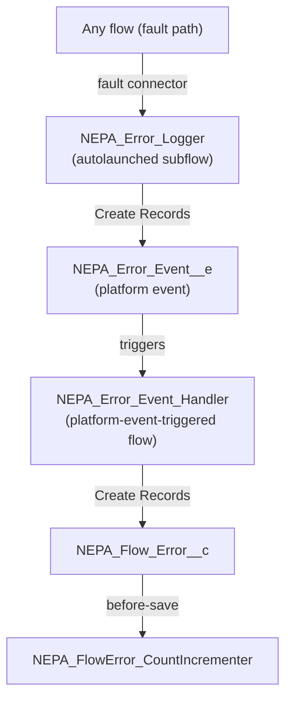
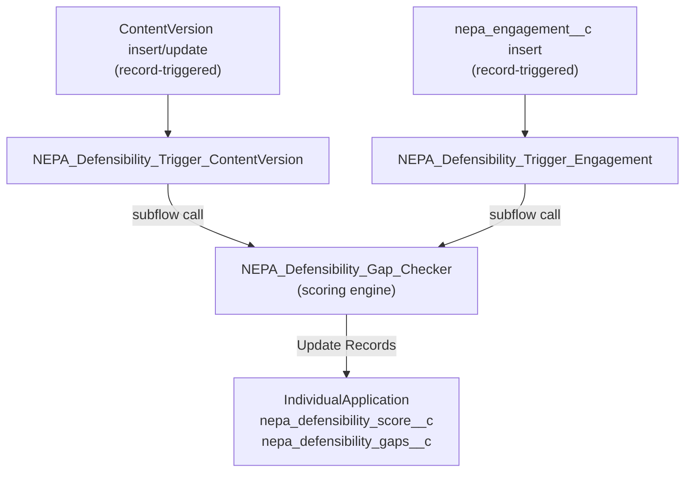

# NEPA Flow Architecture

40 flows total. This document explains the three non-obvious structural patterns — why the error handling, stage gate, and defensibility scoring are split the way they are.

---

## 1. Error Chain

**Why platform events, not direct DML:** A fault path fires inside a transaction that has already rolled back. Any `Create Records` targeting a custom object in that same transaction would also roll back, losing the error record. A platform event is published outside the current transaction boundary, so the event and the resulting `NEPA_Flow_Error__c` record survive even when the originating flow transaction fails.

**How to add error handling to a new flow:** Add a fault connector from any data-changing element to a Subflow element calling `NEPA_Error_Logger`. Pass `{!$Flow.FaultMessage}` as the error message input. Do not wire the fault path back to the main flow — it is terminal.

---

## 2. Stage Gate Split

Two flows govern stage transitions on `IndividualApplication`, but they operate on different objects in different transaction phases:

| Flow | Trigger object | Phase | Responsibility |
|---|---|---|---|
| `NEPA_Stage_Gate` | `IndividualApplication` | Before-save | Blocks invalid stage transitions; enforces document gate via `NEPA_Stage_Gate_Doc_Check` |
| `NEPA_Stage_Gate_Orchestrator` | `ApplicationTimeline` | After-save (async) | Advances the process stage when a timeline event is completed |

**Why two flows instead of one:** Before-save fires before the record is written — the right place to block an invalid transition. After-save fires after the `ApplicationTimeline` completion event is committed — the right place to then progress the parent `IndividualApplication`. Combining both in one flow would require an after-save trigger on `IndividualApplication` doing a related-record update, which creates a re-entry loop. Splitting by object and phase keeps each flow in its correct governor limit context.

**NEPA_Stage_Gate_Doc_Check** is a third supporting subflow called by `NEPA_Stage_Gate`. It queries `ContentVersion` records linked to the process and returns whether the stage's document requirements are satisfied. Extracting it keeps the gate logic readable and makes the document check independently testable.

---

## 3. Defensibility Wrapper Pattern

**Why two thin wrappers and one engine:** The scoring logic (document coverage, engagement coverage, gap detection) is identical regardless of what triggered the recalculation. Duplicating it in each trigger flow would mean maintaining two copies. The wrappers exist only to: (1) detect the triggering event type, (2) resolve the parent `IndividualApplication` ID from either a `ContentDocumentLink` or `nepa_process__c` lookup, and (3) call the shared subflow.

**NEPA_Defensibility_Gap_Checker** itself is an autolaunched subflow. It takes `inp_ProcessId` as input, queries all linked documents and engagements in bulk (no Get Records in loops), computes `nepa_defensibility_score__c` (0–100), populates `nepa_defensibility_gaps__c` with a human-readable gap list, and writes both fields back to the `IndividualApplication` via a single Update Records element.

---

## Full Flow Inventory

| Flow | Type | Trigger / Entry |
|---|---|---|
| NEPA_ActionPlan_Launcher | Autolaunched | Invoked when IndividualApplication review type is determined; selects and creates the matching NEPA Action Plan Template |
| NEPA_Administrative_Record_Checker | Autolaunched subflow | Called from Stage Gate |
| NEPA_AdminRecord_AutoCreate | After-save | ContentVersion insert |
| NEPA_Agency_Tier_Setter | After-save | Program update (nepa_record_owner_agency__c change) |
| NEPA_CE_Determination_Router | After-save | IndividualApplication (CE pathway) |
| NEPA_CE_Intake | Before-save | IndividualApplication insert (CE) |
| NEPA_CE_Screener | After-save | IndividualApplication (CE, on update) |
| NEPA_Challenge_Predictor | After-save | IndividualApplication update (review type / sector / tribal flag change) |
| NEPA_Close_Administrative_Record | After-save (async) | IndividualApplication (nepa_review_type__c transitions to ROD or FONSI) |
| NEPA_Comment_AI_Router | After-save | PublicComplaint insert — entry point for Agentforce comment triage |
| NEPA_Comment_Duplicate_Check | Autolaunched | Called from comment triage; substring similarity within 30 days on same process |
| NEPA_Comment_Period_Gate | Before-save | IndividualApplication update |
| NEPA_Comment_ResponseTask_Creator | Autolaunched | Called from comment triage; creates high-priority Task for substantive comments |
| NEPA_Comment_Triage_Save | Autolaunched | Invoked from Apex / Agent |
| NEPA_Defensibility_Gap_Checker | Autolaunched subflow | Called from trigger wrappers |
| NEPA_Defensibility_Trigger_ContentVersion | After-save | ContentVersion insert/update |
| NEPA_Defensibility_Trigger_Engagement | After-save | nepa_engagement__c insert |
| NEPA_EIS_Section_Assembler | Autolaunched | Invoked from Agent |
| NEPA_EIS_Section_Draft_Trigger | After-save | ContentVersion insert (EIS) |
| NEPA_EJTribal_Router | Autolaunched | Called from comment triage; unconditional EJ/tribal keyword gate — routes to human queue, bypasses AI |
| NEPA_Error_Event_Handler | Platform-event triggered | NEPA_Error_Event__e |
| NEPA_Error_Logger | Autolaunched subflow | Called from fault connectors |
| NEPA_FlowError_CountIncrementer | Before-save | NEPA_Flow_Error__c insert |
| NEPA_FRA_Page_Limit_Setter | Before-save | ContentVersion insert (Final EA/EIS) |
| NEPA_GIS_Proximity_Check | Autolaunched subflow | Called from CE Screener — downstream OmniStudio Integration Procedure (`NEPA_GISProximityIP`) is backlog; see [ARCHITECTURE_DECISIONS.md — Appendix C](ARCHITECTURE_DECISIONS.md#appendix-c--omnistudio-backlog-detail) |
| NEPA_Litigation_Risk_Scorer | Autolaunched | Invoked from BRE / Agent |
| NEPA_Permit_Coordinator | Autolaunched | Invoked from Agent |
| NEPA_Plaintiff_Intelligence | After-save | PublicComplaint insert — writes plaintiff flags to both the comment record and the parent IndividualApplication |
| NEPA_Record_Completeness_Scorer | After-save | IndividualApplication update |
| NEPA_SLA_Due_Date_Setter | Before-save | ApplicationTimeline insert |
| NEPA_SLA_Escalation_Monitor | Scheduled | Daily on overdue ApplicationTimeline |
| NEPA_Stage_Gate | Before-save | IndividualApplication update |
| NEPA_Stage_Gate_Doc_Check | Autolaunched subflow | Called from Stage Gate |
| NEPA_Stage_Gate_Orchestrator | After-save | ApplicationTimeline (Completed) |
| NEPA_Team_Assembly_Orchestrator | After-save | IndividualApplication insert |
| NEPA_Timeline_Risk_Assessor | After-save | IndividualApplication update (stage change) |
| NEPA_BiOp_Reinitiation_Checker | After-save | Visit update — any of 5 nepa_reinit_*__c checkboxes set to true. If parent IA has active BiOp, creates High-priority ESA Coordinator Task and adds +12 to nepa_challenge_risk_delta__c (50 CFR §402.16) |
| NEPA_Permit_Issued_Schedule_Creator | After-save | nepa_required_permit__c (nepa_permit_status__c → Issued). Queries NEPA_Inspection_Schedule__mdt by permit type, queries NEPA_State_Risk_Profile__mdt via parent IA state code, bulk-creates Visit inspection tasks with statutory authority and state risk context |
| NEPA_PostDecision_Monitor_Scheduler | After-save | IndividualApplication (nepa_ar_locked__c → true / ROD-FONSI issuance). Queries NEPA_Required_Document__mdt for Stage_Required_By__c = Post-Decision records matching the review type; bulk-creates monitoring Tasks |
