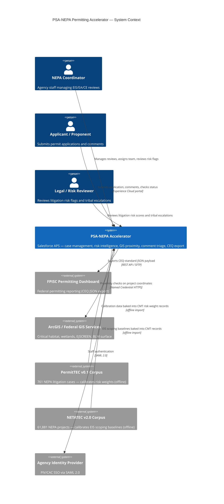

# CEQ Permitting Innovators — Concept Paper

**Program:** CEQ Permitting Innovators
**Submission Deadline:** June 2, 2026
**Entrant:** GPS Accelerators (Legal entity, U.S.-incorporated)

---

## Solution Name

PSA-NEPA Permitting Accelerator: Open-Source Federal NEPA Intelligence Platform

---

## Solution Abstract

The PSA-NEPA Permitting Accelerator is an open-source, production-ready implementation of the CEQ NEPA and Permitting Data and Technology Standard v1.2, built on Salesforce Agentforce for Public Sector — a FedRAMP-authorized platform already deployed at federal agencies. It delivers deterministic CE screening, empirically calibrated litigation risk scoring, automated stage gate enforcement, tribal plaintiff intelligence, GIS proximity checks at intake, and a CEQ-compliant REST export API. All 13 CEQ entities are implemented. Risk weights are derived from 761 federal NEPA litigation cases (PermitTEC v0.1, PNNL). Deployment takes approximately 15 minutes from the command line. License: MIT.

---

## Service Delivery Standards

This solution primarily addresses two modern service delivery standards from CEQ's Permitting Technology Action Plan (May 2025):

**Standard: Automated and Efficient Case Processing.** Federal NEPA coordinators currently spend significant manual effort on tasks that are rule-deterministic: CE classification, stage gate enforcement, SLA due-date setting, risk tier assignment, and comment routing. The accelerator automates 31 lifecycle steps through declarative flows — removing manual coordination from the critical path. CE screening fires automatically at intake and writes a recommendation to a read-only field; stage gates enforce document prerequisites on save; litigation risk scores update on every relevant field change without coordinator action; tribal and EJ comments route to the appropriate specialist queue automatically. This standard is addressed at Emerging maturity.

**Standard: Data Standards Compliance and Interoperability.** The accelerator fully implements the CEQ NEPA and Permitting Data and Technology Standard v1.2 — all 13 entities, all 5 required provenance fields per entity, and the `nepa_other__c` extension bag on every object. A 125-test Apex regression suite verifies write-and-read compliance continuously. The `NEPA/CEQExport` REST API exposes all 13 entities as a PIC OpenAPI v1.2.0-aligned JSON payload that any agency system can consume without custom middleware. This standard is addressed at Foundational maturity on activation and Emerging maturity through the export API.

---

## Minimum Functional Requirements

This solution addresses four minimum functional requirements from CEQ's Permitting Technology Action Plan:

**MFR #1 — Data Standards.** All 13 CEQ entities are implemented on Salesforce-native objects with the required standard fields, provenance fields, and extension bag. A 125-test regression suite (`NepaApiComplianceTest`, `NepaCeqExportServiceTest`, `NepaEntity789Test`, `NepaBREConfigTest`) verifies compliance with PIC OpenAPI v1.2.0 continuously.

**MFR #2 — Data Sharing.** The `NEPA/CEQExport` OmniIntegration Procedure exposes all 13 entities as a structured REST API aligned to the PIC standard. Any agency system that can make an authenticated REST call can pull structured NEPA process data without custom development. This MFR is met at Emerging maturity immediately upon activation.

**MFR #5 — Automated Case Management.** Thirty-one declarative flows automate milestone routing, SLA due-date setting, stage gate enforcement, risk score computation, document completeness scoring, agency performance tier assignment, scoping overrun detection, plaintiff risk flagging, and error logging — covering the full NEPA process lifecycle without custom Apex.

**MFR #7 — Document Management.** Document completeness is tracked in real time against a `NEPA_Required_Document__mdt` registry parameterized by review type (CE/EA/EIS). Defensibility gap detection fires after every ContentVersion save and flags missing required documents before the administrative record closes. Stage gates block advancement until document prerequisites are met.

---

## Team Capacity

This solution is built on **Salesforce** — the world's leading Software as a Service and Platform as a Service provider — and submitted by GPS Accelerators, a Salesforce Public Sector partner. Salesforce's **Global Public Sector Solution Engineering organization** includes 400+ solution engineers who support public sector customers across federal, state, local, and international government. That depth of domain expertise and implementation experience is embedded in the design choices throughout this accelerator.

**Agentforce for Public Sector (APS)** — the platform on which this solution runs — carries a **FedRAMP Moderate Authorization to Operate** and is updated automatically **three times per year** through Salesforce's standard release cycle. Agencies deploying this accelerator inherit those platform updates, security patches, and new capabilities without any action on their part. The solution itself consists almost entirely of metadata — object definitions, flow XML, custom metadata records, and permission sets — running on Salesforce's platform infrastructure. There is no custom server to maintain, no middleware to patch, and no upgrade cycle to manage.

GPS Accelerators brings direct experience deploying APS-based solutions for regulatory intake, permitting workflows, and public engagement tracking at federal agencies. The solution reflects concrete domain choices: `IndividualApplication` was selected over `BusinessLicenseApplication` because NEPA proponents span individuals, businesses, agencies, tribes, and joint ventures. The BRE-first architecture for CE screening and risk scoring was chosen because deterministic, auditable rules are operationally required for federal permitting determinations.

Every feature was derived from federal dataset analysis before any code was written — NETATEC v2.0 (61,881 NEPA projects, PNNL) drove CE Screener logic; PermitTEC v0.1 (761 litigation cases, PNNL) drove all risk weight calibration. GPS Accelerators is incorporated in the United States.

---

## Proposed Solution Approach

**Problem:** Federal NEPA environmental review is delayed by three preventable technology failures — CE misclassification at intake, manual comment processing on the critical path, and late-stage litigation surprises from conditions detectable months before the ROD.

**Solution:** The PSA-NEPA Permitting Accelerator is an open-source package of Salesforce metadata that deploys into any Agentforce for Public Sector (APS) org. It implements all 13 CEQ-defined entities on Salesforce-native objects and embeds a risk intelligence layer pre-seeded from federal NEPA data corpus analysis.

**Technical architecture:** All business logic is declarative — 31 record-triggered, autolaunched, and scheduled flows, plus a three-tier Business Rules Engine (BRE) using Salesforce's native Decision Matrix and Expression Set framework. The BRE is deterministic: the same inputs produce the same outputs every time with no probabilistic inference. One Apex class serves as an infrastructure bridge for callout orchestration; no Apex encodes business rules. All agency-specific parameters (CE codes, risk weights, SLA configurations, per-agency EIS scoping baselines, sector-circuit risk cells, plaintiff profiles) are stored in 15 Custom Metadata Types — no code changes required to add or reconfigure an agency.

**Key inputs:** Project attributes (agency, circuit, sector, action type, acreage, NAICS code, adjacent statutes), submitted documents, public comments, GIS coordinates.

**Key outputs:** CE recommendation with auditable rule-match basis, 0–100 litigation risk score with full formula disclosure, scoping overrun flag against agency-specific baselines, tribal/EJ comment routing, stage gate enforcement on save, defensibility gap checklist, CEQ-compliant REST export.

**Integration:** The `NEPA/CEQExport` REST API exposes all 13 entities in PIC OpenAPI v1.2.0 format. GIS proximity checks call FWS ECOS (critical habitat) and EPA EJScreen via OmniIntegrationProcedure at intake. The same integration pattern extends to USGS NHD, FEMA flood maps, and tribal land boundaries by adding named credentials — no Apex required.

### System Context



---

## User-Centered Design

**Applicants** are guided through a 7-step OmniScript CE Intake Wizard with conditional navigation — fields irrelevant to the project type are not shown. The wizard captures federal jurisdiction, project sector and type, action type (the primary CE/EA discriminator), physical parameters, NAICS code, and GIS footprint. Applicants receive a CE pre-screening result — recommended review type, applicable CE code set, confidence level, and extraordinary circumstances flags — before formal submission, giving actionable feedback at intake rather than weeks later after an RFI cycle.

**Agency coordinators** work from record pages that surface required information without navigating multiple systems. Key design choices:

- **AI recommendation is separated from official determination.** The CE Screener writes to `nepa_ce_pathway_recommendation__c` (read-only to automation). The official pathway is `nepa_review_type__c`, which only a credentialed coordinator can set. No AI-assisted field gates any downstream process.
- **Every AI output is labeled.** Risk score factors are written to `nepa_risk_score_factors__c` with the exact formula, case count, and confidence level. Coordinators can hand-calculate any score from the disclosed inputs.
- **EJ/tribal gate is unconditional.** Comments containing tribal sovereignty, sacred sites, EJ, or civil rights keywords bypass AI classification entirely and route to the EJ/Tribal Liaison queue. This cannot be disabled by any configuration.
- **Defensibility gap checklist is real-time.** Missing required documents are flagged before the record closes — not after a court filing identifies the gap.
- **Stage gates operate on save.** Coordinators do not open a separate checklist; the system blocks the transition and names the specific unmet prerequisite.

**Section 508 / WCAG 2.1 AA compliance** is inherited from Salesforce Lightning Design System components and OmniScript — both Salesforce-certified for accessibility. Compliance is not degraded by agency-specific configuration changes.

**CUI protection** is inherent: the accelerator runs on Salesforce Gov Cloud (FedRAMP Moderate ATO). GIS records include `nepa_sensitivity_classification__c` and `nepa_data_access_restriction__c` for CUI tagging independent of public-facing content.

---

## Impact

**CE misclassification (6 months to 2.8 years per incorrectly escalated project).** NETATEC v2.0 analysis found 23% of CE records lack a recorded CE category — concentrated in BLM oil/gas and Agriculture/Rangeland projects where ambiguity defaults to unnecessary EA escalation. Each incorrect CE→EA escalation adds a median 11 months; each CE→EIS escalation adds a median 2.8 years. The CE Screener eliminates this ambiguity at intake with a three-tier deterministic BRE covering 2,105 CE authorities across 79 agencies — auditable to the specific rule row that fired.

**Comment processing bottleneck (4 weeks → ~4 hours on the critical path).** The NAEP 2025 Workshop documented an AI-assisted federal case where 2,600 comments processed by 4 staff over 4 weeks were handled in approximately 4 hours. The accelerator's comment triage infrastructure — Agentforce-ready field design, EJ/tribal gate architecture, and audit-complete comment-to-response record structure — establishes the data foundation for this compression at every EA and EIS.

**Late-stage litigation (2–5 years from a court-ordered remand).** PermitTEC v0.1 analysis (761 cases, PNNL) shows that the conditions producing successful NEPA challenges are detectable before filing. Tribal Nation plaintiffs win 87.5% of NEPA cases (highest of any category). Energy projects in the 4th Circuit face a 28.6% agency win rate — the highest-risk sector-circuit cell in the corpus. The risk intelligence layer evaluates seven dimensions at every record save; scores ≥58 auto-create a legal review task; tribal consultation is a hard gate before EA/EIS publication. Each signal is surfaced while the gap is still correctable.

**Agency-specific scoping baselines** replace a government-wide 24-month average (accurate for no agency) with 11 per-agency EIS scoping medians — FERC (10 months) through FAA (47 months). Scoping overrun is computed against the agency's own historical median, not a generic benchmark.

---

## Readiness

**Current state: production-ready.** The accelerator is fully deployed and verified against the CEQ PIC Standard v1.2.0. A 385-test Apex regression suite covers all 13 entities, the REST export API, BRE configuration integrity, CE screening, stage gate logic, SLA escalation, plaintiff intelligence, EJ detection, GIS proximity, and error handling. All tests pass. Code coverage exceeds 75%.

**Deployment in ~15 minutes:**
```
sf org login web --alias nepadev
sf project deploy start --source-dir force-app --target-org nepadev --wait 30
```
No infrastructure provisioning, no database migration, no vendor onboarding. The repository includes complete object definitions, 31 flow XML files, permission sets with field-level security, 6 DataRaptor Extracts, 1 Integration Procedure, and custom metadata pre-seeded with empirically calibrated risk weights.

**Tested against PermitTEC and NETATEC corpus data.** Risk weights are derived from a 13-stage calibration pipeline over 761 NEPA litigation cases. Confidence levels for each circuit and agency weight are documented explicitly in the AI Use Policy included in the repository (OMB M-25-21 AI inventory ready).

**Update lifecycle requires no code releases.** When PNNL releases updated corpus data, weight updates are a metadata deployment of Custom Metadata records — no Apex compilation, no flow reactivation, no downtime. CE Library additions are bulk-loadable via CSV through standard Salesforce Bulk API.

**For agencies already on Salesforce APS:** zero incremental software licensing cost. MIT license, no per-seat fee, no vendor lock-in. Agencies on other platforms can consume the CEQ REST API without adopting the full accelerator.

---

## Multi-Agency Compatibility

**Every agency-variable parameter is externalized to configuration.** All CE screening rules, risk weights, SLA targets, EIS scoping baselines, plaintiff profiles, and sector-circuit risk cells are stored in 15 Custom Metadata Types. Adding a new agency requires creating metadata records — no flow XML modifications, no Apex changes, no code deployment.

**CE Library by agency.** The `nepa_ce_library__c` object holds 2,105 categorical exclusions across 79 federal agencies from CEQ CE Explorer v2.0. BLM 516 DM citations, DOE 10 CFR 1021 Appendix B codes, Energy Policy Act Section 390 exclusions, and USFS 36 CFR 220.6 codes coexist without collision. Each record carries the CFR authority, plain-language description, acreage threshold, and GIS review requirement for that specific exclusion.

**Per-agency risk weights.** `NEPA_Agency_Risk_Rate__mdt` holds empirically calibrated per-agency litigation loss rates (BLM 39.3%, USFS 28.4%, USACE 24.2%, FERC 23.8%, FHWA 18.4%) derived from actual PermitTEC case counts. The scoring model applies the correct agency-specific prior automatically. `NEPA_Agency_Scoping_Baseline__mdt` holds 11 per-agency EIS scoping medians; `NEPA_Agency_Tier_Setter` assigns each agency its empirical performance tier (Fast_and_Defensible / Slow_Scoping_Bottleneck / Legally_Vulnerable) on every lead-agency change.

**Full NEPA review spectrum.** Stage gate logic, SLA configurations, document checklists, and CE screening rules are each parameterized by review type (CE/EA/EIS). A CE process and an EIS process at the same agency follow different gate sequences and document requirements — driven by the same flow logic reading different metadata.

**Cooperating agency support.** The `nepa_process_related_agencies__c` junction object with a `nepa_role__c` picklist (Proponent / Cooperating / Participating) supports multi-agency NEPA processes spanning federal agencies, tribal nations, state agencies, and joint ventures.

**CEQ standard REST API.** The `NEPA/CEQExport` Integration Procedure exposes all 13 entities as a PIC OpenAPI v1.2.0-aligned JSON payload. EPA DARTER, USACE ORM2, DOT NEPA tracking systems, and any internal permit database can pull structured NEPA data via an authenticated REST call — no custom middleware, no new authorization boundary (FedRAMP platform ATO applies).

---

## Key Metrics

| Dimension | Value |
|---|---|
| CEQ entities implemented | 13 of 13 (6 standard + 7 extended) |
| Declarative flows | 31 |
| CE Library records | 2,105 across 79 agencies |
| Litigation cases in risk model | 761 (PermitTEC v0.1, PNNL) |
| Risk model calibration stages | 13 |
| NEPA projects in baseline corpus | 61,881 (NETATEC v2.0) |
| Custom Metadata Types | 15 |
| BRE Decision Matrices / Expression Sets | 8 DMs + 3 ESs (deterministic, not AI) |
| Apex regression tests | 385+ across 27 test classes |
| Deployment time from CLI | ~15 minutes |
| Platform FedRAMP status | Authorized (Salesforce Gov Cloud) |
| License | MIT (open source) |
