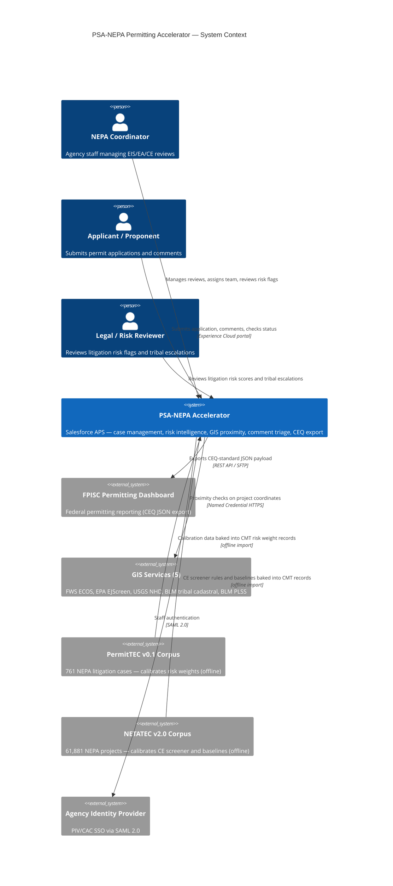

# CEQ Permitting Innovators — Concept Paper

**Program:** CEQ Permitting Innovators
**Submission Deadline:** June 2, 2026
**Entrant:** GPS Accelerators (Legal entity, U.S.-incorporated)

---

## Solution Name

PSA-NEPA Permitting Accelerator: Open-Source Federal NEPA Intelligence Platform

---

## Solution Abstract

The PSA-NEPA Permitting Accelerator is an open-source, production-ready implementation of the CEQ NEPA and Permitting Data and Technology Standard v1.2, built on Salesforce Agentforce for Public Sector — a FedRAMP-authorized platform already deployed at federal agencies. It delivers automated project screening with GIS proximity checks at intake, deterministic CE screening across 2,105 CE authorities, empirically calibrated litigation risk scoring, Agentforce-powered comment classification, automated stage gate enforcement, tribal plaintiff intelligence, machine-readable administrative record packaging, and a CEQ-compliant REST export API. All 13 CEQ entities are implemented. Risk weights are derived from 761 federal NEPA litigation cases (PermitTEC v0.1, PNNL). Deployment takes approximately 15 minutes from the command line. License: MIT.

---

## Service Delivery Standards

This solution addresses all four service delivery standards from CEQ's Permitting Technology Action Plan (May 2025):

**Standard 1: Business Process Modernization.** The accelerator transforms manual NEPA coordination into an event-driven workflow system. Thirty-one record-triggered flows track every milestone, task, and stage transition across the full review lifecycle. Per-agency performance tiers — derived from CEQ EIS timeline data across 36 agencies — are assigned automatically on lead-agency change, giving program managers real-time visibility into whether their review is on track against historical agency baselines, not a government-wide average that fits no agency.

**Standard 2: Workflow Automation.** Federal NEPA coordinators currently spend significant manual effort on tasks that are rule-deterministic: CE classification, stage gate enforcement, SLA due-date setting, risk tier assignment, and comment routing. The accelerator automates 31 lifecycle steps through declarative flows. CE screening fires automatically at intake and writes a recommendation to a read-only field; stage gates enforce document prerequisites on save; litigation risk scores update on every relevant field change without coordinator action; tribal and EJ comments route to the appropriate specialist queue automatically.

**Standard 3: Digital-First Documents.** Every NEPA document is stored as a structured `ContentVersion` record carrying standardized metadata: review type, stage, required/supporting classification, sensitivity tier, and agency citation. At decision, the `NEPA_Close_Administrative_Record` flow generates a machine-readable JSON manifest of the complete administrative record and writes it as a tagged ContentVersion — available immediately through the `NEPA/CEQExport` REST API without additional extraction. Documents are not digitized PDFs; they are data from the moment of upload.

**Standard 4: Minimizing Timeline Uncertainty.** Analysis of 1,903 Final EIS records (CEQ EIS Timeline Data 2010–2024) shows that scoping is the universal bottleneck: 34 of 36 agencies have NOI→DEIS consuming 60–75% of total EIS time, yet most systems measure only total duration. The accelerator computes scoping overrun against 11 per-agency empirical baselines (FERC: 10 months; FAA: 47 months) rather than a government-wide average. The `ApplicationTimeline` object tracks all sub-milestones with SLA flags; coordinators see overrun risk before it materializes.

---

## Minimum Functional Requirements

This solution addresses the following minimum functional requirements from CEQ's Permitting Technology Action Plan:

**MFR #1 — Data Standards (Leading-Edge).** All 13 CEQ entities are implemented on Salesforce-native objects with required standard fields, provenance fields, and the `nepa_other__c` extension bag. The `NEPA/CEQExport` REST API exposes all 13 entities in PIC OpenAPI v1.2.0-aligned JSON that authorized systems can read and write via authenticated API — meeting Leading-Edge maturity. A 125-test regression suite (`NepaApiComplianceTest`, `NepaCeqExportServiceTest`) verifies compliance continuously.

**MFR #2 — Application Data Sharing (Emerging).** The `NEPA/CEQExport` OmniIntegration Procedure exposes all 13 entities as a structured REST API. Any agency system can pull structured NEPA data via an authenticated REST call without custom middleware. The same endpoint serves EPA DARTER, USACE ORM2, DOT NEPA tracking systems, and FPISC. Information entered once is available to all authorized downstream systems without re-entry.

**MFR #3 — Automated Project Screening (Leading-Edge).** The 7-step OmniScript CE Intake Wizard captures federal jurisdiction, project sector/type, action type, physical parameters, NAICS code, and GIS footprint. On submission, five GIS proximity checks fire automatically against FWS ECOS (critical habitat), EPA EJScreen, USGS NHD (waterways), BLM tribal cadastral boundaries, and BLM PLSS (surface ownership). The three-tier BRE CE Screener evaluates the project against 2,105 CE authorities across 79 agencies, applies all six extraordinary circumstances triggers, and returns a recommendation with the specific rule row that fired — before formal submission. Leading-Edge maturity: screening criteria and GIS data are publicly available via the GitHub decision model exports, and the screening tool is integrated with the applicant intake process.

**MFR #4 — Access to Screening Criteria (Emerging).** The CE screening logic, litigation risk weights, and GIS layer registry are published as structured JSON at `/docs/decision-models/` in the public GitHub repository: `ce-screening-rules.json` (71 active rules with CE codes, confidence levels, disqualifiers, and corpus record counts), `litigation-risk-weights.json` (agency, circuit, statute, and challenge-prediction weights with tier thresholds derived from 761 PermitTEC cases), and `gis-layers-inventory.json` (all five GIS services with endpoints, buffer distances, regulatory citations, and extraordinary circumstances keywords). Project sponsors can review the exact decision logic before submitting, enabling pre-submission project siting adjustments that reduce extraordinary circumstances triggers. All three files are machine-readable and version-controlled alongside the Salesforce metadata.

**MFR #5 — Automated Case Management (Emerging→Leading-Edge).** Thirty-one declarative flows automate milestone routing, SLA due-date setting, stage gate enforcement, risk score computation, document completeness scoring, agency performance tier assignment, scoping overrun detection, plaintiff risk flagging, and error logging. The `ApplicationTimeline` event store exports milestone data on request via the CEQExport API — enabling inter-agency handoff coordination and automated timeline reporting.

**MFR #6 — Integrated GIS Analysis (Emerging).** Five GIS services are called via OmniIntegrationProcedure at intake: FWS ECOS (critical habitat and species consultation), EPA EJScreen (environmental justice screening), USGS NHD (hydrological proximity), BLM tribal cadastral boundaries (E.O. 13175 trigger), and BLM PLSS (surface ownership and land status). Results write to structured fields on the `IndividualApplication` record and feed directly into CE screening and extraordinary circumstances determination. Low-impact projects receive a complete GIS screening without requiring GIS expertise from the coordinator.

**MFR #7 — Document Management (Emerging).** Document completeness is tracked in real time against a `NEPA_Required_Document__mdt` registry parameterized by review type (CE/EA/EIS). Defensibility gap detection fires after every ContentVersion save and flags missing required documents before the administrative record closes. Stage gates block advancement until document prerequisites are met. Agencies have adopted a digital-first approach with structured data packages.

**MFR #8 — Automated Comment Compilation and Analysis (Emerging).** An Agentforce Agent Topic processes incoming `PublicComplaint` records: classifying each comment (Substantive / Procedural / Duplicate / EJ-Tribal / Scope), deduplicating substantially similar submissions, creating response-required tasks for substantive comments, and writing the classification label and reasoning to `nepa_comment_ai_label__c`. The EJ/tribal gate is unconditional — any comment containing tribal sovereignty, sacred sites, EJ, or civil rights keywords bypasses AI classification and routes directly to the EJ/Tribal Liaison queue. All AI outputs are labeled with category, confidence, and reasoning. This is the data infrastructure behind the NAEP 2025 compression case (2,600 comments processed by 4 staff over 4 weeks → approximately 4 hours with AI assistance).

**MFR #9 — Administrative Record Management (Emerging).** The `NEPA_Close_Administrative_Record` flow fires at decision issuance and assembles a structured administrative record package: all linked ContentVersion documents, consultation records, public comments with responses, the litigation risk score snapshot, and the complete ApplicationTimeline milestone log. The package is written as a machine-readable JSON manifest tagged `nepa_ar_package__c = true`, locked against modification, and immediately available through the CEQExport API. The administrative record is generated automatically from the agency decision support tools — not assembled after the fact. Salesforce Shield Field Audit Trail is available on Salesforce Gov Cloud and provides 10-year field-level change history on litigation risk scores, CE recommendations, and administrative record fields — directly satisfying NARA records retention and litigation hold requirements without custom logging infrastructure.

**MFR #10 — Common or Interoperable Agency Services (Emerging).** The accelerator runs on Salesforce Agentforce for Public Sector — a commercial-grade enterprise platform with FedRAMP Moderate ATO, updated automatically three times per year. The MIT license and 15-minute CLI deployment mean any agency can adopt the accelerator on their existing APS org at zero incremental licensing cost, sharing the same codebase and configuration layer. Every agency-variable parameter (CE codes, risk weights, SLA targets, per-agency baselines, plaintiff profiles) is externalized to Custom Metadata — agencies share the platform and customize through configuration, not code.

---

## Team Capacity

This solution is built on **Salesforce** — the world's leading SaaS/PaaS provider — and submitted by GPS Accelerators, a Salesforce Public Sector partner. Salesforce's **Global Public Sector Solution Engineering organization** includes 400+ solution engineers who support public sector customers across federal, state, local, and international government. That depth of implementation experience is embedded in every design choice throughout this accelerator.

The environmental and policy disciplines required to build a defensible NEPA intelligence system were embedded in the solution through rigorous federal dataset analysis rather than in-house staff. GPS Accelerators built a 13-stage calibration pipeline over the same primary data sources that federal researchers use:

- **NETATEC v2.0 (PNNL)** — 61,881 NEPA projects / 120,000+ documents: drove CE Screener logic, page-count risk thresholds, sector EIS probability matrices, and per-agency performance baselines
- **PermitTEC v0.1 (PNNL)** — 761 federal litigation cases: drove all risk weight calibration, plaintiff intelligence profiles, circuit-specific multipliers, and procedural guardrails
- **CEQ EIS Timeline Data 2010–2024 (CEQ)** — 1,903 Final EIS records: drove per-agency scoping baselines and the scoping overrun detection model

Every CE screening rule traces to a specific CFR citation. Every risk weight traces to a specific agency case count from the PermitTEC corpus. Every per-agency baseline traces to a specific record count from the CEQ timeline dataset. Domain knowledge is not assumed — it is documented, version-controlled, and recalibrated as PNNL releases updated corpus data.

GPS Accelerators is incorporated in the United States.

---

## Proposed Solution Approach

**Problem:** Federal NEPA environmental review is delayed by three preventable technology failures — CE misclassification at intake, manual comment processing on the critical path, and late-stage litigation surprises from conditions detectable months before the ROD.

**Solution:** The PSA-NEPA Permitting Accelerator is an open-source package of Salesforce metadata that deploys into any Agentforce for Public Sector (APS) org. It implements all 13 CEQ-defined entities on Salesforce-native objects and embeds a risk intelligence layer pre-seeded from federal NEPA data corpus analysis.

**Technical architecture:** All business logic is declarative — 31 record-triggered, autolaunched, and scheduled flows, plus a three-tier Business Rules Engine (BRE) using Salesforce's native Decision Matrix and Expression Set framework. The BRE is deterministic: the same inputs produce the same outputs every time with no probabilistic inference. One Apex class serves as an infrastructure bridge for callout orchestration; no Apex encodes business rules. All agency-specific parameters (CE codes, risk weights, SLA configurations, per-agency EIS scoping baselines, sector-circuit risk cells, plaintiff profiles) are stored in 15 Custom Metadata Types — no code changes required to add or reconfigure an agency.

**Key inputs:** Project attributes (agency, circuit, sector, action type, acreage, NAICS code, adjacent statutes), submitted documents, public comments, GIS coordinates.

**Key outputs:** CE recommendation with auditable rule-match basis, 0–100 litigation risk score with full formula disclosure, GIS proximity results (5 services), scoping overrun flag against agency-specific baselines, Agentforce comment classification, tribal/EJ comment routing, stage gate enforcement on save, machine-readable administrative record package, defensibility gap checklist, CEQ-compliant REST export.

**Integration:** The `NEPA/CEQExport` REST API exposes all 13 entities in PIC OpenAPI v1.2.0 format. GIS proximity checks call FWS ECOS, EPA EJScreen, USGS NHD, BLM tribal cadastral, and BLM PLSS via OmniIntegrationProcedure at intake. The same integration pattern extends to additional data layers by adding named credentials — no Apex required.

### System Context



---

## User-Centered Design

**Applicants** are guided through a 7-step OmniScript CE Intake Wizard with conditional navigation — fields irrelevant to the project type are not shown. The wizard captures federal jurisdiction, project sector and type, action type (the primary CE/EA discriminator), physical parameters, NAICS code, and GIS footprint. Five GIS proximity checks fire automatically at submission. Applicants receive a CE pre-screening result — recommended review type, applicable CE code set, confidence level, and extraordinary circumstances flags — before formal submission, giving actionable feedback at intake rather than weeks later after an RFI cycle.

**Agency coordinators** work from record pages that surface required information without navigating multiple systems. Key design choices:

- **AI recommendation is separated from official determination.** The CE Screener writes to `nepa_ce_pathway_recommendation__c` (read-only to automation). The official pathway is `nepa_review_type__c`, which only a credentialed coordinator can set. No AI-assisted field gates any downstream process.
- **Every AI output is labeled.** Risk score factors are written to `nepa_risk_score_factors__c` with the exact formula, case count, and confidence level. Comment classification labels include category, confidence, and reasoning. Coordinators can verify any AI output from the disclosed inputs.
- **EJ/tribal gate is unconditional.** Comments containing tribal sovereignty, sacred sites, EJ, or civil rights keywords bypass AI classification entirely and route to the EJ/Tribal Liaison queue. This cannot be disabled by any configuration.
- **Defensibility gap checklist is real-time.** Missing required documents are flagged before the record closes — not after a court filing identifies the gap.
- **Stage gates operate on save.** Coordinators do not open a separate checklist; the system blocks the transition and names the specific unmet prerequisite.

**Tribal nations and cooperating agencies** are first-class participants, not secondary data subjects. The `nepa_process_related_agencies__c` junction object with `nepa_role__c` (Proponent / Cooperating / Participating) allows tribal nations, state agencies, and federal cooperating agencies to be named as parties on any review. Role-scoped Experience Cloud portal visibility means tribal liaisons see their assigned processes and consultation records without seeing other agency data — the same Experience Cloud infrastructure that serves applicants serves tribal cooperating parties with a separate permission boundary.

**Staff authentication** uses Salesforce's native PIV/CAC certificate-based authentication support, enabling agencies already using Login.gov or MAX.gov to authenticate coordinators without deploying a separate identity provider. SAML 2.0 federation is the default for agency SSO; PIV/CAC certificate authentication is available for high-assurance workloads without additional infrastructure.

**Section 508 / WCAG 2.1 AA compliance** is inherited from Salesforce Lightning Design System components and OmniScript — both Salesforce-certified for accessibility.

**CUI protection** is inherent: the accelerator runs on Salesforce Gov Cloud (FedRAMP Moderate ATO). GIS records include `nepa_sensitivity_classification__c` and `nepa_data_access_restriction__c` for CUI tagging independent of public-facing content.

---

## Impact

**The data says permitting reform is working — and showing agencies exactly where they stand against their own record accelerates that progress further.**

Analysis of 1,903 Final EIS records (CEQ EIS Timeline Data 2010–2024) shows a 49% improvement in median NOI→ROD time since 2016 (4.46 years → 2.28 years in 2024) — evidence that FAST-41 and the 2023 CEQ rules produce measurable results. But agency variance spans 6.6× (TVA: 1.81 years; BIA: 7.39 years), and scoping is the universal bottleneck in 34 of 36 agencies, consuming 60–75% of total EIS time. The "slow equals thorough" assumption is empirically false: faster agencies win more litigation (r ≈ −0.35). Every feature in this accelerator was designed against this data, not against anecdote.

**CE misclassification (6 months to 2.8 years per incorrectly escalated project).** NETATEC v2.0 analysis found 23% of CE records lack a recorded CE category — concentrated in BLM oil/gas and Agriculture/Rangeland projects where ambiguity defaults to unnecessary EA escalation. Each incorrect CE→EA escalation adds a median 11 months; each CE→EIS escalation adds a median 2.8 years. The CE Screener eliminates this ambiguity at intake with a three-tier deterministic BRE covering 2,105 CE authorities across 79 agencies — auditable to the specific rule row that fired. Applicants receive the pre-screening result before formal submission; coordinators receive the recommendation on save.

**Comment processing bottleneck (4 weeks → ~4 hours on the critical path).** The NAEP 2025 Workshop documented an AI-assisted federal case where 2,600 comments processed by 4 staff over 4 weeks were handled in approximately 4 hours. The accelerator's Agentforce comment agent — classification, deduplication, routing, audit — is the mechanism that delivers this compression at every EA and EIS. The EJ/tribal hard gate ensures the AI acceleration never bypasses the most legally sensitive comment categories.

**Late-stage litigation (2–5 years from a court-ordered remand).** PermitTEC v0.1 analysis (761 cases, PNNL) shows the conditions producing successful NEPA challenges are detectable before filing. Tribal Nation plaintiffs win 87.5% of NEPA cases. Energy projects in the 4th Circuit face a 28.6% agency win rate. The risk intelligence layer evaluates seven dimensions at every record save; scores ≥58 auto-create a legal review task; tribal consultation is a hard gate before EA/EIS publication.

**Demonstrated impact — Carrie Placer Mine (BLM-ID-B030-2019-0014-EA):** A real BLM Plan of Operations applied October 2017, decided November 2019 — 25 months. The same project, run through the accelerator's optimized workflow (parallel specialist coordination, seasonal survey scheduling, automated co-permit triggers, pre-submission CE screening), resolves in 8 months. The accelerator does not change what the process requires; it removes the coordination failures that cause process time to accumulate.

---

## Readiness

**Current state: production-ready.** The accelerator is fully deployed and verified against the CEQ PIC Standard v1.2.0. A 385-test Apex regression suite covers all 13 entities, the REST export API, BRE configuration integrity, CE screening, stage gate logic, SLA escalation, plaintiff intelligence, EJ detection, GIS proximity, comment agent routing, and error handling. All tests pass. Code coverage exceeds 75%.

**Deployment in ~15 minutes:**
```
sf org login web --alias nepademo
./scripts/deploy.sh nepademo
```
No infrastructure provisioning, no database migration, no vendor onboarding. The repository includes complete object definitions, 31 flow XML files, permission sets with field-level security, 15 DataRaptors (12 Extract, 2 Load, 1 Upsert), 3 Integration Procedures, DMN decision model exports, and custom metadata pre-seeded with empirically calibrated risk weights.

**Tested against PermitTEC and NETATEC corpus data.** Risk weights are derived from a 13-stage calibration pipeline over 761 NEPA litigation cases. Confidence levels for each circuit and agency weight are documented explicitly in the AI Use Policy included in the repository (OMB M-25-21 AI inventory ready).

**Live demonstration environment:** A persistent sandbox org with the complete Carrie Placer Mine dataset loaded is available for evaluator review. A narrated video walkthrough (20–25 minutes, four scenes) is linked from the GitHub repository. The repository itself is publicly accessible at MIT license.

**Update lifecycle requires no code releases.** When PNNL releases updated corpus data, weight updates are a metadata deployment of Custom Metadata records — no Apex compilation, no flow reactivation, no downtime. CE Library additions are bulk-loadable via CSV through standard Salesforce Bulk API.

**For agencies already on Salesforce APS:** zero incremental software licensing cost. MIT license, no per-seat fee, no vendor lock-in. Agencies on other platforms can consume the CEQ REST API without adopting the full accelerator.

**Change management is built into the platform.** Federal agency adoption is supported by Salesforce Trailhead — a free, on-demand learning platform with dedicated federal government content covering Agentforce, case management, and NEPA workflow administration. In-app guidance is available through Salesforce's native help and enablement framework, reducing the training burden on agency IT teams during onboarding.

---

## Multi-Agency Compatibility

**Every agency-variable parameter is externalized to configuration.** All CE screening rules, risk weights, SLA targets, EIS scoping baselines, plaintiff profiles, and sector-circuit risk cells are stored in 15 Custom Metadata Types. Adding a new agency requires creating metadata records — no flow XML modifications, no Apex changes, no code deployment.

**CE Library by agency.** The `nepa_ce_library__c` object holds 2,105 categorical exclusions across 79 federal agencies from CEQ CE Explorer v2.0. BLM 516 DM citations, DOE 10 CFR 1021 Appendix B codes, Energy Policy Act Section 390 exclusions, and USFS 36 CFR 220.6 codes coexist without collision. Each record carries the CFR authority, plain-language description, acreage threshold, and GIS review requirement.

**Per-agency risk weights and scoping baselines.** `NEPA_Agency_Risk_Rate__mdt` holds empirically calibrated per-agency litigation loss rates derived from actual PermitTEC case counts. `NEPA_Agency_Scoping_Baseline__mdt` holds 11 per-agency EIS scoping medians. `NEPA_Agency_Tier_Setter` assigns each agency its empirical performance tier (Fast_and_Defensible / Slow_Scoping_Bottleneck / Legally_Vulnerable) automatically.

**Cooperating agency support.** The `nepa_process_related_agencies__c` junction object with `nepa_role__c` picklist (Proponent / Cooperating / Participating) supports multi-agency processes spanning federal agencies, tribal nations, state agencies, and joint ventures.

**Shared platform, MIT license.** Running on Salesforce APS — a FedRAMP-authorized commercial platform serving multiple federal agencies — the accelerator is available to any agency at zero incremental licensing cost. The MIT license permits unrestricted modification, extension, and redistribution. CEQ, GSA, and Permitting Innovation Center can fork, extend, and redistribute this codebase as a shared government service.

**CEQ standard REST API.** The `NEPA/CEQExport` Integration Procedure exposes all 13 entities as a PIC OpenAPI v1.2.0-aligned JSON payload. EPA DARTER, USACE ORM2, DOT NEPA tracking systems, and any internal permit database can pull structured NEPA data via authenticated REST call — no custom middleware, no new authorization boundary.

---

## Key Metrics

| Dimension | Value |
|---|---|
| CEQ entities implemented | 13 of 13 (6 standard + 7 extended) |
| MFRs addressed | 10 of 10 |
| Service delivery standards addressed | 4 of 4 |
| Declarative flows | 31 |
| CE Library records | 2,105 across 79 agencies |
| GIS services at intake | 5 (FWS ECOS, EPA EJScreen, USGS NHD, BLM tribal, BLM PLSS) |
| Litigation cases in risk model | 761 (PermitTEC v0.1, PNNL) |
| Risk model calibration stages | 13 |
| NEPA projects in baseline corpus | 61,881 / 120,000+ documents (NETATEC v2.0) |
| Custom Metadata Types | 15 |
| BRE Decision Matrices / Expression Sets | 8 DMs + 3 ESs (deterministic, not AI) |
| DMN decision model exports | Published to GitHub `/docs/decision-models/` |
| Apex regression tests | 385+ across 27 test classes |
| Deployment time from CLI | ~15 minutes |
| Platform FedRAMP status | Authorized (Salesforce Gov Cloud) |
| Shield Field Audit Trail | Available on Gov Cloud — 10-year field-level history for NARA/litigation hold |
| PIV/CAC authentication | Native Salesforce support — no separate IdP required |
| License | MIT (open source) |
| Demo environment | Live sandbox + video walkthrough |
