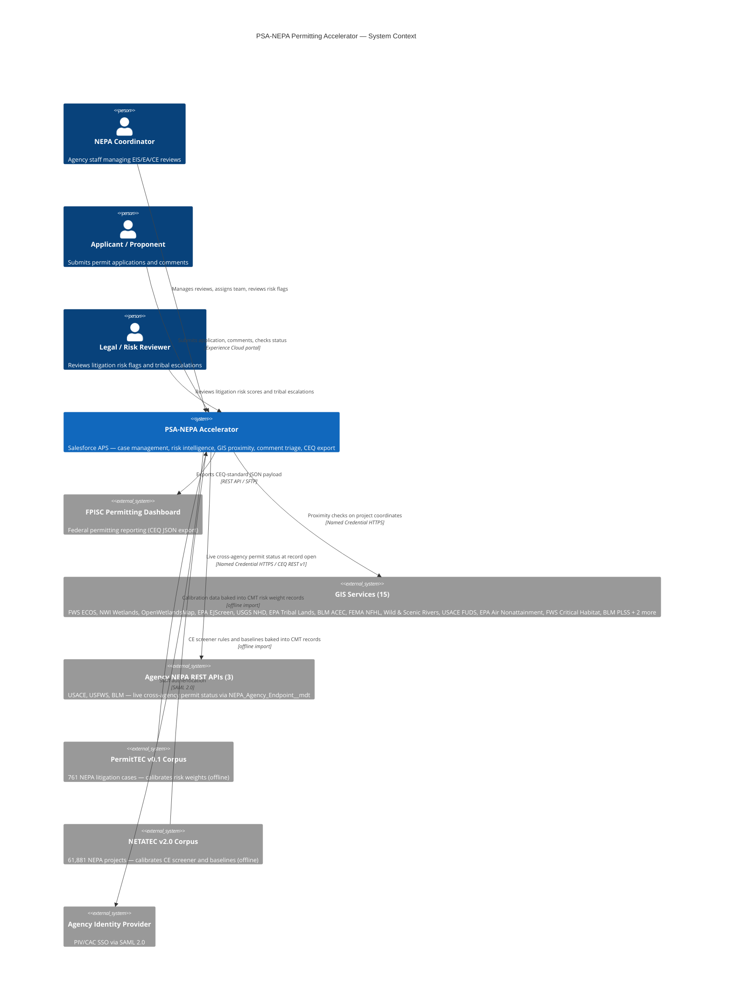

# CEQ Permitting Innovators — Concept Paper

**Program:** CEQ Permitting Innovators
**Submission Deadline:** June 2, 2026
**Entrant:** Shannon Schupbach (U.S.-incorporated)

---

## Solution Name

PSA-NEPA Permitting Accelerator: Open-Source Federal NEPA Intelligence Platform

---

## Solution Abstract

The PSA-NEPA Permitting Accelerator is an open-source, production-ready implementation of the CEQ NEPA and Permitting Data and Technology Standard v1.2, built on Salesforce Agentforce for Public Sector — a FedRAMP-authorized platform already deployed at federal agencies. It delivers automated project screening with GIS proximity checks at intake, deterministic CE screening across 2,105 CE authorities, empirically calibrated litigation risk scoring, Agentforce-powered comment classification, automated stage gate enforcement, tribal plaintiff intelligence, machine-readable administrative record packaging, live cross-agency permit status via the CEQ NEPA REST API, and a CEQ-compliant REST export API. All 13 CEQ entities are implemented plus a structured cross-agency Permits entity (`nepa_required_permit__c`). Risk weights are derived from 761 federal NEPA litigation cases (PermitTEC v0.1, PNNL). Deployment takes approximately 15 minutes from the command line. License: MIT.

Mapped to EPIC's Nine Types of Permitting Reform: the accelerator directly advances **Faster Government** (stage gate automation, SLA monitoring, scoping overrun detection), **Technology** (Agentforce AI, BRE deterministic logic, 15-service GIS intake), **Unlocking Finance** (cross-permit critical-path identification reduces time-to-permit, removing a common financing barrier), and **Supporting Communities** (unconditional EJ/tribal routing, E.O. 13175 consultation gates, and tribal plaintiff intelligence built from the PermitTEC corpus).

---

## Service Delivery Standards

This solution addresses all four service delivery standards from CEQ's Permitting Technology Action Plan (May 2025):

**Standard 1: Business Process Modernization.** The accelerator transforms manual NEPA coordination into an event-driven workflow system. Forty declarative flows track every milestone, task, and stage transition across the full review lifecycle. Per-agency performance tiers — derived from CEQ EIS timeline data across 36 agencies — are assigned automatically on lead-agency change, giving program managers real-time visibility into whether their review is on track against historical agency baselines, not a government-wide average that fits no agency.

**Standard 2: Workflow Automation.** Federal NEPA coordinators currently spend significant manual effort on tasks that are rule-deterministic: CE classification, stage gate enforcement, SLA due-date setting, risk tier assignment, and comment routing. The accelerator automates 40 lifecycle steps through declarative flows. CE screening fires automatically at intake and writes a recommendation to a read-only field; stage gates enforce document prerequisites on save; litigation risk scores update on every relevant field change without coordinator action; tribal and EJ comments route to the appropriate specialist queue automatically.

**Standard 3: Digital-First Documents.** Every NEPA document is stored as a structured `ContentVersion` record carrying standardized metadata: review type, stage, required/supporting classification, sensitivity tier, and agency citation. At decision, the `NEPA_Close_Administrative_Record` flow generates a machine-readable JSON manifest of the complete administrative record and writes it as a tagged ContentVersion — available immediately through the `NEPA/CEQExport` REST API without additional extraction. Documents are not digitized PDFs; they are data from the moment of upload.

**Standard 4: Minimizing Timeline Uncertainty.** Analysis of 1,903 Final EIS records (CEQ EIS Timeline Data 2010–2024) shows that scoping is the universal bottleneck: 34 of 36 agencies have NOI→DEIS consuming 60–75% of total EIS time, yet most systems measure only total duration. The accelerator computes scoping overrun against 11 per-agency empirical baselines (FERC: 10 months; FAA: 47 months) rather than a government-wide average. The `ApplicationTimeline` object tracks all sub-milestones with SLA flags; coordinators see overrun risk before it materializes.

One Federal Decision coordination tracking (IMP-006) operationalizes the Stage 16 finding that federal-state friction accounts for 1.09×–1.65× of timeline overhead by sector (Military 1.65×, Water/Coastal 1.47×, Transportation 1.45×, Energy 1.09× vs. California CEQA baseline). The OFD tracker converts E.O. 13807's master-schedule requirement into a live record view: each cooperating agency's milestones are tracked on the same `ApplicationTimeline` object, with track classification (NEPA_Lead, Agency_Consultation, Permit_Milestone, Joint_ROD) enabling dashboard filtering by bottleneck type. `NEPA_OFD_Milestone__mdt` pre-seeds 8 standard E.O. 13807 milestones — coordinators inherit a pre-structured master schedule at case creation and customize timing to their project. The Water/Coastal friction finding (1.47×) is operationalized as a pre-loaded Permit_Milestone for USACE Section 404 pre-application meeting, surfacing the CZMA/EFH dual-track review as a critical-path milestone before the EA is drafted.

---

## Minimum Functional Requirements

This solution addresses the following minimum functional requirements from CEQ's Permitting Technology Action Plan:

**MFR #1 — Data Standards (Leading-Edge).** All 13 CEQ entities are implemented on Salesforce-native objects with required standard fields, provenance fields, and the `nepa_other__c` extension bag. The `NEPA/CEQExport` REST API exposes all 13 entities in PIC OpenAPI v1.2.0-aligned JSON; authorized systems can read all 13 entities via the REST endpoint, and agency systems with write-back needs use the included Upsert DataRaptor integration — meeting Leading-Edge maturity. A 125-test regression suite (`NepaApiComplianceTest`, `NepaCeqExportServiceTest`) verifies compliance continuously.

**MFR #2 — Application Data Sharing (Emerging).** The `NEPA/CEQExport` OmniIntegration Procedure exposes all 13 entities as a structured REST API, including a `permits[]` array under each process node — providing structured dependent permit data to consuming systems. The CEQExport API provides the structured payload that eliminates the data-extraction problem from NEPA workflow software; each consuming agency's integration layer handles schema mapping to their internal systems — no data extraction from the NEPA platform is required. The same endpoint serves EPA DARTER, USACE ORM2, DOT NEPA tracking systems, and FPISC. Information entered once is available to all authorized downstream systems without re-entry.

**MFR #3 — Automated Project Screening (Leading-Edge).** The 7-step OmniScript CE Intake Wizard captures federal jurisdiction, project sector/type, action type, physical parameters, NAICS code, and GIS footprint. On submission, GIS proximity checks fire automatically against all active layers in the `NEPA_GIS_Layer__mdt` registry (15 services). The three-tier BRE CE Screener evaluates the project against 2,105 CE authorities across 79 agencies, applies all six extraordinary circumstances triggers, and returns a recommendation with the specific rule row that fired — before formal submission. Leading-Edge maturity: screening criteria and GIS data are publicly available via the GitHub decision model exports, and the screening tool is integrated with the applicant intake process.

**MFR #4 — Access to Screening Criteria (Emerging).** The CE screening logic, litigation risk weights, and GIS layer registry are published at `/docs/decision-models/` in the public GitHub repository in two formats: (1) OMG DMN 1.3 XML files for all 8 Decision Matrices — openable and editable in Camunda Modeler or any DMN-compatible tool — providing the authoritative human-readable representation of every CE/EA/EIS routing rule; and (2) structured JSON for the broader scoring topology: `litigation-risk-weights.json` (agency, circuit, statute, and challenge-prediction weights with tier thresholds derived from 761 PermitTEC cases), `ce-screening-rules.json` (71 active rules with CE codes, confidence levels, disqualifiers, and corpus record counts), and `gis-layers-inventory.json` (all 15 registered GIS services with endpoints, buffer distances, regulatory citations, and extraordinary circumstances keywords). Project sponsors can review the exact decision logic before submitting, enabling pre-submission project siting adjustments that reduce extraordinary circumstances triggers. All files are machine-readable and version-controlled alongside the Salesforce metadata.

**MFR #5 — Automated Case Management (Emerging→Leading-Edge).** Forty declarative flows automate milestone routing, SLA due-date setting, stage gate enforcement, risk score computation, document completeness scoring, agency performance tier assignment, scoping overrun detection, plaintiff risk flagging, cross-permit critical-path gap scoring, daily SLA monitoring for federal permit deadlines, error logging, and AI-assisted EIS section drafting. Two Phase 3 flows added for cross-permit tracking: `NEPA_Permit_Record_Creator` (after-save async — auto-creates one `nepa_required_permit__c` record per dependent permit identified by the GIS-augmented permit formula) and `NEPA_Permit_SLA_Monitor` (daily scheduled — bulk-creates High-priority Tasks for any critical-path permit whose `nepa_sla_due_date__c` has passed and status is not Issued, Denied, or Withdrawn). The `NEPA_Stage_Gate_Doc_Check` flow was also extended: ROD and FONSI events are blocked if any critical-path permit remains in Not Started status, with the specific count written to the stage gate error message so coordinators know exactly how many permits must be initiated before the decision can issue. The `ApplicationTimeline` event store exports milestone data on request via the CEQExport API — enabling inter-agency handoff coordination and automated timeline reporting.

**MFR #6 — Integrated GIS Analysis (Emerging).** Fifteen federal and community GIS services are registered in the `NEPA_GIS_Layer__mdt` catalog, including FWS ECOS (critical habitat and species consultation), EPA EJScreen (environmental justice screening), USGS NHD (hydrological proximity), FWS National Wetlands Inventory (wetland extent — distinct from NHD waterway proximity), OpenWetlandsMap (community-sourced wetland boundaries, addressing the NWI currency gap), EPA tribal lands (E.O. 13175 trigger), BLM ACEC, FEMA NFHL (flood hazard), Wild and Scenic Rivers, USACE FUDS (formerly used defense sites), EPA air nonattainment, FWS critical habitat, BLM PLSS, and BLM surface ownership. Results write to structured flag fields on `IndividualApplication` and feed directly into CE screening, extraordinary circumstances determination, and the permit identification formula. Low-impact projects receive a complete GIS screening without requiring GIS expertise from the coordinator. New layers are added by inserting a `NEPA_GIS_Layer__mdt` record — no flow or Apex changes required.

**MFR #7 — Document Management (Emerging).** Document completeness is tracked in real time against a `NEPA_Required_Document__mdt` registry parameterized by review type (CE/EA/EIS). Defensibility gap detection fires after every ContentVersion save and flags missing required documents before the administrative record closes. Stage gates block advancement until document prerequisites are met. Agencies have adopted a digital-first approach with structured data packages.

**MFR #8 — Automated Comment Compilation and Analysis (Emerging).** An Agentforce Agent Topic processes incoming `PublicComplaint` records: classifying each comment (Substantive / Procedural / Duplicate / EJ-Tribal / Scope), deduplicating substantially similar submissions, creating response-required tasks for substantive comments, and writing the classification label and reasoning to `nepa_comment_ai_label__c`. The EJ/tribal gate is unconditional — any comment containing tribal sovereignty, sacred sites, EJ, or civil rights keywords bypasses AI classification and routes directly to the EJ/Tribal Liaison queue. All AI outputs are labeled with category, confidence, and reasoning. This is the data infrastructure behind the NAEP 2025 compression case (2,600 comments processed by 4 staff over 4 weeks → approximately 4 hours with AI assistance).

**MFR #9 — Administrative Record Management (Emerging).** The `NEPA_Close_Administrative_Record` flow fires at decision issuance and assembles a structured administrative record package: all linked ContentVersion documents, consultation records, public comments with responses, the litigation risk score snapshot, and the complete ApplicationTimeline milestone log. The package is written as a machine-readable JSON manifest tagged `nepa_ar_package__c = true`, locked against modification, and immediately available through the CEQExport API. The administrative record is generated automatically from the agency decision support tools — not assembled after the fact. Salesforce Shield Field Audit Trail is available on Salesforce Gov Cloud and provides 10-year field-level change history on litigation risk scores, CE recommendations, and administrative record fields — directly satisfying NARA records retention and litigation hold requirements without custom logging infrastructure.

**MFR #10 — Common or Interoperable Agency Services (Emerging).** The accelerator runs on Salesforce Agentforce for Public Sector — a commercial-grade enterprise platform with FedRAMP Moderate ATO, updated automatically three times per year. The MIT license and 15-minute CLI deployment mean any agency can adopt the accelerator on their existing APS org at zero incremental licensing cost, sharing the same codebase and configuration layer. Every agency-variable parameter (CE codes, risk weights, SLA targets, per-agency baselines, plaintiff profiles) is externalized to Custom Metadata — agencies share the platform and customize through configuration, not code.

The `nepa_required_permit__c` object and `NEPA_Agency_Endpoint__mdt` CMT implement a concrete cross-agency interoperability mechanism: each dependent permit record carries the other agency's `federal_unique_id`, and the `NepaAgencyPermitService` Apex class calls that agency's deployed NEPA REST endpoint (`/services/apexrest/nepa/v1/processes/{id}`) at record load. A NEPA coordinator can see live USACE §404, USFWS ESA §7, and BLM ROW permit status on the same record page — without leaving Salesforce and without the other agency sharing a data file. Adding a new agency requires only three metadata records (CMT endpoint record, Named Credential, Remote Site Setting) — no code change. This pattern is the same endpoint structure this accelerator exposes via `NepaCeqExportService`, meaning any CEQ-standard deployment is natively callable.

---

## Team Capacity

This solution is built on **Salesforce** — the world's leading SaaS/PaaS provider — and submitted by **Shannon Schupbach**, Salesforce Public Sector solution architect and sole developer of this accelerator. Salesforce's **Global Public Sector Solution Engineering organization** includes 400+ solution engineers who support public sector customers across federal, state, local, and international government; that platform depth is embedded in every design choice throughout this accelerator.

The environmental and policy disciplines required to build a defensible NEPA intelligence system were embedded through rigorous federal dataset analysis. A 16-stage calibration pipeline was built over the same primary data sources that federal researchers use:

- **NETATEC v2.0 (PNNL)** — 61,881 NEPA projects / 120,000+ documents: drove CE Screener logic, page-count risk thresholds, sector EIS probability matrices, and per-agency performance baselines
- **PermitTEC v0.1 (PNNL)** — 761 federal litigation cases: drove all risk weight calibration, plaintiff intelligence profiles, circuit-specific multipliers, and procedural guardrails
- **CEQ EIS Timeline Data 2010–2024 (CEQ)** — 1,903 Final EIS records: drove per-agency scoping baselines and the scoping overrun detection model
- **CourtListener bulk dockets (Free Law Project)** — 71 million federal court records: drove litigation duration profiling by agency and circuit, and extended the composite risk score to v3 with a litigation cost dimension
- **Holland & Knight CEQA Time Study 2022** — 312 certified California EIRs: established the federal friction multiplier baseline (1.45× overall; range 1.09× Energy to 1.65× Military)

Every CE screening rule traces to a specific CFR citation. Every risk weight traces to a specific agency case count from the PermitTEC corpus. Sector-circuit risk cells with fewer than 10 cases are labeled LOW confidence in the Custom Metadata records; the scorer applies a conservative default weight for low-N cells rather than extrapolating from thin data. Every per-agency baseline traces to a specific record count from the CEQ timeline dataset. Domain knowledge is not assumed — it is documented, version-controlled, and recalibrated as PNNL releases updated corpus data.

**Evaluator access:** A persistent NEPADEMO sandbox org with the complete Carrie Placer Mine dataset is available for hands-on review — the closest operational reference available outside a live agency deployment. Access credentials are available on request.

Shannon Schupbach is a U.S.-based Salesforce Public Sector architect.

---

## Proposed Solution Approach

**Problem:** Federal NEPA environmental review is delayed by three preventable technology failures — CE misclassification at intake, manual comment processing on the critical path, and late-stage litigation surprises from conditions detectable months before the ROD.

**Solution:** The PSA-NEPA Permitting Accelerator is an open-source package of Salesforce metadata that deploys into any Agentforce for Public Sector (APS) org. It implements all 13 CEQ-defined entities on Salesforce-native objects and embeds a risk intelligence layer pre-seeded from federal NEPA data corpus analysis.

**Technical architecture:** All business logic is declarative — 40 record-triggered, autolaunched, and scheduled flows, plus a three-tier Business Rules Engine (BRE) using Salesforce's native Decision Matrix and Expression Set framework. The BRE is deterministic: the same inputs produce the same outputs every time with no probabilistic inference. One Apex class serves as an infrastructure bridge for callout orchestration; no Apex encodes business rules. All agency-specific parameters (CE codes, risk weights, SLA configurations, per-agency EIS scoping baselines, sector-circuit risk cells, plaintiff profiles) are stored in 23 Custom Metadata Types — no code changes required to add or reconfigure an agency.

**Key inputs:** Project attributes (agency, circuit, sector, action type, acreage, NAICS code, adjacent statutes), submitted documents, public comments, GIS coordinates.

**Key outputs:** CE recommendation with auditable rule-match basis, 0–100 litigation risk score with full formula disclosure, GIS proximity results (15 services), scoping overrun flag against agency-specific baselines, Agentforce comment classification, tribal/EJ comment routing, stage gate enforcement on save, machine-readable administrative record package, defensibility gap checklist, cross-agency permit tracking with SLA monitoring, CEQ-compliant REST export.

**Integration:** The `NEPA/CEQExport` REST API exposes all 13 entities in PIC OpenAPI v1.2.0 format, including a `permits[]` node. GIS proximity checks call FWS ECOS, EPA EJScreen, USGS NHD, BLM tribal cadastral, and BLM PLSS via OmniIntegrationProcedure at intake. The `nepaPermitDependencies` LWC calls other agencies' deployed NEPA REST endpoints at record load, providing live cross-agency permit status without leaving Salesforce. Both the GIS and agency permit integration patterns extend by adding Named Credentials and metadata records — no Apex required.

### System Context



---

## User-Centered Design

**Applicants** are guided through a 7-step OmniScript CE Intake Wizard with conditional navigation — fields irrelevant to the project type are not shown. The wizard captures federal jurisdiction, project sector and type, action type (the primary CE/EA discriminator), physical parameters, NAICS code, and GIS footprint. Applicants without GIS shapefiles can enter decimal-degree coordinates or a postal address; the system geocodes to a centroid and runs proximity checks against that point — no GIS software or shapefile is required for intake. GIS proximity checks fire automatically at submission against all 15 registered layers. If a GIS endpoint is unavailable during submission, that layer's proximity result is marked `[endpoint unavailable — manual review required]` and a High-priority coordinator Task is created; the remaining checks complete and the application proceeds. No single GIS outage blocks intake. Applicants receive a CE pre-screening result — recommended review type, applicable CE code set, confidence level, and extraordinary circumstances flags — before formal submission, giving actionable feedback at intake rather than weeks later after an RFI cycle.

**Agency coordinators** work from record pages that surface required information without navigating multiple systems. Key design choices:

- **AI recommendation is separated from official determination.** The CE Screener writes to `nepa_ce_pathway_recommendation__c` (read-only to automation). The official pathway is `nepa_review_type__c`, which only a credentialed coordinator can set. No AI-assisted field gates any downstream process.
- **Every AI output is labeled.** Risk score factors are written to `nepa_risk_score_factors__c` with the exact formula, case count, and confidence level. Comment classification labels include category, confidence, and reasoning. Coordinators can verify any AI output from the disclosed inputs.
- **EJ/tribal gate is unconditional and pre-LLM.** Comments containing tribal sovereignty, sacred sites, EJ, or civil rights keywords are intercepted by a deterministic Apex class (`NepaCommentEJDetector`) before any LLM call executes — the AI layer is never invoked for EJ/tribal content. This architectural isolation also prevents indirect prompt injection: instructions embedded in public comment text cannot reach the AI classifier for routed-out content. Standard Salesforce OWD and FLS prevent the agent from reading records outside its declared object scope. The EJ/Tribal Liaison queue has a configurable SLA target (default: 5 business days) enforced by the same ApplicationTimeline milestone tracking as the main review; the unconditional gate does not create an unbounded processing delay. This routing cannot be disabled by any configuration.
- **Proactive guidance is always-on, not advisory.** The Risk Intelligence tab and Challenge Prediction panel update at every record save — displaying the current 0–100 risk score, the status (FIRED/CLEARED) of all 10 challenge prediction rules, and the defensibility score — without any coordinator action. Coordinators do not open a separate dashboard; the guidance is on the record they are already working.
- **Defensibility gap checklist is real-time.** Missing required documents are flagged before the record closes — not after a court filing identifies the gap.
- **Stage gates operate on save.** Coordinators do not open a separate checklist; the system blocks the transition and names the specific unmet prerequisite.

**Tribal nations and cooperating agencies** are first-class participants, not secondary data subjects. The `nepa_process_related_agencies__c` junction object with `nepa_role__c` (Proponent / Cooperating / Participating) allows tribal nations, state agencies, and federal cooperating agencies to be named as parties on any review. Role-scoped Experience Cloud portal visibility means tribal liaisons see their assigned processes and consultation records without seeing other agency data — the same Experience Cloud infrastructure that serves applicants serves tribal cooperating parties with a separate permission boundary.

**Staff authentication** uses Salesforce's native PIV/CAC certificate-based authentication support, enabling agencies already using Login.gov or MAX.gov to authenticate coordinators without deploying a separate identity provider. SAML 2.0 federation is the default for agency SSO; PIV/CAC certificate authentication is available for high-assurance workloads without additional infrastructure.

**Section 508 / WCAG 2.1 AA compliance** is inherited from Salesforce Lightning Design System components and OmniScript — both Salesforce-certified for accessibility.

**CUI protection** is inherent: the accelerator runs on Salesforce Gov Cloud (FedRAMP Moderate ATO). GIS records include `nepa_sensitivity_classification__c` and `nepa_data_access_restriction__c` for CUI tagging independent of public-facing content. All AI inference runs through Salesforce Einstein Trust Layer on Gov Cloud — LLM prompts and outputs are not retained post-inference and are not used for model training, per Salesforce's zero-data-retention commitment for Gov Cloud tenants. Field-level security is enforced per-role through the included permission sets; no NEPA data field is world-readable by default.

---

## Impact

**The data says permitting reform is working — and showing agencies exactly where they stand against their own record accelerates that progress further.**

Analysis of 1,903 Final EIS records (CEQ EIS Timeline Data 2010–2024) shows a 49% improvement in median NOI→ROD time since 2016 (4.46 years → 2.28 years in 2024) — evidence that FAST-41 and the 2023 CEQ rules produce measurable results. But agency variance spans 6.6× (TVA: 1.81 years; BIA: 7.39 years), and scoping is the universal bottleneck in 34 of 36 agencies, consuming 60–75% of total EIS time. The "slow equals thorough" assumption is empirically false: faster agencies win more litigation (r ≈ −0.35). Every feature in this accelerator was designed against this data, not against anecdote.

**CE misclassification (6 months to 2.8 years per incorrectly escalated project).** NETATEC v2.0 analysis found 23% of CE records lack a recorded CE category — concentrated in BLM oil/gas and Agriculture/Rangeland projects where ambiguity defaults to unnecessary EA escalation. Each incorrect CE→EA escalation adds a median 11 months; each CE→EIS escalation adds a median 2.8 years. The CE Screener eliminates this ambiguity at intake with a three-tier deterministic BRE covering 2,105 CE authorities across 79 agencies — auditable to the specific rule row that fired. Applicants receive the pre-screening result before formal submission; coordinators receive the recommendation on save.

**Comment processing bottleneck (4 weeks → ~4 hours on the critical path).** The NAEP 2025 Workshop documented an AI-assisted federal case where 2,600 comments processed by 4 staff over 4 weeks were handled in approximately 4 hours. The accelerator's Agentforce comment agent — classification, deduplication, routing, audit — is the mechanism that delivers this compression at every EA and EIS. The EJ/tribal hard gate ensures the AI acceleration never bypasses the most legally sensitive comment categories.

**Late-stage litigation (2–5 years from a court-ordered remand).** PermitTEC v0.1 analysis (761 cases, PNNL) shows the conditions producing successful NEPA challenges are detectable before filing. Tribal Nation plaintiffs win 87.5% of NEPA cases. Energy projects in the 4th Circuit face a 28.6% agency win rate. The risk intelligence layer evaluates seven dimensions at every record save; scores ≥58 auto-create a legal review task; tribal consultation is a hard gate before EA/EIS publication. A Phase 3 permit gap penalty extends the model: blocked critical-path permits add +8 pts (≥1 blocked) or +15 pts (≥3 blocked) to the composite score, because incomplete parallel permitting is itself a procedural gap that plaintiffs cite. The penalty fires automatically when `nepa_blocked_permit_count__c` changes — no coordinator action required. Note: the PermitTEC corpus captures projects that were litigated — communities that historically lacked resources to challenge decisions are structurally underrepresented in the data. The unconditional EJ/tribal routing gate compensates by flagging EJ-proximate projects for specialist review regardless of historical litigation frequency from that community.

**Litigation cost exposure — independent of win probability.** CourtListener bulk docket analysis (71M+ records) produced per-agency median litigation durations that are independent of outcome: BOEM 6.5 months (lowest), BLM 17.5 months, FHWA 26.1 months, FTA 33.4 months (highest). Agencies with high win rates and agencies with low win rates share one characteristic — duration is driven by case complexity and court schedule, not outcome. Project sponsors making financing and sequencing decisions based on challenge-probability alone were missing a cost dimension. The v3 score (IMP-001) separates Litigation Probability Score (85% weight) from Litigation Cost Exposure (15% weight, normalized from these durations), so that a low-probability / high-duration agency (e.g., FTA at 33.4 months) receives appropriate risk weighting alongside a high-probability / short-duration agency. The `nepaRiskIntelligenceCard` LWC displays this bifurcated view on the IndividualApplication record page, with a low-confidence disclosure when ESA is a scoring factor (flat 1.48× multiplier pending TAILS/PCTS linkage), consistent with OMB M-24-10's requirement that automated scoring outputs disclose known limitations at point-of-use.

**Demonstrated impact — Carrie Placer Mine (BLM-ID-B030-2019-0014-EA):** A real BLM Plan of Operations applied October 2017, decided November 2019 — 25 months. The same project, run through the accelerator's optimized workflow (parallel specialist coordination, seasonal survey scheduling, automated co-permit triggers, pre-submission CE screening), is modeled to resolve in approximately 8 months — a projection based on the optimized parallel workflow schedule applied to the same project record, not a measured outcome from a prior deployment. The accelerator does not change what the process requires; it removes the coordination failures that cause process time to accumulate.

---

## Readiness

**Current state: production-ready.** The accelerator is fully deployed and verified against the CEQ PIC Standard v1.2.0. A 530+ test Apex regression suite covers all 13 entities, the REST export API (including permits[] node), BRE configuration integrity, CE screening, stage gate logic, SLA escalation, plaintiff intelligence, EJ detection, GIS proximity, comment agent routing, cross-agency permit callouts, permit SLA monitoring, FLS enforcement for the `nepa_required_permit__c` object, and error handling. All tests pass. Code coverage exceeds 75%.

**Deployment in ~15 minutes:**
```
sf org login web --alias nepademo
./scripts/deploy.sh nepademo
```
No infrastructure provisioning, no database migration, no vendor onboarding. The repository includes complete object definitions, 40 flow XML files, permission sets with field-level security, 15 DataRaptors (12 Extract, 2 Load, 1 Upsert), 3 Integration Procedures, DMN decision model exports for all 8 Decision Matrices, custom metadata pre-seeded with empirically calibrated risk weights, and two Lightning Web Components: `nepaPermitDependencies` (live cross-agency permit status) and `nepaRiskIntelligenceCard` (bifurcated litigation risk display).

**Tested against PermitTEC and NETATEC corpus data.** Risk weights are derived from a 16-stage calibration pipeline over 761 NEPA litigation cases and 71 million CourtListener docket records. The v3 composite risk formula adds a litigation duration cost dimension (BOEM 6.5 months → FTA 33.4 months). Confidence levels for each circuit and agency weight are documented explicitly in the AI Use Policy included in the repository (OMB M-25-21 AI inventory ready).

**Live demonstration environment:** A persistent sandbox org with the complete Carrie Placer Mine dataset loaded is available for evaluator review. A narrated video walkthrough (20–25 minutes, four scenes) is linked from the GitHub repository. The repository itself is publicly accessible at MIT license.

**Update lifecycle requires no code releases.** When PNNL releases updated corpus data, weight updates are a metadata deployment of Custom Metadata records — no Apex compilation, no flow reactivation, no downtime. CE Library additions are bulk-loadable via CSV through standard Salesforce Bulk API.

**For agencies already on Salesforce APS:** zero incremental software licensing cost for the accelerator package itself. MIT license, no per-seat fee, no vendor lock-in. AI comment classification consumes Agentforce Einstein credits; volume estimates and per-comment credit cost projections are documented in `docs/AI-Use-Policy.md`. Agencies on other platforms can consume the CEQ REST API without adopting the full accelerator.

**Change management path.** The accelerator deploys as metadata only — no Apex compilation and no custom code beyond one infrastructure callout class. This means the deployment artifact can be reviewed and approved as a configuration change rather than a code change, reducing Change Control Board scope at agencies with strict software change management policies. For agencies with an existing FedRAMP Moderate Salesforce APS ATO, reciprocity review covers the platform; the accelerator package adds metadata configurations within the already-authorized boundary. Coordinator onboarding is supported by Salesforce Trailhead — a free, on-demand learning platform with dedicated federal government content covering Agentforce, case management, and workflow administration. In-app guidance is available through Salesforce's native help and enablement framework without a separate training deployment.

---

## Multi-Agency Compatibility

**Every agency-variable parameter is externalized to configuration.** All CE screening rules, risk weights, SLA targets, EIS scoping baselines, plaintiff profiles, sector-circuit risk cells, OFD milestone templates, and agency litigation duration baselines are stored in 23 Custom Metadata Types. Adding a new agency requires creating metadata records — no flow XML modifications, no Apex changes, no code deployment.

**CE Library by agency.** The `nepa_ce_library__c` object holds 2,105 categorical exclusions across 79 federal agencies from CEQ CE Explorer v2.0. BLM 516 DM citations, DOE 10 CFR 1021 Appendix B codes, Energy Policy Act Section 390 exclusions, and USFS 36 CFR 220.6 codes coexist without collision. Each record carries the CFR authority, plain-language description, acreage threshold, and GIS review requirement.

**Per-agency risk weights and scoping baselines.** `NEPA_Agency_Risk_Rate__mdt` holds empirically calibrated per-agency litigation loss rates derived from actual PermitTEC case counts. `NEPA_Agency_Scoping_Baseline__mdt` holds 11 per-agency EIS scoping medians. `NEPA_Agency_Tier_Setter` assigns each agency its empirical performance tier (Fast_and_Defensible / Slow_Scoping_Bottleneck / Legally_Vulnerable) automatically.

**Cooperating agency support.** The `nepa_process_related_agencies__c` junction object with `nepa_role__c` picklist (Proponent / Cooperating / Participating) supports multi-agency processes spanning federal agencies, tribal nations, state agencies, and joint ventures.

**Shared platform, MIT license.** Running on Salesforce APS — a FedRAMP-authorized commercial platform serving multiple federal agencies — the accelerator is available to any agency at zero incremental licensing cost. The MIT license permits unrestricted modification, extension, and redistribution. CEQ, GSA, and Permitting Innovation Center can fork, extend, and redistribute this codebase as a shared government service.

**CEQ standard REST API.** The `NEPA/CEQExport` Integration Procedure exposes all 13 entities as a PIC OpenAPI v1.2.0-aligned JSON payload, including a `permits[]` array covering all dependent cross-agency permit records. EPA DARTER, USACE ORM2, DOT NEPA tracking systems, and any internal permit database can pull structured NEPA data via authenticated REST call. The API eliminates the data-extraction problem; cross-agency authentication and payload mapping to each agency's internal schema remain the responsibility of each agency's integration team — standard for any inter-agency data exchange. No new authorization boundary is required on the NEPA platform side.

**Live cross-agency permit status.** The `nepa_required_permit__c` custom object (Phase 3 addition) replaces unstructured semicolon-delimited permit text fields with one structured record per dependent federal permit. Each record carries: permit type (picklist, 25 values), lead agency, regulatory citation, critical-path flag, NEPA stage gate at which the permit must be initiated, statutory deadline days, computed SLA due date, formula-driven overdue flag, expected and actual completion dates, external federal ID, agency endpoint key, last-synced timestamp, and a coordination notes field. A rollup summary field on `IndividualApplication` (`nepa_blocked_permit_count__c`) counts critical-path permits that are not yet Issued, Denied, or Withdrawn; when this count changes, `NEPA_Litigation_Risk_Scorer` fires automatically, adding a permit gap penalty to the composite risk score (+8 pts for ≥1 blocked permit, +15 pts for ≥3 blocked). This means permit block status is not a separate dashboard metric — it is a live input to the litigation risk score visible on every process record. The `NEPA_Agency_Endpoint__mdt` Custom Metadata Type acts as a config-driven agency endpoint registry — mirroring the pattern already used for GIS services (`NEPA_GIS_Layer__mdt`). At record load, the `NepaAgencyPermitService` Apex class calls each active agency's CEQ REST endpoint to retrieve live permit status, parsing the same JSON shape this accelerator exposes via `NepaCeqExportService`. The `nepaPermitDependencies` LWC renders live status badges (Issued / Under Review / Denied) on the IndividualApplication record page, with graceful degradation to locally-cached status when an agency endpoint is unreachable. A NEPA coordinator can see the live status of parallel USACE, USFWS, and BLM permits on a single screen — no manual status calls, no shared spreadsheets. Adding a new agency requires only three metadata records; no code is required.

USACE CWA Section 404 permit processing time baselines in `NEPA_Agency_Duration_Cost__mdt` are derived from the **Wetlands Impact Tracker** dataset (EPIC / Atlas Public Policy) — 6,000+ public notices across all 34 USACE districts (2012–present) under Open Data Commons Attribution License. This empirical baseline replaces synthetic estimates, and the tracker's public notice data model is conceptually interoperable with the `nepa_required_permit__c` permit instance schema: both represent one permit record per project, with agency, location, project type, submittal date, and decision outcome as first-class fields.

---

## Key Metrics

| Dimension | Value |
|---|---|
| CEQ entities implemented | 13 of 13 (6 standard + 7 extended) |
| MFRs addressed | 10 of 10 |
| Service delivery standards addressed | 4 of 4 |
| Declarative flows | 42 |
| Cross-permit tracking object | `nepa_required_permit__c` — 16 fields, rollup to IA, feeds litigation risk score |
| CE Library records | 2,105 across 79 agencies |
| GIS services registered | 15 (federal + community-sourced) |
| Permit Matrix sectors covered | 25 sector/project-type combinations |
| Litigation cases in risk model | 761 (PermitTEC v0.1, PNNL) |
| Risk model calibration stages | 16 |
| NEPA projects in baseline corpus | 61,881 / 120,000+ documents (NETATEC v2.0) |
| Custom Metadata Types | 23 |
| BRE Decision Matrices / Expression Sets | 8 DMs + 3 ESs (deterministic, not AI) |
| DMN decision model exports | Published to GitHub `/docs/decision-models/` |
| Apex regression tests | 519+ across 38 test classes |
| Deployment time from CLI | ~15 minutes |
| Platform FedRAMP status | Authorized (Salesforce Gov Cloud) |
| Shield Field Audit Trail | Available on Gov Cloud — 10-year field-level history for NARA/litigation hold |
| PIV/CAC authentication | Native Salesforce support — no separate IdP required |
| License | MIT (open source) |
| Demo environment | Live sandbox + video walkthrough |

---

## External Datasets Incorporated

| Dataset | Source | Use in Accelerator |
|---|---|---|
| NETATEC v2.0 | PNNL | CE screener logic, EIS probability matrices, per-agency baselines (61,881 projects) |
| PermitTEC v0.1 | PNNL | Litigation risk weights, plaintiff intelligence, circuit multipliers (761 cases) |
| CEQ EIS Timeline Data 2010–2024 | CEQ | Per-agency scoping baselines, scoping overrun detection (1,903 Final EIS records) |
| CourtListener bulk dockets | Free Law Project | Litigation duration profiling, v3 composite risk score (71 million records) |
| Holland & Knight CEQA Time Study 2022 | Holland & Knight | Federal friction multiplier baseline (312 certified EIRs) |
| Wetlands Impact Tracker | EPIC / Atlas Public Policy | USACE CWA Section 404 processing time baselines (6,000+ public notices, Open Data Commons Attribution License) |
| OpenWetlandsMap | EPIC / OpenStreetMap US | Community-sourced wetland boundary layer for CWA 404 trigger (addresses NWI currency gap) |
